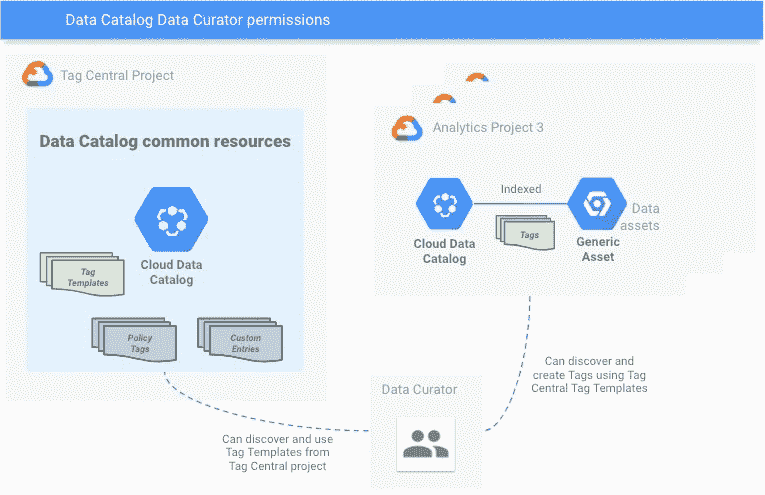

# 如何使用 Google 数据目录和 Terraform 自动化治理最佳实践

> 原文：<https://medium.com/google-cloud/how-to-automatically-manage-your-iam-access-controls-with-google-data-catalog-and-terraform-5ea33adcbdd4?source=collection_archive---------0----------------------->

## 脚本和地形自动化，以帮助您确保在谷歌数据目录的最佳做法

> **免责声明:所有观点仅代表我个人，不代表任何人……**

有大量关于[和](https://cloud.google.com/data-catalog/docs/concepts/iam)[谷歌数据目录](https://cloud.google.com/data-catalog)的文档。但是，当您开始您的数据治理之旅时，您可能想知道需要什么样的访问控制，以及在您的组织中谁应该被授予这些访问控制…

*   什么样的最终用户应该能够发现我的数据资产？
*   谁应该能够对它们进行分类并[添加标签](https://cloud.google.com/data-catalog/docs/quickstart-tagging)？
*   最后，能够[创建模板](https://cloud.google.com/data-catalog/docs/tags-and-tag-templates)并为数据分类过程设定标准？

这可能会变得非常复杂，所以在这篇博文中，我们将从元数据之上的访问控制开始，这是 Google 数据目录的竞技场。

如果我告诉你，我们可以通过使用 Terraform 来自动化这一切呢？听起来不错，对吧？所以让我们开始吧！

# 解决方案

数据治理架构

这只是一个关于如何使用数据目录的建议。首先，假设您有一些通用模板，将用于在不同的项目中创建标签。

为此，我们需要两件不同的作品:

*   **标记中心项目**

这是我们存储所有公共资源的地方，比如[标签模板](https://cloud.google.com/data-catalog/docs/tags-and-tag-templates)、[策略标签](https://cloud.google.com/bigquery/docs/column-level-security-intro)和[定制条目](https://cloud.google.com/data-catalog/docs/how-to/custom-entries)。因此，我们不需要复制它们，只需支付一次费用，并且在管理和更改它们时更加轻松。

为了展示这一点，在 Terraform 示例中，我们将在标记中心项目中创建 4 个标记模板:

★数据工程模板

★派生数据模板

★数据治理模板

★数据质量模板

*   **一组分析项目**

对于分析项目，我指的是那些将存储数据资产的项目，如大型查询表、发布子主题或任何其他由数据目录管理的资源。

# 人物角色

现在，让我们来看一下将与 Tag Central 和 Analytics 项目交互的角色，我们将使用 Terraform 自动设置这些角色。

请记住，这些名称只是建议，您可以用扮演类似角色的名称来替换它们，您可以将**数据管理者**称为**数据架构师**或者将**数据管理者**称为**数据管家**以及这个数据字母汤中的许多其他名称。

*   **数据省长**

数据管理员角色

数据管理员是在元数据上执行管理工作负载的人员的角色。这意味着创建/更新/删除标记模板等数据目录资源，并设置数据治理流程的标准。

*   **数据管理员**

数据管理员角色

数据管理员会照顾你的数据资产:)…他们会选择相关的，并为它们添加意义(通过创建标签)，这样其他用户就可以很容易地发现和利用它们。

*   **数据分析师**

数据分析师角色

这个人将使用策划的资产，定义和开发特定领域的分析，以支持您的决策。

要考虑到，这些人物角色可能会改变或重叠，这取决于组织的规模或组织结构的方式。所以你可以让同一个人扮演多个角色。

> 如果您使用不同的人物角色，请随意贡献您的范例库或在这篇博文中添加您的用例，这将非常有帮助。

# 自动化

事不宜迟，让我们看看 Terraform 自动化，因为手动操作对我们没有任何好处！

这个 Github repo:

 [## mes macosta/Google-数据目录-治理-最佳实践

### 脚本和自动化回购，以帮助确保谷歌数据目录的最佳做法…

github.com](https://github.com/mesmacosta/google-datacatalog-governance-best-pratices) 

包含所有示例和如何运行它的详细分步指南。

为了运行 Terraform，我们将使用一个服务帐户，因为在撰写本文时，Data Catalog 不支持使用来自 Google Cloud SDK 的最终用户凭据。

为了遵循最佳实践，我们不会下载服务帐户密钥，而是使用[服务帐户模拟](https://cloud.google.com/iam/docs/impersonating-service-accounts)。

## 创建服务帐户

因此，第一步是创建一个服务帐户并设置适当的 IAM 角色:

## 设置 Terraform 变量占位符

接下来，我们需要设置 Terraform 变量占位符。所以在你克隆了 [GitHub repo](https://github.com/mesmacosta/google-datacatalog-governance-best-pratices) 之后，换一下[。tfvars](https://github.com/mesmacosta/google-datacatalog-governance-best-pratices/blob/main/tag-central/terraform/.tfvars) 占位符。

让我们看一个有效配置文件的示例:

在上面的示例代码中，无论何时看到 member，它都可以是:`user:{email}`、`serviceAccount:{email}`、`group:{email}`或`domain:{domain}`中的任何一个。

## 运行 Terraform

最后，让我们执行 Terraform:

如果你想快速浏览一下，我制作了一个演示视频来展示执行过程:

## 生成的资源

Terraform 完成后，我们可以查看生成的资源:

IAM 角色

我们可以看到，我们在 Terraform 中设置的所有项目都包含所讨论的人物角色，并具有适当的权限。

我们不要忘记 Terraform 创建的公共资源:

数据目录标记模板

差不多就这些了，感谢阅读:)。

# 包扎

数据治理是一个非常复杂的领域，任何有助于我们设定和实施这些标准的自动化都是受欢迎的。在这篇博文中，我们查看了在**项目**级别工作时支持我们的 Terraform 示例。

请记住，如果您想要在**文件夹**或**组织**级别使用建议的访问控制，这是大型组织的常见用例。

GitHub repo 中的 [iam 模块](https://github.com/mesmacosta/google-datacatalog-governance-best-pratices/blob/main/tag-central/terraform/iam/main.tf)很容易适应该用例，您需要做的就是将`google_project_iam_member`资源分别切换到`google_folder_iam_member`或`google_organization_iam_member`。

如果您需要这方面的指导，请随时向示例库投稿或添加特性请求。

干杯，

# 参考

*   **数据目录 IAM 角色** : [数据目录/文档/概念/iam](https://cloud.google.com/data-catalog/docs/concepts/iam)
*   **示例 GitHub**:[Google-data catalog-governance-best-practices](https://github.com/mesmacosta/google-datacatalog-governance-best-pratices)
*   **冒充服务账号** : [冒充服务账号](https://cloud.google.com/iam/docs/impersonating-service-accounts)