# 如何使用 BigQuery ML 构建基于电子商务数据的推荐系统

> 原文：<https://medium.com/google-cloud/how-to-build-a-recommendation-system-on-e-commerce-data-using-bigquery-ml-df9af2b8c110?source=collection_archive---------0----------------------->

有了 BigQuery 中的数据，机器学习工作流现在比以往任何时候都更容易。在这篇文章中，你将学习如何使用矩阵分解在零售场景中构建产品推荐系统，以及如何使用预测的推荐来推动营销活动。

# 为什么推荐系统如此重要？


照片由[茹碧森](https://medium.com/u/92410629f98b?source=post_page-----df9af2b8c110--------------------------------):【https://unsplash.com/photos/Q59HmzK38eQ 拍摄

如今，大多数消费者都期望个性化，希望看到与其兴趣相关的产品和服务。自然，他们也可以帮助企业。通过学习用户的行为和偏好，企业可以通过各种方式提供他们的建议，包括个性化优惠券、营销电子邮件和搜索结果，或有针对性的广告。最终，这使得企业能够通过有针对性的交叉销售或追加销售来吸引更多的客户支出，同时通过营销不相关的产品来降低不必要的成本。

> *“未能向客户展示他们了解他们以及他们的购买偏好的公司，可能会将业务输给更了解客户需求的竞争对手。”
> ——哈佛商业评论。“个性化时代”。2018 年 9 月*

# 推荐系统是如何工作的？

基于用户偏好，矩阵分解(协同过滤)是创建推荐系统的最常见和最有效的方法之一。有关它们如何工作的更多信息，请参见[这里的推荐系统介绍](https://developers.google.com/machine-learning/recommendation/collaborative/matrix)。

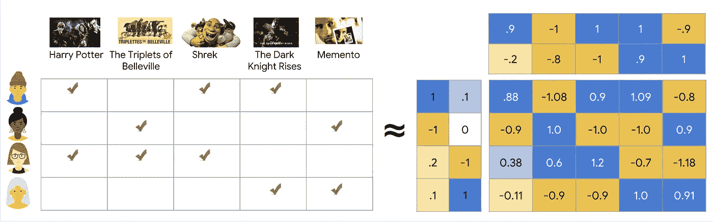

[https://developers . Google . com/machine-learning/recommendation/collaborative/matrix](https://developers.google.com/machine-learning/recommendation/collaborative/matrix)

# 什么是 BigQuery ML？

[BigQuery ML](https://cloud.google.com/bigquery-ml/docs/bigqueryml-intro) 使用户能够通过使用标准的 SQL 查询在 BigQuery 中创建和执行机器学习模型。这意味着，如果你的数据已经在 BigQuery 中，你不需要导出你的数据来训练和部署机器学习模型——通过训练，你也在同一步骤中进行部署。结合 BigQuery 的计算资源自动扩展功能，您将不必担心启动集群或构建模型培训和部署管道。这意味着您将节省构建机器学习管道的时间，使您的企业能够更多地关注机器学习的价值，而不是花时间建立基础设施。

你可能也听说过[推荐 AI](https://cloud.google.com/recommendations) ，这是一款谷歌云产品，专门用于在网站上使用最先进的深度学习模型进行实时推荐。另一方面，使用 BigQuery ML 的矩阵分解是一种更通用的 ML 算法，可用于离线和在线推荐(例如，个性化电子邮件活动)。

# 使用 BigQuery ML 在电子商务数据上训练和部署矩阵分解模型

让我们来看一个例子，如何根据用户在网上商店浏览某个产品的时间来确定你会向用户推荐哪些其他产品。你也可以点击查看这篇博文的 [Jupyter 笔记本版本。](https://github.com/GoogleCloudPlatform/analytics-componentized-patterns/blob/master/retail/recommendation-system/bqml/bqml_retail_recommendation_system.ipynb)

# 数据

在 BigQuery 上公开托管的[谷歌分析样本数据集](https://console.cloud.google.com/marketplace/details/obfuscated-ga360-data/obfuscated-ga360-data?filter=solution-type:dataset)是一个数据集，它提供了 12 个月(2016 年 8 月至 2017 年 8 月)来自[谷歌商品商店](https://www.googlemerchandisestore.com/)的模糊谷歌分析 360 数据，这是一个销售谷歌品牌商品的真实电子商务商店。

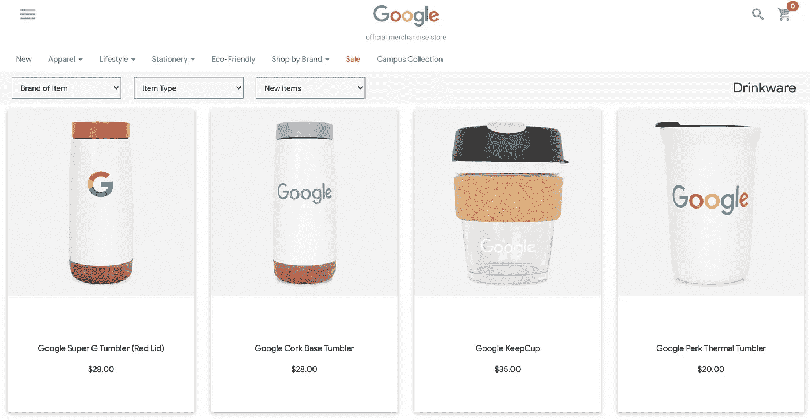

来自[谷歌商品商店](http://www.googlemerchandisestore.com)的截图。

以下是来自谷歌分析的一些原始数据样本:

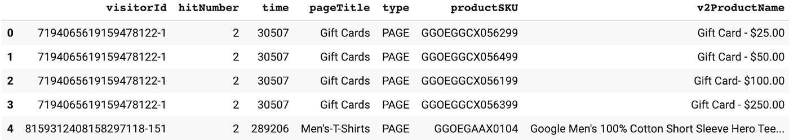

# 预处理数据

基于用户反馈的种类，有两种类型的矩阵分解:显式和隐式。通过显式反馈，数据集必须表明用户对产品的偏好，比如 1 到 5 颗星之间的评级。

除非大量用户提供产品评论，否则没有或没有足够的明确反馈来说明用户对产品的喜欢程度。在这种情况下，需要使用其他行为指标来*推断*他们的隐含偏好。推断对产品的兴趣的一种方式是考虑用户在产品详情页面上花费的总时间(例如，会话持续时间)。

## 训练数据应该是什么样的？

使用矩阵分解，为了训练模型，您将需要一个包含 **userId** 、 **itemId** 和 **rating** 的表。在本例中，产品页面上的会话持续时间将用作隐式评级。如果您有其他指标(例如，页面浏览量的频率)，您可以简单地使用加权和将这些指标组合在一起，以计算评级值。

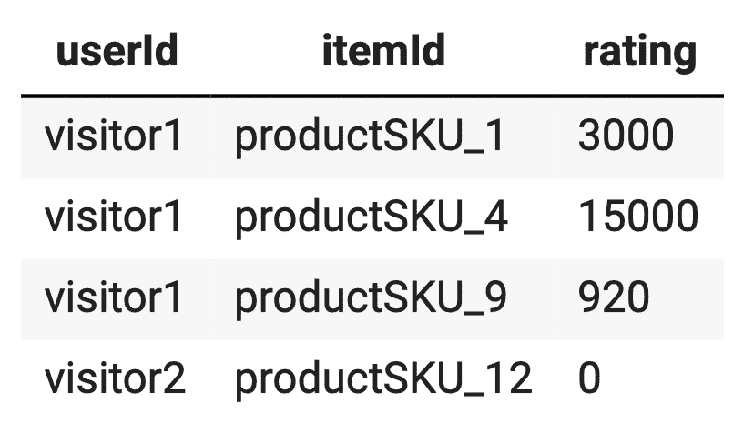

*用于矩阵分解的已清理训练数据的示例，
其中产品页面上的会话持续时间(以毫秒计)被用作隐式评级*

使用 Google Analytics 示例，我们可以创建一个包含预处理培训数据的表:

```
## follows schema from [https://support.google.com/analytics/answer/3437719?hl=en&ref_topic=3416089](https://support.google.com/analytics/answer/3437719?hl=en&ref_topic=3416089)CREATE OR REPLACE TABLE bqml.aggregate_web_stats AS (
  WITH
    durations AS (
      --calculate pageview durations
      SELECT
        CONCAT(fullVisitorID,'-', 
             CAST(visitNumber AS STRING),'-', 
             CAST(hitNumber AS STRING) ) AS visitorId_session_hit,
        LEAD(time, 1) OVER (
          PARTITION BY CONCAT(fullVisitorID,'-',CAST(visitNumber AS STRING))
          ORDER BY
          time ASC ) - time AS pageview_duration
      FROM
        `bigquery-public-data.google_analytics_sample.ga_sessions_2016*`,
        UNNEST(hits) AS hit 
    ),

    prodview_durations AS (
      --filter for product detail pages only
      SELECT
        CONCAT(fullVisitorID,'-',CAST(visitNumber AS STRING)) AS visitorId,
        productSKU AS itemId,
        IFNULL(dur.pageview_duration,
          1) AS pageview_duration,
      FROM
        `bigquery-public-data.google_analytics_sample.ga_sessions_2016*` t,
        UNNEST(hits) AS hits,
        UNNEST(hits.product) AS hits_product
      JOIN
        durations dur
      ON
        CONCAT(fullVisitorID,'-',
               CAST(visitNumber AS STRING),'-',
               CAST(hitNumber AS STRING)) = dur.visitorId_session_hit
      WHERE
      #action_type: Product detail views = 2
      eCommerceAction.action_type = "2" 
    ),

    aggregate_web_stats AS(
      --sum pageview durations by visitorId, itemId
      SELECT
        visitorId,
        itemId,
        SUM(pageview_duration) AS session_duration
      FROM
        prodview_durations
      GROUP BY
        visitorId,
        itemId )
    SELECT
      *
    FROM
      aggregate_web_stats
);-- Show table
SELECT
  *
FROM
  bqml.aggregate_web_stats
LIMIT
  10
```

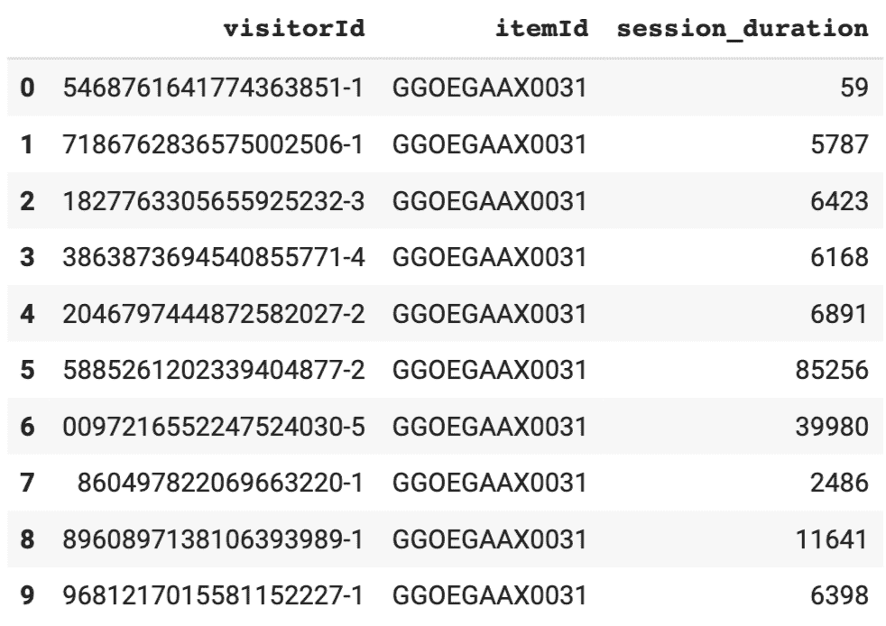

现在我们准备训练矩阵分解模型。

如果你喜欢用 Jupyter 笔记本格式看这篇博文，你可以直接在 Github 上查看:

[https://github . com/Google cloud platform/analytics-componented-patterns/blob/master/retail/recommendation-system/bqml/bqml _ retail _ recommendation _ system . ipynb](https://github.com/GoogleCloudPlatform/analytics-componentized-patterns/blob/master/retail/recommendation-system/bqml/bqml_retail_recommendation_system.ipynb)

# 在 BigQuery ML 中训练矩阵分解模型

若要定型矩阵分解模型(使用隐式反馈)，您需要设置选项:

*   `model_type`:‘矩阵分解’
*   `user_col` : <用户栏目名称>
*   `item_col` : <项目列名>
*   `rating_col` : <评级栏目名称>
*   `feedback_type`:‘隐式’(默认为‘显式’)

要了解训练模型时参数的更多信息，请阅读关于矩阵分解的 CREATE MODEL 语句的[文档](https://cloud.google.com/bigquery-ml/docs/reference/standard-sql/bigqueryml-syntax-create-matrix-factorization)。

```
CREATE OR REPLACE MODEL bqml.retail_recommender
OPTIONS(model_type='matrix_factorization', 
        user_col='visitorId', 
        item_col='itemId',
        rating_col='session_duration',
        feedback_type='implicit'
        )
AS
SELECT * FROM bqml.aggregate_web_stats
```

*注意* : *您可能需要设置预约时段。有关更多信息，您可以阅读如何以编程方式* *或通过*[*big query UI*](https://cloud.google.com/bigquery/docs/reservations-workload-management#getting-started-with-bigquery-reservations)*设置 flex slots* [。](/google-cloud/optimize-bigquery-costs-with-flex-slots-e06ec5e4aa90)

# 模型评估

完成培训后，我们的模型现在已经部署好了(作为 bqml.retail_commender)。您可以检查从模型评估中得到的度量。

有关这些指标的更多信息，请阅读 [ML。在此评估文档](https://cloud.google.com/bigquery-ml/docs/reference/standard-sql/bigqueryml-syntax-evaluate)。

```
SELECT
  *
FROM
  ML.EVALUATE(MODEL bqml.retail_recommender)
```

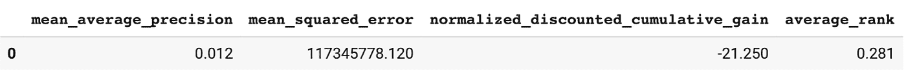

# 超参数调谐

如果您想要改进您的模型，您可以调整的一些超参数是:

*   `NUM_FACTORS`:指定用于矩阵分解模型的潜在因子数(int64_value)
*   `L2_REG`:应用的 L2 正则化量(float64_value)
*   `WALS_ALPHA`:隐式矩阵分解模型的超参数(float64_value)

查看[这篇博文，了解 BigQuery ML](https://towardsdatascience.com/how-to-do-hyperparameter-tuning-of-a-bigquery-ml-model-29ba273a6563) 中超参数调优的更多信息。

# 使用 ML 进行预测。推荐

让我们快速检查一下产生的建议是什么样的。您可以向特定访问者推荐的前 5 项是什么？请注意，我使用了一点儿 [SQL 脚本](https://cloud.google.com/bigquery/docs/reference/standard-sql/scripting)来帮助我们检查特定的访问者。

```
DECLARE MY_VISITORID STRING DEFAULT "0824461277962362623-1";SELECT
  *
FROM
  ML.RECOMMEND(MODEL `bqml.retail_recommender`,
      (SELECT MY_VISITORID as visitorID)
              )
ORDER BY predicted_session_duration_confidence DESC
LIMIT 5
```

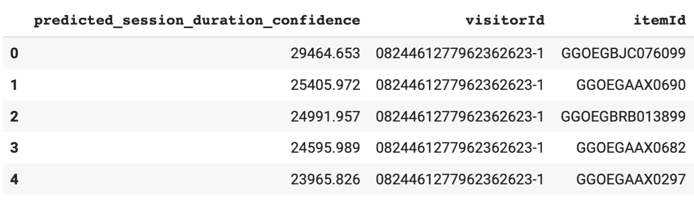

按照可信度分数降序排列，显示了这个特定访问者 Id 的前 5 个项目。

让我们通过加入 productSKU 来添加产品名称，这样我们就可以看到推荐的产品实际上是什么:

```
DECLARE
  MY_VISITORID STRING DEFAULT "6499749315992064304-2";
WITH
  product_details AS(
  SELECT
    productSKU,
    v2ProductName,
  FROM
    `bigquery-public-data.google_analytics_sample.ga_sessions_2016*`,
    UNNEST(hits) AS hits,
    UNNEST(hits.product) AS hits_product
  GROUP BY
    2,
    1 )
SELECT
  r.*,
  d.v2ProductName
FROM
  ML.RECOMMEND(MODEL `bqml.retail_recommender`,
    (
    SELECT
      MY_VISITORID AS visitorId)) r
JOIN
  product_details d
ON
  r.itemId = d.productSKU
ORDER BY
  predicted_session_duration_confidence DESC
LIMIT
  5
```

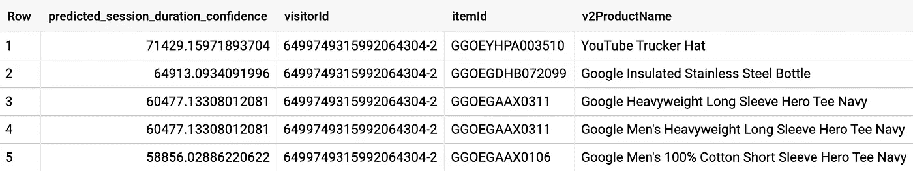

向该访客推荐的产品

对所有游客呢？由于结果输出可能有点大，我将结果输出到一个表中:

```
-- Create output table of top 5 predictions
CREATE OR REPLACE TABLE bqml.prod_recommendations AS (
WITH predictions AS (
    SELECT 
      visitorId, 
      ARRAY_AGG(STRUCT(itemId, 
                       predicted_session_duration_confidence)
                ORDER BY 
                  predicted_session_duration_confidence DESC
                LIMIT 5) as recommended
    FROM ML.RECOMMEND(MODEL bqml.retail_recommender)
    GROUP BY visitorId
)SELECT
  visitorId,
  itemId,
  predicted_session_duration_confidence
FROM
  predictions p,
  UNNEST(recommended)
);-- Show table
SELECT
  *
FROM
  bqml.prod_recommendations
ORDER BY 
  visitorId
LIMIT
  10
```

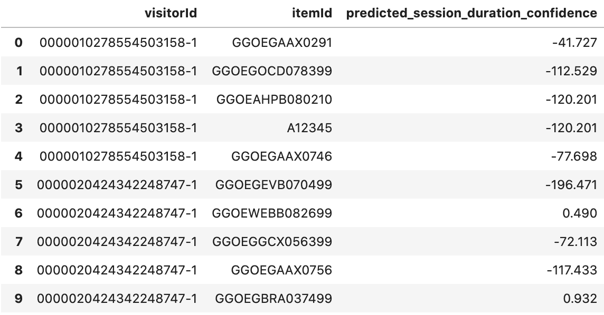

# 在生产中使用预测的建议

一旦有了建议，插入生产管道将取决于您的用例。

以下是一些可能帮助你开始的方法:

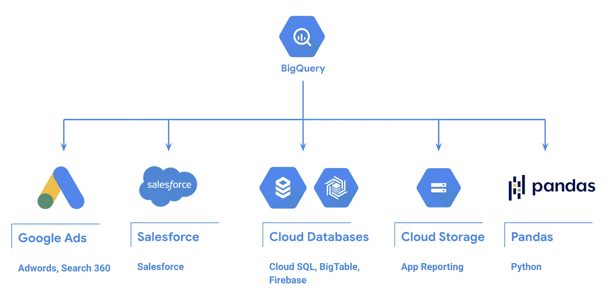

**A .营销激活的出口建议**

1.  通过谷歌广告、显示和视频 360 和搜索广告 360 激活
2.  通过电子邮件激活

**B .从 BigQuery 导出建议的其他方式**

1.  对熊猫数据帧的大查询
2.  将预测导出到 Google 云存储

通过将来自 BigQuery ML 的预测结果导出回 Google Analytics，您将能够通过广告、搜索或电子邮件激活更有效地产生定制的再营销受众和目标客户。

# A-1。将推荐导出到 Google Analytics 360 (Google 营销平台)

## 为 Google Analytics 360 格式化数据

您可能需要将数据输出格式化为 Google Analytics 可以直接使用的格式，例如:

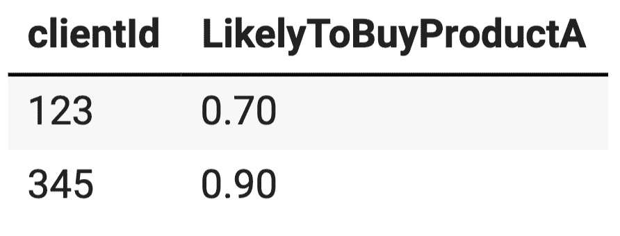

下面是一个针对 itemId `GGOEYOLR018699`的示例查询，它使用 [ML 对 0 和 1 之间的置信度得分进行归一化。最小 _ 最大 _ 缩放器](https://cloud.google.com/bigquery-ml/docs/reference/standard-sql/bigqueryml-preprocessing-functions#mlmin_max_scaler):

```
WITH predictions AS (
    SELECT 
      visitorId, 
      ARRAY_AGG(STRUCT(itemId, 
                       predicted_session_duration_confidence)
                ORDER BY 
                  predicted_session_duration_confidence) as recommended
    FROM ML.RECOMMEND(MODEL bqml.retail_recommender)
    WHERE itemId = "GGOEYOLR018699"
    GROUP BY visitorId
)

SELECT
  visitorId,
  ML.MIN_MAX_SCALER(predicted_session_duration_confidence) OVER() as GGOEYOLR018699
FROM
  predictions p,
  UNNEST(recommended)
ORDER BY GGOEYOLR018699 DESC
```

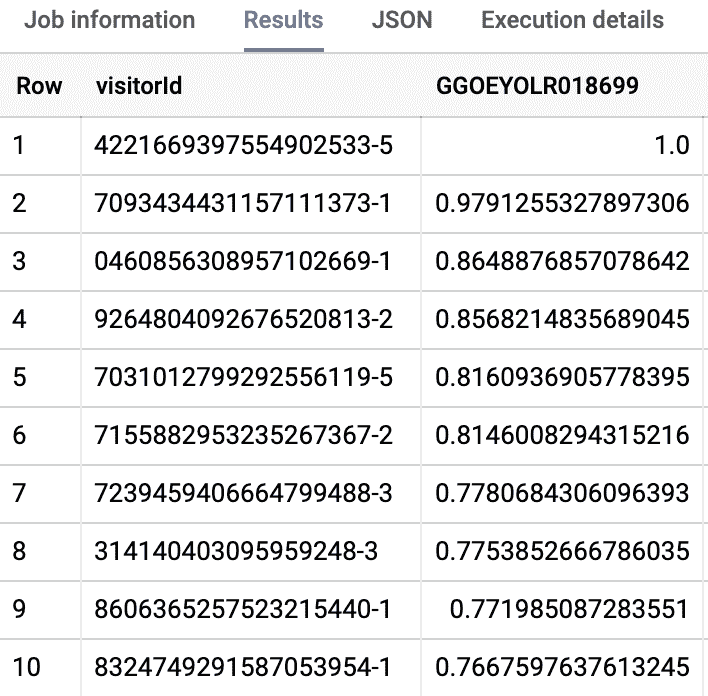

要为每个产品创建一个列，您可以使用 pivot()函数，如[这篇博文](https://towardsdatascience.com/easy-pivot-in-bigquery-one-step-5a1f13c6c710)中所述。

对于 Google Analytics 数据导入，建议您使用 clientId 作为关键字，以及显示一些倾向得分的各个列。换句话说，您可能需要为您感兴趣推荐的每个产品创建一个新的专栏，并在 Google Analytics 中创建一个自定义维度，然后用于建立您的受众。最好确保每个 clientId 有一行。如果您知道要将预测导出到 Google Analytics，建议您直接使用 clientId 而不是 visitorId 来训练您的模型。

**将数据从 BigQuery 导出到 Google Analytics 360**

将 BigQuery ML 预测从 BigQuery 表导出到 Google Analytics 360 的最简单方法是使用[调制解调器(营销模型部署)](https://github.com/google/modem)参考实现。MoDeM 帮助您将数据加载到 Google Analytics 中，以便最终在 Google Ads 中激活，显示&视频 360 和搜索广告 360

要从 BigQuery 导出到 Google Analytics 360:

*   [按照这里的逐步说明](https://github.com/google/modem/tree/master/bqml)使用调制解调器构建从 BigQuery ML 到 Google Analytics 的 ETL 管道。您也可以在本[笔记本](https://colab.research.google.com/github/google/modem/blob/master/bqml/utils/BQML_Deployment_Template_Cloud_Function.ipynb)中查看互动说明。

## A-2。使用 Salesforce 营销云激活电子邮件

由于 Google Analytics 不包含电子邮件地址，您可能需要与 Salesforce Marketing Cloud 等第三方平台集成来激活电子邮件。

Google Analytics 360 客户可以在 Salesforce 直销渠道(电子邮件和短信)上的营销云中激活他们的 Analytics 360 受众。这使您的营销团队能够基于在线网络行为建立受众，并通过电子邮件和短信与这些客户互动。

遵循此处的[逐步说明](https://support.google.com/analytics/answer/9250031?hl=en)将 Google Analytics 360 与 Salesforce 营销云集成，或通过 Salesforce Trailhead 了解更多关于[受众激活的信息。](https://trailhead.salesforce.com/content/learn/modules/google-analytics-360-integration-for-marketing-cloud)

# B.从 BigQuery 导出建议的其他方法

## B-1。对熊猫数据帧的大查询

将预测存储在一个单独的表中，您可以使用 BigQuery 存储 API 将数据导出到 Pandas dataframe 中(参见[文档和代码示例](https://cloud.google.com/bigquery/docs/bigquery-storage-python-pandas#download_table_data_using_the_client_library))。也可以使用[其他 BigQuery 客户端库](https://cloud.google.com/bigquery/docs/reference/libraries)。

## B-2。将预测表导出到 Google 云存储

有几种方法可以将预测表导出到 Google 云存储，以便您可以在单独的服务中使用它们。此[文档](https://cloud.google.com/bigquery/docs/exporting-data#exporting_table_data)向您展示了如何使用`bq extract`命令导出。

# 摘要

恭喜你！现在，您已经知道如何使用 BigQuery ML 训练您的推荐系统，评估您的模型，调优超参数和部署您的模型，并在生产中使用结果。现在，您的企业离为客户提供更加个性化的服务又近了一步。

# 想要更多吗？

请给我留下您的意见和任何建议或更正。

我是 Polong Lin，谷歌云的开发者倡导者。在 [@polonglin](http://www.twitter.com/polonglin) 上关注我，以及所有关于 reddit.com/r/bigquery.的 BigQuery

**感谢审稿人** : Abhishek Kashyap，Lak Lakshmanan，Tai Conley，Rebecca Gutteridge，Oly Bhaumik，Marc Cohen，Tahir Fayyaz，Felipe Hoffa。