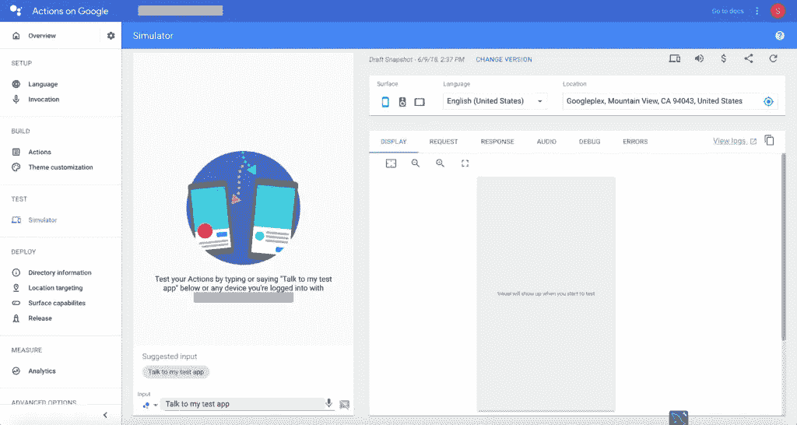

# 如何在 Google 上使用 Dialogflow Enterprise Edition 和 Actions 为 Google Assistant 构建应用程序

> 原文：<https://medium.com/google-cloud/how-to-build-an-app-for-google-assistant-using-dialogflow-enterprise-edition-and-actions-on-google-4413a61d2f2d?source=collection_archive---------0----------------------->


用户在对话中使用谷歌助手来完成事情，比如购买食品杂货或预订搭车，或者在我们的情况下，伸出手来解决问题(关于现在可能的事情的完整列表，请参见[行动目录](https://assistant.google.com/explore/))。)作为开发人员，您可以使用 Google 上的操作来轻松创建和管理用户与您自己的第三方履行服务之间愉快而有效的对话体验。我们将学习如何在 Google 上使用 Dialogflow 企业版和操作为 Google Assistant 构建一个应用程序。在用户和你自己的履行服务之间建立丰富有效的对话体验。使用 SSML 添加逼真的对话，并将用户数据存储到谷歌云数据存储中。了解如何为 Google Assistant 发布您的操作。

本教程是我们上一个教程[的第 2 部分的延续，讲述如何使用 Dialogflow 企业版和 Dialogflow API V2 创建聊天机器人。](/google-cloud/how-to-create-a-chatbot-using-dialogflow-enterprise-edition-and-dialogflow-api-v2-923f4a965176)

# 如何在 Google 上使用 Dialogflow Enterprise Edition 和 Actions 为 Google Assistant 构建应用程序:


本教程结束时，您将对以下内容有更好的理解:

*   [在谷歌上的行动](https://developers.google.com/actions/)
*   [Dialogflow 企业版](https://cloud.google.com/dialogflow-enterprise/)
*   [谷歌助手](https://assistant.google.com/)
*   [为谷歌助手建立动作](https://console.actions.google.com/)
*   [谷歌控制台上的操作](https://console.actions.google.com)

如前所述，本教程是上一个教程的第 2 部分的延续。遵循上一教程中的步骤 1 到 8，然后回到这里继续本教程。第 1 部分已经介绍了项目的大部分创建、设置、创建 dialogflow 代理以及将信息存储在 Google Cloud Datastore 中。

## 第 1 步:按照本[教程](/google-cloud/how-to-create-a-chatbot-using-dialogflow-enterprise-edition-and-dialogflow-api-v2-923f4a965176)从第 1 步到第 8 步继续下一步。

[](/google-cloud/how-to-create-a-chatbot-using-dialogflow-enterprise-edition-and-dialogflow-api-v2-923f4a965176) [## 如何使用 Dialogflow 企业版和 Dialogflow API V2 创建聊天机器人

### 在本教程中，我们将学习如何使用 Dialogflow 企业版和 Dialogflow API V2 创建聊天机器人。这个…

medium.com](/google-cloud/how-to-create-a-chatbot-using-dialogflow-enterprise-edition-and-dialogflow-api-v2-923f4a965176) 

## 步骤 2:对话流集成

*   进入[对话流程控制台](https://console.dialogflow.com/)，选择您的代理并点击**集成**。


*   点击**谷歌助手**
*   这将打开一个弹出窗口，如下所示。点击**测试**按钮。


*   点击测试按钮启动谷歌模拟器上的**动作，如下所示。**

## 步骤 3:动作模拟器

[动作控制台](https://console.actions.google.com/)中的动作模拟器允许您通过一个易于使用的 web 界面来测试您的应用程序，该界面允许您模拟硬件设备及其设置。您还可以访问调试信息，如您的实施接收和发送的请求和回应。



*   如果您没有支持的硬件设备，模拟器是在 google assistant 上测试您的应用程序/操作的最佳方式。
*   首先，让我们测试一下到目前为止我们构建的应用程序。下面的例子向你展示了我们在谷歌助手测试应用的体验。


## 第四步:如何改善对话体验

到目前为止，我们构建的应用程序/操作完全符合我们的预期，但我们也注意到整体体验可以更好。我们注意到，我们的应用程序在拼写机票号码时，会以基数格式拼写。但是，我们希望票号用数字或单个字符拼写出来。由于本教程是关于如何使用 Dialogflow 企业版和 Google 上的操作为 Google Assistant 构建一个应用程序，我们需要确保我们的应用程序在对话式对话中使用时更具吸引力和自然性。

## 第五步:在你的回答中加入 SSML(语音合成标记语言)

当向 Google Assistant 返回响应时，您可以在响应中使用语音合成标记语言的子集( [SSML](https://www.w3.org/TR/speech-synthesis/) )。通过使用 SSML，你可以让你的代理人的反应看起来更逼真。

要在我们的响应中添加 SSML，我们需要修改我们的云函数。

*   转到[对话流程控制台。](https://console.dialogflow.com/)
*   点击**完成。**
*   使用行内编辑器修改我们的云函数 index.js 以包含 SSML。

```
'use strict';
const http = require('http');
// Imports the Google Cloud client library
const Datastore = require('[@google](http://twitter.com/google)-cloud/datastore');
// Your Google Cloud Platform project ID
const projectId = 'REPLACE_WITH_YOUR_PROJECT_ID';
// Instantiates a client
const datastore = Datastore({
  projectId: projectId
});
// The kind for the new entity
const kind = 'ticket';// The kind for the new entity
const kind = 'ticket';exports.dialogflowFirebaseFulfillment = (req, res) => {
  console.log('Dialogflow Request body: ' + JSON.stringify(req.body));
  // Get the city and date from the request
  let ticketDescription = req.body.queryResult['queryText']; // incidence is a required param
  //let name = req.body.result.contexts[0].parameters['given-name.original'];
  let username = req.body.queryResult.outputContexts[1].parameters['given-name.original'];
  let phone_number = req.body.queryResult.outputContexts[1].parameters['phone-number.original'];
  console.log('description is ' +ticketDescription);
  console.log('name is '+ username);
  console.log('phone number is '+ phone_number);
  function randomIntInc (low, high) {
    return Math.floor(Math.random() * (high - low + 1) + low);
  }
  let ticketnum = randomIntInc(11111,99999);
  // The Cloud Datastore key for the new entity
  const taskKey = datastore.key(kind);
  // Prepares the new entity
  const task = {
    key: taskKey,
    data: {
      description: ticketDescription,
      username: username,
      phoneNumber: phone_number,
      ticketNumber: ticketnum
    }
  };
  console.log("incidence is  " , task);
  // Saves the entity
  datastore.save(task)
  .then(() => {
    console.log(`Saved ${task.key}: ${task.data.description}`);
    res.setHeader('Content-Type', 'application/json');
    //SSML Response to send to Dialogflow
    res.send(JSON.stringify({ 'fulfillmentText': '<speak>I have successfully logged your ticket, the ticket number is <say-as interpret-as="characters">' + ticketnum + '</say-as>. Someone from the helpdesk will reach out to you within 24 hours.</speak>'}));
    //res.send(JSON.stringify({ 'fulfillmentText': "I have successfully logged your ticket, the ticket number is " + ticketnum + ". Someone from the helpdesk will reach out to you within 24 hours.", 'fulfillmentMessages': "I have successfully logged your ticket, the ticket number is " + ticketnum +  ". Someone from the helpdesk will reach out to you within 24 hours."}));
  })
  .catch((err) => {
    console.error('ERROR:', err);
    res.setHeader('Content-Type', 'application/json');
    res.send(JSON.stringify({ 'speech': "Error occurred while saving, try again later", 'displayText': "Error occurred while saving, try again later" }));    
  });
}
```

*   最重要的变化在第 50 行。我们已经在我们的**响应**中添加了 **SSML** 标记。
*   注意:确保将项目 ID 替换为您自己的项目 ID，该项目 ID 是您在之前的[教程](/google-cloud/how-to-create-a-chatbot-using-dialogflow-enterprise-edition-and-dialogflow-api-v2-923f4a965176)中创建的。

```
<speak>I have successfully logged your ticket, the ticket number is <say-as interpret-as="characters">' + ticketnum + '</say-as>. Someone from the helpdesk will reach out to you within 24 hours.</speak>
```

`<speak>`根元素的 SSML 反应。`<say‑as>`让您指示元素中包含的文本结构类型的信息。它还有助于指定呈现所包含文本的详细程度。

点击了解更多关于 [SSML 标记响应的信息。](https://developers.google.com/actions/reference/ssml)

*   部署云功能。
*   点击**集成**和**谷歌助手**和**测试。**
*   在模拟器中测试应用程序并检查响应。你会听到票号现在是以单个字符拼写出来的，而不是我们想要的基数格式。

## 第六步:结束对话

从之前的演示中，您会注意到我们的应用程序需要被取消才能结束对话。然而，一旦我们收集了所有信息，我们可以自动结束对话。所以一旦应用程序回复了票号，我们就可以结束对话了。

*   点击**意图。**
*   展开提交票据意图并点击**提交票据-收集描述**意图。
*   在**响应下，启用**切换 ***设置此意图为对话结束*** 。


## 第七步:使用 Google Home 测试你的应用

您也可以使用 Google Home/mini/phone 或任何运行 Google Assistant 的设备来测试您的应用程序。确保您已经在 Google 控制台的操作中启用了您的测试草稿。你的应用程序应该运行在任何设备运行谷歌助理链接到你的帐户(谷歌帐户用于创建这个项目)

你可以在 Google Home 上测试你的 app，说“ ***OK Google，跟我的测试 app*** 通话”。

您还可以使用用户信息和**票证详细信息**检查[**Google Cloud Datastore**](https://console.cloud.google.com/)中出现的所有数据。


## 步骤 8:添加调用名称并选择谷歌助手语音

为了让用户与您的操作/应用程序进行交互，我们需要添加一个调用名称，他们可以用它来调用我们的操作。
用户口头说出**调用名**来调用你的动作。例如，如果调用名称是像素先生，用户可以说:好的谷歌，与像素先生交谈。


*   添加**调用名。**
*   添加**目录标题。**
*   根据你的个性或品牌选择合适的谷歌助手语音。

## 步骤 9:品牌、主题定制、调用和发现清单

主题定制允许您定制操作的外观和感觉，以向用户突出您的品牌身份。自定义主题后，保存您的更改并在模拟器中测试它们。

请务必查看[调用和发现清单](https://developers.google.com/actions/discovery/checklist)，看看您是否涵盖了所有清单。

## 步骤 10:如何在 Google 上使用 Dialogflow 企业版和操作为 Google Assistant 构建应用程序—部署和发布:

在部署和发布应用程序/操作之前。请务必阅读[出版清单](https://developers.google.com/actions/distribute/)。

最后，在**部署**部分填写所有必需的信息。

*   **目录信息**:显示您在操作目录中的操作所需的所有详细信息。
*   **定位:**指定您的行动将触发的国家。你的行动将对每个国家讲你的行动所支持的语言的人起作用。
*   **表面功能:**您的动作将触发的表面，并为您的动作指定所需的设备功能。
*   **发布:**提交您的生产行动**。**产品发布允许您正式向所有 Google Assistant 用户发布您的操作。

## 结论—如何在 Google 上使用 Dialogflow 企业版和操作为 Google Assistant 构建应用程序:

总之，我们已经成功地为 Google Assistant 构建了一个动作。本教程的目的是向您展示如何使用 Google 上的 Dialogflow 企业版和操作为 Google Assistant 构建一个应用程序。你仍然可以添加很多东西来使整个对话体验变得更好。您还可以使用 [Dialogflow](https://console.dialogflow.com/) 用大量训练数据训练您的代理。在接下来的教程中，我将会介绍更多关于谷歌和谷歌助手的操作。请在下面的评论中告诉我你想让我在未来的教程中讲述什么。

还可以查看其他教程比如
- [无代码打造自己的谷歌语音助手](https://techwithsach.com/build-your-own-google-voice-assistant-without-code/)
- [如何使用 Dialogflow 企业版和 Dialogflow API 创建聊天机器人 V2](https://techwithsach.com/how-to-create-a-chatbot-using-dialogflow-enterprise-edition-and-dialogflow-api-v2/)
- [使用谷歌云自然语言 API 的情感分析](/google-cloud/sentiment-analysis-using-google-cloud-machine-learning-552be9b9c39b)
- [使用谷歌云自然语言 API 的实体分析](/google-cloud/entity-analysis-using-google-cloud-natural-language-api-1b7d8f3302bd)

也请查看[TechWithSach.com](https://techwithsach.com/)获得更多关于机器学习、人工智能、颤振、unity 等有趣的教程。