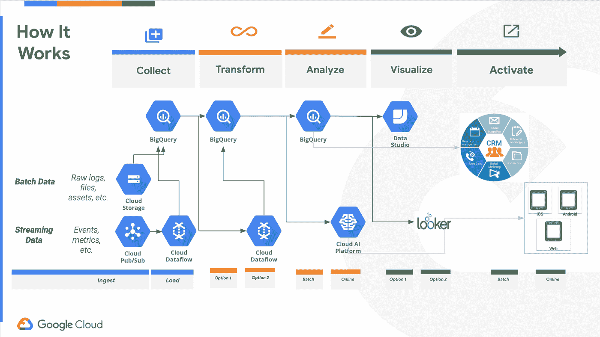
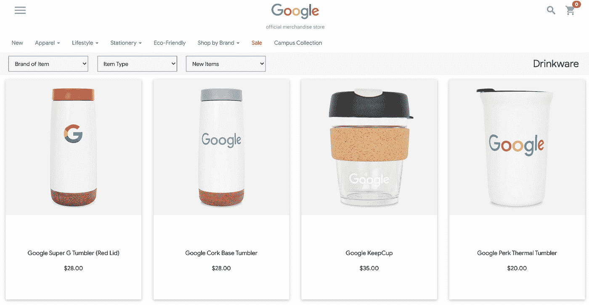
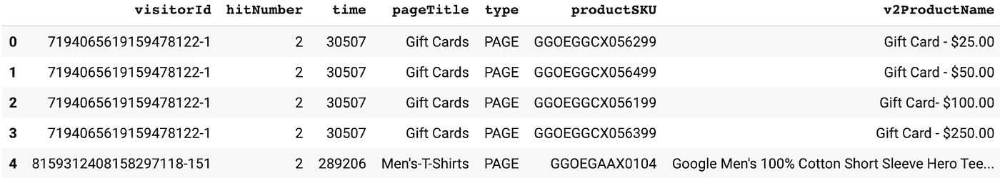
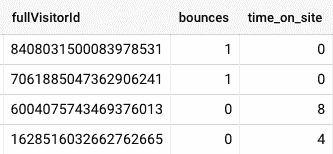
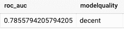
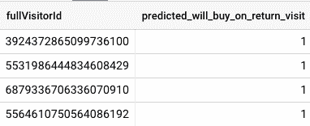
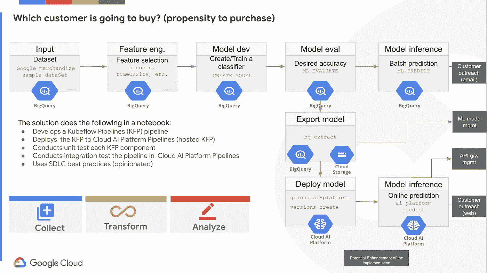
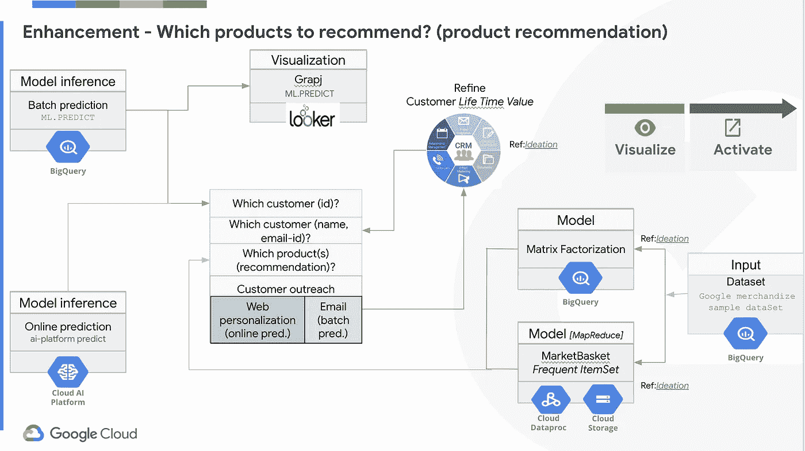
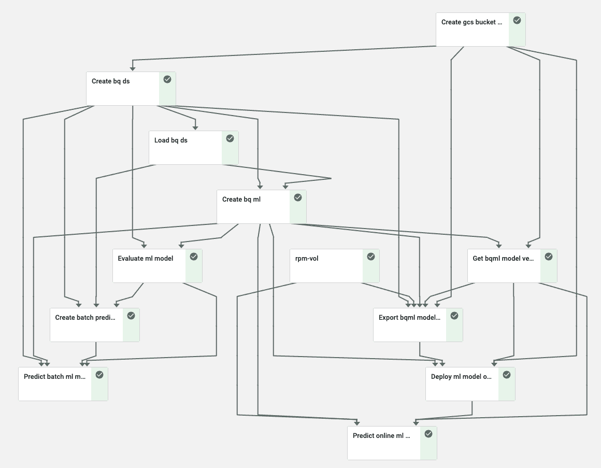

# 如何使用 BigQuery ML 和 Kubeflow 管道构建端到端的购买倾向解决方案

> 原文：<https://medium.com/google-cloud/how-to-build-an-end-to-end-propensity-to-purchase-solution-using-bigquery-ml-and-kubeflow-pipelines-cd4161f734d9?source=collection_archive---------0----------------------->

购买倾向用例广泛适用于零售、金融等多个垂直行业。在本文中，我们将向您展示如何使用 [BigQuery ML](https://cloud.google.com/bigquery-ml/docs) 和 [Kubeflow Pipelines](https://www.kubeflow.org/docs/pipelines/overview/pipelines-overview/) (KFP，一个机器学习操作(MLOps)工作流工具)构建一个端到端的解决方案，使用[谷歌分析数据集](https://console.cloud.google.com/marketplace/details/obfuscated-ga360-data/obfuscated-ga360-data?filter=solution-type:dataset)来确定**哪些客户有购买倾向**。您可以使用该解决方案通过电子邮件或邮政渠道在离线活动中接触到您的目标客户。当客户在您的网站上浏览您的产品时，您也可以通过当场决策在在线活动中使用它，向客户推荐一些产品或触发个性化电子邮件。

购买倾向用例是个性化用例的子集。这是当今许多组织进行营销的关键驱动力。在当今不断变化的时代，您需要确保在正确的时间将正确的信息发送给正确的客户。“大规模个性化有可能创造 1.7 万亿至 3 万亿美元的新价值”([麦肯锡研究](https://www.mckinsey.com/business-functions/marketing-and-sales/our-insights/a-technology-blueprint-for-personalization-at-scale))。倾向建模有助于公司识别这些“正确的”客户和潜在客户，他们购买特定产品或服务的可能性很高。


如皮森摄:[https://unsplash.com/photos/Q59HmzK38eQ](https://unsplash.com/photos/kTd2PvtqE_o)

倾向模型很重要，因为它是一种以个性化信息为目标的销售拓展机制，因为它们是成功吸引客户注意力的关键。通过使用购买倾向模型，您可以更有效地锁定最有可能购买某些产品的客户。

# 目录

*   [典型的端到端解决方案架构和实施步骤](#75c7)
*   [识别具有过去客户购买历史的数据源，并将其加载到 BigQuery](#c0b7)
*   [为 ML 任务准备数据](#c478)
*   [建立一个 ML 模型，以确定决定顾客购买倾向的因素](#4bb8)
*   [使用批量预测进行离线活动](#dbc6)
*   [使用在线预测进行在线宣传](#2583)
*   [将客户数据加入 CRM 系统，以收集客户详细信息](#8e0d)
*   [ML 管道](#5209)
*   [接下来的步骤](#9664)
*   [总结](#0cb1)

# 典型的端到端解决方案架构和实施步骤

您将选择功能，创建标签(它会告诉您客户是否有购买倾向)，构建模型，使用 BigQuery ML 在 BigQuery 中预测批量/在线。BigQuery ML 使您能够通过使用标准 SQL 查询在 BigQuery 中创建和执行机器学习模型。这意味着，您不需要导出数据来训练和部署机器学习模型-通过训练，您也可以在同一步骤中进行部署。结合 BigQuery 的计算资源自动扩展功能，您将不必担心启动集群或构建模型培训和部署管道。这意味着您将节省构建机器学习管道的时间，使您的企业能够更多地关注机器学习的价值，而不是花时间建立基础设施。

为了自动化这个模型构建过程，您将使用 [Kubeflow Pipelines](https://www.kubeflow.org/docs/pipelines/overview/pipelines-overview/) 来编排管道，这是一个基于 Docker 容器来构建和部署可移植、可扩展的机器学习(ML)工作流的平台

下图展示了整个解决方案的工作原理:



该解决方案包括以下步骤:

1.  使用过去的客户购买历史来识别数据源，并将数据加载到 BigQuery
2.  为机器学习(ML)任务准备数据。
3.  建立一个确定顾客购买倾向的 ML 模型
4.  将客户数据加入 CRM 系统，以收集客户详细信息(例如，电子邮件 id 等。)
5.  确定我们应该向客户推荐哪种产品
6.  利用上述数据开展渠道活动
7.  在 CRM 或类似系统中管理客户通信(如电子邮件)的生命周期
8.  从活动结果中提炼客户终身价值
9.  监控模型以确保它们符合预期
10.  如有必要，根据新数据集或修正后的数据集重新训练模型

我们现在将在下面详细讨论这些步骤。还有一个附带的[笔记本](https://github.com/GoogleCloudPlatform/analytics-componentized-patterns/tree/master/retail/propensity-model/bqml)，它实现了解决方案的前 3 个步骤。

# 确定具有过去客户购买历史的数据源，并将其加载到 BigQuery

您的数据存放在哪里？确定将数据导入 BigQuery 的最佳预处理技术。您可以在 MLOps 管道中自动化预处理，这将在本文后面看到。您将要使用的数据集托管在 BigQuery 上，提供了 12 个月(2016 年 8 月至 2017 年 8 月)来自[谷歌商品商店](https://www.googlemerchandisestore.com/shop.axd/Home?utm_source=Partners&utm_medium=affiliate&utm_campaign=Data%20Share%20Promo)的模糊谷歌分析 360 数据，这是一家销售谷歌品牌商品的真实电子商务商店。



来自[谷歌商品商店](http://www.googlemerchandisestore.com/)的截图。

以下是来自谷歌分析的一些原始数据样本:



# 为 ML 任务准备数据

现在，您已经确定了数据集，您开始为您的 ML 模型开发准备数据。如果要使用监督学习，请选择适当的要素和标签。在本文中，出于演示目的，您将使用几个特性。

下面的查询将创建训练数据、要素(` bounds '、` time_on_site `)和标签(` will_buy_on_return_visit `)，您将在以后使用它们来构建您的模型:

```
## follows schema from [https://support.google.com/analytics/answer/3437719?hl=en&ref_topic=3416089](https://support.google.com/analytics/answer/3437719?hl=en&ref_topic=3416089)

# select initial features and label to feed into your model
CREATE 
OR REPLACE TABLE bqml.rpm_ds.rpm_ds_propensity_training_samples_tbl OPTIONS(
  description = "Google Store curated Data"
) AS 
SELECT 
  fullVisitorId, 
  bounces, 
  time_on_site, 
  will_buy_on_return_visit # <--- your label
FROM 
  # features
  (
    SELECT 
      fullVisitorId, 
      IFNULL(totals.bounces, 0) AS bounces, 
      IFNULL(totals.timeOnSite, 0) AS time_on_site 
    FROM 
      `data-to-insights.ecommerce.web_analytics` 
    WHERE 
      totals.newVisits = 1 
      AND date BETWEEN '20160801' 
      AND '20170430'
  ) # train on first 9 months
  JOIN (
    SELECT 
      fullvisitorid, 
      IF(
        COUNTIF(
          totals.transactions > 0 
          AND totals.newVisits IS NULL
        ) > 0, 
        1, 
        0
      ) AS will_buy_on_return_visit 
    FROM 
      `bigquery-public-data.google_analytics_sample.*` 
    GROUP BY 
      fullvisitorid
  ) USING (fullVisitorId) 
ORDER BY 
  time_on_site DESC # order by most time spent first
```

下面是运行上述查询的部分结果:



特征

# 建立一个 ML 模型来确定哪一个决定了客户的购买倾向

我们应该使用哪种型号？要使用的所有功能是什么？该模型的超参数集应该是什么？这些是典型的数据科学家挑战。

如果客户有购买倾向，您需要进行分类。因此，这是一项分类任务。一种常用的分类模型是逻辑回归。您将使用 [BigQuery ML](https://cloud.google.com/bigquery-ml/docs/bigqueryml-intro) 构建一个逻辑回归。

以下查询将创建模型:

```
CREATE 
OR REPLACE MODEL `rpm_ds.rpm_bqml_model` OPTIONS(
  MODEL_TYPE = 'logistic_reg', labels = [ 'will_buy_on_return_visit' ]
) AS 
SELECT 
  * 
EXCEPT 
  (fullVisitorId) 
FROM 
  `bqml.rpm_ds.rpm_ds_propensity_training_samples_tbl`
```

一旦创建了模型，您就可以根据某些规则检查模型的执行情况。我们采用了一些经验法则(如 ROC-AUC > 0.9)，但您可以根据自己的具体需求进行调整。

以下查询将评估模型以检查预期 ROC AUC:

```
SELECT 
  roc_auc, 
  CASE WHEN roc_auc >.9 THEN 'good' WHEN roc_auc >.8 THEN 'fair' WHEN roc_auc >.7 THEN 'decent' WHEN roc_auc >.6 THEN 'not great' ELSE 'poor' END AS modelquality 
FROM 
  ML.EVALUATE(MODEL `rpm_ds.rpm_bqml_model`)
```

运行该查询会产生以下输出:



你真的认为我们成功建立了一个好的模型吗？嗯…很可能不会…因为 78%的 ROC_AUC 被认为是一个公平的分数。这需要大量的领域知识、超参数调整、特征工程等。来建立一个谷歌模型。这不是你能创建的最好的模型，但是它给了你一个基线。由于本文的重点是构建一个端到端的管道，而不是对性能进行建模，因此对模型进行微调超出了本文的范围。

经过培训的模型可以帮助您在离线活动或在线活动中接触到您的客户。我们将对前者使用批量预测，对后者使用在线预测。

您可以在 BigQuery 中使用训练好的模型对大型数据集进行批量预测。或者，你可以在谷歌云人工智能平台上部署模型，进行在线预测。

# 对离线活动使用批量预测

对于离线活动场景，您可以对大型数据集进行异步批量预测。让我们检查一下如何进行批量预测。您可以在 BigQuery 中创建一个表，并插入您想要预测的所有输入。您将在 BigQuery 中创建一个表“rpm _ ds _ prevention _ prediction _ input _ TBL ”,其中每一行都是一个具有反弹和 time_on_site 功能的客户。然后使用训练好的模型对所有输入/行进行预测。

下面的查询显示了批量预测:

```
# predict the inputs (rows) from the input table
SELECT 
fullVisitorId, predicted_will_buy_on_return_visit
FROM
ML.PREDICT(MODEL rpm_ds.rpm_bqml_model,
(
    SELECT
    fullVisitorId, 
    bounces,
    time_on_site
    from bqml.rpm_ds.rpm_ds_propensity_prediction_input_tbl
))
```

下面是运行上述查询的部分结果:



在上面的输出中，模型预测这四个客户有购买倾向，因为“predicted _ will _ buy _ on _ return _ visit”返回 1。

您认为该模型预测了上述每一位客户的购买倾向吗？也许吧。可以肯定的是，你需要深入挖掘。您可能想要检查上面 ML 中的特性、参数、阈值(默认为[0.5](https://cloud.google.com/bigquery-ml/docs/reference/standard-sql/bigqueryml-syntax-predict#threshold))。预测)等。来调整模型。

# 对在线活动使用在线预测

对于在线活动场景，我们需要在云人工智能平台中部署模型。这是一个分两步走的过程。首先，您需要导出模型，然后部署到云 AI 平台，该平台会公开一个 REST 端点来服务在线预测。

下面是将 [BiqQuery ML](https://cloud.google.com/bigquery-ml/docs) 模型导出到 [Google 云存储](https://cloud.google.com/storage)的命令:

```
# export the model to a Google Cloud Storage bucket
bq extract -m rpm_ds.rpm_bqml_model gs://bqml_sa/rpm_data_set/bqml/model/export/V_1
```

第二，您需要将导出的模型部署到[云 AI 平台预测](https://cloud.google.com/ai-platform/prediction/docs)，它托管您训练好的模型，以便您可以向它发送预测请求。

下面是将模型部署到云 AI 平台预测的命令:

```
# export the model to a Google Cloud Storage bucket
# deploy the above exported model
gcloud ai-platform versions create --model=rpm_bqml_model V_1        --framework=tensorflow --python-version=3.7 --runtime-version=1.15        --origin=gs://bqml_sa/rpm_data_set/bqml/model/export/V_1/ --staging-bucket=gs://bqml_sa
```

现在，您可以通过 web 请求/响应进行在线预测。您可以在 web 应用程序中使用端点来执行现场操作，例如显示个性化内容或触发异步流程，例如发送个性化电子邮件或明信片。下面是可以快速测试在线预测的命令:

```
# Perform online predict (create a input table with the input features)
# create a json file (input.json) with the below content
{"bounces": 0, "time_on_site": 7363}

# use the above json to predict
gcloud ai-platform predict --model rpm_bqml_model --version V_1 --json-instances input.json
```

运行该命令会产生类似于以下内容的输出:

```
Predicted results for {"bounces": 0, "time_on_site": 7363} is PREDICTED_WILL_BUY_ON_RETURN_VISIT  WILL_BUY_ON_RETURN_VISIT_PROBS             WILL_BUY_ON_RETURN_VISIT_VALUES
['1']                               [0.9200436491721313, 0.07995635082786867]  ['1', '0']
```

在上面的输出中，模型预测该特定客户有购买倾向，因为“predicted _ WILL _ BUY _ ON _ RETURN _ visit”返回 1。给定 time_ont_site 上“0”次反弹和“7363”秒的测试，模型告诉我们他们有 92%的可能性有购买倾向。使用这些信息，您可以向客户发送优惠券(或者您可能只想向概率在 0.5 到 0.8 之间的人发放优惠券，因为如果概率很高，他们可能会在没有激励的情况下购买该商品)。

当然，你不必只使用 gcloud，你当然可以使用你最喜欢的工具(wget，curl，postman 等等。)来快速检查 REST 端点。

# 将客户数据与 CRM 系统结合起来，以收集客户详细信息

因此，我们现在可以预测客户是否有批量购买或在线购买的倾向。现在怎么办？我们在数据集中使用了 fullvisitorid。我们需要客户的详细信息，如电子邮件地址，因为您的数据集没有这些信息。这个想法是从客户关系管理(CRM)系统中收集他们。因此，我们需要集成一个 CRM 系统来实现这个目标。

在这里你会对整合[有所了解。本文讨论了如何将 Google Analytics 360 集成到 Salesforce 营销云。该集成允许您将在 Analytics 360 中创建的受众发布到营销云，并在您的 Salesforce 电子邮件和 SMS 直接营销活动中使用这些受众。您需要根据您的 CRM 平台确定合适的集成机制。](https://support.google.com/analytics/answer/9250031?hl=en)

附带的笔记本不实现这一步。

# 解决方案的其余步骤

解决方案中的其余步骤是不言自明的，尽管系统的集成和互操作可能不是那么简单。但是，一般来说，这是软件开发生命周期中一个持续的挑战，不是吗？随着潜在的后续步骤继续在现有解决方案的基础上进行，您还可以查看一些指南。

# ML 管道

您现在将构建一个 ML 管道来自动化解决方案的步骤 1、2 和 3。剩下的步骤留给专题文章或者作为读者的练习。我们将使用 Kubeflow 管道(KFP)，并在谷歌云上使用托管 KFP、[云人工智能平台管道](https://cloud.google.com/ai-platform/pipelines/docs/)。

以下是解决方案步骤的可视化表示，可在 [git repo](https://github.com/GoogleCloudPlatform/analytics-componentized-patterns/tree/master/retail/propensity-model/bqml) 的 Jupyter 笔记本中找到:



下面是基于当前实施的解决方案步骤的可视化表示。笔记本没有实现这些步骤:



上图中的三个链接是:

*   参考[文章](https://support.google.com/analytics/answer/9250031?hl=en)，了解如何使用 CRM 系统预测有购买倾向的客户。
*   参考[文章](/google-cloud/how-to-build-a-recommendation-system-on-e-commerce-data-using-bigquery-ml-df9af2b8c110)，了解如何使用矩阵分解进行产品推荐。文章还提到了一个笔记本。本文使用了您在当前文章中使用的相同的 BigQuery 公共数据集。
*   参考斯坦福大学教授所著的《海量数据集的挖掘》一书的第六章“频繁项集”中的[，了解如何建立一个常用产品列表。](http://infolab.stanford.edu/~ullman/mmds/ch6.pdf)

下面是从笔记本上运行 KFP 实验时[云人工智能平台管道](https://cloud.google.com/ai-platform/pipelines/docs/)的输出。当您执行实验时，您的输出可能会有所不同:



实验的 Kubeflow 管道输出的屏幕截图

每个盒子代表一个 KFP 组件。关于函数中的语义、语法、参数传递等，你可以参考笔记本。[笔记本](https://github.com/GoogleCloudPlatform/analytics-componentized-patterns/tree/master/retail/propensity-model/bqml)展示了以下特点:

```
* Environment Setup
    - Setup Cloud AI Platform Pipelines (using the CloudConsole)
    - Install KFP client
    - Install Python packages for Google Cloud Services
* Kubeflow Pipelines (KFP) Setup
    - Prepare Data for the training
        -- Create/Validate a Google Cloud Storage Bucket/Folder
        -- Create the input table in BigQuery
    - Train the model
    - Evaluate the model
    - Prepare the Model for batch prediction
        -- Prepare a test dataset (a table)
        -- Predict the model in BigQuery
    - Prepare the Model for online prediction
    - Create a new revision (*for model revision management*)
        -- Export the BigQuery Model
        -- Export the Model from BigQuery to Google Cloud Storage
        -- Export the Training Stats to Google Cloud Storage
        -- Export the Eval Metrics to Google Cloud Storage
    - Deploy to Cloud AI Platform Prediction
    - Predict the model in Cloud AI Platform Prediction
* Data Exploration using BigQuery, Pandas, matplotlib
* SDLC methodologies Adherence (opinionated)
    - Variables naming conventions
        -- Upper case Names for immutable variables
        -- Lower case Names for mutable variables
        -- Naming prefixes with *rpm_* or *RPM_*
    - Unit Tests
    - Cleanup/Reset utility functions
* KFP knowledge share (demonstration)
    - Pass inputs params through function args
    - Pass params through pipeline args
    - Pass Output from one Component as input of another
    - Create an external Shared Volume available to all the Comp
    - Use built in Operators
    - Built light weight Component
    - Set Component not to cache
```

# 后续步骤

对于您的特定用例，您可以使用许多改进或替代方法。

# 预测输入数据的替代数据源

如果合适的话，您还可以使用一个[联合数据源](https://cloud.google.com/bigquery/external-data-sources)。

# 替代模型

我们在本文中使用了逻辑回归，但是您也可以使用 [XGBoost 或其他](https://cloud.google.com/bigquery-ml/docs/bigqueryml-intro#supported_models_in)。您还可以并行训练多个模型，然后进行评估，以确定哪个模型在您的场景中表现更好。您可以在 MLOps 管道中这样做，让 BigQuery 为您处理训练模型所需的计算。

# 在线预测终点

现在您已经有了在线预测的端点，您可以将 API 发布给 web 开发人员和/或监控其使用情况。你可以使用[谷歌 Apigee](https://cloud.google.com/apigee/api-management) ，一个 API 管理平台，来做这些和更多的事情。

# 确定我们应该向客户推荐哪种产品

在我们确定哪些客户有购买倾向后，我们需要找出我们应该向他们推荐什么产品。我们可以发起一项活动，针对目标客户群使用个性化信息。但是，附带的笔记本并没有实现这一步。

有许多方法可以确定我们应该向客户推荐的产品。您可以使用矩阵分解或 MarketBasket FrequentItemSet 技术作为起点。

市场购物篮模型还可以提供一个在线状态预测模型，即当客户浏览(或任何类似的行为，如添加到购物车)产品 A 时，您可以推荐下一个产品 B，以此类推。您可以将智能嵌入到您的 web 应用程序中，以便更好地理解客户的意图。举例来说，如果有人正在购买尿布，你可能会建议他们购买啤酒(基于一个有趣的发现，请查看下面的第 6 章材料参考，了解更多信息。)或者，如果顾客在购物车中添加了盆栽土，你可以向他们推荐植物食品。你对顾客的意图了解得越多，你就能更好地推荐其他相关产品。选择是无穷无尽的…

# 摘要

恭喜你！现在，您了解了如何使用 BigQuery ML 构建倾向模型，以及如何在 Kubeflow Pipelines 中编排 ML 管道。你可以继续构建当前的解决方案来完成激活，但是你可以使用[笔记本](https://github.com/GoogleCloudPlatform/analytics-componentized-patterns/tree/master/retail/propensity-model/bqml)作为起点。

# 想要更多吗？

请给我留下您的意见和任何建议或更正。

我在谷歌云工作。我帮助我们的客户在谷歌云上构建解决方案。