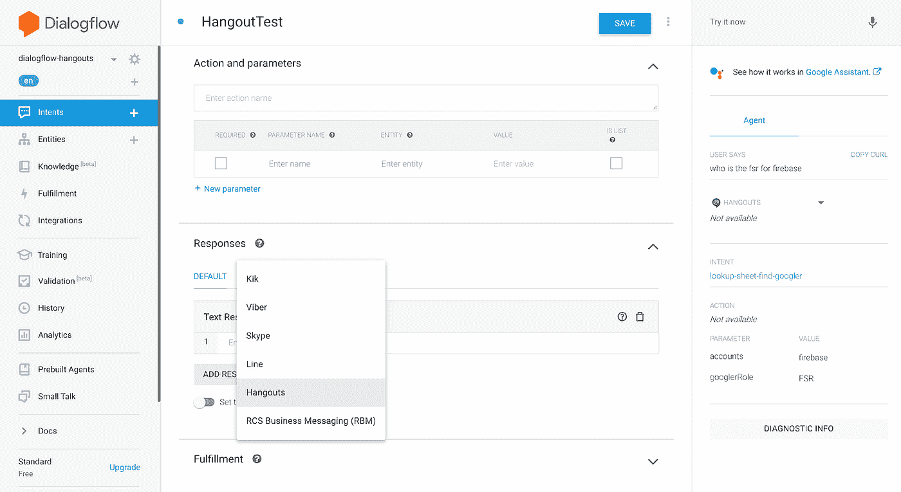
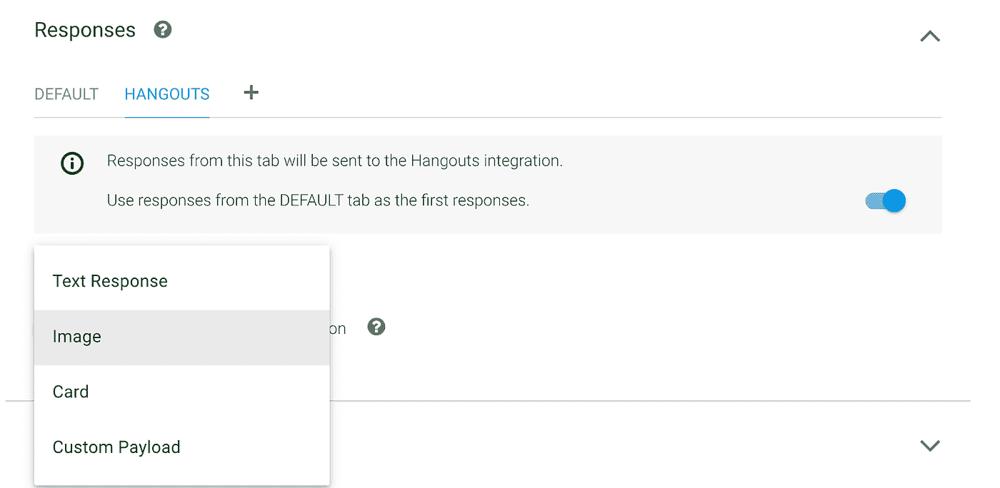
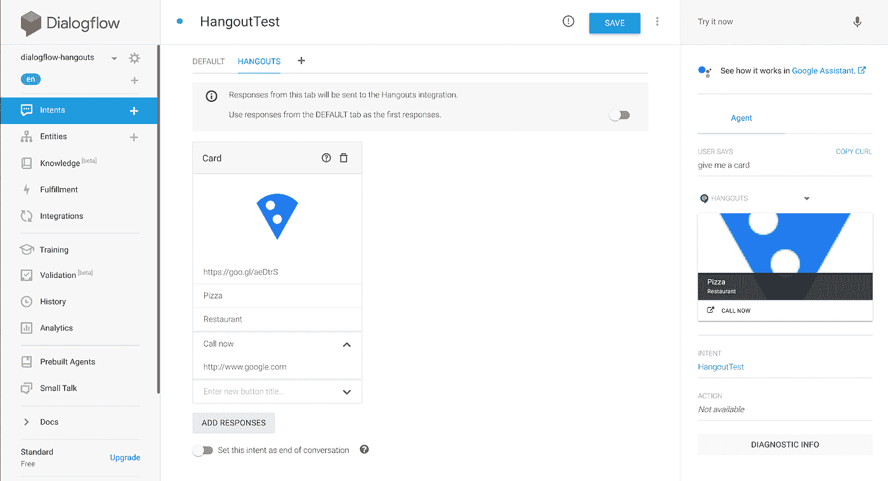
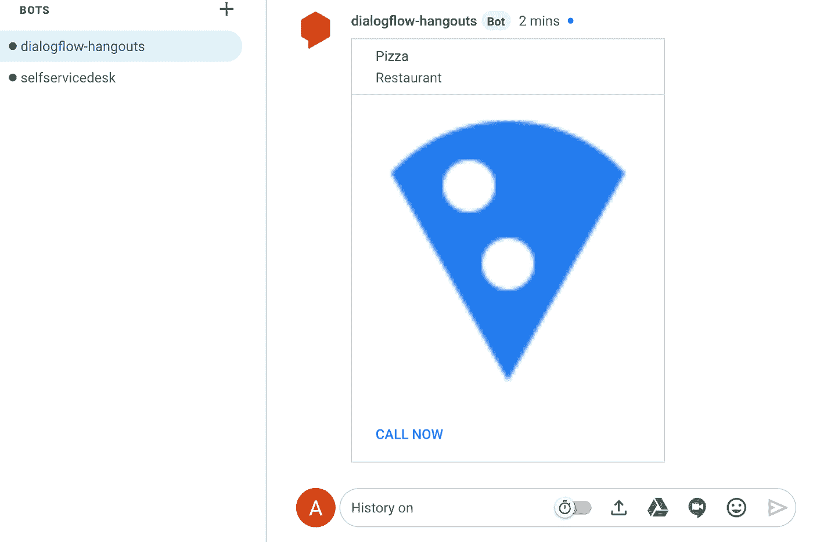

# 如何通过使用自定义的有效负载和卡来构建带有 Dialogflow 的聊天机器人。

> 原文：<https://medium.com/google-cloud/how-to-build-chatbots-for-hangouts-with-dialogflow-by-using-custom-payloads-and-cards-2006a11b578?source=collection_archive---------1----------------------->

Dialogflow Hangouts 集成允许您创建可以包含在一对一聊天以及聊天室中的机器人。从左侧的 Integrations 菜单中，您可以启用该功能并选择您的代理环境。

您可以按照本指南了解更多信息:[https://cloud . Google . com/dialog flow/docs/integrations/hangouts](https://cloud.google.com/dialogflow/docs/integrations/hangouts)

但你可能在这里，找出如何将它与卡片、格式化文本、图像或自定义有效载荷等丰富的信息集成在一起。也许你甚至试图通过你的履行代码来实现这一点。我掩护你。

# 丰富的信息

当 Hangouts Chat 向 bot 发送事件时，它会在事件有效负载中包含某些数据；确切的负载取决于事件类型。该事件和负载包含在发送到 bot 注册 URL 的 HTTP 调用中。

对于一些事件，机器人可以响应于该事件向聊天发送消息。该消息是一个 JSON 对象，其内容取决于消息的类型:

# Google Hangouts 集成在 Dialogflow UI 控制台中

开箱即用，在 Dialogflow UI 控制台中，您可以通过单击**响应**块中的+按钮来选择自定义 Hangout 响应:



这允许您创建 4 种不同类型的响应:

*   格式化文本响应
*   形象
*   卡片
*   自定义有效负载



Hangouts **文本响应**，在视觉上看起来与 Dialogflow UI 控制台中的**默认文本响应**相同。然而，原始 api 响应看起来有点不同，因为它还将平台配置设置为“GOOGLE_HANGOUTS”，这在构建多渠道代理时可能会很有趣。

```
"fulfillmentMessages": [{ "text": { "text": [ "This is a test." ]}, "platform": "GOOGLE_HANGOUTS"},...
```

除此之外，您还可以更改文本格式。参见 [SimpleText](https://developers.google.com/hangouts/chat/reference/message-formats/basic) 例如，您可以通过将文本包裹在某些符号中来使文本成为**粗体**或*斜体*。

Hangouts **Image** ，顾名思义会在 Hangouts 中插入图像。您可以指定图像 url。

Hangouts **卡**允许您创建一个基本的简单卡。您可以设置一个**标题**，一个**副标题**，一个**图片** **url** 和**多个** **按钮**(一个标签和一个 url):



在 Google Hangouts 中会是这样的:



最后，有一个选项可以指定一个 Hangouts **自定义有效载荷**，*现在这就是魔术发生的地方，以便创建高级卡*。一张卡可以有一个或多个部分。每个部分都可以有一个标题。

你可以看看 hangouts 消息格式卡参考指南，看看你可以用这个创建一些组合:[https://developers . Google . com/hangouts/chat/reference/message-formats/cards](https://developers.google.com/hangouts/chat/reference/message-formats/cards)

然而，使用定制的有效负载意味着您必须提供 JSON 格式。

现在，如果您将参考指南的示例复制并粘贴到 Dialogflow 中的自定义有效负载框中，您需要注意以下几点:

*   第一把钥匙不能叫**牌**，但必须命名为: **hangouts**
*   **hangouts** 键指向一个对象，而不是(卡片的)数组
*   确保编辑器不包含任何林挺错误
*   您不能在对话流*立即尝试控制台*中测试结果，您必须直接在 Hangouts 聊天中测试

下面是一个工作示例:

Hangouts 高级富卡的 Dialogflow 自定义有效负载

# Google Hangouts 集成在 Dialogflow 实现代码中

除非您为 Hangouts 聊天创建静态 FAQ 聊天代理，否则您可能会从服务器获取结果并在组件中显示它。为此，您将需要后端实现代码(要么在云功能中(例如由内嵌编辑器提供)，要么通过指定 webhook url。

无论哪种方式，如果您使用 JavaScript/Node，在聊天中集成 Hangouts 卡的最简单方法是使用**dialog flow-fulfillment**NPM 库:[https://www.npmjs.com/package/dialogflow-fulfillment](https://www.npmjs.com/package/dialogflow-fulfillment)

*(注意:你不能使用 actions-on-google npm 包，因为这个库是为 Google Assistant 代理准备的。)*

确保使用 0.6.1 版(或更高版本)。尽管 0.6.1 版本没有特定的 Google Hangouts 平台识别，但默认的 Dialogflow 卡、图像和有效负载响应将开箱即用:

```
var card = new Card({ title: 'hello', text: 'test', imageUrl: 'https://goo.gl/aeDtrS', buttonText: 'Details', buttonUrl: 'https://assistant.google.com/'});var image = new Image({ imageUrl: 'https://goo.gl/aeDtrS',});
```

(建议筹码在 Hangouts 中不起作用，因为它们不存在于 Hangouts 聊天中。…但是你可以用按钮来实现。)

但是假设你想要比这些更复杂一点的卡，你将不得不使用定制的有效载荷。假设我们在 Dialogflow fulfillment 编辑器中编写了以下云函数:

```
const { WebhookClient, Payload } = require('dialogflow-fulfillment');exports.dialogflowFirebaseFulfillment = functions.https.onRequest((request, response) => { let agent = new WebhookClient({ request, response }); let intentMap = new Map(); intentMap.set('test', test); agent.handleRequest(intentMap);});
```

在 Dialogflow 中，我们创建了一个名为' **test** '的意图，它启用了 fulfillment webhook。

您可以使用我在本文前面使用的 [rich 卡示例](https://gist.github.com/savelee/612450be03f64a69cc2d4b2b4a5b9d32)。取而代之的是一个函数 **getCard** ，返回这个定制的有效载荷对象。

测试方法应该是这样的:

```
function test(agent){ let json = getCard(); let payload = new Payload( 'hangouts', json, { rawPayload: true, sendAsMessage: true} ); agent.add(payload);}
```

我们正在创建一个**有效载荷**对象。将平台指定为字符串很重要: **hangouts** 以确保它会出现在 Google Hangouts 中。

第二个参数是前面提到的自定义有效负载。

我们将需要指定第三个对象，它将 **rawPayload** 设置为 **true** ，并确保它将作为消息发送**。**

去吧，测试一下。应该能行！