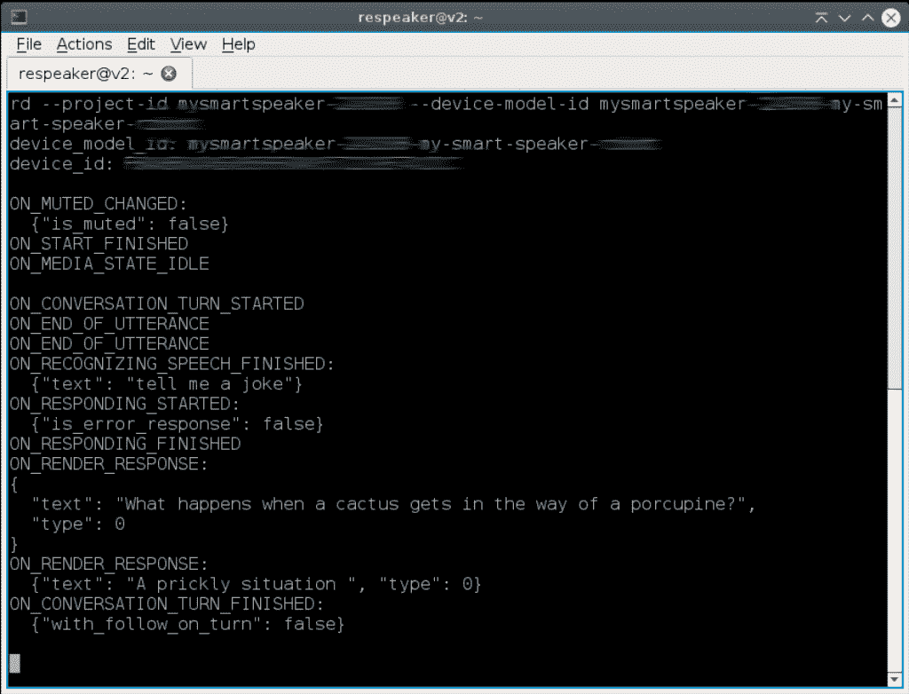
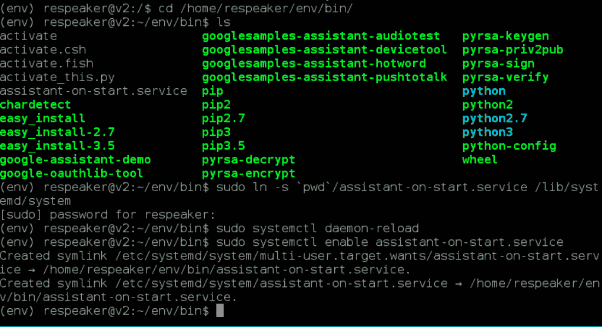

# 如何打造自己的智能音箱——Google Assistant、Google Cloud、在 Google 上的操作和 re speaker Core v 2.0——第 2 部分

> 原文：<https://medium.com/google-cloud/how-to-build-your-own-smart-speaker-google-assistant-google-cloud-actions-on-google-and-b5beb96da119?source=collection_archive---------0----------------------->


在本教程中，我们将学习如何使用 Google Assistant 和 ReSpeaker Core v2.0 构建自己的智能扬声器。值得注意的是，这是第一部分教程的延续。

[](/@sachindroid8/how-to-build-your-own-smart-speaker-google-assistant-google-cloud-actions-on-google-and-eec1169d9435) [## 如何打造自己的智能音箱——谷歌助手、谷歌云、谷歌上的动作和…

### 在本教程中，我们将学习如何使用谷歌助手、谷歌云、在…上的操作来构建自己的智能扬声器

medium.com](/@sachindroid8/how-to-build-your-own-smart-speaker-google-assistant-google-cloud-actions-on-google-and-eec1169d9435) 

此外，我们将嵌入谷歌助手，并建立我们自己的谷歌主页/谷歌迷你像智能音箱。

1.  谷歌助手库简介
2.  设置和配置—硬件、网络和音频
3.  安装 SDK 和示例代码
4.  运行示例代码
5.  自动化—在启动时运行您的应用
6.  结论
7.  参考


# 1.谷歌助手库简介

对于任何想要快速将助手集成到项目中的人来说，Python 的 Google Assistant 库是一个交钥匙解决方案。此外，该库是用 Python 编写的，并在流行的硬件上得到支持，如 Raspberry Pi 3 等。

# 2.设置和配置—硬件、网络和音频

在继续下一步之前，请参考上一个教程并完成所有步骤。

[](/@sachindroid8/how-to-build-your-own-smart-speaker-google-assistant-google-cloud-actions-on-google-and-eec1169d9435) [## 如何打造自己的智能音箱——谷歌助手、谷歌云、谷歌上的动作和…

### 在本教程中，我们将学习如何使用谷歌助手、谷歌云、在…上的操作来构建自己的智能扬声器

medium.com](/@sachindroid8/how-to-build-your-own-smart-speaker-google-assistant-google-cloud-actions-on-google-and-eec1169d9435) 

# 3.安装 SDK 和示例代码

# 3.1 配置新的 Python 虚拟环境

首先，使用一个 [Python 虚拟环境](https://docs.python.org/3/library/venv.html)将 SDK 及其依赖项从系统 Python 包中隔离出来。因此，打开 QTerminal 并依次运行以下命令。

**对于 Python 3** :

```
sudo apt-get update
sudo apt-get install python3-dev python3-venv
python3 -m venv env
env/bin/python -m pip install --upgrade pip setuptools wheel
source env/bin/activate
```

# 3.2 获取包

Google Assistant SDK 包包含在设备上运行 Google Assistant 所需的所有代码，包括示例代码。所以，一个一个执行下面的脚本。

## 安装依赖项

```
sudo apt-get install portaudio19-dev libffi-dev libssl-dev libmpg123-dev
python3 -m pip install --upgrade google-assistant-library==1.0.1
python3 -m pip install --upgrade google-assistant-sdk[samples]==0.5.1
```

# 4.运行示例代码——嘿，谷歌

由于我们已经完成了上一教程的所有基础工作和这里的剩余步骤，我们可以继续运行我们的示例代码。

用自己的 id 修改命令`googlesamples-assistant-hotword --project-id <my-dev-project> --device-model-id <my-model` >。

所以，对于上面的命令，把<`my-dev-project` >改成你的`project-id`，把< `my-model>`改成你的`Model ID`。

对于这个演示，应该是这样的

```
googlesamples-assistant-hotword --project-id mysmartspeaker-xxxxx --device-model-id mysmartspeaker-xxxx-my-smart-speaker-xxxxx
```

您也可以使用以下命令运行相同的程序。

```
python3 /home/respeaker/env/bin/googlesamples-assistant-hotword --project-id mysmartspeaker-xxxxx --device-model-id mysmartspeaker-xxxx-my-smart-speaker-xxxxx
```

最后，你可以使用热门词汇 **Ok Google/Hey Google** 来触发谷歌助手。

试试问下面的
*好的谷歌一下，给我讲个笑话。好的，谷歌，把我传送上去，斯科特。*



# 5.自动化—在启动时运行您的应用

既然我们已经运行了示例应用程序，我们确实需要一直运行它，并且在启动时自动启动。为了做到这一点，我们需要配置一些东西。让我们开始吧。

# 5.1 创建服务文件。

默认情况下，我们的设备在启动时不做任何事情；您必须手动执行程序。但是你可以通过创建一个`[systemd](https://manpages.debian.org/stretch/systemd/systemd.1.en.html)`服务让这个程序(或者你选择的任何其他程序)在启动时自动运行。

您所需要的只是一个`.service`配置文件。该文件接受一长串配置选项。

在 QTerminal 中，输入以下命令。

```
cd /home/respeaker/env/bin/
sudo vi assistant-on-start.service
```

将以下代码复制粘贴到 assistant-on-start.service 文件中。确保用您的 id 替换项目 id 和设备型号 id。

```
[Unit]
Description=My Assistant Smart Speaker
Wants=network-online.target
After=network-online.target
Wants=systemd-timesyncd.service
After=systemd-timesyncd.service

[Service]
Environment=DISPLAY=:0
ExecStart=/bin/bash -c '/home/respeaker/env/bin/python3 -u /home/respeaker/env/bin/googlesamples-assistant-hotword --project-id mysmartspeaker-xxxxx --device-model-id mysmartspeaker-xxxx-my-smart-speaker-xxxxx'
WorkingDirectory=/home/respeaker/env/bin/
Restart=always
User=respeaker

[Install]
WantedBy=multi-user.target
```

要将这个文件付诸实施，您需要将它放入`/lib/systemd/system/`目录中。但是，您可以在这个目录中创建一个符号链接(一个“符号链接”)，指向已经存在的文件，而不是将这个文件实际移动到那里。您可以这样做:

```
# Create the symlink
sudo ln -s `pwd`/assistant-on-start.service /lib/systemd/system# Reload the service files so the system knows about this new one
sudo systemctl daemon-reload
```

现在我们需要告诉系统在启动时运行这个服务:

```
sudo systemctl enable assistant-on-start.service
```



一切就绪！您现在可以尝试重新启动以查看它的工作情况。

或者使用以下命令手动运行它:

```
sudo service assistant-on-start start
```

**注意:**即使在该命令的提示符返回后，程序也需要一段时间才能启动。

如果您希望在启动时停止该服务的运行，请使用以下命令禁用它:

```
sudo systemctl disable assistant-on-start.service
```

要在它运行后手动停止它，请使用以下命令:

```
sudo service assistant-on-start stop
```

您可以使用以下命令检查服务的状态:

```
sudo service assistant-on-start status
```

# 6.结论

总之，我们已经成功地将谷歌助手嵌入到我们的智能扬声器中。我们还自动将其设置为一直运行，并在启动时自动启动。因此，我们现在有了自己的类似 Google Home/Google mini 的设备，它使用 ReSpeaker Core v2.0 进行语音识别，具有 6 阵列麦克风和语音算法。在下一个即将到来的教程中，我们将扩展设备来做更多的事情，比如连接到蓝牙扬声器，使其便携等等。在那之前，看看我在 [**媒体**](/@sachindroid8) 和我的网站[**techwithsach.com**](https://techwithsach.com/)上的其他教程帖子。

[](/google-cloud/how-to-create-a-chatbot-using-dialogflow-enterprise-edition-and-dialogflow-api-v2-923f4a965176) [## 如何使用 Dialogflow 企业版和 Dialogflow API V2 创建聊天机器人

### 在本教程中，我们将学习如何使用 Dialogflow 企业版和 Dialogflow API V2 创建聊天机器人。这个…

medium.com](/google-cloud/how-to-create-a-chatbot-using-dialogflow-enterprise-edition-and-dialogflow-api-v2-923f4a965176) [](/google-cloud/how-to-build-an-app-for-google-assistant-using-dialogflow-enterprise-edition-and-actions-on-google-4413a61d2f2d) [## 如何在 Google 上使用 Dialogflow Enterprise Edition 和 Actions 为 Google Assistant 构建应用程序

### 用户在对话中使用 Google Assistant 来完成事情，比如购买食品杂货或预订乘车服务，或者在我们的…

medium.com](/google-cloud/how-to-build-an-app-for-google-assistant-using-dialogflow-enterprise-edition-and-actions-on-google-4413a61d2f2d) [](/@sachindroid8/how-to-build-your-own-smart-speaker-google-assistant-google-cloud-actions-on-google-and-eec1169d9435) [## 如何打造自己的智能音箱——谷歌助手、谷歌云、谷歌上的动作和…

### 在本教程中，我们将学习如何使用谷歌助手、谷歌云、在…上的操作来构建自己的智能扬声器

medium.com](/@sachindroid8/how-to-build-your-own-smart-speaker-google-assistant-google-cloud-actions-on-google-and-eec1169d9435) 

7.参考

*   [AIY 项目—语音工具包](https://aiyprojects.withgoogle.com/voice#makers-guide-3-4--run-your-app-automatically)
*   [谷歌助手 SDK](https://developers.google.com/assistant/sdk/guides/library/python/)