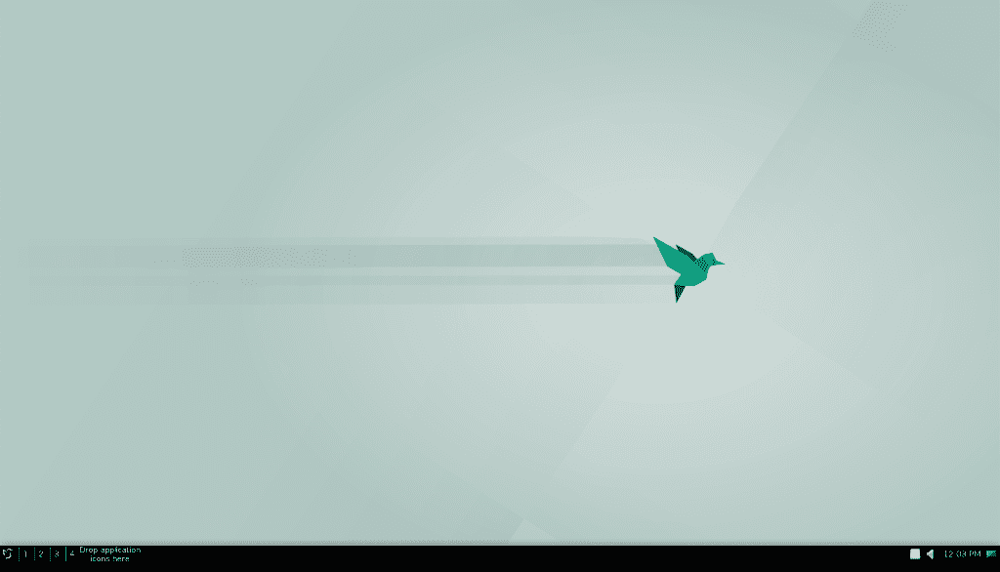
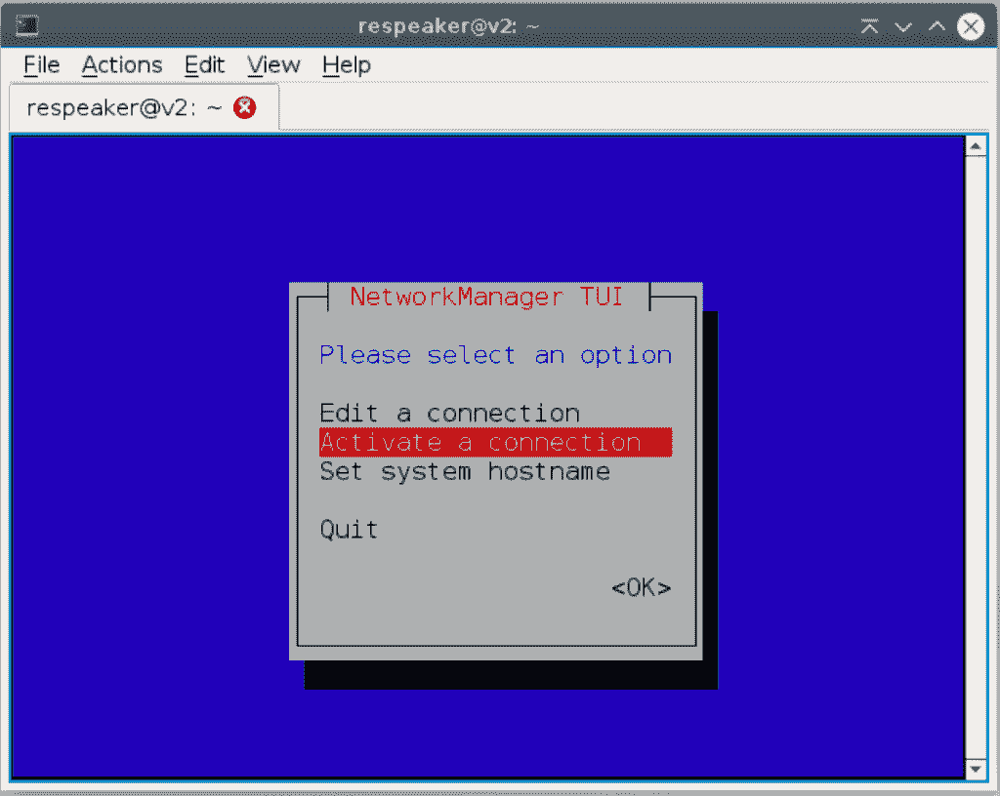
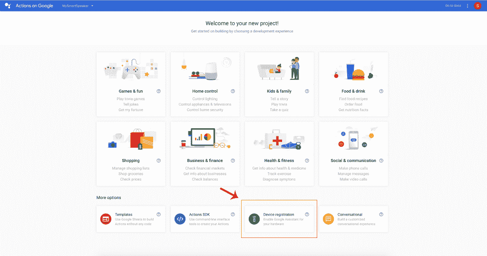
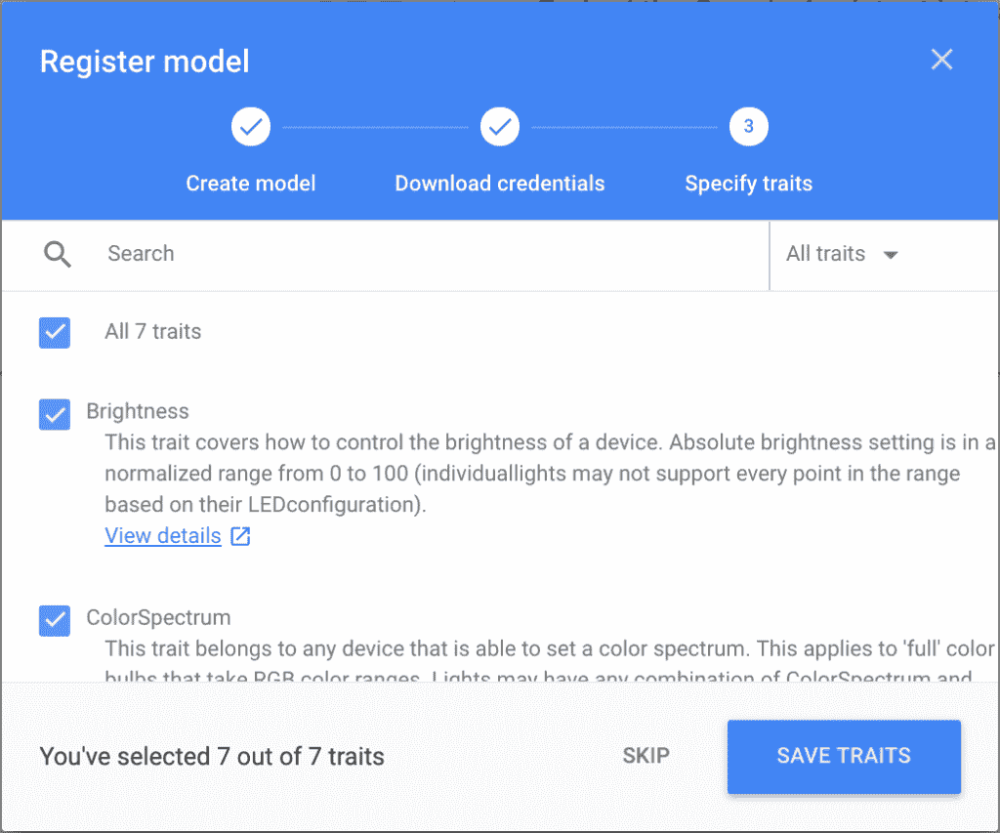
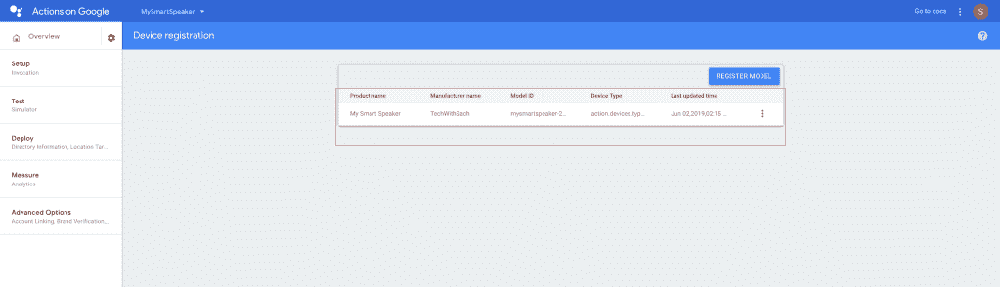
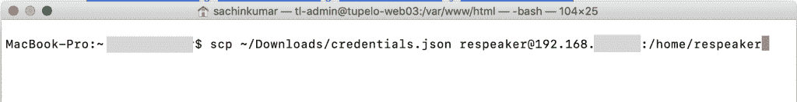
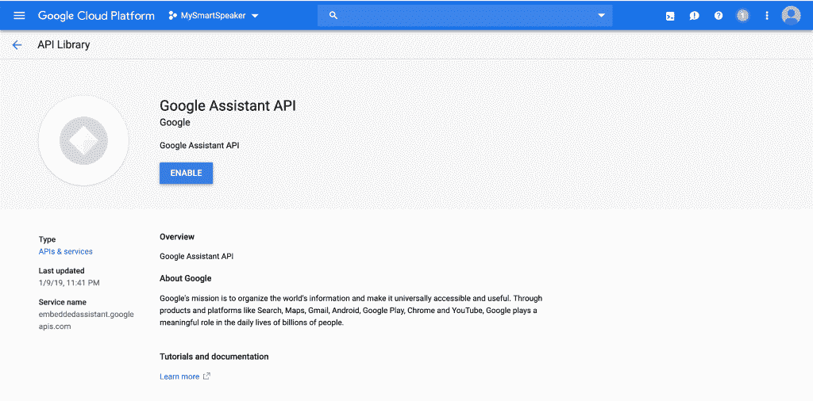

# 如何打造自己的智能音箱——谷歌助手、谷歌云、在谷歌上的行动和 re speaker Core v 2.0——第 1 部分

> 原文：<https://medium.com/google-cloud/how-to-build-your-own-smart-speaker-google-assistant-google-cloud-actions-on-google-and-eec1169d9435?source=collection_archive---------0----------------------->


在本教程中，我们将学习如何使用 Google Assistant、Google Cloud、Actions on Google 和 ReSpeaker Core v2.0 构建您自己的智能扬声器。此外，这是一个多部分教程系列，介绍如何使用各种工具、SDK、API 和硬件开发和构建您自己的智能扬声器。


1.  ReSpeaker Core v2.0 简介
2.  装置
3.  设置和配置
4.  为您的硬件启用谷歌助手
5.  创建一个谷歌云项目
6.  Google 控制台上的操作
7.  启用 Google Assistant API
8.  安装 SDK 和示例代码
9.  安装重新扬声器 d
10.  激活谷歌助手
11.  结论
12.  参考

# 1.ReSpeaker Core v2.0 简介


Seeed 的 [ReSpeaker Core v2.0](https://www.amazon.com/Seeed-Studio-ReSpeaker-Core-v2-0/dp/B07DN43Q7L/ref=sxts_sxwds-bia?crid=10FI9GG7CLUWY&keywords=respeaker+core+v2.0&pd_rd_i=B07DN43Q7L&pd_rd_r=c4fe2e8c-39a9-4e82-985c-13a0eb234e73&pd_rd_w=z0aFE&pd_rd_wg=Xzhga&pf_rd_p=b0a90583-d22c-4c32-806b-f09cd6946e61&pf_rd_r=38D25D986D0SPN8C7SSQ&qid=1559869222&s=gateway&sprefix=respeak%2Caps%2C316) 是为语音接口应用而设计的。所以，它是基于 Rockchip RK3229，一个四核 ARM Cortex A7，运行频率高达 1.5GHz，内存为 1GB。此外，该板具有一个六麦克风阵列，采用 DoA(到达方向)、BF(波束形成)、AEC(回声消除)等语音算法。因此，我们将以此为基础构建我们的智能扬声器。

# 2.装置

**第一步:**下载 ReSpeaker Core v2.0 最新版本的 Debian 镜像，本教程使用的镜像是[**re speaker-Debian-9-lxqt-SD-2018 08 01–4gb . img . xz**](https://v2.fangcloud.com/share/7395fd138a1cab496fd4792fe5?folder_id=188000311814&lang=en&preview=188002318085&scenario=share)。
你可以在这里下载 ReSpeaker Core v2.0 [的镜像。
**第二步。**使用 SD 读卡器将 SD 卡插入 PC 或 MAC。所以，你需要一个 4GB 以上容量的 SD 卡。
**第三步。**点击此处下载](https://v2.fangcloud.com/share/7395fd138a1cab496fd4792fe5?folder_id=188000207914&lang=en)[蚀刻机](https://etcher.io/)，用蚀刻机将`*.img.xz`文件直接刻录到你的 SD 卡上。或者将`*.img.xz`文件解压成`*.img`文件，然后用其他镜像写入工具刻录到 SD 卡上。
之后，点击加号图标添加你刚才下载的图像，软件会自动选择你插的 SD 卡。然后点击 Flash！开始燃烧。大约需要 10 分钟才能完成。


**第四步。**因此，在将图像写入 SD 卡后，将 SD 卡插入您的 ReSpeaker Core v2.0。另外，使用 PWR_IN 微型 USB 端口给电路板供电，并且通电后不要取出 SD 卡。最后，ReSpeaker Core v2.0 将从 SD 卡启动，您可以看到 USER1 和 USER2 LEDs 亮起。用户 1 通常配置为在引导时以心跳模式闪烁，用户 2 通常配置为在 SD 卡访问期间引导至亮。

# 3.设置和配置

# 3.1 网络和远程访问配置

**步骤 1:** 分别使用 HDMI 端口和 USB 端口将 ReSpeaker Core v2.0 板连接到显示器、键盘和鼠标。一旦映像启动，您将会看到类似如下的屏幕。



**步骤 2:** 从系统工具菜单打开 QTerminal，输入以下命令设置 WIFI。


**步骤 3:** 使用网络管理器工具 nmtui 配置您的对方网络。nmtui 将已经安装在 ReSpeaker 映像上。

```
sudo nmtui
```

默认的**密码**是**通话者**，用户名**也是**通话者**。系统将提示您输入密码。输入 respeaker 继续。**

从列表中选择**激活连接**选项，并按下`Enter`。



为 ReSpeaker v2.0 选择您的 Wi-Fi，按下`Enter`键并输入您的 Wi-Fi 密码，然后再次按下`Enter`键。当您看到一个`*`标记时，表示您的重新扬声器已成功连接到您的 Wi-Fi 网络。此外，点击`Esc`键两次，退出网络管理器配置工具。


**第四步:**一旦 WiFi 连接成功，我们就可以使用 VNC 浏览器远程访问 ReSpeaker Core v2.0 板。在此之前，我们需要知道设备的 IP 地址。

**步骤 5:** 在终端中键入以下命令，并复制 IP 地址。

```
ip address
```


**第 6 步:**将 [VNC 浏览器](https://www.realvnc.com/en/connect/download/viewer/)下载到您的电脑或 mac 上，输入 IP 地址，并使用以下方法远程连接到系统。
IP 地址:<输入复话板>的 IP 地址
用户名:复话者
密码:复话者

**第 7 步:**因此，我们现在应该使用 VNC 浏览器远程连接到我们的 ReSpeaker Core v2.0 板。因此，您现在可以使用 VNC 浏览器远程访问和控制设备，而不是将显示器、键盘和鼠标直接连接到主板上使用。

# 3.2 音频配置

出于本教程的目的，我们将使用一个普通的有源扬声器，并使用其**3.5 毫米音频插孔**连接到 ReSpeaker Core v2.0 板以输出音频。首先，您可以将有源扬声器或耳机插入此端口。其次，请注意，您还可以选择将评估板连接到蓝牙扬声器或带有 JST 2.0 引脚的扬声器。

**第一步:**列出话筒。我们可以在终端中使用以下命令来检查这一点。

```
arecord -l
```


确保记下卡号和设备号。在这种情况下，卡号为 0，设备号为 0。此外，找到名称带有**seed**前缀的采集卡。上例中，播放设备为 **hw:0，0** ，即卡**0**/设备 **0** 。

**第二步:**查看设备上所有播放设备的列表。我们可以在终端中使用以下命令来检查这一点。

```
aplay -l
```


确保记下卡号和设备号。在这种情况下，卡号是 0，设备号是 1。找到名称带有**seed**前缀的声卡。上例中，播放设备为 **hw:0，1** ，即卡**0**/设备 **1** 。

**第三步:**录音和播放:在终端中使用以下命令测试录音和播放声音。

```
# record & playback 2 channels audio
arecord -Dhw:0,0 -f S16_LE -r 16000 -c 2 hello.wav
aplay -Dhw:0,1 -r 16000 -c 2 hello.wav

# If you want to output the sound by the bluetooth device, you need to use the command below to play
aplay -r 16000 -c 2 hello.wav

# record 8 channels audio
# there are 6 microphones on board, and ac108 compose the 2 remaining channels.
arecord -Dhw:0,0 -f S16_LE -r 16000 -c 8 hello_8ch.wav
```

**步骤 4:** 创建一个名为。主目录(/home/respeaker)中的 asoundrc。因此，确保它有正确的麦克风和扬声器的从属定义；使用以下配置，但将<卡号>和<设备号>替换为您在上一步中记下的数字。因此，对`pcm.mic`和`pcm.speaker`都这样做。

```
sudo nano .asoundrc
```

同样，从下面复制粘贴代码。根据您的配置将其替换为正确的<card number="">和<device number="">，并保存文件。</device></card>

```
pcm.!default {
  type asym
  capture.pcm "mic"
  playback.pcm "speaker"
}
pcm.mic {
  type plug
  slave {
    pcm "hw:<card number>,<device number>"
  }
}
pcm.speaker {
  type plug
  slave {
    pcm "hw:<card number>,<device number>"
  }
}
```

在本例中，基于我们的配置。一个 undrc 文件如下所示。


# 4.为您的硬件启用谷歌助手


现在我们有了硬件设置，我们几乎已经设置好了智能扬声器。让我们继续为我们的 ReSpeaker 硬件启用 Google Assistant。

# 5.创建一个谷歌云项目

出于本教程和即将推出的同一主题系列教程的目的，我们将在谷歌云平台中添加一个新项目。

**第一步:**登录您的 google/gmail 帐户。

**第二步:**首先，我们需要使用[https://console.cloud.google.com/](https://console.cloud.google.com/)创建一个[谷歌云平台](https://console.cloud.google.com/)项目

*   创建或选择现有的 GCP 项目。在我的例子中，我将我的 GCP 项目命名为 MySmartSpeaker。

# 6.谷歌上的行动

**第一步:**在谷歌控制台的[动作中导入一个新项目。点击添加/导入项目。](https://console.actions.google.com/?pli=1)

**步骤 2:** 选择我们在 Google Cloud 控制台中创建的相同项目名称。在这种情况下，MySmartSpeaker。


第三步:点击`**Device registration:Enable Google Assistant for your hardware**`。



**第四步:**点击`**REGISTER MODEL**` 将谷歌助手嵌入你的硬件。


**第五步:**然后，填写你的产品信息，点击`**REGISTER MODEL**`。


**第六步:**下载 **OAuth 2.0 凭证**点击`**NEXT**`。


**第七步:**选择`**All 7 traits**`，点击`**SAVE TRAITS**`。



**第八步:**复制`Model ID`。在下一个屏幕中，单击项目名称并记下您的**型号 ID** ，因为我们将在接下来的步骤中需要此型号 ID。在这种情况下，我们的**型号 ID** 类似于 mysmart speaker-xxxx-my-smart-speaker-xxxxx。你的将不同于谷歌控制台上显示的操作。



**第 9 步:**复制项目 ID。此外，从控制台上，请点击谷歌控制台上操作左上角的**齿轮**，点击**项目设置**，记住**项目 ID** 。


**第十步:**将我们在**第六步**中下载到我们电脑上的 client_secret_xxxxxxx.json 文件重命名为 credentials.json。


**第 11 步:**将 credentials.json 文件从我们的计算机移动到 ReSpeaker Core v2.0 板的路径`/home/respeaker`。我们可以通过使用下面的命令或任何首选的工具来做到这一点。由于我们在前面的步骤中已经知道了设备的 IP 地址，所以我们可以直接连接到设备，并在您的计算机上使用以下命令移动文件。这里是我的 MacBook 的**端子**。

```
1scp ~/Downloads/credentials.json <username>@<IP ADDRESS>:/home/respeaker
```



输入`yes`继续，并输入密码`respeaker`。


我们已经成功地将 credentials.json 文件从我们的计算机复制到 ReSpeaker Core v2.0 设备的/ `home/respeaker`路径中。

最重要的是，到这一步，我们有了以下内容。
`Project ID: mysmartspeaker-xxxxx
Model ID: mysmartspeaker-xxxx-my-smart-speaker-xxxxx
credentials.json file in path /home/respeaker of the ReSpeaker Core v2.0 device.`

# 7.为我们的智能音箱启用谷歌助手 API

**第一步:**在你选择的项目上启用 Google Assistant API。所以，我们需要在[谷歌云平台控制台](https://console.cloud.google.com/)上做这件事。

只需点击[此处](https://console.developers.google.com/apis/api/embeddedassistant.googleapis.com/overview)即可启用谷歌助手 API。或者可以点击**导航菜单****->API 和服务- >库**，搜索**谷歌助手**。点击**启用**。



确保访问[活动控制](https://myaccount.google.com/activitycontrols?pli=1)并确保以下拨动开关启用(蓝色):

*   `Web & App Activity`
*   此外，请务必选择`Include Chrome browsing history and activity from websites and apps that use Google services`复选框。
*   `Device Information`
*   `Voice & Audio Activity`


# 8.安装谷歌助手 SDK 和示例代码

对于本教程的剩余部分，我们需要使用我们的 VNC 查看器直接在 ReSpeaker Core v2.0 设备中执行脚本。
我们可以用两个选项来完成这个阶段 **Python 2.7** 或者 **Python 3** 。为了这个教程，我们将选择 **Python 3** 。也可以参考 [Google Assistant SDK 文档](https://developers.google.com/assistant/sdk/guides/service/python/embed/install-sample)了解更多细节。此外，这将是我们的设备成为智能扬声器的核心。

# 8.1 配置环境

**对于 Python 3**

**第一步:**配置环境。在我们的 ReSpeaker Core V2.0 设备中再次打开 QTerminal。


**第二步:**如下图所示逐一执行以下脚本。因此，系统会提示您输入重新发言人密码。密码是`respeaker`。

```
sudo apt-get update
sudo apt-get install python3-dev python3-venv
python3 -m venv env
env/bin/python -m pip install --upgrade pip setuptools wheel
source env/bin/activate
```

# 8.2 获取包

Google Assistant SDK 包包含在设备上运行 Google Assistant 所需的所有代码，包括示例代码。

**第一步:**安装软件包的系统依赖项:确保一个一个运行脚本。

```
sudo apt-get install portaudio19-dev libffi-dev libssl-dev
#Use pip to install the latest version of the Python package in the virtual environment:
sudo python -m pip install --upgrade google-assistant-sdk[samples]
```

# 8.3 生成凭证

安装或更新授权工具:

```
sudo python -m pip install --upgrade google-auth-oauthlib[tool]
```

创建目标文件夹。

```
sudo mkdir –p /path/to/assistant-sdk/
```

使用下面的命令将`credentials.json`复制到目标位置。

```
sudo cp /home/respeaker/credentials.json /path/to/assistant-sdk/
```

点击下面的命令获取令牌生成代码。因此，我们应该会在终端中看到一个 URL:

```
google-oauthlib-tool --scope https://www.googleapis.com/auth/assistant-sdk-prototype \
          --save --headless --client-secrets /path/to/assistant-sdk/credentials.json
```

复制 URL 并将其粘贴到浏览器中(这可以在任何机器上完成)。该页面将要求您登录您的 Google 帐户。登录创建开发者项目的 Google 帐户。


复制代码并粘贴到终端中。


如果授权成功，您将看到类似下面的响应:
`credentials saved: /home/respeaker/.config/google-oauthlib-tool/credentials.json`。

相反，如果您看到`InvalidGrantError`，则输入了无效代码。再试一次，注意复制并粘贴整个代码。

# 9.安装重新扬声器 d

输入以下命令安装 respeakerd。

```
sudo apt-get install portaudio19-dev libffi-dev libssl-dev 
sudo pip install -U googleassistant_respeakerd
```

# 10.激活谷歌助手

还记得我们之前提到的两个 id 吗？现在是时候使用它们了。

用自己的 id 修改命令`googlesamples-assistant-pushtotalk --project-id <my-dev-project> --device-model-id <my-model` >。

所以，对于上面的命令，把< 【 > into your 【 and change < 【 into your 【 .

For this demo, it should be like

```
googlesamples-assistant-pushtotalk --project-id mysmartspeaker-xxxxx --device-model-id mysmartspeaker-xxxx-my-smart-speaker-xxxxx
```

Finally, press Enter and Ask the Assistant any questions like “What’s the weather in San Francisco” or “Sing a song” or “Tell me a joke” etc.


# 11\. Conclusion

To conclude, we have successfully embedded the Google Assistant into our ReSpeaker Core v2.0 using Google Assistant as a Service. So to summarize, we installed, setup and configured the ReSpeaker Core v2.0\. In addition, we also created a project in the Google Cloud Platform and Actions on Google Console, Enabled the Google Assistant API, installed the SDK and sample code and ran the Google Assistant as a service. With the above steps, we have successfully build a good foundation for our smart speaker.

Furthermore, we are just scratching the surface in terms of the full capabilities of the ReSpeaker Core v2.0\. So, watch out for Part 2 of this smart speaker tutorial series. Also, in addition, check out my other tutorial posts on [**中的**](/@sachindroid8) 和我网站上的[**techwithsach.com**](https://techwithsach.com/)。

[](/google-cloud/how-to-create-a-chatbot-using-dialogflow-enterprise-edition-and-dialogflow-api-v2-923f4a965176) [## 如何使用 Dialogflow 企业版和 Dialogflow API V2 创建聊天机器人

### 在本教程中，我们将学习如何使用 Dialogflow 企业版和 Dialogflow API V2 创建聊天机器人。这个…

medium.com](/google-cloud/how-to-create-a-chatbot-using-dialogflow-enterprise-edition-and-dialogflow-api-v2-923f4a965176) [](/google-cloud/how-to-build-an-app-for-google-assistant-using-dialogflow-enterprise-edition-and-actions-on-google-4413a61d2f2d) [## 如何在 Google 上使用 Dialogflow Enterprise Edition 和 Actions 为 Google Assistant 构建应用程序

### 用户在对话中使用 Google Assistant 来完成事情，比如购买食品杂货或预订乘车服务，或者在我们的…

medium.com](/google-cloud/how-to-build-an-app-for-google-assistant-using-dialogflow-enterprise-edition-and-actions-on-google-4413a61d2f2d) [](/google-cloud/sentiment-analysis-using-google-cloud-machine-learning-552be9b9c39b) [## 使用谷歌云自然语言 API 的情感分析

### 本教程将引导您使用谷歌云自然语言 API 进行情感分析

medium.com](/google-cloud/sentiment-analysis-using-google-cloud-machine-learning-552be9b9c39b) [](/google-cloud/entity-analysis-using-google-cloud-natural-language-api-1b7d8f3302bd) [## 使用谷歌云自然语言 API 的实体分析

### 在本教程中，我们将学习如何使用 Google Cloud 自然语言 API 进行实体分析。本教程是一个…

medium.com](/google-cloud/entity-analysis-using-google-cloud-natural-language-api-1b7d8f3302bd) [](/@sachindroid8/flutter-tutorials-getting-started-build-beautiful-native-apps-on-android-and-ios-d5919a7188b) [## 颤振教程—入门—在 Android 和 iOS 上构建漂亮的原生应用

### 谷歌的颤振是什么？

medium.com](/@sachindroid8/flutter-tutorials-getting-started-build-beautiful-native-apps-on-android-and-ios-d5919a7188b) 

# 12.参考

*   [谷歌助手服务简介](https://developers.google.com/assistant/sdk/guides/service/python/)
*   [嵌入谷歌助手](https://developers.google.com/assistant/sdk/guides/service/python/embed/run-sample)
*   [Seeed Studio ReSpeaker 维基](http://wiki.seeedstudio.com/ReSpeaker/)
*   [注册设备型号](https://developers.google.com/assistant/sdk/guides/service/python/embed/register-device)
*   [ReSpeaker Core v2.0](http://wiki.seeedstudio.com/ReSpeaker_Core_v2.0/)