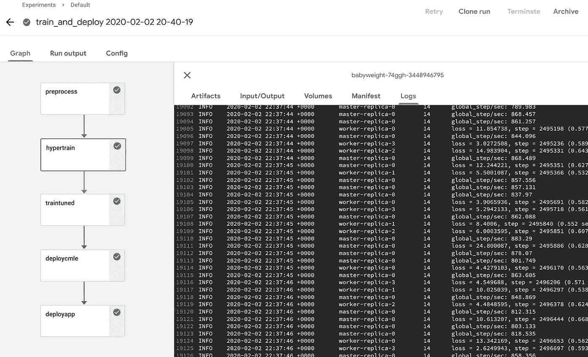
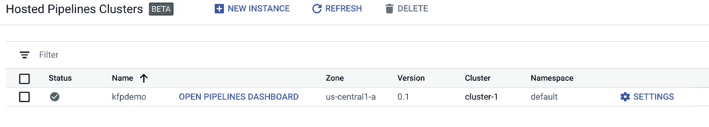
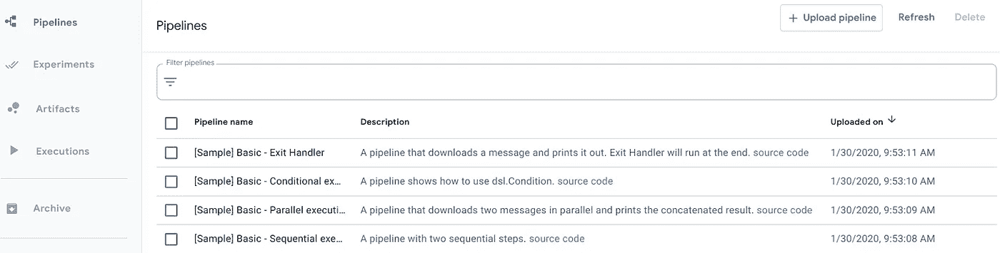
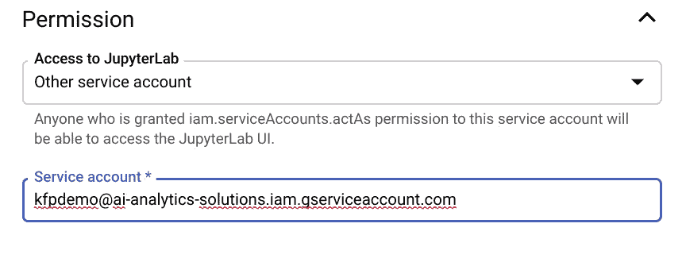
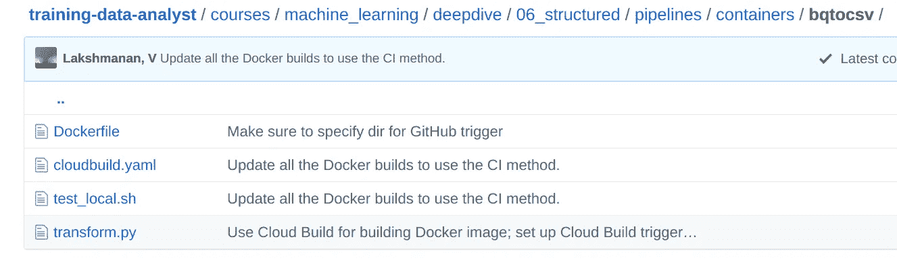
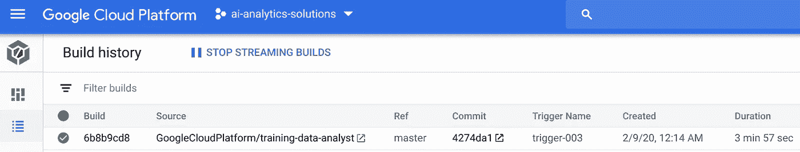

# 如何使用 Kubeflow ML 管道在机器学习(“MLOps”)中执行 CI/CD(# 3)

> 原文：<https://medium.com/google-cloud/how-to-carry-out-ci-cd-in-machine-learning-mlops-using-kubeflow-ml-pipelines-part-3-bdaf68082112?source=collection_archive---------0----------------------->

## 将您的 ML 组件设置为在有新代码(CI)时自动重建，并在有新数据(CD)时启动再训练实验

在之前的文章中，我向您展示了如何开始使用 Kubeflow Pipelines 和 T2 Jupyter 笔记本作为 Kubeflow ML pipeline 的组件。Kubeflow Pipelines 已经有了足够的改变(好的方面！—变得更简单)在这篇文章中，我将从头开始。换句话说，我将展示如何设置集群、笔记本和提交管道。也就是说，如果有些概念不太清楚，我建议你回去看看那两篇文章。


如果我们有 CI/CD 和食物一起吃不是很好吗？厨师可以根据市场上的供应情况(CI)更改项目描述，您可以在点餐时对其进行调整(“额外鹰嘴豆泥”)当您提交订单时，厨房就会做出合适的食物？(光盘)

在这个自述文件中可以找到[的全套说明——请在阅读本文时随意跟随。](https://github.com/GoogleCloudPlatform/training-data-analyst/blob/master/courses/machine_learning/deepdive/06_structured/pipelines/README.md)

## 1.设置托管的 Kubeflow 管道

Kubeflow 管道中的 ML 管道由步骤的有向无环图(DAG)组成，每个步骤都是一个容器。例如，这个管道由五个步骤组成——预处理、超参数训练、微调最佳模型、部署它和部署前端 webapp。在这种情况下，实际的应用程序并不重要，所以我不会在本文中深入讨论。



ML 管道由 ML 步骤组成，每个步骤都是一个 Docker 容器

管道在 Google Kubernetes 引擎(GKE)集群上执行。这个集群是长期存在的，您可以使用 Kubeflow Pipelines API 向它提交管道。

幸运的是，您不需要设置 GKE 集群，在其上安装 Kubeflow，并配置所有必要的权限来允许远程提交。Google Cloud Marketplace 上有一张[预建的托管 ML Pipelines 图片](https://console.cloud.google.com/marketplace/details/google-cloud-ai-platform/kubeflow-pipelines)。你也可以从[https://console.google.com/ai-platform/pipelines/clusters](https://console.google.com/ai-platform/pipelines/clusters)那里得到它并创建一个新的实例。

集群启动后(这需要 2-3 分钟)，单击管道仪表板链接以查看可用管道和正在执行的管道运行:



出现的集群有一个到 ML Pipelines 仪表板的链接



使用仪表板手动上传管道，并查看过去和正在进行的实验

## 2a。建立你的个人发展环境

虽然您可以使用仪表板与 Kubeflow 管道进行交互，但您更有可能使用 AI 平台笔记本进行开发活动。

为 kfp 开发和普通开发之间有一个关键的区别——您希望在集群上代表您执行代码。向您的用户提供对某段代码的授权是不可行的——因此，创建一个服务帐户:

```
SA_NAME=kfpdemo
gcloud iam service-accounts create $SA_NAME \
       --display-name $SA_NAME --project "$PROJECT_ID"
```

然后，将您希望 ML 管道拥有的权限授予这个服务帐户。例如，如果您希望 ML 管道能够启动数据流作业，您应该:

```
gcloud projects add-iam-policy-binding $PROJECT_ID \
    --member=serviceAccount:$SA_NAME@$PROJECT_ID.iam.gserviceaccount.com \
    --role=roles/dataflow.developer
```

脚本 [setup_auth.sh](https://github.com/GoogleCloudPlatform/training-data-analyst/blob/master/courses/machine_learning/deepdive/06_structured/pipelines/setup_auth.sh) 创建了一个服务帐户，并赋予它云存储、发布/订阅、BigQuery、数据流和人工智能平台(从 CloudShell 运行)的扩展角色。然后，它还将机密复制到 Kubeflow 集群，以便 Kubeflow 集群可以使用此服务帐户:

```
gcloud iam service-accounts keys create application_default_credentials.json --iam-account $SA_NAME@$PROJECT_ID.iam.gserviceaccount.com# Attempt to create a k8s secret. If already exists, override.
kubectl create secret generic user-gcp-sa \
  --from-file=user-gcp-sa.json=application_default_credentials.json \
  -n $NAMESPACE --dry-run -o yaml  |  kubectl apply -f -
```

现在，我们可以转到 GCP 控制台的人工智能平台|笔记本部分，创建一个笔记本。但是，当我们创建 AI 平台笔记本时，让它使用您刚刚设置的服务帐户:



用户的开发环境应该使用一个在 kfp 集群中存储了秘密的服务帐户。

这在企业开发环境中是如何工作的？您将有一个 Terraform 脚本，它为每个用户创建托管管道、一组服务帐户(每个服务帐户只有一个用户拥有 actAs 权限)和笔记本实例。每个用户都可以使用“他们的”服务帐户创建笔记本实例。笔记本本身将被限制为单用户模式，以确保所有操作都是可审计的。

## 2b。为管道步骤创建 Docker 容器

现在开发环境已经设置好了，我们可以开发 ML 组件，编写一个管道来连接各个步骤并执行管道。

每个步骤都需要是一个容器。因此，通过在 docker 文件中捕获依赖关系来将代码容器化。例如，这是用于将模型部署到 AI 平台的 docker 文件:

```
FROM google/cloud-sdk:latestRUN mkdir -p /babyweight/src && \
    cd /babyweight/src && \
    git clone [https://github.com/GoogleCloudPlatform/training-data-analyst](https://github.com/GoogleCloudPlatform/training-data-analyst)COPY deploy.sh ./ENTRYPOINT ["bash", "./deploy.sh"]
```

注意一些技巧——从一个有用的起始图片开始。在这种情况下，部署一个模型需要运行一个 gcloud 命令，所以我从一个提供最新 gcloud 的映像开始。如果我需要来自源代码控制的文件，我可以 git 克隆我的存储库来为培训师提供源代码。

容器的入口点是从本地目录复制的 run deploy.sh。实际上，该脚本由以下命令组成:

```
gcloud ai-platform versions create ${MODEL_VERSION} \
       --model ${MODEL_NAME} --origin ${MODEL_LOCATION} \
       --runtime-version $TFVERSIONecho $MODEL_NAME > /model.txt
echo $MODEL_VERSION > /version.txt
```

我将简要描述 echo 命令的原因。

我们有容器的代码是不够的，我们必须构建容器并使其对集群可用。您可以使用云构建来实现这一点:

```
gcloud builds submit . --config cloudbuild.yaml
```

其中 cloudbuild.yaml 指定了 Google 容器注册表(gcr.io)中的标签:

```
steps:
    - name: 'gcr.io/cloud-builders/docker'
      dir:  '${DIR_IN_REPO}'   # remove-for-manual
      args: [ 'build', '-t', 'gcr.io/${PROJECT_ID}/${CONTAINER_NAME}:${TAG_NAME}', '.' ]
images:
    - 'gcr.io/${PROJECT_ID}/${CONTAINER_NAME}:${TAG_NAME}'
```

现在我们在 gcr.io 中有了一个 Docker 映像，我们可以在 Jupyter 笔记本中试用它:

```
!docker run -t gcr.io/${PROJECT_ID}/babyweight-pipeline-deploycmle:latest gs://${BUCKET}/babyweight/hyperparam/17 babyweight local
```

## 2c。编写一个管道来连接这些步骤

一旦我们将所有 ML 步骤容器化，我们就可以编写一个管道将这些步骤连接成一个 DAG。这是在 Python 中使用 kfp API 完成的:

```
[@dsl](http://twitter.com/dsl).pipeline(
  name='babyweight',
  description='Train Babyweight model from scratch'
)
def preprocess_train_and_deploy(
    project='ai-analytics-solutions',
    bucket='ai-analytics-solutions-kfpdemo',
    start_year='2000'
):
    """End-to-end Pipeline to train and deploy babyweight model"""
    # Step 1: create training dataset using Apache Beam on Cloud Dataflow
    preprocess = dsl.ContainerOp(
          name='preprocess',
          # image needs to be a compile-time string
          image='gcr.io/ai-analytics-solutions/babyweight-pipeline-bqtocsv:latest',
          arguments=[
            '--project', project,
            '--mode', 'cloud',
            '--bucket', bucket,
            '--start_year', start_year
          ],
          file_outputs={'bucket': '/output.txt'}
      ).apply(use_gcp_secret('user-gcp-sa'))# Step 2: Do hyperparameter tuning of the model on Cloud ML Engine
    hparam_train = dsl.ContainerOp(
        name='hypertrain',
        # image needs to be a compile-time string
        image='gcr.io/ai-analytics-solutions/babyweight-pipeline-hypertrain:latest',
        arguments=[
            preprocess.outputs['bucket']
        ],
        file_outputs={'jobname': '/output.txt'}
      ).apply(use_gcp_secret('user-gcp-sa'))
```

上面代码片段的要点是:

*   用`@dsl.pipeline `修饰该函数
*   该函数的参数可用于配置运行
*   在我的例子中，每一步都是一个 ContainerOp，它引用我们推送到 gcr.io 的 Docker 图像。
*   您可以将参数传递给容器。这些将成为入口点的命令行参数
*   指定步骤输出的显示位置
*   步骤 1 (bucket)的输出是步骤 2 (preprocess.outputs['bucket'])的输入—注意，步骤的名称用于引用需要哪个步骤的输出。您可以使用这里的任何步骤，只要它不会引入循环依赖。

当我们说预处理步骤的输出将在/output.txt 中时，我们必须确保将数据放在那里。这就是为什么上一节中我的 deploy.sh 在文件的后续步骤中回显了一些必要的输入。

## 2d。手动执行管道

一旦您编写了管道，您就可以使用 kfp 附带的命令行编译器来编译它，然后手动将它上传到仪表板。但是您也可以使用 Python API 直接提交代码。这在仪表板上更方便:

```
args = {
    'project' : PROJECT, 
    'bucket' : BUCKET
}client = kfp.Client(host=PIPELINES_HOST)
pipeline = client.create_run_from_pipeline_func(
     preprocess_train_and_deploy,
     args)
```

通过在 GCP 控制台中查看集群的设置，可以获得集群的 PIPELINES_HOST。

这将启动管道并在集群上保留日志。

## 3a。设置持续集成(CI)

现在我们已经有了正确工作的代码，我们准备好设置持续集成了。基本上，每当 Docker 所依赖的任何文件被提交到源存储库时，我们都希望重新构建 Docker 映像。

为了简单起见，我组织了代码，使每个步骤都在一个自包含的目录中:



因此，我们所要做的就是[将 GitHub 存储库连接到 GCP](https://console.cloud.google.com/cloud-build/triggers) 账户，并从 GitHub 设置一系列云构建触发器:


```
create_github_trigger() {
    DIR_IN_REPO=$(pwd | sed "s%${REPO_NAME}/% %g" | awk '{print $2}')
    gcloud beta builds triggers create github \
      --build-config="${DIR_IN_REPO}/cloudbuild.yaml" \
      --included-files="${DIR_IN_REPO}/**" \
      --branch-pattern="^master$" \
      --repo-name=${REPO_NAME} --repo-owner=${REPO_OWNER} 
}for container_dir in $(ls -d */ | sed 's%/%%g'); do
    cd $container_dir
    create_github_trigger
    cd ..
done
```

*注意:为了验证这一点，你必须派生出我的 GitHub repo，并用你的 fork 进行尝试——你可能没有权限将 GoogleCloudPlatform repos 连接到你自己的 GCP 项目。*

现在，无论何时提交文件，相应的触发器都会启动云构建:



## 3b。设置连续部署(CD)

与 web 应用程序不同，每当我们更新包含管道的 ML 组件时，我们不希望重新运行每个 ML 模型。因此，请仔细考虑哪种类型的事件需要重新执行，以及重新执行是整个管道还是部分管道。

一个常见的场景是，每当我们有新数据时，我们都希望重新训练模型(或者我们可能只想微调训练)。让我们假设我们想要训练并立即部署更新的模型(例如，我们没有 A/B 测试等的准备阶段。).在这种情况下，我们将创建一个新的管道方法，它只包含训练和部署步骤，并启动它来响应云存储中的新文件。

触发云存储的最简单方法是使用云功能。所以，我们可以做:

```
def handle_newfile(data, context):
    filename = data['filename']
    mlp_babyweight.finetune_and_deploy(filename)
```

其中，微调和部署方法为:

```
def finetune_and_deploy(filename):
    """invoked from a Cloud Function or a Cloud Run, it launches a Pipeline on kfp"""
    import kfp
    import sys

    if 'babyweight/preproc/train' in filename:
        PIPELINES_HOST = os.environ.get('PIPELINES_HOST', "Environment variable PIPELINES_HOST not set")
        PROJECT = os.environ.get('PROJECT', "Environment variable PROJECT not set")
        BUCKET = os.environ.get('BUCKET', "Environment variable BUCKET not set")
        print("New file {}: Launching ML pipeline on {} to finetune model in {}".format(
            filename, PIPELINES_HOST, BUCKET))
        sys.stdout.flush()
        client = kfp.Client(host=PIPELINES_HOST)
        args = {
            'project' : PROJECT, 
            'bucket' : BUCKET,
        }
        pipeline = client.create_run_from_pipeline_func(train_and_deploy, args)
        return 'Fine tuning job Launched!'
```

然后，我们可以使用以下方式部署云功能:

```
gcloud functions deploy handle_newfile --runtime python37 \
    --set-env-vars PROJECT=${PROJECT},BUCKET=${BUCKET},PIPELINES_HOST=${PIPELINES_HOST},HPARAM_JOB=${HPARAM_JOB} \
    --trigger-resource=${BUCKET}  \
    --trigger-event=google.storage.object.finalize
```

请注意，我的存储库向您展示了一个更复杂的设置。我将执行代码容器化，并使用 Cloud Run 启动它。虽然我们可以从云存储中触发云运行，但这需要设置发布/订阅主题等。因此，我触发了一个云函数，然后让云函数调用云运行。

如果我们在 preproc 目录下的云存储中创建一个新文件，那么将启动训练和部署 ML 阶段，并更新模型。

尽情享受吧！

## 后续步骤:

*   在 GitHub 中尝试这个 README.md 文件中的步骤
*   阅读关于这个话题的[谷歌云解决方案](https://cloud.google.com/solutions/machine-learning/mlops-continuous-delivery-and-automation-pipelines-in-machine-learning)——与解决方案相关的 GitHub repo 给你 Terraform 脚本等。在企业环境中这样做。