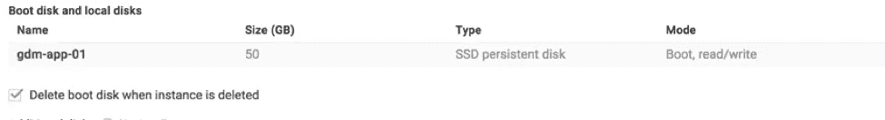
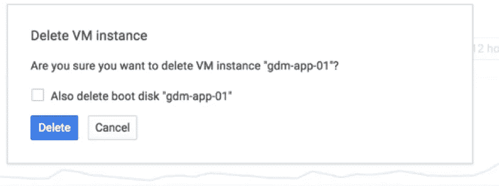
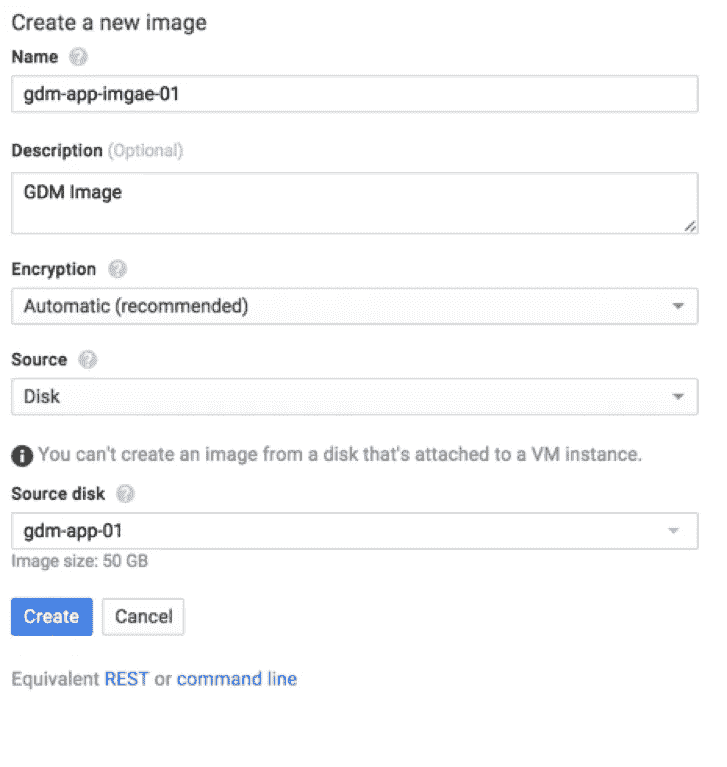
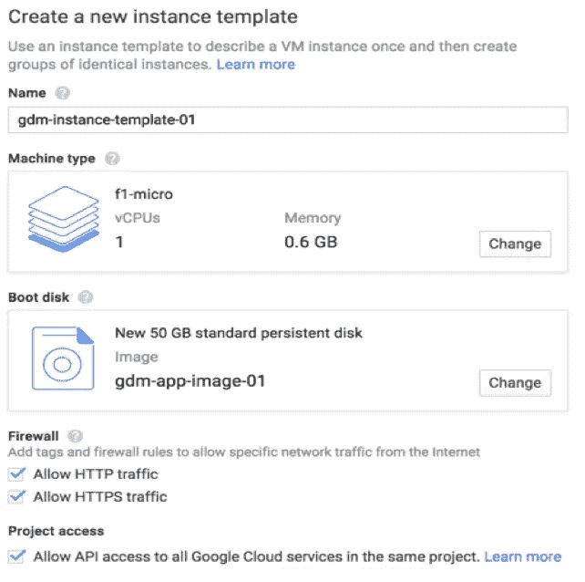
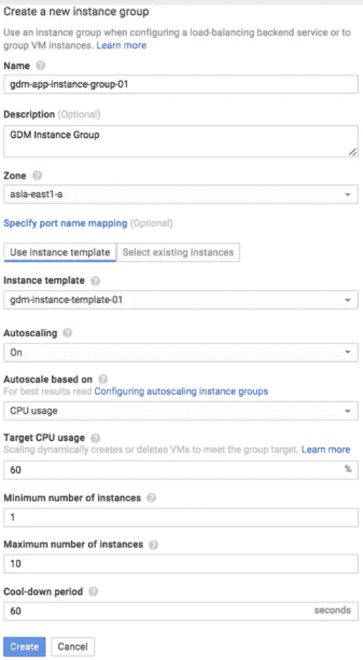
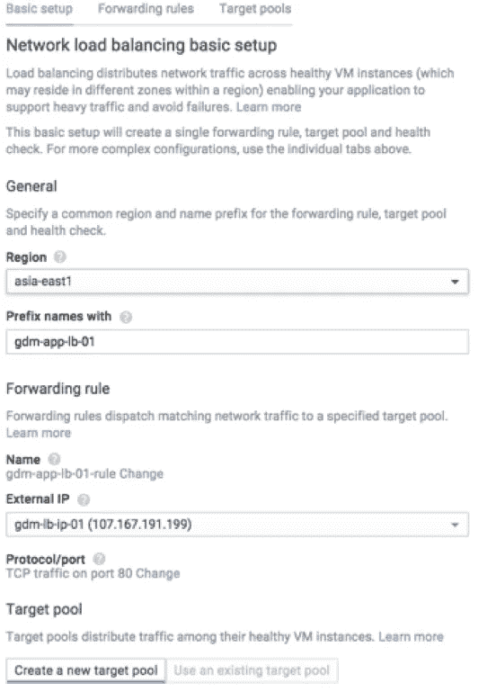
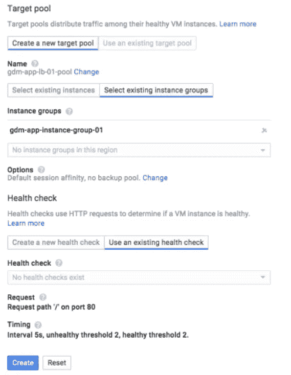

# 如何配置自动缩放— Google 计算引擎

> 原文：<https://medium.com/google-cloud/how-to-configure-autoscaling-google-compute-engine-f3ae932fe0f9?source=collection_archive---------0----------------------->

*作者:*[*Manoj Kumar*](https://www.linkedin.com/in/manoj7city)*，Powerupcloud 首席云架构师。最初发表于 2016 年 2 月 7 日 blog.powerupcloud.com**[*。*](http://blog.powerupcloud.com/2016/02/07/how-to-configure-autoscaling-google-compute-engine/)*

*当我们[在 Google Cloud 上管理一个巨大的活动网站](http://blog.powerupcloud.com/2015/09/03/gohf_case_study/)时，我们必须确保 web 层能够自动扩展，以承受 twitter 和电视频道等营销活动导致的流量突然激增。AWS 自动缩放的分步指南多如牛毛，但我们找不到类似的谷歌云文章。但是谷歌云的[文档](https://cloud.google.com/docs/)非常棒，仅次于 AWS。因为我们已经为一个繁忙的网站配置了自动缩放，并且已经看到了它的运行，我们认为记录它将有助于将来的某个人。接下来是一系列带有最小注释的截图，解释了如何在 Google cloud 中配置 autoscaling。*

## *为图像准备一个实例*

*[Autoscaler](https://cloud.google.com/compute/docs/autoscaler/) 需要一个可用的映像，当满足某些条件时，它可以从该映像中动态旋转实例。在这个例子中，我们将考虑一个简单的 Apache/PHP 服务器进行自动缩放，并相应地准备一个映像。*

*   *启动您偏好的实例类型*
*   *安装 Apache、PHP 和其他必要的包*
*   *部署代码并测试它是否工作*
*   *如果需要实例在启动期间执行某些任务，请添加启动脚本。例如，您可能希望从 git 存储库中获取最新的代码，并在启动时进行部署。*

*一旦所有这些都做了，去实例设置和禁用删除启动盘选项时，实例被删除。是的，我们将删除这个实例，并用它制作一个图像。*

**

*现在删除该实例，但不删除为其提供动力的引导磁盘。*

**

*从这个磁盘创建一个新映像。*

**

*检查图像是否已创建。*

**

## *创建实例模板*

*到目前为止，我们有一个引导盘，从中我们可以旋转实例，但谷歌云不知道你想旋转什么样的实例。什么尺寸，什么型号？这就是实例模板介入的地方。我们需要根据需要创建一个实例模板。*

*在 GCE 控制台中，转到[实例模板](https://console.cloud.google.com/project/_/compute/instanceTemplates/list?_ga=1.17308798.637619450.1440397583)页面。单击创建新的实例模板。为例程模板填充以下信息:*

*   *名字*
*   *机器类型*
*   *引导磁盘(这是我们在上一步中创建的磁盘)*
*   *允许通行。HTTP/HTTPS 或者别的什么，根据你的需要。*
*   *如果您想与其他 Google 云服务通信，请允许 API 访问*
*   *创建模板*

**

## *创建实例组*

*Google Cloud 的[实例组](https://cloud.google.com/compute/docs/instance-groups/)要么是托管组，要么是非托管组。在计算引擎的情况下，我们需要具有共同特征并且可以根据特定条件扩展的托管实例组。一个实例组依赖于一个实例模板，我们已经处理了这个模板。现在让我们创建实例组*

**

## *创建负载平衡器*

*横向扩展通常依赖于负载平衡，我们需要一个这样的负载平衡。因此，让我们继续配置一个。与基本的 AWS ELB 或 Azure 负载平衡器相比，Google Compute 的负载平衡器先进了几个数量级。稍后会详细介绍。为了这篇文章，我将使用一个网络负载平衡器-*

**

*下一个-*

**

*大概就是这样。现在，您的应用程序将根据您的配置进行伸缩。希望这有用！*