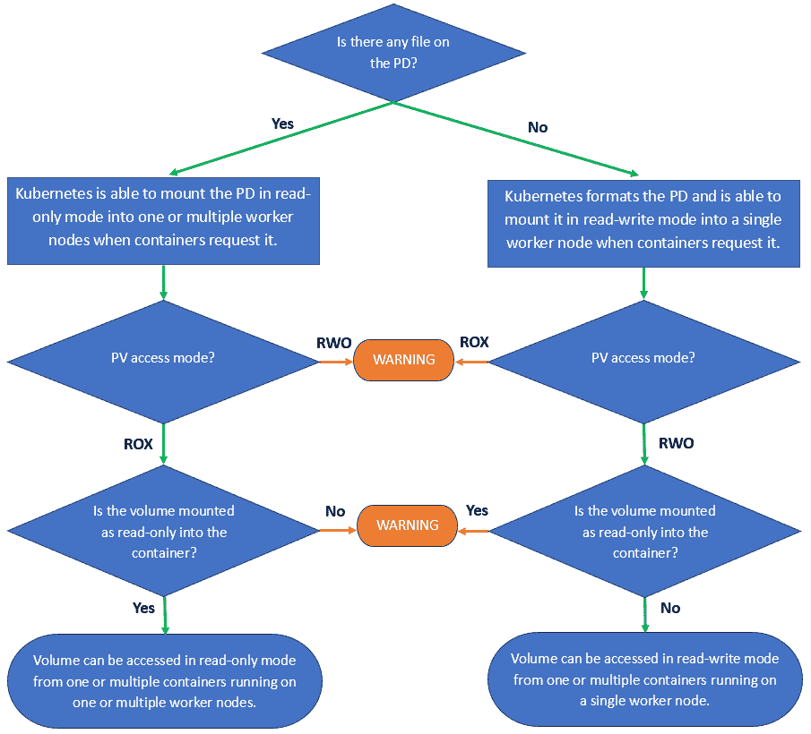

# 谷歌 Kubernetes 引擎只读卷

> 原文：<https://medium.com/google-cloud/how-to-configure-read-only-volumes-in-google-kubernetes-engine-gke-clusters-9c32c1c6b238?source=collection_archive---------0----------------------->

## 至少可以说，在 Kubernetes 中将外部卷附加到容器上不是一个简单的过程。当处理运行在多个 Kubernetes worker 节点上的多个容器时，这变得更加复杂，这是一个非常常见的用例。这篇文章的目标是试图理解这一切。

**TL；博士**:见最后的流程图。

这篇文章和下面的 Google 官方文档一起使用，这些文档是关于如何使用来自多个阅读器的持久磁盘的，最近已经被修改了。

 [## 对多个读取器使用永久磁盘

cloud.google.com](https://cloud.google.com/kubernetes-engine/docs/how-to/persistent-volumes/readonlymany-disks) 

在 Kubernetes 中，无论外部卷的访问模式是读写还是只读，都有两个步骤可以使外部卷对容器可用。

1.  该卷被装入一个或多个 Kubernetes 工作节点
2.  这个卷被装入一个或多个运行在这些 Kubernetes worker 节点上的容器中

在 Google Kubernetes 引擎(GKE)集群中，GCP 持久磁盘支持外部卷。

在被 Kubernetes 中的容器使用之前，必须创建一个支持只读卷的持久性磁盘并填充数据。

# **如何创建 GCP 持久盘？**

从现在开始，我们将把 GCP 持久磁盘简称为磁盘。

在这种情况下，有 3 种主要的方法来创建磁盘。

**#1 无 Kubernetes**

当您希望完全控制磁盘创建并将数据从 GKE 集群外部写入磁盘时，可以使用这种方法，它也不需要太多 Kubernetes 知识。

应该手动创建一个新的持久磁盘，并将其连接到 Google Cloud Engine 虚拟机(VM)。

数据磁盘(也称为不可引导磁盘)是除可引导操作系统磁盘(默认情况下存在于每个虚拟机和其他潜在数据磁盘上)之外的磁盘。

您可以在创建虚拟机时执行此操作，或者将新磁盘连接到现有虚拟机。

*   **GUI**

[使用数据磁盘创建新的虚拟机](https://cloud.google.com/compute/docs/instances/create-start-instance#create_a_vm_instance_with_additional_non-boot_disks)

运筹学

[创建磁盘并将其连接到现有虚拟机](https://cloud.google.com/compute/docs/disks/add-persistent-disk)

*   **谷歌云 SDK (gcloud CLI)**

[使用数据磁盘创建新的虚拟机](https://cloud.google.com/compute/docs/instances/create-start-instance#create_a_vm_instance_with_additional_non-boot_disks)

运筹学

创建磁盘并将其连接到现有虚拟机(2 步)

1.  [创建磁盘](https://cloud.google.com/sdk/gcloud/reference/compute/disks/create)
2.  [将磁盘连接到现有虚拟机](https://cloud.google.com/sdk/gcloud/reference/compute/instances/attach-disk?hl=fr)

一旦您将应用程序所需的所有文件复制到磁盘中，您需要[将其](https://cloud.google.com/sdk/gcloud/reference/compute/instances/detach-disk)从虚拟机(gcloud CLI)中分离出来。

**#2 与库伯内特**

大多数人都使用这种方法，因为它的优点是不需要 Kubernetes 之外的额外权限，但对于不熟悉存储类和回收策略 Kubernetes 概念的人来说，这是不必要的。

通过这种方法，您可以让 Kubernetes 使用 PersistentVolumeClaim 和 StorageClass 对象动态地为您创建磁盘，并将其装入容器。

 [## 持久卷和动态预配置

### 该页面概述了 Kubernetes 中的持久卷和声明，以及它们在 Google Kubernetes 中的使用…

cloud.google.com](https://cloud.google.com/kubernetes-engine/docs/concepts/persistent-volumes) 

将应用程序所需的所有文件复制到磁盘后，删除引用磁盘卷的 Pod，等待它终止，然后等待磁盘自动从节点分离。

**#3 混动**

这种方法是#1 和#2 的混合，像#1 一样创建磁盘，但像#2 一样将数据填充到磁盘中。

手动创建一个没有 Kubernetes 的磁盘，并通过 Kubernetes 以读写模式将其装入容器。

 [## 将预先存在的持久性磁盘用作持久性卷

### 本页解释了如何使用填充了数据的现有持久性磁盘创建持久性卷，以及如何使用…

cloud.google.com](https://cloud.google.com/kubernetes-engine/docs/how-to/persistent-volumes/preexisting-pd#create_pv_pvc) 

将应用程序所需的所有文件复制到磁盘后，删除引用磁盘卷的 Pod，等待它终止，然后等待磁盘自动从节点分离。

# **如何在 Kubernetes 中从多个阅读器中将一个卷设为只读？**

JsonPath 表达式用于指示子字段，对于眼睛来说，这可能不是更舒适的阅读格式，但是它有避免混淆的优点。

**Pod**

**pod . spec . volumes . persistentvolumeclaim . readonly**

*   默认为 false 的布尔值，将被设置为 true
*   在 pod 的所有容器的所有挂载点上强制只读

**pod . spec . containers . volume mounts . readonly**

*   默认为 false 的布尔值，为清楚起见，建议在查看 Pod 定义时将其设置为 true，即使它是由 Pod . spec . volumes . persistentvolumeclaim . readonly 强制执行的
*   每个容器的每个挂载点只读设置(比上面的子字段更细粒度)

部署比 pod 更容易使用，因此要知道等效的部署子字段分别是 Deployment . spec . template . spec . volumes . persistentvolumeclaim . readonly 和 Deployment . spec . template . spec . containers . volume mounts . readonly。

**持续卷**

以下配置适用于树内和 CSI 存储驱动程序。

**persistent volume . spec . access modes**

*   []字符串，必须将子字段设置为 ReadOnlyMany
*   选项有 ReadOnlyMany、ReadWriteOne 或 ReadWriteMany，截至本文撰写之时，尚不支持这些选项
*   建议不要设置一个以上的访问模式，即使您可以这样做，否则如果访问模式不兼容，在创建容器时会出现错误
*   访问模式不会触发 Kubernetes 上的任何操作，它们被用作控制检查，例如防止 Kubernetes 将一个“标记”为 ReadWriteOnce 的 PersistentDisk 挂载到多个 worker 节点中

仅适用于 CSI 驾驶员:

**persistent volume . spec . CSI . readonly**

*   默认为 false 的布尔值，将被设置为 true

**持续量声明**

**persistentvolumeclaim . spec . access modes**

*   与上述 persistent volume . spec . accessModes 的配置相同+将 access modes 设置为等于 PersistentVolume accessModes(或至少一个子网以获得创建边界

# **描述 Kubernetes 如何将 GCP 持久性磁盘装入容器的流程图**

流程图左侧的绿色路径是使卷成为只读卷的步骤(ROX)。

右手边的绿色路径，是读写一次(RWO)的步骤。

不支持或不建议使用橙色路径。

在所有情况下，这对 Kubernetes 都没有意义，因为它向它提供了相互矛盾的信息。

为清晰起见，以下流程图中使用了缩写:

*   PD => GCP 持久磁盘
*   PV => Kubernetes 持久卷定义
*   ROX = > readonly many(PV access modes 值)
*   RWO = >读写一次(PV 访问模式值)

推特@ouissamebekada