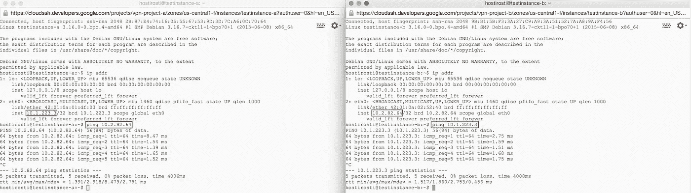

# 如何通过 VPN 连接谷歌云平台网络

> 原文：<https://medium.com/google-cloud/how-to-connect-google-cloud-platform-networks-via-vpn-622e47d510ba?source=collection_archive---------0----------------------->

当多个团队在一个软件开发项目上工作时，拥有多个 Google 云平台项目对项目资源进行更细粒度的访问和权限控制是有意义的。但是，使用这种方法，您需要一种方法来连接服务，而不将这些服务公开。这就是 VPN 的用处。您可以使用 VPN 安全地连接运行服务的网络。在这篇博文中，我们将在两个网络之间建立一对一的连接。Google VPN 设置也允许网络间的 1:n 和 n:m VPN 设置。

## 所需步骤的快速总结

*   在您的每个项目中，为您希望通过 VPN 连接的实例创建一个专用网络
*   使用专用的端点 IP 地址在每个项目中设置 VPN 连接
*   添加防火墙规则，以便实例可以跨越其专用网络边界进行“对话”
*   测试 VPN 设置

## 通过 VPN 连接谷歌云平台网络的详细步骤

在项目 a 中，为您希望通过 VPN 连接的 Google 计算引擎实例创建一个专用网络。这将是我们的项目 a 网络。在[个私有 IP 地址范围](https://en.wikipedia.org/wiki/Private_network)中选择一个地址范围。在我们的例子中，我们将使用一个超过 65k 地址的 C 类网络。记下地址范围，稍后您将需要它来设置 VPN 连接。最后但同样重要的是，在您的地址范围内选择一个地址作为“网关”。

重复上述步骤，为项目 b 中您希望通过 VPN 连接的实例创建一个专用网络。这将是我们的项目 b 网络。重要说明:选择一个与您为项目 A 设置选择的地址范围不同的地址范围。同样，请注意地址范围并设置有效的“网关”。

下一步是为每个相互指向的项目创建一个 VPN 连接。转到 Networks->VPN，开始在 project A 中创建一个新的 VPN 连接。为它命名，选择您在上一步中创建的 project-a-network，并为 VPN 创建一个 IP 地址。此时，您还不知道远程 IP 地址，所以暂时将其留空。

选择一个强共享秘密(共享秘密非常敏感，因为它允许进入你的网络-> **保持它非常非常安全！**)并将“远程网络 IP 范围”设置为您为 project-b-network 选择的“地址范围”。共享密码仅用于 VPN 连接设置，不要在其他地方共享。

现在只有“远程对等 IP 地址”仍然缺失。保持设置页面打开，并打开一个新的浏览器选项卡。转到开发人员控制台，重复相同的步骤，在项目 B 中设置 VPN 连接。一旦为项目 B VPN 设置创建了“IP 地址”,记下它，返回到项目 a VPN 设置页面，并将此“IP 地址”插入“远程对等 IP 地址”字段。

在项目 B VPN 设置中，将“远程对等 IP 地址”设置为您为项目 A 设置创建的“IP 地址”。对两种设置使用相同的共享密钥。

稍等片刻后，您应该会看到两个 VPN 设置都有一个绿色勾号，表示配置成功。如果您看不到这些复选标记，请检查日志，了解建立连接时发生错误的信息。

## 测试 VPN

当您看到两个 VPN 设置的绿色复选标记时，您应该可以开始了。让我们验证连接是否真的工作。

我们需要做什么来测试连接？

*   在项目 A 和项目 B 中创建计算引擎实例，它们位于我们为 VPN 创建的网络中
*   创建防火墙规则以允许 SSH 和 ping
*   SSH 到实例中，查找 IP 地址，并 ping“其他”网络中的机器

首先，我们在每个项目中创建一个 Google 计算引擎实例。创建实例时，在“管理、磁盘、网络、访问和安全”选项中选择各自的专用网络(项目 a 网络和项目 b 网络)。

其次，我们需要向我们创建的专用网络(项目 a 网络和项目 b 网络)添加两个防火墙规则。进入网络->网络，点击项目-[a | b]-网络。单击“添加防火墙规则”。我们创建的第一个规则允许来自公众的 SSH 流量，这样我们就可以 SSH 到我们刚刚创建的实例中。第二条规则允许两个网络之间的 icmp 流量(ping 使用 icmp 协议)。

现在，您可以 SSH 到每个实例并 ping 另一个实例。

在这篇博文中，我演示了如何在两个谷歌云平台网络之间建立 1:1 的 VPN 连接。通过向您的 VPN 连接添加额外的“隧道”,您可以将这些 1:1 连接扩展到网络之间的 1:n 甚至 n:m 链接。

关于建立 VPN 连接的更多信息可以在[https://cloud.google.com/compute/docs/vpn](https://cloud.google.com/compute/docs/vpn)**找到。**