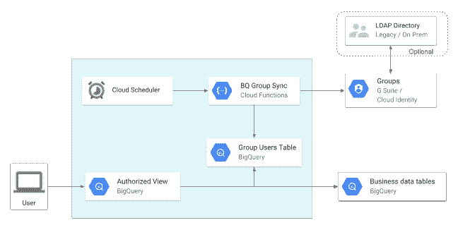
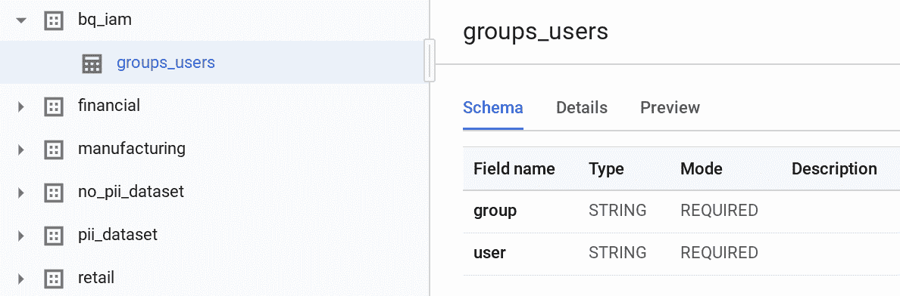
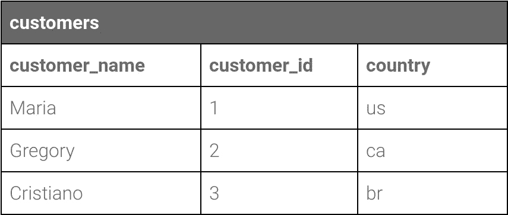
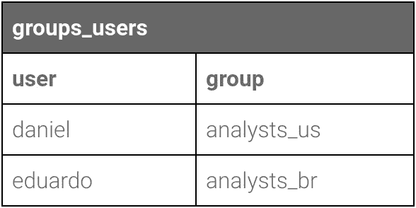

# 如何使用组在行级别控制对 BigQuery 的访问

> 原文：<https://medium.com/google-cloud/how-to-control-access-to-bigquery-at-row-level-with-groups-1cbccb111d9e?source=collection_archive---------1----------------------->

***更新 2021–06–25:****big query 现在有原生的* [*行级安全*](https://cloud.google.com/bigquery/docs/row-level-security-intro) *功能。在使用本文描述的技术之前，您应该检查一下这一点。*

# 介绍

BigQuery 是一个无服务器、高度可伸缩的数据仓库系统，为各种用例提供了巨大的灵活性。BigQuery 有一个基于 [Google Cloud 的 IAM](https://cloud.google.com/iam/) 功能的安全模型，这让管理员可以通过角色、组和个人用户来控制对数据集的访问。

然而，在某些用例中，可能有必要在比数据集更细粒度的级别上控制对数据的访问。例如，不同的用户可能需要访问表中行的不同子集。对于这种情况，BigQuery 具有[授权视图](https://cloud.google.com/bigquery/docs/share-access-views)功能，允许您授予对数据集的视图访问权，而不是像组那样的 IAM 实体。然后，该视图可以实现任何必要的过滤器，并与最终用户共享，最终用户只能查看过滤后的数据。

在 GCP 中设置访问控制的一种常见(推荐)方法是将用户添加到组中，并向这些组授予权限。通常，组织已经为其他资源这样做了，并在他们的 G Suite 管理或公司 LDAP 系统中保持组成员的更新。本文解释了如何通过 Google Groups 和 G Suite Admin API(或云身份 API)将这个组成员数据与授权视图集成，以便创建基于组的行级访问控制方案。

# 体系结构

为了同步组成员，我们将同时使用 [G 套件管理目录 API](https://developers.google.com/admin-sdk/directory/) (或[云身份 API](https://cloud.google.com/identity/docs/) )和[大查询 API](https://cloud.google.com/bigquery/docs/reference/rest/v2/) 。Google Cloud 函数将被安排执行定期同步，用所有组成员填充 BigQuery 表。然后创建一个授权视图，将组成员资格与业务数据表连接起来。下图显示了它的工作原理:



# 先决条件

您将需要一个启用了以下 API 的 GCP 项目:

*   [BigQuery API](https://console.cloud.google.com/apis/library/bigquery-json.googleapis.com)
*   [云函数 API](https://console.cloud.google.com/apis/library/cloudfunctions.googleapis.com)
*   [云调度 API](https://console.cloud.google.com/apis/library/cloudscheduler.googleapis.com)
*   [管理软件开发套件](https://console.cloud.google.com/apis/library/admin.googleapis.com)
*   [云身份 API](https://console.cloud.google.com/apis/library/cloudidentity.googleapis.com)

您还需要一个 G Suite 或云身份组织，并拥有对这两者的管理权限。

# 设置

为了自动化这个过程并访问管理 API，您需要做的第一件事是创建一个允许模拟 G Suite 管理员用户的服务帐户，这在 GCP 的说法中称为“Google Apps 域范围委托”。

首先创建一个服务帐户:

1.  打开[服务账户页面](https://console.developers.google.com/iam-admin/serviceaccounts)。如果出现提示，请选择一个项目。
2.  点击**创建服务账户**。
3.  在创建服务帐户窗口中，键入服务帐户的名称，并选择**启用 Google Apps 全域委托**。然后单击保存。

然后，您需要通过以下步骤授权此服务帐户访问您的 G Suite/Cloud 身份域:

1.  转到您的 G Suite 域的[管理控制台](http://admin.google.com/)。
2.  从控制列表中选择**安全**。如果您没有看到安全列表，请从页面底部的灰色栏中选择**更多控制**，然后从控制列表中选择安全。
3.  从选项列表中选择**高级设置**。
4.  在**认证**部分选择**管理 API 客户端访问**。
5.  在**客户端名称**字段中输入服务帐户的客户端 ID。
6.  在**一个或多个 API 范围**字段中输入这些范围之一:[https://www.googleapis.com/auth/admin.directory.group](https://www.googleapis.com/auth/admin.directory.group)用于 G Suite 管理目录 API (Google Groups)或[https://www . Google API . com/auth/Cloud-Identity . Groups . readonly](https://www.googleapis.com/auth/cloud-identity.groups.readonly)用于云身份 API
7.  点击**授权**按钮。

这是我们开始使用命令行的地方，所以让我们定义一些我们需要的变量:

```
export PROJECT_ID= # your project idexport REGION= # your region, e.g. us-central1export SERVICE_ACCOUNT_USERNAME= # service account you created aboveexport SERVICE_ACCOUNT=$SERVICE_ACCOUNT_USERNAME@$PROJECT_ID.iam.gserviceaccount.com
```

服务帐户还需要使用 BigQuery 和颁发身份验证令牌的权限。您可以使用以下命令授予这些角色:

```
gcloud projects add-iam-policy-binding $PROJECT_ID \ --member serviceAccount:$SERVICE_ACCOUNT \ --role roles/bigquery.usergcloud projects add-iam-policy-binding $PROJECT_ID \ --member serviceAccount:$SERVICE_ACCOUNT \ --role roles/iam.serviceAccountTokenCreator
```

现在我们来看将执行所有魔术的[实际代码。首先，检查代码:](https://github.com/GoogleCloudPlatform/professional-services/tree/master/examples/bigquery-row-access-groups)

```
git clone git@github.com:GoogleCloudPlatform/professional-services.git
```

接下来，用文本编辑器打开`main.py`，更新以下变量的值以反映您的环境:

```
DOMAIN = # Your G Suite/Cloud Identity domain, e.g. 'cbcloudtest.com'ADMIN_EMAIL = # The email of a domain administrator, e.g. 'admin@cbcloudtest.com'DATASET = # The name of a dataset that will be created to hold the user mapping table, e.g. 'bq_iam'GROUPS_USERS_TABLE_NAME = # Name to give the user mapping table, e.g. 'groups_users'
```

默认情况下，代码准备使用 G Suite API。如果您使用的是云身份，那么您需要在脚本`group_sync.py`中修改几行代码。打开文件，查找以“For Cloud Identity”开头的注释，这表示需要更改的行。

下一步是通过运行以下代码将代码部署为云函数:

```
gcloud beta functions deploy sync_groups \ --project $PROJECT_ID \ --runtime python37 \ --trigger-http \ --timeout 300 \ --service-account $SERVICE_ACCOUNT
```

此时，您可以使用`gcloud functions run sync_groups`手动运行该功能。在 if 完成之后，您应该能够看到用 BigQuery 中的数据填充的新数据集和表:



当您对结果满意时，您可以安排该功能定期进行同步。您可以运行以下命令来调度它，根据 [crontab 格式](https://en.wikipedia.org/wiki/Cron#Overview)根据您的需要调整`— schedule`参数:

```
gcloud beta scheduler jobs create http group_sync \ --project $PROJECT_ID \ --schedule=”11 * * * *” \ --uri=https://$REGION-$PROJECT_ID.cloudfunctions.net/group_sync \ --description=”Synchronizes group membership between G Suite and BigQuery”
```

# 创建过滤视图

既然已经在 BigQuery 中拥有了组成员资格数据，就可以开始将它与您自己的业务表连接起来，以便为每个用户进行适当的过滤。

假设您有一个包含客户数据的下表，并且您希望将某个分析师可以访问的数据限制在他们自己的地理区域内:



此外，假设您的组成员表如下所示:



为了对每个用户应用合适的过滤器，您需要使用 [SESSION_USER](https://cloud.google.com/bigquery/docs/reference/standard-sql/security_functions#session_user) 函数。这个函数总是返回当前登录的 Google 帐户的电子邮件。

您可以[使用以下查询(在标准 SQL 中)创建一个授权视图](https://cloud.google.com/bigquery/docs/share-access-views):

```
SELECT c.customer_name, c.customer_idFROM private.customers cJOIN **user_groups** g ON **SESSION_USER()** = g.user_idWHERE c.country IN ( CASE WHEN g.group='analysts_br' THEN 'br' WHEN g.group='analysts_ca' THEN 'ca' WHEN g.group='analysts_us' THEN 'us' END)
```

然后，您可以授予用户对该视图的访问权限，而不是对原始表的访问权限，用户将只能查看他们有权查看的数据。

# 限制

使用这种技术时，有几个方面需要记住。

首先，它只适用于原生 BigQuery 表，其数据存储在 BigQuery 中。对于联合源，即从 GCS 或其他数据库提取数据的源，执行查询的用户需要能够访问底层资源，这在这种情况下会违背目的。

另一个重要的限制是，由于`SESSION_USER` 函数是不确定的，BigQuery 不会缓存这些视图上的查询结果，这可能会影响成本。

# 相关著作

另请查看[论文](/google-cloud/share-data-with-confidence-cell-level-access-controls-in-bigquery-and-data-studio-cf753fa173a4)文章，该文章展示了一套全面的技术来控制对 BigQuery 数据的访问，给出了用户权限的映射。

*特别感谢“Woogie”Wolgemuth 贡献了验证码，感谢 Jake Ferriero 审阅了验证码和文章，感谢 edu·马雷托提供了文章输入。*