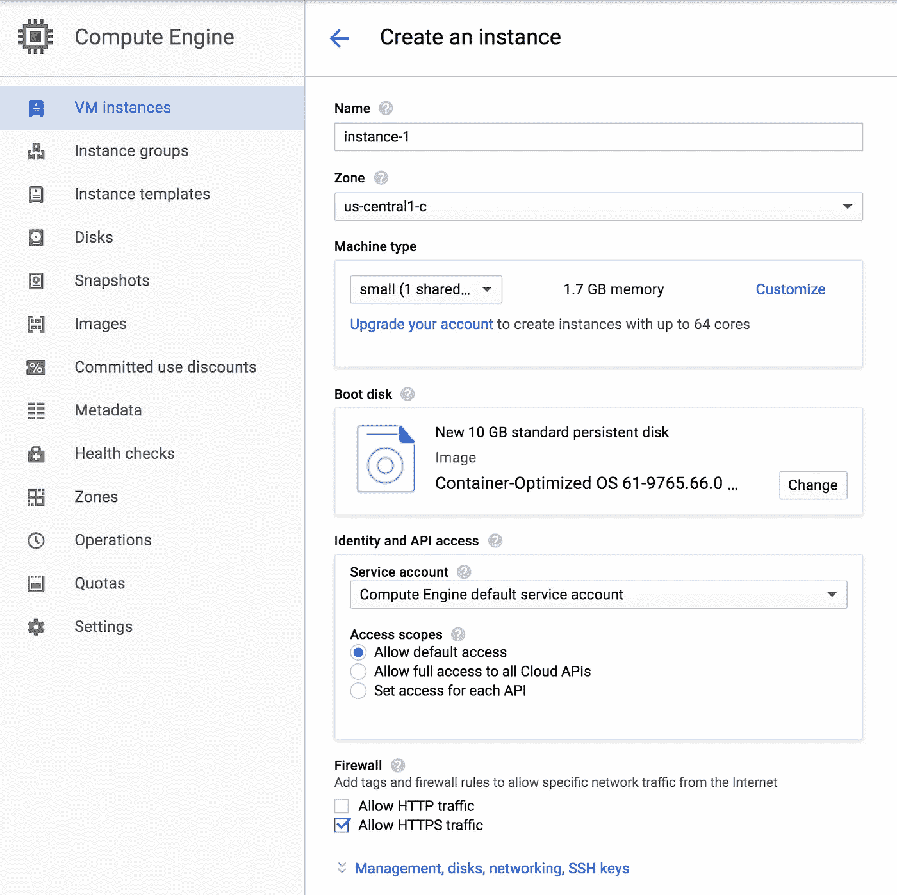
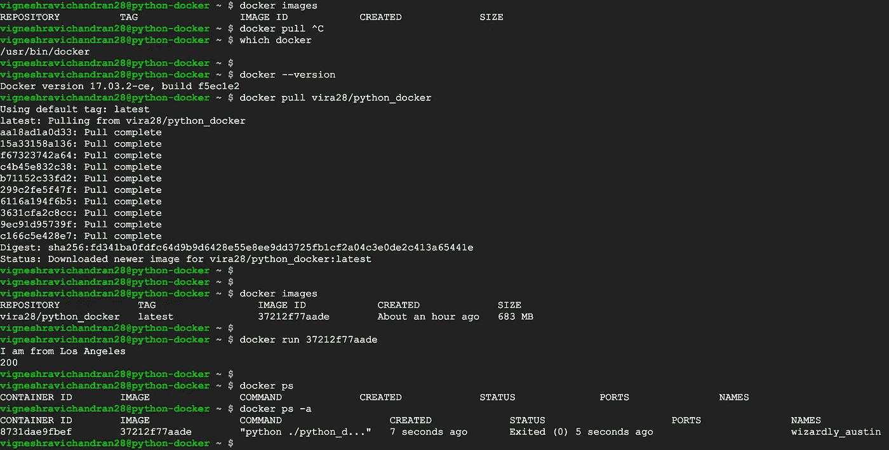

# 如何将简单的 python 应用程序转换成容器化的(Docker)应用程序

> 原文：<https://medium.com/google-cloud/how-to-convert-a-simple-python-application-to-a-containerized-docker-one-d6103bfffc7b?source=collection_archive---------0----------------------->

TL；DR ->容器化一个 python 应用。推送图像并从 Google Cloud 执行。

在一个悠闲的周六下午，我觉得玩容器很不错。

我对将应用程序容器化并在不同环境中运行的想法很感兴趣。当我这样做时，比仅仅阅读更容易理解一些东西。

要求:

python ≥2.7(和 pip)

Docker ≥1.13.1

docker hub 和 google cloud 中的一个帐户。(两者都有免费层$)

这是一个简单的 python 程序，我想将其容器化。

> 导入请求
> 
> city = "洛杉矶"
> 
> 打印“我来自% s %城市”
> 
> r = requests . get(' http://www . Google . com ')
> 
> 打印状态代码

安装包*请求*使用 *pip* 在本地执行该程序。

接下来，我写了一个 [Dockerfile](https://github.com/vr001/python_docker/blob/master/Dockerfile) ，它基本上捆绑了基本映像、执行命令和安装其他包。

然后通过执行***docker build-t<imageName>构建一个 docker 映像。*** 您可以通过运行 *docker images 来验证图像。(记下图像 id)* 测试图像是否按预期工作 *docker 运行<imageName>*

不想就此打住。在不同的服务器上运行这个镜像将会是多么酷啊！！？。

好的，您需要将您在本地构建的 docker 映像推送到 docker hub，这样您就可以从不同的服务器获取并运行映像。

准备推送 docker 图像。

*docker 标签<imageid>docker hub username>/<imageName:最新>*

*docker 登录(提供 docker 用户名/密码)*

*docker 推送<docker hub username>/<imageName>*

您已成功将 docker 映像推送到 docker hub！！。

要真正理解容器化的使用，您需要从不同的环境运行这个映像。嗯！！？最简单的方法是，如果你有一个虚拟机，你可以使用它(或不同的计算机)。如果你两者都没有，那么你可以从谷歌云启动一个虚拟机。(或来自任何其他提供商)。

注意:有包括 Docker 的操作系统映像。所以，你甚至不需要在虚拟机中安装 Docker。

引导盘:容器优化操作系统 61–9765 . 66 . 0 稳定

内核:ChromiumOS-4 . 4 . 70 Kubernetes:1 . 6 . 10 Docker:17 . 03 . 2

启动谷歌计算引擎(VM)

一旦您创建了虚拟机，ssh 到机器。你应该在仪表盘上看到。然后按照下面截图中的命令操作。

从谷歌计算引擎运行 docker 图像。

不用安装 Python，不用安装包(请求)。一切都捆绑在映像中，只需执行它！！

**源代码:**【https://github.com/vr001/python_docker】T2

**码头工人形象**:[https://hub.docker.com/r/vira28/python_docker/](https://hub.docker.com/r/vira28/python_docker/)

**参考:**

 [## 请求:人类 HTTP 请求 2.18.4 文档

### Twitter，Spotify，微软，亚马逊，Lyft，BuzzFeed，Reddit，美国国家安全局，英国政府，谷歌，Twilio…

www.python-requests.org](http://www.python-requests.org/en/master/)  [## 将您的 Python 应用程序归档

### Dockerfiles 使您能够创建自己的图像。docker 文件描述了组成映像的软件…

runnable.com](https://runnable.com/docker/python/dockerize-your-python-application)