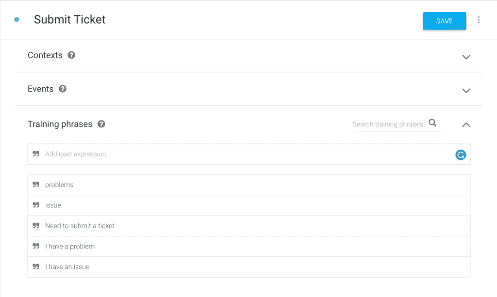

# 如何使用 Dialogflow 企业版和 Dialogflow API V2 创建聊天机器人

> 原文：<https://medium.com/google-cloud/how-to-create-a-chatbot-using-dialogflow-enterprise-edition-and-dialogflow-api-v2-923f4a965176?source=collection_archive---------0----------------------->


在本教程中，我们将学习如何使用 Dialogflow 企业版和 Dialogflow API V2 创建聊天机器人。本教程是对教程列表的补充，涵盖了 Google Cloud 及其令人敬畏的产品和服务套件。

# 使用 Dialogflow 企业版和 Dialogflow API V2 创建聊天机器人

本教程结束时，您将对以下内容有更好的理解。

1.  Dialogflow 简介
2.  Dialogflow 企业版简介
3.  如何在 Dialogflow 中创建代理
4.  对意图和实体的理解
5.  构建客户服务代理
6.  实现和云功能以及对话流 V2 API
7.  如何创建客服代理聊天机器人
8.  将票证信息存储在云数据存储中
9.  结论
10.  参考

因为我们在本教程中有很多内容要介绍，所以让我们开始吧。

## 1.Dialogflow 简介:

Dialogflow 是一个端到端的开发套件，用于为网站、移动应用程序、流行的消息平台和物联网设备构建对话界面。它可以用来构建聊天机器人、语音助手等特别相关的工具，这些工具能够与你的用户进行自然而丰富的互动(T2)。
Dialogflow 也由机器学习驱动，以**识别用户所说内容的意图和上下文**，允许对话界面提供高效和准确的响应。所以在本教程的这一点上，Google 提供了两个版本的 Dialogflow。

*   [**Dialogflow 标准版**](https://dialogflow.com/) :全部免费
*   [**Dialogflow 企业版**](https://cloud.google.com/dialogflow-enterprise/) :高级服务和现收现付服务。

## 2.Dialogflow 企业版简介:

**Dialogflow 企业版**作为谷歌云平台(GCP)的一部分提供。它提供无限制的文本和语音交互，更高的批量使用配额，以及来自 Google Cloud support 的支持。Dialogflow Enterprise Edition 是一种高级产品，作为一种现收现付的服务提供。
dialog flow Enterprise Edition 非常适合需要企业级服务的企业，这种服务可以轻松扩展以支持用户需求的变化。

## 3.如何在 Dialogflow 企业版中创建代理:

在 Dialogflow 标准版中，您可以前往[dialogflow.com](https://dialogflow.com/)创建您的代理。而对于 Dialogflow 企业版，我们首先在 Google 云平台中创建一个项目，并使用 Dialogflow API。按照以下步骤使用 Dialogflow 企业版和 Dialogflow API V2 创建聊天机器人。

**3.1 项目设置和认证:**

首先，我们需要使用 https://console.cloud.google.com/的[创建一个谷歌云平台项目](https://console.cloud.google.com/)

*   创建或选择现有的 GCP 项目。
*   为该项目启用 Dialogflow V2 API。


*   点击**启用 API 和服务**


*   在搜索栏中搜索 Dialogflow API 并单击它。


*   继续点击**启用 API** 。


*   **3.2 创建一个 Dialogflow 代理。**
*   启用 API 后，单击 Dialogflow 代理选项卡并为您的项目选择一个代理名称。
*   代理名称
*   语言
*   时区


*   单击**创建**按钮创建**diaglflow 企业版代理。**


*   因此，在本教程的剩余部分，我们将使用 dialogflow.com 构建我们在 GCP 上创建的代理。于是，点击**打开 dialogflow.com 代理**
*   因此，一旦你点击链接，它也应该要求你选择你的谷歌帐户。选择最初创建项目时使用的同一个 google 帐户。
*   它现在还应该向您显示一个允许 dialogflow 查看和管理数据的页面。最后，点击**允许**。


*   此外，查看帐户设置并点击**接受。**
*   最后，您现在将看到 Dialgflow 仪表板，在本教程中，您还可以看到一条消息，说明“Dialogflow API V2 已正式推出。它现在是所有新的 Dialogflow 代理的默认 API，所有新功能将仅在 V2 上发布。点击了解如何迁移您的 V1 代理[。”](https://dialogflow.com/docs/reference/v1-v2-migration-guide)


**3.3 创建服务帐户。**

*   在我们继续进行 dialogflow 之前，让我们也确保我们有一些更多的项目设置。
*   从 Google Cloud [服务账户](https://console.cloud.google.com/iam-admin/serviceaccounts/)页面，**选择**您的**项目**。
*   您应该会看到一个类似如下所示的屏幕。


*   以 JSON 的形式下载一个私钥。
*   从 GCP 控制台，转到**API 和服务**并点击**凭证**。


*   点击**创建凭证**并选择**服务账号密钥。**


*   从下拉列表中选择您的服务帐户，选择 JSON 并点击**创建。**这会将 JSON 密钥下载到您的计算机上。安全保存。


*   将环境变量 GOOGLE_APPLICATION_CREDENTIALS 设置为包含您的服务帐户密钥的 JSON 文件的文件路径。打开终端或命令提示符窗口，根据您的操作系统执行以下命令。

**举例:** **Linux 或 macOS**

将[PATH]替换为包含您的服务帐户密钥的 JSON 文件的文件路径。

```
export GOOGLE_APPLICATION_CREDENTIALS="[PATH]"
```

例如:

```
export GOOGLE_APPLICATION_CREDENTIALS="/home/user/Downloads/service-account-file.json"
```

**举例:** **窗口**

将[PATH]替换为包含您的服务帐户密钥的 JSON 文件的文件路径，将[FILE_NAME]替换为文件名。

使用命令提示符:

```
set GOOGLE_APPLICATION_CREDENTIALS=[PATH]
```

**3.4** [**安装并初始化云 SDK。**](https://cloud.google.com/sdk/docs/)

*   遵循文档中显示的说明。
*   最后，按照这些步骤，您应该获得一个服务帐户密钥文件(JSON 格式),该文件将允许您通过快速入门中的 Dialogflow V2 API 的身份验证:
*   **g cloud auth activate–service–account–key–file = service–account–key–file**
*   成功完成上述步骤后，您就已经激活了服务帐户凭据。

## 4.理解对话流中的意图和实体:

**意图:****意图**代表了用户所说的和你的软件应该采取的行动之间的映射。

意图界面也有以下部分:

*   训练短语
*   行动
*   反应
*   上下文

**实体:**实体是用于从自然语言输入中提取[参数值](https://dialogflow.com/docs/actions-and-parameters#parameters)的强大工具。任何你想从用户请求中得到的重要数据，都会有相应的实体。

随着我们进入教程的下一部分，您也将对意图和实体有更好的理解。

## 5.构建客户服务代理:

由于我们正在构建一个客户服务代理聊天机器人，我们也必须首先欢迎或问候客户。我们可以通过**欢迎意向来实现这一点。**

**5.1 欢迎用户**

*   点击**欢迎意向**。
*   在培训短语下，继续添加一些你的用户会用来开始对话的短语。


*   此外，下一步是添加来自聊天机器人的适当响应，以问候用户并提示他们特定的问题。


*   最后，点击**保存**意向。您还应该看到一个弹出消息，说**代理** **培训已完成**。

**5.2 创建提交票意向**

*   点击**创建意图**。这将创建一个新的意图，您必须为您的意图指定一个名称。姑且称之为提交票吧。
*   之后点击**训练短语**来添加用户可能会说的短语。
*   一旦您成功添加了几个**训练短语**，让我们添加一个响应以从用户那里获得更多信息。
*   点击**添加响应**并输入类似这样的响应。当然可以！我可以帮你。请提供您的姓名。
*   点击**保存**保存**提交票意向**。



**5.3 创建跟进意向收集名称**

*   以便我们建立后续意向。请遵循以下步骤。
*   单击左侧导航面板上的 Intents。
*   将鼠标悬停在**提交票据**意图上。您将看到**向右侧添加随动**意图选项。


*   这应该会给你一个下拉列表。从列表中选择**自定义**。
*   现在，您应该会看到一个后续意向已经创建。点击**提交票证—自定义**。


*   我们把名字改成有意义的吧。将意向名称更改为**提交票证—收集名称**。
*   添加几个**训练短语**。
*   “我是约翰”
*   “我的名字是萨钦”
*   “我是露西”
*   您还可以看到，它会自动突出显示实体名称 **@sys.given-name** 。
*   此外，到目前为止，在 actions 和 parameters 下，您应该会看到如下所示的内容。


*   最后，添加一个响应来从用户那里获取更多信息。$given-name 将保存客户的姓名。
*   “谢谢$赐名！你的电话号码是多少？”


*   **保存**意向培训代理。

**5.4 创建跟进意向以收集电话号码。**

*   首先，将鼠标悬停在**提交票证—收集名称**意图上。您将看到**向右侧添加随动**意图选项。


*   这应该会给你一个下拉列表。从列表中选择**自定义**。
*   现在，您应该会看到一个后续意向已经创建。点击**提交票证—收集名称—自定义**。


*   我们把名字改成有意义的吧。将意向名称更改为**提交票证—收集电话**。
*   添加几个**训练短语**。这些只是样品。
*   我的电话号码是+ 1231232432
*   手机号码是+1 234234234
*   +1234324234
*   将实体从@sys.number 更改为 **@sys.phone-number** 。


*   最后，添加一个响应来从用户那里获取更多信息。$phone-number 将保存客户的姓名。
*   “谢谢！现在请描述您的问题”。


*   **保存**意图训练特工。

**5.5 创建跟进意向，收集客户问题的描述。**

*   与前面的步骤相同，创建一个名为**Submit Ticket-collect description 的跟进意向。**


*   添加几个**训练短语**。这些只是用于演示目的的样本数据。
*   我的手机一直重启
*   wifi 问题
*   蓝牙问题
*   屏幕没有反应。
*   冻结屏幕


*   将回答留空。我们将它留空的原因是，我们希望在从用户那里捕获所有信息并生成一个票号以将其返回给用户作为参考之后，响应来自我们的服务器。
*   此外，为了让我们将它链接到服务器或云功能，我们需要启用**实现**。
*   点击**完成**和**为此目的启用 webhook 调用**。


*   点击**保存**按钮保存提交票-领取描述。

## 6.实现和云功能:

Fulfilments 由 Webhook 和 firebase 的云功能组成。由于我们试图了解如何使用 Dialogflow 企业版和 Dialogflow API V2 创建聊天机器人，因此我们还需要了解更多关于 Webhook 或 Firebase 云功能的信息。

**Webhook** :设置一个 Webhook 允许您将匹配意图的信息传递给 web 服务，并从中获得一个结果。

**Firebase 的云函数:**对于简单的 webhook 测试和实现，您可以使用 Fulfillments 页面的 Firebase 区域的云函数。在大多数情况下，你只需要 Firebase 的免费“火花”层。其他层的层限制和定价信息可在 [Firebase 定价页面](https://firebase.google.com/pricing/)上找到。

要启用:

*   点击左侧菜单中的**履行**。
*   此外，启用**行内编辑器**的切换。
*   **行内编辑器:**你可以使用你自己的代码或者从下面复制粘贴代码到行内编辑器中。


```
'use strict';
const http = require('http');
// Imports the Google Cloud client library
const Datastore = require('[@google](http://twitter.com/google)-cloud/datastore');
// Your Google Cloud Platform project ID
const projectId = 'REPLACE_WITH_YOUR_PROJECT_ID';
// Instantiates a client
const datastore = Datastore({
  projectId: projectId
});
// The kind for the new entity
const kind = 'ticket';// The kind for the new entity
const kind = 'ticket';exports.dialogflowFirebaseFulfillment = (req, res) => {
  console.log('Dialogflow Request body: ' + JSON.stringify(req.body));
  // Get the city and date from the request
  let ticketDescription = req.body.queryResult['queryText']; // incidence is a required param
  //let name = req.body.result.contexts[0].parameters['given-name.original'];
  let username = req.body.queryResult.outputContexts[1].parameters['given-name.original'];
  let phone_number = req.body.queryResult.outputContexts[1].parameters['phone-number.original'];
  console.log('description is ' +ticketDescription);
  console.log('name is '+ username);
  console.log('phone number is '+ phone_number);
  function randomIntInc (low, high) {
    return Math.floor(Math.random() * (high - low + 1) + low);
  }
  let ticketnum = randomIntInc(11111,99999);
  // The Cloud Datastore key for the new entity
  const taskKey = datastore.key(kind);
  // Prepares the new entity
  const task = {
    key: taskKey,
    data: {
      description: ticketDescription,
      username: username,
      phoneNumber: phone_number,
      ticketNumber: ticketnum
    }
  };
  console.log("incidence is  " , task);
  // Saves the entity
  datastore.save(task)
  .then(() => {
    console.log(`Saved ${task.key}: ${task.data.description}`);
    res.setHeader('Content-Type', 'application/json');
    //Response to send to Dialogflow
    res.send(JSON.stringify({ 'fulfillmentText': "I have successfully logged your ticket, the ticket number is " + ticketnum + ". Someone from the helpdesk will reach out to you within 24 hours."}));
    //res.send(JSON.stringify({ 'fulfillmentText': "I have successfully logged your ticket, the ticket number is " + ticketnum + ". Someone from the helpdesk will reach out to you within 24 hours.", 'fulfillmentMessages': "I have successfully logged your ticket, the ticket number is " + ticketnum +  ". Someone from the helpdesk will reach out to you within 24 hours."}));
  })
  .catch((err) => {
    console.error('ERROR:', err);
    res.setHeader('Content-Type', 'application/json');
    res.send(JSON.stringify({ 'speech': "Error occurred while saving, try again later", 'displayText': "Error occurred while saving, try again later" }));    
  });
}
```

*   将第 6 行中的 project_id 替换为您自己的 google 云平台项目 id。您应该可以在[谷歌云控制台](https://console.cloud.google.com/)中的仪表板>项目信息下找到项目 ID。
*   因为我们将使用 Google Cloud Datastore 来存储机票信息，所以我们需要在 **package.json** 下添加必要的依赖项。
*   从下面复制代码，并在内联编辑器中将其添加到您的 **package.json** 中，或者只添加第 20 行的代码来添加云数据存储依赖项。

```
{
  "name": "dialogflowFirebaseFulfillment",
  "description": "This is the default fulfillment for a Dialogflow agents using Cloud Functions for Firebase",
  "version": "0.0.1",
  "private": true,
  "license": "Apache Version 2.0",
  "author": "Google Inc.",
  "engines": {
    "node": "~6.0"
  },
  "scripts": {
    "start": "firebase serve --only functions:dialogflowFirebaseFulfillment",
    "deploy": "firebase deploy --only functions:dialogflowFirebaseFulfillment"
  },
  "dependencies": {
    "actions-on-google": "2.0.0-alpha.4",
    "firebase-admin": "^4.2.1",
    "firebase-functions": "^0.5.7",
    "dialogflow": "^0.1.0",
    "[@google](http://twitter.com/google)-cloud/datastore": "^1.1.0",
    "dialogflow-fulfillment": "0.3.0-beta.3"
  }
}
```


*   点击**部署**按钮，部署我们的云功能。
*   部署可能需要几秒钟才能完成。
*   *注:以上云函数是使用新的****dialog flow API V2****或* ***V2 API 提供的。*** *因此* ***，****index . js 文件中注释的一些代码是基于 V1 API 的。这清楚地显示了在 Dialogflow 中从 V1 迁移到 V2 API 是多么简单。我将很快就从 V1 到 V2 API 的迁移做一个单独的教程。*

## 7.如何创建客服代理聊天机器人:

最后，是时候测试我们的代理并实现我们的聊天机器人了。Dialogflow 允许我们轻松地将我们的代理集成到多个平台，如[**dialog flow Integrations**](https://dialogflow.com/docs/integrations/)**下的 Google Assistant、Facebook Messenger、Slack、web 等。**

在本教程中，我们将看到如何创建我们的代理，并将其嵌入到我们自己的网站中。

*   点击左侧导航菜单中的**集成**。
*   启用**网络演示**
*   将显示一个弹出窗口，其中包含生成的链接。


*   首先，点击链接来看看你的聊天机器人的神奇之处。
*   因此，您也可以使用嵌入代码将聊天机器人添加到您的网站。


## 8.将机票信息存储在 Google Cloud 数据存储中:

最后，我们的聊天机器人开始运行了。最值得注意的是，如果您使用云功能，我们会获得客户的以下详细信息。

*   获取客户信息
*   用户名
*   电话号码
*   描述

**8.1 将详细信息存储到 Google Cloud Datastore:**

我们还可以在谷歌云数据库中看到通过聊天机器人捕捉到的细节。

*   进入 [**谷歌云控制台**](https://console.cloud.google.com/) 。
*   单击导航菜单以显示选项。
*   选择**数据存储- >实体。**
*   因此，查看聊天机器人捕获的数据和所有特定信息。


包含机票信息的 Google 云数据存储

## 9.结论:

总之，这是一个很长的教程，涵盖了如何使用 Dialogflow 企业版和 Dialogflow API V2 创建聊天机器人的各个方面。此外，我们还学习了如何从用户那里获取信息，并使用 Google Cloud Datastore 存储这些信息。因此，这只是触及表面，利用 Dialogflow 和 Google 云服务的可能性是无穷无尽的。我已经尽了最大努力涵盖了本教程的每一步，以便您可以轻松地学习开发这样的应用程序。在接下来的[教程](https://chatbotslife.com/how-to-build-an-app-for-google-assistant-using-dialogflow-enterprise-edition-and-actions-on-google-4413a61d2f2d)中，我们还将[学习如何以谷歌助手的形式使用它，以及我们如何从 V1 API 迁移到 V2 API](https://chatbotslife.com/how-to-build-an-app-for-google-assistant-using-dialogflow-enterprise-edition-and-actions-on-google-4413a61d2f2d) 。

最后，在下一个系列教程中再见。在此之前，还可以查看我的其他教程帖子，关于 [**如何使用 Dialogflow 企业版为谷歌助手构建应用程序，以及关于谷歌**](https://chatbotslife.com/how-to-build-an-app-for-google-assistant-using-dialogflow-enterprise-edition-and-actions-on-google-4413a61d2f2d) **、** [**使用谷歌云自然语言 API 进行情感分析**](https://techwithsach.com/sentiment-analysis-using-google-cloud-natural-language-api/) 和 [**使用谷歌云自然语言 API 进行实体分析**](https://techwithsach.com/entity-analysis-using-google-cloud-natural-language-api/) 和 [**使用 Flutter**](https://techwithsach.com/flutter-tutorials-getting-started/) 入门。查看更多关于[***techwithsach.com***](https://techwithsach.com/)的教程

## 10.参考资料:

*   [**谷歌云控制台**](https://console.cloud.google.com/)
*   [**了解关于 Dialogflow 企业版的更多信息**](https://cloud.google.com/dialogflow-enterprise/)
*   [**Dialogflow 标准版**](https://dialogflow.com/)
*   [**如何使用新的 Dialogflow V2 API**](https://dialogflow.com/docs/reference/v2-agent-setup)