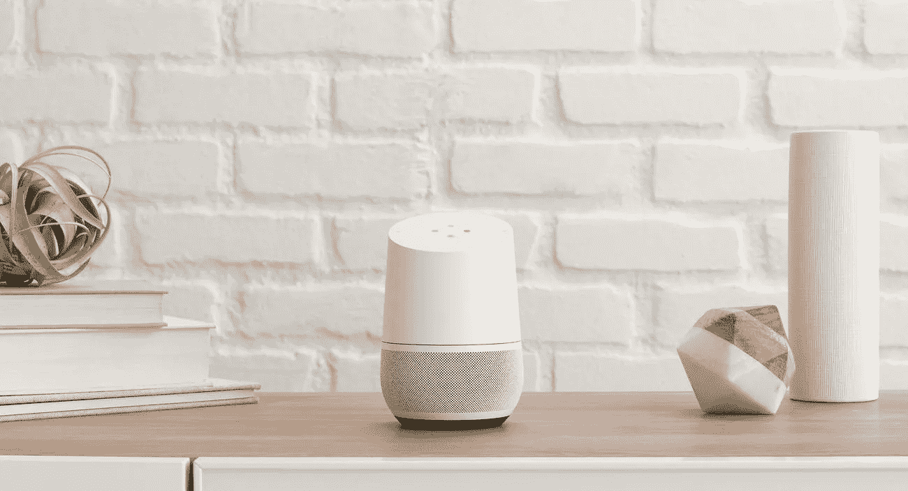
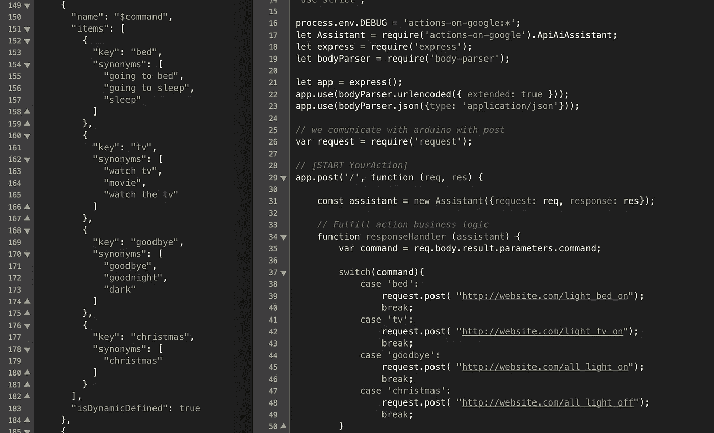
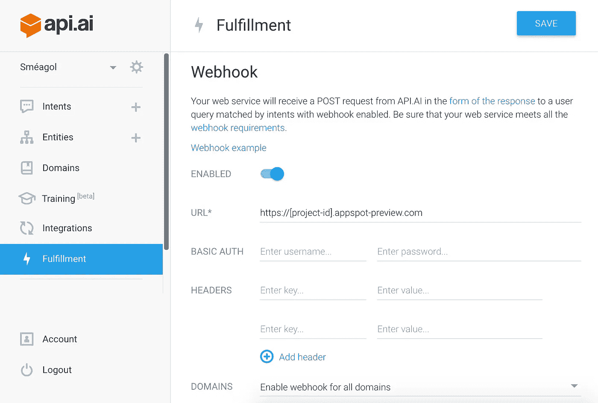
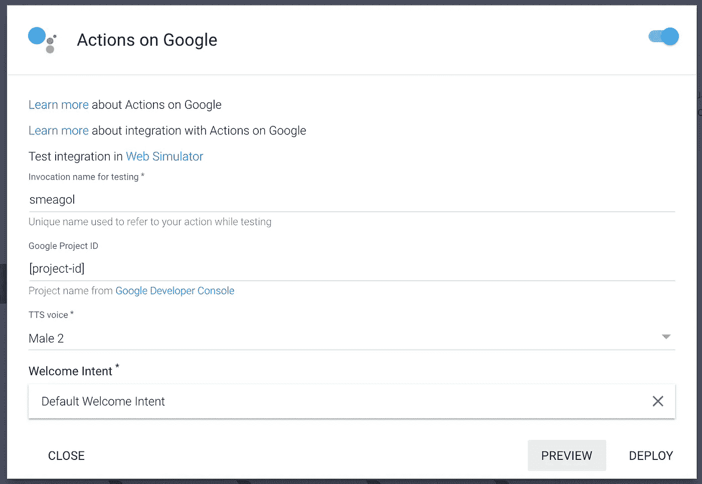
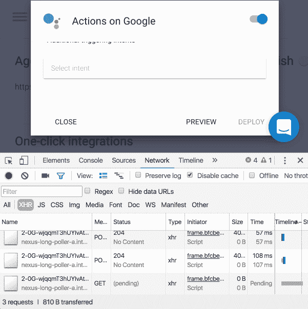

# 如何用 API 创建自定义私有 Google Home 动作？人工智能和谷歌应用引擎

> 原文：<https://medium.com/google-cloud/how-to-create-a-custom-private-google-home-action-260e2c512fc?source=collection_archive---------0----------------------->

谷歌家庭助手[图片:thegadgetflow.com]

Google Home 是一款由谷歌助手驱动的声控扬声器。它已经有内置的动作，但也可以添加自定义的动作。

本教程一步一步地详细介绍了如何建立一个助手动作，以及如何保持它的私密性(即您可以在自己的 Google Home 设备中使用该操作，但不会公开发布)。

基本思想是创建一个运行在 Google App Engine 服务器上的应用程序(webhook ),它由 API.AI 构建的动作触发。

我假设您知道如何使用 shell，以及如何用 Google App Engine 支持的编程语言和环境[编写应用程序(在本教程中，我从 Node.js 模板开始)。此外，本教程中的链接引用了适用于任何平台的文档，但我只在我的 macOS Sierra 上测试过。](https://cloud.google.com/appengine/docs)

**第一步。创建 API。人工智能和谷歌云账户。**您必须使用您用来控制 Google Home 的相同 Google 电子邮件创建帐户。

*   在 [API 上创建一个账户。AI](https://api.ai/)；
*   在[谷歌云](https://console.cloud.google.com/start)上创建账户；

**第二步。在 API.AI.** API 上创建一个助手动作。AI 是对话端点的开发工具。它允许为谷歌主页创建一个自然语言交互动作。

*   关注谷歌官方视频，了解如何创建一个动作:[谷歌上的动作:使用 API 构建助手动作。AI](https://www.youtube.com/watch?v=9SUAuy9OJg4) 。
    **Achtung！！**如果您希望您的助手操作保持私密，请在 13:50 分钟停止视频，并且不要点击 API 上的“部署”。人工智能控制台。
*   记下您在 Google Cloud 中创建的项目 ID。

**步骤三。当被意图**触发时，对助手的行为进行编码。例如，当你问“你有快速热汤的配方吗？”时，助理应该怎么做？。API。人工智能识别单词'快'，'热'和'汤'，但我们需要一个应用程序来处理这些单词，并给我们一个快速热汤的食谱。这被称为 *webhook* 。
你可以从模板开始在 Node.js 中创建一个 webhook。

*   在你的工作区创建一个文件夹，我将这个文件夹命名为 *< my_project_dir >。*
*   在*<my _ project _ dir>*里面创建一个文件夹，我将这个文件夹称为 *< template_dir >* 。
*   从 github 下载模板 zip:[*apiai-web hook-template-nodejs*](https://github.com/actions-on-google/apiai-webhook-template-nodejs)，解压并移动文件到 *< template_dir >。*
*   下载并安装 [Node.js](https://nodejs.org/en/)
*   在本地 node_modules 文件夹中安装节点依赖项，打开终端并运行:

> $ cd <template_dir>$ npm 安装</template_dir>

*   使用文本编辑器或您喜欢的 javascript IDE 打开 *< template_dir >* 中的“ *app.js* ”文件，并在函数中编写您的 webhook 逻辑:

> function response handler(assistant){
> //完成您的履行逻辑并发送响应
> }

*注意*:当一个意图(在你的 API 中描述。AI 动作)被触发时，一个 Json post 被发送到应用程序正在监听的服务器。Json 包含触发您意图的实体作为参数，它们可以通过解析 *app.post* 方法中的‘req’参数来检索。
要获取发送到服务器的 Json 示例，请转到 API。人工智能，测试你的意图在右边的面板“*现在就试试*”然后点击“显示 JSON”按钮。

***举例为第三步。***

API。AI 动作(左)和相对的 webhook(右)

上面的截图展示了一个 API 的例子。API 操作(左侧)和 webhook(右侧)。
API 中的动作。AI 包含实体'*命令*，以'*床*'、*电视*'、*再见*'和'*圣诞节*'为关键字(带有相对同义词)。例如，如果一个意图被触发，说“是时候看电视了！”，该动作识别具有值' *tv* '的实体'*命令*，并用包含参数 *"command": "tv "的 Json 向 webhook 发送 POST 请求。*

然后 webhook 以这种方式解析 Json(第 35 行右侧):

> var command = req . body . result . parameters . command；

并且基于变量*命令*的值，它发送一个 *POST* 请求。
在“ *tv* ”示例中，它发送一个 POST 请求，如下所示:

> request . post(" http://website . com/light _ TV _ on ")；

要了解更多关于我的光控项目，请访问我的 GitHub 页面:[https://github.com/sarettasarda/project-smars](https://github.com/sarettasarda/project-smars)

**第四步。本地测试 Node.js 应用程序**。在将应用程序部署到服务器之前，请确保它能按预期工作。因为部署过程需要几分钟，所以在本地运行时调试应用程序会更快。

*   要启动您的应用程序，请打开终端并运行:

> $ cd <template_dir>$ npm 开始</template_dir>

*   如果你的应用没有任何 bug(并且你没有在文件底部的' app.js '中修改服务器的启动部分)，你会在终端上看到:“ *App 监听端口 8080* ”。
*   要简单地触发您的应用程序，打开第二个终端，尝试将带有 *curl* 的 Json 发送到您正在运行的本地 webhook:

> $ curl-X POST-H " Content-Type:application/JSON " http://localhost:8080

*   如果你想用类似于 API 发送的 Json 进行测试。AI 你可以用 *curl* 发送 JSON 体来测试一下:

> $ curl-X POST-H " Content-Type:application/JSON "-d '[JSON _ here]' http://localhost:8080

[json_here]是您期望从 API 接收的 json。AI 行动。如前一步所述，您可以获得 API 中 Json 的示例。AI 项目尝试意图(在右边面板)并点击“显示 JSON”按钮。

**第五步。在 Google App Engine** 中部署项目。如果你的 webhook 运行正常，你就可以把它上传到服务器了。我将引用 *< project_id >* 作为您在步骤 2 中创建的项目的 id，同时遵循“Google 上的操作:使用 API 构建助手操作”。AI’视频教程。

*   按照[文档](https://cloud.google.com/sdk/downloads)在您的机器上下载、安装和初始化 Google Cloud SDK，或者对于从命令行运行的 Mac 用户:

> $ curl https://sdk.cloud.google.com | bash
> $ source ~/。bash_profile

*   要在 Google App Engine 中部署应用程序，请运行:

> $ cd <template_dir>$ gcloud 配置集项目<project _ id>
> $ g cloud 应用部署</template_dir>

*   您应该会看到类似以下示例的日志输出。记下端点 URL。在下一节中，您将需要它来配置 webhook URL。

> 更新服务[默认]…完成。
> 将服务[默认]部署到 https://[project-id]. appspot . com
> 
> 您可以通过运行:
> $ gcloud app logs read 从命令行读取日志
> 
> 要在网络浏览器中查看您的应用程序，请运行:
> $ gcloud 应用程序浏览

*   您的申请现已在“ *https://【项目 id】上线。****appspot-preview****。' com '。* URL 的'-preview '部分是 Google 为预览您的应用程序而进行的重定向，如果您决定公开您的应用程序，一旦您的应用程序被 Google 团队审查并接受，它将在'*https://[project-id]. appspot . com '*中更改。
    在本教程中，我们将实现一个私有操作，因此我们不会发布该操作，我们将只使用' *https://[project-id]。****appspot-preview****。地址。*

**第六步。连接您的 API。AI 行动到你的 webhook** 。

*   打开 API。AI 项目。
*   打开右侧面板上的“履行”窗口。
*   复制您的应用程序的网址'*' https://[项目 id]。* ***【预览】*** *。com'* 到 API.AI 中的 URL 字段
*   保存实现。
*   在任何相关意向中，启用回应的实现:打开“意向”窗口，打开您要连接的意向，向下滚动到“实现”部分，选中“使用 webhook”。
*   确保“域”窗口中的所有域都已关闭。

复制您的应用程序的 URL '*https://[project-id]。将 appspot-preview.com'* 添加到 API.AI 中的 URL 字段

**第七步。测试助手操作。**

*   在 API 上。人工智能打开右边面板的“集成”窗口。
*   启用谷歌上的*动作，打开设置*
*   点击右下角的“授权”按钮，然后点击“预览”按钮。
    **Achtung！！**如果您希望您的助手操作保持私密，请不要点击“部署”!
*   你可以直接对着你的 Google Home " *Ok Google，talk to<your _ Action _ name>*"或者在 API 里测试这个动作。AI 项目右侧面板中的*现在就试试*。

对我的“smeagol”项目的 Google 设置的操作。

**第八步。**设置无限预览*。动作预告只会持续 30 分钟。您可以选择部署和公开您的助手操作(仅当大 G 喜欢您的工作时),单击“部署”按钮**或**通过将它设置为无限预览来保持您的操作的私密性。为了让你的行动保密:

*   下载 Google[*g actions CLI*](https://developers.google.com/actions/tools/gactions-cli)(g action 是一个自我更新的命令行界面，可以让你测试你的动作)。  注意:在 Mac 和 Linux 上，在终端中运行“ *$chmod +x gactions* ”以使二进制文件可执行。
*   复制 *< my_project_dir >里面的可执行文件。*
*   初始化 gaction，打开终端并运行:

> $ cd <my_project_dir>$美元。/g 操作初始化</my_project_dir>

*   gaction 在*<my _ project _ dir>*中创建一个名为“ *action.json* 的文件，将该 json 文件移动到 *< template_dir >中。*
*   打开一个浏览器开发者控制台(对于 Chrome:点击右上角的三个点->更多工具->开发者工具)。
*   单击“网络”选项卡。
*   打开你的 API。AI 项目并打开“集成”窗口。
*   打开“Google 上的操作”设置(Google 集成上的操作应该已经打开)。
*   点击“授权”按钮。
*   点击“预览”按钮。
*   在浏览器开发人员控制台中，检查来自以下位置的 XHR 响应:

> https://console.api.ai/api/agent/googleassistant/preview

*   复制响应内容，粘贴到 *< template_dir >* 内的文件' *action.json* '中。
*   保存文件。
*   要将预览设置为永久持续，请打开终端并运行:

> $ CD<my_project_dir>T5【美元】。/ga actions preview-action _ package<template _ dir>/action . JSON-preview _ mins 99999999-invocation _ name[invocation _ name _ here]</my_project_dir>

该命令将发送动作(' *action.json'* )文件，与 API 相同。AI 项目)到你的 Google Home，并将它作为预览运行 999999999 分钟(约 2000 年)。

*感谢 *Brady* 在“[让 google actions 开发项目预览持续更长时间](http://stackoverflow.com/a/41205026/1699586)”提供无限预览技巧和视频！

感谢您跟随教程！