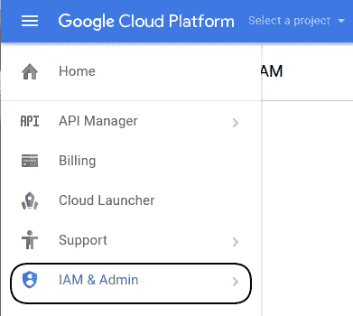
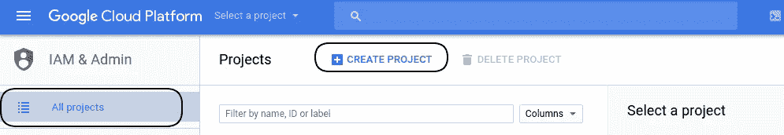
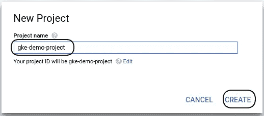
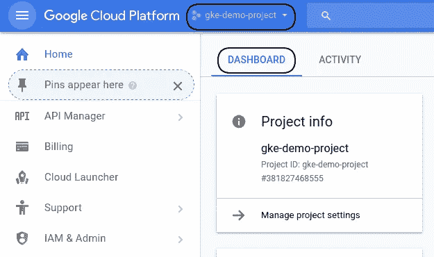
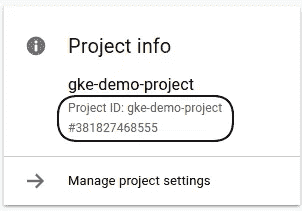

# 如何使用谷歌云平台控制台创建云平台项目

> 原文：<https://medium.com/google-cloud/how-to-create-cloud-platform-projects-using-the-google-cloud-platform-console-e6f2cb95b467?source=collection_archive---------0----------------------->

## 我们可以通过谷歌云平台控制台创建新项目

a)在产品和服务选项卡中，单击 IAM 和管理，请参考图 1.1

图:1.1

b)选择“所有项目”选项卡，点击“创建项目”，参考图 1.2

图 1.2

c)提供有效的项目名称，然后单击“创建”

图 1.3

d)项目将被创建，您将能够看到“仪表板”

图:1.4

项目可以通过以下方式进行识别:

i) **项目 ID** :您在创建项目时选择的定制名称，或者当您激活要求您创建项目 ID 的 API 时选择的定制名称。

ii) **项目编号**:一个由服务器自动生成并分配给你的项目的编号。

iii) **项目名称**:项目名称是一种人类可读的方式来标识您的项目，但是它不被任何 Google APIs 使用。

它们显示在“项目信息”中，参考图 1.5。项目编号和项目 ID 在 Google 云平台中是唯一的。

图:1.5