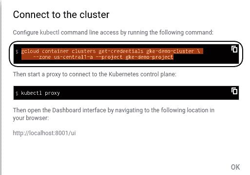

# 如何使用谷歌云平台控制台创建谷歌容器引擎(GKE)

> 原文：<https://medium.com/google-cloud/how-to-create-google-container-engine-gke-using-the-google-cloud-platform-console-925dd1cc9400?source=collection_archive---------1----------------------->

# 构建 Kubernetes 集群的快速入门

要构建任何谷歌容器引擎，我们需要谷歌云平台项目，如果项目已经创建，我们可以直接在该项目中创建容器引擎。[或者创建项目 ref: [**Google 云平台项目**](/@nnilesh7756/how-to-create-cloud-platform-projects-using-the-google-cloud-platform-console-e6f2cb95b467) ]

a)在“产品和服务”选项卡中，单击“*容器引擎*”。

图:1.1

b)点击“*创建一个容器集群*”。

图 1.2

c)提供有效的集群名称、区域、机器类型、工作节点大小，并单击“*创建*”。

图 1.3

d)现在我们的集群已创建，要通过“kubectl”连接集群，请单击“*connect”*。

图:1.4

e)复制“gcloud container”命令。

图:1.5

f)点击“*激活谷歌云外壳*”选项卡。

图:1.6

g)粘贴我们在'*步骤 e* '中复制的命令，现在我们已经配置了 kube-config，我们可以通过 kubectl 命令访问集群。

