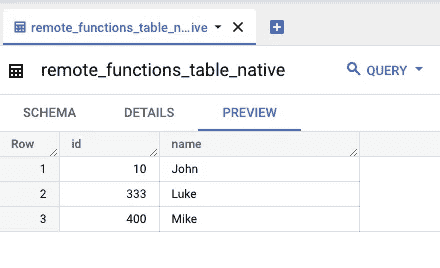

# 如何在 BigQuery 中创建远程函数

> 原文：<https://medium.com/google-cloud/how-to-create-remote-functions-in-bigquery-8a2319038308?source=collection_archive---------0----------------------->

## 使用远程函数以无限的方式处理和扩充 BigQuery 数据

# 介绍

Google BigQuery 是一个针对分析工作负载优化的无服务器数据仓库。BigQuery 使用 Google 标准 SQL 命令，并支持多种内置函数。但是，也有内置功能不够用的情况。 [BigQuery 远程函数](https://cloud.google.com/bigquery/docs/reference/standard-sql/remote-functions)允许 BigQuery 用户通过对云函数的自定义函数调用来处理他们的数据。

例如，BigQuery 远程函数可以用于以下用途:

1.  定制哈希和加密/解密工作负载
2.  机器学习推理
3.  反向地理编码
4.  数据扩充

本操作指南将举例说明创建和使用 BigQuery 远程函数的分步示例。这个函数将使用 SHA-384 散列函数，它不是 BigQuery 中固有的函数。

## **名称和参考文献**

我在本指南中使用的名称是:

**项目 ID** : `bq-remote-functions`
**云函数名称** : `remote_hash`
**云函数入口点** : `remote_hash`
**BigQuery 数据集** : `remote_functions_dataset`
**BigQuery 表** : `remote_functions_table_native`
**BigQuery 远程函数连接** : `remote-function-connection`

# **第一步:启用所需的 API**

打开[云壳](http://shell.cloud.google.com)，如果需要，用`gcloud config set project [PROJECT ID]`设置你的项目。

启用必要的 API:

```
gcloud services enable cloudfunctions.googleapis.com --async
gcloud services enable cloudbuild.googleapis.com --async
gcloud services enable bigqueryconnection.googleapis.com --async
```

# **第二步:编写功能代码**

创建名为`function/`的文件夹。

在该文件夹中，使用您选择的编辑器，将以下云函数代码保存为`main.py`:

同样在这个文件夹中，用下面的命令添加一个需求文件:`echo functions-framework==3.2.0 >> requirements.txt`

# **第三步:将代码部署到云功能**

使用以下命令部署云功能:

```
gcloud functions deploy remote_hash \
--runtime python310 \
--trigger-http \
--ingress-settings all \
--source ./function/
```

如果询问"**允许新函数[remote_hash]的未认证调用吗？(是/否)？**"，选择 **N**

注意,`--ingress-settings`需要是`all`,因为否则来自 BigQuery 的远程函数调用将被阻塞。

# **步骤 4:创建示例 BigQuery 数据集和表**

在 BigQuery 中创建数据集和表:

```
bq mk remote_functions_dataset
bq mk --table remote_functions_dataset.remote_functions_table_native id:INTEGER,name:STRING
```

填充表格:

该表应该如下所示:



远程 _ 函数 _ 表 _ 本机

# **步骤 5:创建 BigQuery 远程连接**

创建 BigQuery 远程连接:

```
bq mk --connection \
--display_name=’Connection to remote Cloud Function’ \
--connection_type=CLOUD_RESOURCE \
--project_id=bq-remote-functions \
--location=US \
remote-function-connection
```

使用以下命令显示新创建的连接的详细信息:

```
bq show --location=US --connection remote-function-connection
```

注意`properties`下的`serviceAccountID`。它应该是这样的:

```
{“serviceAccountId”: “bqcx-012345678901-drct@gcp-sa-bigquery-condel.iam.gserviceaccount.com”}
```

# **步骤 6:向服务帐户添加角色**

将 invoker 角色添加到上面显示在`serviceAccountID`下的服务协议中:

```
gcloud projects add-iam-policy-binding bq-remote-functions \
--member="serviceAccount:bqcx-012345678901-drct@gcp-sa-bigquery-condel.iam.gserviceaccount.com" \
--role='roles/cloudfunctions.invoker'
```

# **第七步:创建 BigQuery 远程函数**

使用`gcloud functions describe remote_hash`找到并记下云功能端点 URL

在 BQ 中运行这个命令来创建远程函数:

# **步骤 8:测试功能**

使用以下查询测试函数:

结果应该是这样的:


带哈希的远程函数表本机

# **结论**

这是一个关于 BigQuery 远程函数的简单操作方法。远程函数是一种强大的方式，可以启用 BigQuery 固有功能之外的功能。

## **参考资料和进一步阅读**

1.[https://cloud . Google . com/big query/docs/reference/standard-SQL/remote-functions](https://cloud.google.com/bigquery/docs/reference/standard-sql/remote-functions)
2 .[https://cloud . Google . com/blog/products/data-analytics/extending-big query-functions](https://cloud.google.com/blog/products/data-analytics/extending-bigquery-functions)

## **附录:请求/响应模式和结构**

对于此表:

```
+------+-----+------+
|  Row |  id | name |
+------+-----+------+
|    1 |  10 | John |
|    2 | 333 | Luke |
|    3 | 400 | Mike |
+------+-----+------+
```

在远程函数调用期间，发送到云函数的请求对象将如下所示，调用是一系列列表:

```
{'requestId': '3b7456fd-22ed-4241-b444-00f98756cbe3',
'caller': '//bigquery.googleapis.com/projects/bq-remote-functions/jobs/bquxjob_5ca2b63f_182cc1a93f8',
'sessionUser': 'user@XXXXXXXXXXXXXX.com',
'calls': [["John"], ["Luke"], ["Mike"]]}
```

响应对象的结构需要像这样，返回的数据是一个列表:

```
{"replies": ["9db044f2b3b06c6f83e78b491cd6d65b38fa10d9fbb47abca9954ec9524b69fd47dfc327f6c73ef4ea8f53007e66d024","bec067cb433d75794150b9e52aef3ec2b59be0e8229e8d6c5aebdec05a1a628813790a206f4614a2ed281cd552aaab6c","1b5621919d40b106be695c51d268aa4f168f1237edea9e8dba1bd63111f23236130661c173c925942ee2e5d5ff23f26d"]}
```

注意，像这样构造的响应对象(列表的列表)将在 BQ 端导致一个`Failed to decode JSON to SQL type.`错误；您不能将列表列表作为函数的响应:

```
{"replies": [["9db044f2b3b06c6f83e78b491cd6d65b38fa10d9fbb47abca9954ec9524b69fd47dfc327f6c73ef4ea8f53007e66d024"],["bec067cb433d75794150b9e52aef3ec2b59be0e8229e8d6c5aebdec05a1a628813790a206f4614a2ed281cd552aaab6c"],["1b5621919d40b106be695c51d268aa4f168f1237edea9e8dba1bd63111f23236130661c173c925942ee2e5d5ff23f26d"]]}
```