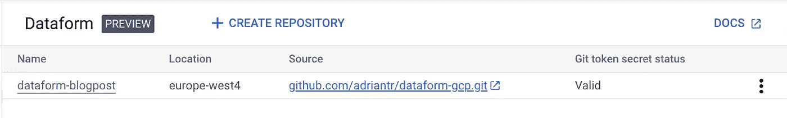
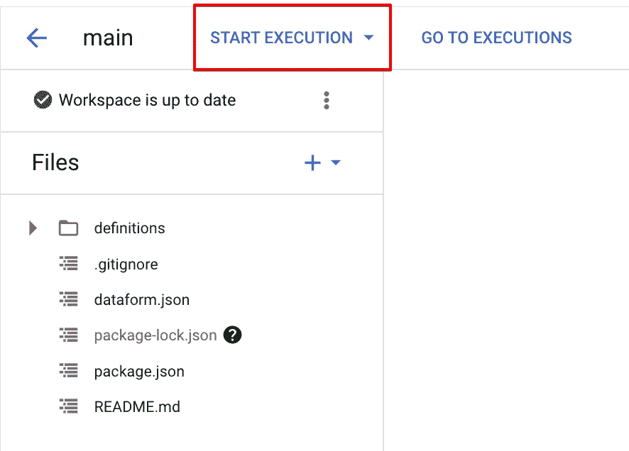
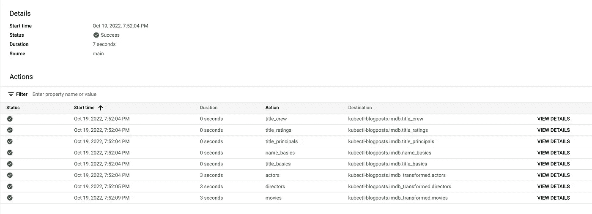

# 操作方法:Google Cloud 中的数据表单—第 1 部分

> 原文：<https://medium.com/google-cloud/how-to-dataform-in-google-cloud-part-1-86bce30216fd?source=collection_archive---------0----------------------->

大约一年前，在为一家零售商创建分析解决方案时，我有机会使用 Dataform(开源 CLI 版本)。在那个时候，我最终将最重要的功能包装为 Go 中的 REST API，并使用 Cloud Scheduler 来调用基于标签的必要转换。该解决方案的每个部分都通过 Terraform 部署在 GCP。嗯，Google 选择了几乎相同的云工作流方法作为云调度器的包装器。

看起来 Google 在 2022 年悄悄地发布了 Dataform 的预览版。在此之前，Dataform 要么只作为开源 CLI 版本提供，要么作为一个具有漂亮的依赖关系图等的 web 应用程序提供。

# 为什么是数据形式？

为什么应该考虑使用数据形式？这些年来，云存储的价格大幅下降，使得原始数据的保存变得可以承受，这导致了从老式的 ETL(在加载之前进行转换)到全新的 ELT(在数据加载之后应用转换)的过渡。数据转换对于许多数据驱动的组织来说起着至关重要的作用。Dataform 为您提供了以下功能，我建议您了解一下:

*   从表定义、视图到转换的 SQL 都存储在 SCM 中
*   可以用断言来验证转换
*   增量表功能确保只处理自上次转换以来添加的行(需要对源表和目标表进行适当的分区，以最小化成本)。
*   可以利用 JS 片段来重用您不希望跨转换复制和粘贴的代码片段
*   通过使用变量来分离环境的可能性(尽管在预览版的控制台中似乎不支持)。

# 文件夹结构

由于数据表单项目的大小可能会迅速增长，我的建议是从适当的文件夹结构开始:

*   `definitions`文件夹是存储`sqlx`文件的地方。该文件夹至少应该分为`reporting`和`sources`两个部分，前者定义数据表单创建的表和视图，后者引用 BigQuery 数据集和表来获取数据。
*   `includes`文件夹是存储可重用 SQL 块的 JavaScript 文件的地方。根据经验，您可能会出于不同的目的进行类似的转换。

# **谷歌云设置**

一旦您的 git repo 有了适当的文件夹结构、一些已定义的源以及要创建的表或视图，您就必须执行以下操作:

*   启用负责运行数据表单编译的项目的`dataform.googleapis.com`
*   启用该 API 将为您提供一个格式为`service-{PROJECT_NUMBER}@gcp-sa-dataform.iam.gserviceaccount.com`的服务帐户，它将执行这些操作。确保授予服务帐户创建和读取相应数据集中的源表所需的权限。
*   为了支持 git 集成，需要一个个人访问令牌——存储在 Secret Manager 中。确保上面提到的服务帐户具有访问机密版本的必要权限。

一旦连接到 Git 存储库，数据表单仪表板应如下所示:

当按下存储库的名称时，可以创建一个开发工作区。下面是开发工作区的定义:

*开发工作区是 Git 存储库中文件的可编辑副本。开发工作区允许您在数据表单中遵循基于 Git 的开发过程。您在开发工作区中对文件进行的编辑开始时是未提交的更改，您可以提交这些更改，然后进行推送。*

在我们的例子中，由于所有的代码都已经在 GitHub 中，我们将把`main`分支的内容放入我们新创建的工作空间中。

# 数据表单设置

为了使数据表单工作，repo 中必须有两个文件。

第一个是`dataform.json`文件，至少包括以下配置:

这基本上告诉 Dataform 我们正在 BigQuery 项目`kubectl-blogposts`中进行转换。默认数据集是`dataform`，我们计划在`US`位置创建资源。

数据表单正常工作所需的另一个文件是通过运行`npm i @dataform/core`生成的`package.json`。

# 数据数据数据

出于本文的目的，我选择了公开可用的 IMDB 数据集(您可以在 BigQuery 的分析中心找到它，并将其添加到您的项目中)。在本教程中，我们将创建一个视图，其中包含一个用户和分析友好的表格，其中包含有关电影、发行年份、导演、演员、平均评级和评论数量的信息。

我们首先定义以下来源:

*   `definitions/sources/name_basics.sqlx`包含从人的 id 到实际姓名的映射
*   `definitions/sources/title_basics.sqlx`包含标题的一般信息
*   `definitions/sources/title_crew.sqlx`包含电影导演的信息
*   `definitions/sources/title_principals.sqlx`包含演员信息
*   `definitions/sources/title_ratings.sqlx`包含关于评级的信息

典型的定义 sqlx-file 包含:

*   `declaration`类型
*   大查询术语中的`schema`或*数据集*
*   `name`源表的名称

## 董事们

每部电影的导演都生活在`title_crew`表中逗号分隔的字段中。这给了我们一个创建视图`definitions/reporting/directors.sqlx`的机会，我们可以在最终产品中引用它。编写 SQL，现在可以通过使用`ref`语法:`${ ref('title_principals')`来引用`title_crew`表。

然后，Dataform 会将该引用转换为`project_id.dataset_name.table_name`。我们的 directors 视图将从`title_crew`表中交叉连接和取消嵌套`directors`列，并为我们提供一个更易于操作的视图。

## 把所有的放在一起

由于本文不是关于解释 SQL，Dataform 将基于以下代码创建一个`definitions/reporting/movies.sqlx`视图作为最终结果:

一旦主分支的代码被放入开发工作区，就可以随意执行所有的操作(这基本上意味着 Dataform 将创建所有的资源，不管它们被分配了哪些标签):

检查执行过程，您会注意到所有的`.sqlx`文件都被处理到了目的地。对于每个表/视图/定义，可以看到细节和生成的 SQL 代码。

成功执行工作流

Dataform 是激发我的数据工程好奇心的工具，我不得不承认，现在看到它成为谷歌云的一部分真是太棒了。虽然仍然有点隐藏和不完善，但 Dataform 和其他东西一样，为您的数据工程师提供了适当的发布渠道。

如果你有问题，请随时给我提问！[将](https://github.com/adriantr/dataform-gcp)链接到回购。