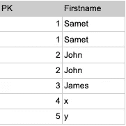
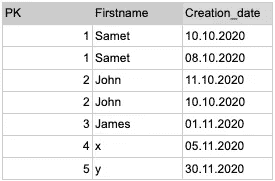
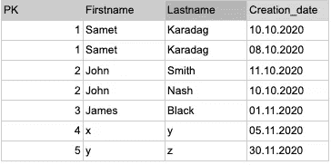

# 如何删除 BigQuery 表中的重复行

> 原文：<https://medium.com/google-cloud/how-to-de-duplicate-rows-in-a-bigquery-table-55f7d6321626?source=collection_archive---------0----------------------->

> 重复数据有时会导致错误的合计或结果。在进行任何聚合、连接或计算之前，您可能需要删除这些重复的行。处理重复数据有多种方法，你可以在这篇文章中找到其中一种方法来处理重复的键/列/行。

**案例一；每个键列只能有一个唯一的行**

示例数据:



在这里，您可以看到一些完整行的副本，如果完整行是重复的，您可以简单地使用“distinct * ”:

```
select distinct * from ds.duplicates
```

以下查询可用于根据 PK 列对此表进行重复数据删除:

您可能已经意识到，我们正在创建一个新表，而不是覆盖现有的表。如果要覆盖已有的表，可以使用与**相同的**表名**创建或替换**:

表中可能有一些额外的列，如“load_date”，案例 2 和案例 3 显示了如何使用相同的方法处理这些列。

**案例二；使用保持最新等标准进行重复数据删除**

如果您有一些删除标准，如日期列，您可以更改排序键，如下所示:



**案例三；基于多列进行重复数据删除**

如果您有多个列键或基于某些列删除重复项，则可以在 PARTITION BY 子句中使用这些列:

示例:根据名字和姓氏进行重复数据删除



请在这个帖子里评论，让我知道你喜欢的方法。