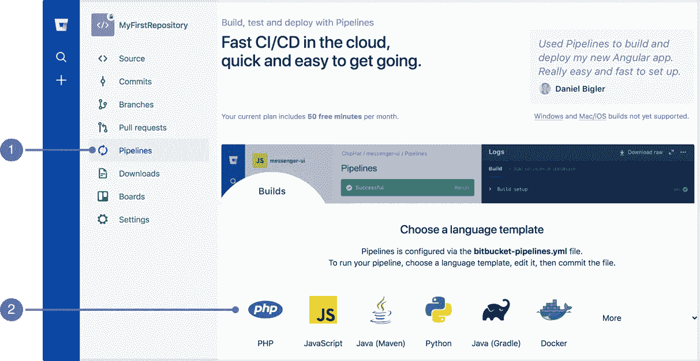
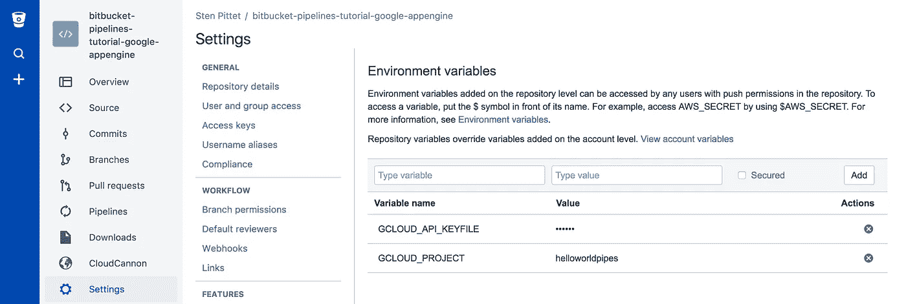

# 如何使用 Bitbucket 管道将 React 应用程序部署到 Google Cloud

> 原文：<https://medium.com/google-cloud/how-to-deploy-a-react-application-to-google-cloud-using-bitbucket-pipelines-8bc59d78d3af?source=collection_archive---------0----------------------->

在过去的几周里，我一直在拼凑多篇文章、博客帖子和文档。为了回馈社区，我正在分享我所学到的东西。

*注意:我将把各种文档的部分拼凑在一起。我意识到一些文档可能会有一些差异，我的目标是让你以最简单的方式开始完成。*

## 示例变量

Google Cloud Project = `your-project-name`
节点版本= `9.11.1`
源代码目录(不部署)= `app/`
编译目录(部署)= `dist/`


照片由 [Pixabay](https://www.pexels.com/@pixabay) 拍摄

# 设置谷歌云

首先，如果你还没有的话，你需要建立一个谷歌云账户。

1.  选择或创建 GCP 项目([管理资源页面](https://console.cloud.google.com/cloud-resource-manager))
2.  确保您的项目启用了计费功能([了解如何使用](https://cloud.google.com/billing/docs/how-to/modify-project))
3.  启用应用引擎管理 API ( [启用 API](https://console.cloud.google.com/flows/enableapi?apiid=appengine))

## 为位桶创建授权凭据

创建应用引擎服务帐户和 API 密钥。Bitbucket 需要这些信息来部署到 App Engine。

1.  在谷歌云平台控制台，进入[凭证](https://console.cloud.google.com/apis/credentials)页面。
2.  点击**创建凭证>服务账号键**。
3.  在下一页中，在服务帐户下拉列表中选择**计算引擎默认服务帐户**。
4.  点击**创建**按钮。JSON 文件的副本将下载到您的计算机上。 ***(这是你的 JSON 凭证文件)***

## 创建应用程序引擎应用程序

管道脚本要求您的项目具有 App Engine 应用程序。要创建 App Engine 应用程序:

1.  在云平台控制台，转到[云壳](https://console.cloud.google.com/?cloudshell=true)。
2.  运行`gcloud app create`来创建你的默认应用引擎应用

## 配置应用引擎

创建一个新文件，将其另存为`app.yaml`，并将以下代码粘贴到其中。确保将该文件保存在项目的根目录下(与`package.json`在同一个位置)。

默认情况下，当 Google Cloud 部署时，它会上传项目中的每个文件。如果你像我一样，不想等待**小时**来上传所有未编译的源代码(包括`node_modules`)，那么你需要修改下面配置中的`skip_files`。将`dist`替换为编译后的代码目录，将`app`替换为源文件目录。

指定跳过哪些文件会覆盖默认设置，所以我也把它们放在我的`node_modules/`下面，以免意外上传任何额外的东西。

```
runtime: python27
api_version: 1
threadsafe: true
handlers:
- url: /(.*\.(html|css|js|png|jpg|woff|json))
  static_files: dist/\1
  upload: dist/(.*\.(html|css|js|png|jpg|woff|json))
- url: /.*
  static_files: dist/index.html
  upload: dist/index.html
- url: /
  static_dir: build
skip_files:
- app/
- node_modules/
- ^\.git/.*
- ^(.*/)?#.*#$
- ^(.*/)?.*~$
- ^(.*/)?.*\.py[co]$
- ^(.*/)?.*/RCS/.*$
- ^(.*/)?\..*$
- ^(.*/)?.*\.bak$
```

*注意:如果使用制表符，文件将无法正常执行。* `*.yml*` *文件只能使用空格。*

# 设置位桶

如果您还没有创建回购，那么您将需要启用**管道**。



选择 **JavaScript** 作为您的选项，并将配置更新为

```
image: node:9.11.1options:
  max-time: 10
pipelines:
 default:
 — step:
 name: Build Application
 caches:
 — node
 script:
 — npm install
 — npm run build
 artifacts:
 — dist/** # change this to your build directory
 — step:
 name: Deploy to GCloud
 deployment: staging
 script:
 # Set a couple variables for readability
 — SDK_VERSION=197.0.0
 — SDK_FILENAME=google-cloud-sdk-${SDK_VERSION}-linux-x86_64.tar.gz
 # Install Google Cloud SDK
 — curl -o /tmp/google-cloud-sdk.tar.gz [https://dl.google.com/dl/cloudsdk/channels/rapid/downloads/${SDK_FILENAME](https://dl.google.com/dl/cloudsdk/channels/rapid/downloads/${SDK_FILENAME)}
 — tar -xvf /tmp/google-cloud-sdk.tar.gz -C /tmp/
 — /tmp/google-cloud-sdk/install.sh -q
 — source /tmp/google-cloud-sdk/path.bash.inc
 — gcloud -v
 # Authenticating with the service account key file
 — echo $GCLOUD_API_KEYFILE | base64 — decode — ignore-garbage > ./gcloud-api-key.json
 — gcloud auth activate-service-account — key-file gcloud-api-key.json
 # Linking to the Google Cloud project
 — gcloud config set project $GCLOUD_PROJECT
 # Deploying the application
 — gcloud app deploy
```

*注意:如果使用制表符，文件将无法正常执行。* `*.yml*` *文件只能使用空格。*

## 配置管道脚本所需的环境变量

打开您的终端，浏览到您之前的 **JSON 凭证文件**的位置。然后运行下面的命令以 base64 格式编码您的文件。将命令的输出复制到剪贴板。

`base64 <your-credentials-file.json>`

转到 Bitbucket 中的存储库设置，并导航到**管道** > **环境变量** *。*创建一个名为`GCLOUD_API_KEYFILE`的新变量，并将编码后的服务帐户凭证粘贴到其中。

添加另一个名为`GCLOUD_PROJECT`的变量，并将该值设置为您在第一步`your-project-name`中创建的 Google Cloud 项目的键



*注意:您不需要为这些字段*中的任何一个勾选 ***安全***

# *配置节点*

*Google Cloud 不能从`devDependencies`开始读取，所以你会想把任何必要的包扔进`dependencies`中，对我来说，那最终是**所有的东西**，但是我会通过它返回并在可能的地方清理。*

*在您的`package.json`中添加一个部分，指定您的项目运行在哪个版本的节点上。*

```
*"engines": {
  "node": "9.11.1"
}*
```

# *结论*

*如果一切都设置妥当，那么这就是您的部署流程。*

1.  *将代码推送到您的 bitbucket repo*
2.  *比特桶运行`npm install`和`npm run build`*
3.  *来自`npm run build`的静态文件可以在`dist/`(你编译的代码目录)获得*
4.  *Bitbucket 安装谷歌云 SDK*
5.  *比特桶运行`gcloud app deploy`*
6.  *Google Cloud App Deploy 会将所有文件从`dist/`上传到 Google Cloud Bucket*
7.  *Google Cloud App Deploy 将更新您的 Google Cloud App Engine 服务*
8.  *您的应用程序被部署到`[https://your-project-name.appspot.com](https://your-project-name.appspot.com)`*

**

*万岁，你做到了！*

# *资源*

*这些是我拼凑起来的各种文件和文章*

*   *[https://confluence . atlassian . com/bit bucket/deploy-to-Google-cloud-900820342 . html](https://confluence.atlassian.com/bitbucket/deploy-to-google-cloud-900820342.html)*
*   *[https://medium . com/Google-cloud/how-to-deploy-a-static-react-site-to-Google-cloud-platform-55 ff 0 BD 0 f 509](/google-cloud/how-to-deploy-a-static-react-site-to-google-cloud-platform-55ff0bd0f509)*
*   *[https://cloud . Google . com/solutions/continuous-delivery-bit bucket-app-engine](https://cloud.google.com/solutions/continuous-delivery-bitbucket-app-engine)*
*   *[https://cloud . Google . com/app engine/docs/standard/python/getting-started/deploying-the-application](https://cloud.google.com/appengine/docs/standard/python/getting-started/deploying-the-application)*

## ****Bug:部署超时问题****

*有一个谷歌知道的已知问题导致部署无缘无故挂起。我建议给你的`bitbucket-pipelines.yml`增加一个选项，我在上面提到过，让`max-time: 10`如果花费超过 10 分钟，这将导致管道失败。请确保根据您的部署时间进行调整，我的应该需要 2-3 分钟。如果失败，您将需要手动重新运行管道，有时需要尝试几次。*