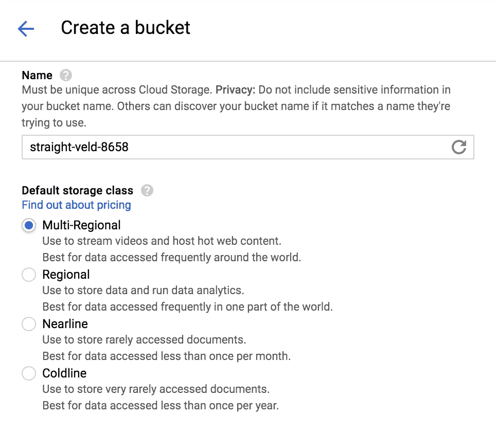
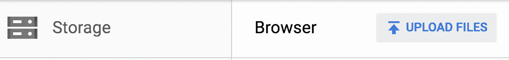
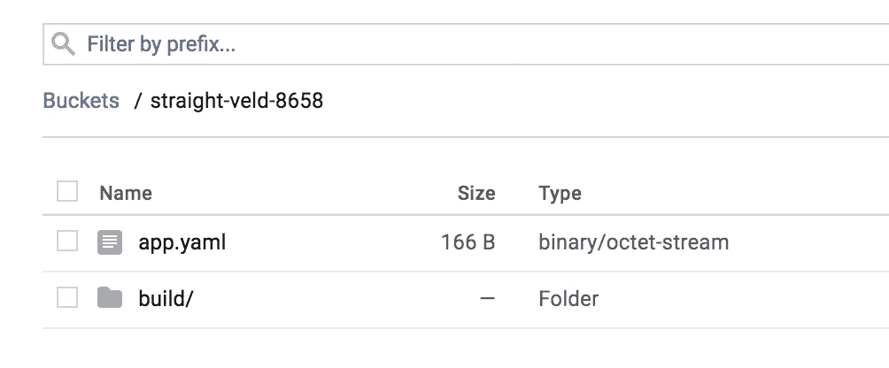
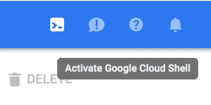

# 如何将静态 React 站点部署到 Google 云平台

> 原文：<https://medium.com/google-cloud/how-to-deploy-a-static-react-site-to-google-cloud-platform-55ff0bd0f509?source=collection_archive---------1----------------------->

看着外面的几个指南，当我试图找到如何部署我的应用程序时，我感到非常困惑。

我看了谷歌网站上的一些指南和一些堆栈溢出的帖子，但没有发现它们太有帮助。

我发现了一个很棒的资源，它让我在 MDN 上获得了 70%的支持:

[](https://developer.mozilla.org/en-US/docs/Learn/Common_questions/How_do_you_host_your_website_on_Google_App_Engine) [## 你如何在谷歌应用引擎上托管你的网站？

### Google App Engine 是一个强大的平台，让您可以在 Google 的基础设施上构建和运行应用程序——无论是…

developer.mozilla.org](https://developer.mozilla.org/en-US/docs/Learn/Common_questions/How_do_you_host_your_website_on_Google_App_Engine) 

填补了一些空白，我能够部署我的静态 React 站点。这是我的指南，简单几步。

# 我们将使用的工具:

*   [create-react-app cli 工具](https://github.com/facebookincubator/create-react-app)
*   [谷歌云平台](https://cloud.google.com/)(我简称它为 GCP)

*注意:我们将部署一个使用 React 渲染前端的静态站点。在这个例子中，没有后端/服务器被连接。*

# 开始部署吧！

1.  使用`create-react-app` cli 工具创建一个 react 应用程序，添加您的代码、资源等。在这个例子中，我们将使用命令`create-react-app test-app`，其中将创建一个名为 **test-app** 的目录，包含我所有的应用程序文件。
2.  进入 test-app 目录，使用`npm run build`命令创建一个缩小的项目包。这将创建一个名为 **build** 的新文件夹，其中包含部署静态 React 站点所需的所有文件。

```
$ cd test-app
$ npm run build
```

3.在 GCP 创建一个存储桶。您可以保留默认值，只需点击`create`。

我们将使用这个桶轻松地将我们的构建文件夹文件上传到 GCP。之后，我们会将文件转移到我们的 GCP 项目。记下*桶名*，因为我们稍后会用到它。这个水桶的名字叫`straight-veld-8658`



4.一旦创建了存储桶，点击它并选择`upload files`。浏览到您的项目目录并上传整个`build`文件夹。



5.我们还需要一个`app.yaml`文件。这个文件是一个配置文件，它告诉应用程序引擎如何将 URL 映射到静态文件。我使用了 MDN 教程的 sample-app 中提供的同一个 app.yaml 文件(但是把`website`目录改成了`build`)。看起来是这样的:

```
runtime: python27
api_version: 1
threadsafe: truehandlers:
- url: /
  static_files: **build**/index.html
  upload: **build**/index.html- url: /
  static_dir: **build**
```

将该文件也上传到 bucket。

您的存储桶现在应该填充了以下文件:



6.在同一个页面上找到一个图标，让你打开一个谷歌云外壳到你的应用实例。点击它，打开外壳。



现在，我们将上传到`straight-veld-8658`桶中的**构建**目录和 **app.yaml** 文件到我们的实例中，这样我们就可以启动应用程序了。使用以下命令:

```
$ mkdir test-app
$ gsutil rsync -r gs://straight-veld-8658 ./test-app
```

*注意:gsutil rsync 命令的格式如下:gsutil rsync-r[source][destination](-r 表示递归同步文件)*

你可以确保文件在那里。当你`cd test-app`和`ls`时，你应该同时看到`app.yaml`和`**build**`

7.在 shell 中运行`gcloud app deploy`来部署应用程序。您应该会看到某种成功消息，表明该应用程序已被提供。它还应该为您提供您可以访问该应用程序的 url。

一般来说，除非你已经链接了一个自定义域名，否则这个 url 的格式如下:`https://[app_name].appspot.com`