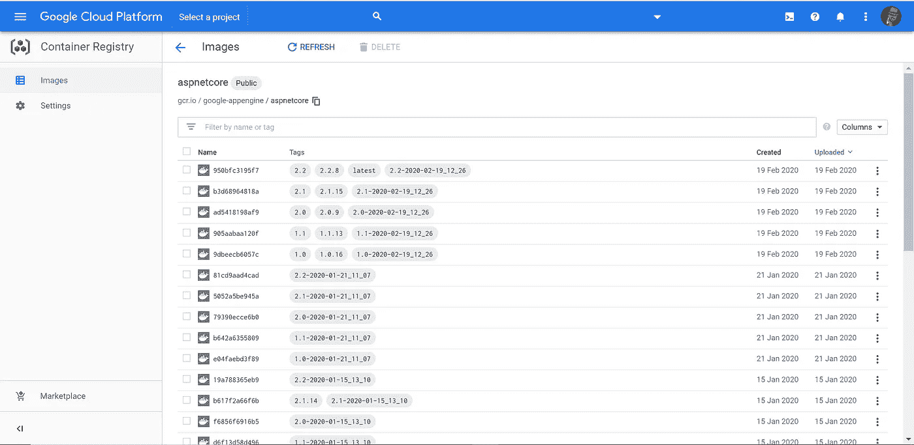
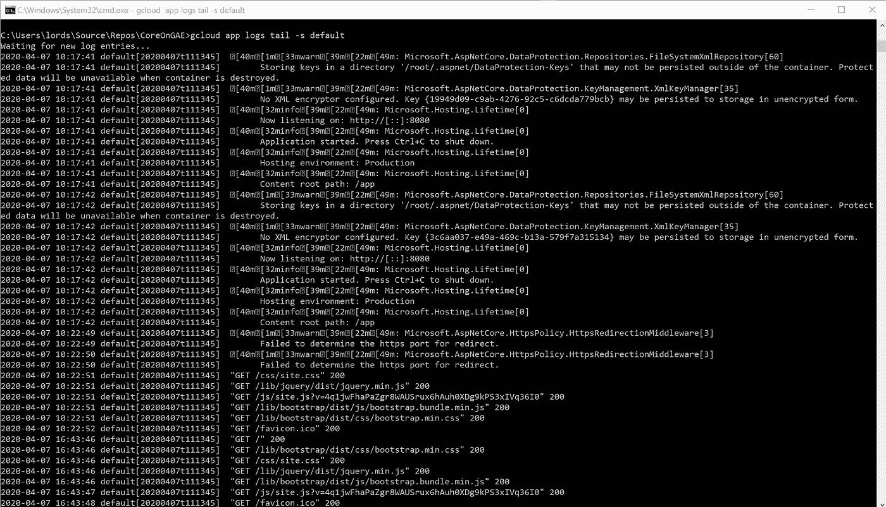

# 如何将 ASP.NET Core 3 . x 部署到 Google App Engine

> 原文：<https://medium.com/google-cloud/how-to-deploy-asp-net-core-3-x-to-google-app-engine-8813b0ee3521?source=collection_archive---------0----------------------->


你是被选中的人！

继我上一篇关于将 SP.NET 核心 3.x 应用程序部署到谷歌云引擎的文章之后，现在轮到应用引擎了。

**带有 Flex 环境的 App Engine**应该提供一个简单明了的部署体验，在大多数情况下，当我想在 GCP 上快速运行时，这是我的 goto。

遗憾的是，到目前为止，利用最新版本的。NET 核心框架。

如果你没有时间，而你只是想要一个指向正确方向的指针…

# TL；速度三角形定位法(dead reckoning)

App Engine Flex environment 有一个" *aspnetcore* "运行时，但它(还)不支持 3.x 版本的应用程序。

**您需要使用包含最新框架的基础映像，提供一个指定 Dockerfile 的定制运行时。**

有几点需要注意，特别是**您的应用程序监听并公开端口 8080，以便能够与 GAE 的前端进行通信。**

如果您不仅对“什么”感兴趣，而且对“如何”感兴趣，我将指导您创建一个简单的 Asp.Net 核心应用程序，通过 CLI 以正常方式将其部署到 GAE(*目前无法工作*)，并向您展示如何为 DotNetCore 3.x 创建一个定制的运行时，以便它能够工作。

*免责声明:在部署到 aspnetcore 运行时遇到的问题可能会在未来的更新中得到解决，在这种情况下，我将尝试回到这个问题并记录下来以避免混淆，但一般来说，这篇文章对如何开始将 ASP.NET 核心应用程序部署到 GAE 仍然有用。*

# 要求

在开始之前，我假设您已经在计算机上安装了:

*   谷歌云 SDK([https://cloud.google.com/sdk](https://cloud.google.com/sdk))
*   。NET Core 3.1 SDK([https://dotnet.microsoft.com/download](https://dotnet.microsoft.com/download)
*   Visual Studio 2019([https://visualstudio.microsoft.com/vs/](https://visualstudio.microsoft.com/vs/))、Visual Studio Code([https://code.visualstudio.com/](https://code.visualstudio.com/))或任何其他文本编辑器。

并对 GCP 有基本的了解。NET Core & Docker，使用 GCP 帐户。

即使我们要使用 Dockerfiles，也不要求在您的机器上安装它(但是在本地测试可能会有用)。

我们开始吧！

# 创建 ASP.NET 核心 Web 应用程序

首先，我们需要一个应用程序，一个默认的 MVC 模板可以是一个很好的例子，因为这将允许我们有快速的视觉反馈。

我们可以通过 Visual Studio 创建它:


或者等效地，从命令提示符我们可以使用 CLI([https://docs . Microsoft . com/en-us/dot net/core/tools/dot net-new](https://docs.microsoft.com/en-us/dotnet/core/tools/dotnet-new)):

```
dotnet new mvc -n "CoreOnGAE"
```


从这里开始，我们假设我们的项目被命名为“ *CoreOnGAE* ”。

为了检查所有东西都已正确初始化和恢复，我们可以尝试在 Visual Studio 中构建并启动我们的项目，按 F5 ( *构建&开始调试*)，这也将打开一个浏览器窗口，或者从 CLI 中，我们可以导航到项目的文件夹，然后执行:

```
dotnet run
```


正如我们所看到的，应用程序正在本地主机的端口 *5001 上侦听 HTTPS* 和 *5000 上侦听 HTTP* ，让我们使用浏览器并导航至:


你可以选择在**" \ Views \ Home \ index . cs html**"定制这个页面，否则，我们很好。

# 部署 Web 应用程序

我们需要一个项目来包含我们的应用程序引擎实例。
您可以选择使用现有的一个或创建一个新的。

如果需要，在[https://console.cloud.google.com/](https://console.cloud.google.com/)创建一个项目，在我的例子中，我将其命名为“ *dotnet-core-testing* ”。

或者，您可以从 CLI 创建它([https://cloud . Google . com/SDK/g cloud/reference/projects/create](https://cloud.google.com/sdk/gcloud/reference/projects/create)):

```
gcloud projects create "dotnet-core-testing" --set-as-default
```


— set-as-default 标志用于将新项目设置为当前项目

或者将现有项目设置为正在使用
([https://cloud.google.com/sdk/gcloud/reference/config/set](https://cloud.google.com/sdk/gcloud/reference/config/set)):

```
gcloud config set project dotnet-core-testing
```

然后，我们需要在 App Engine 中初始化一个应用程序，这可以通过控制台来完成


或者通过 CLI([https://cloud.google.com/sdk/gcloud/reference/app/create](https://cloud.google.com/sdk/gcloud/reference/app/create)):

```
gcloud app create --project=dotnet-core-testing
```


要将您的应用程序推送到 GAE，您需要指定它将使用的环境和运行时。为此，您需要向您的应用程序添加一个 **app.yaml** 文件。

在一个完美的场景中，我们只需要指定我们将使用 **Flex 环境**和 **AspNetCore 运行时**:

```
runtime: aspnetcore
env: flex
```

**【额外提示】**在 Window 的命令提示符下，你可以在一行中新建一个 app.yaml:

```
(echo runtime: aspnetcore & echo env: flex) > app.yaml
```

当您开始发布过程时，必须将 app.yaml 文件复制到目标文件夹。
你可以通过 Visual Studio 或编辑*将文件包含到输出中。csproj 文件:

```
<Project Sdk="Microsoft.NET.Sdk.Web"><PropertyGroup>
    <TargetFramework>netcoreapp3.1</TargetFramework>
</PropertyGroup>
**<ItemGroup>
    <None Include="app.yaml" CopyToOutputDirectory="Always" />
</ItemGroup>**</Project>
```

然后，您可以在 VS 或 CLI 中发布发布版本([https://docs . Microsoft . com/en-us/dot net/core/tools/dot net-publish](https://docs.microsoft.com/en-us/dotnet/core/tools/dotnet-publish)):

```
dotnet publish -c Release
```


确保 app.yaml 存在于输出目录中

理想情况下，我们现在可以将我们的 Asp.Net 核心应用程序推送到 App Engine。

我们可以通过**Google Cloud Tools for Visual Studio**(查看我以前的文章 [***here***](/google-cloud/how-to-deploy-asp-net-core-3-x-to-google-compute-engine-iis-dc4d614000f9) 了解如何安装&配置它们)在*解决方案浏览器*中右键单击项目，选择“*发布到 Google Cloud…* ”，然后选择“ *App Engine Flex* ”:


或者在 CLI 上使用一个简单的命令([https://cloud.google.com/sdk/gcloud/reference/app/deploy](https://cloud.google.com/sdk/gcloud/reference/app/deploy)):

```
gcloud app deploy .\bin\Release\netcoreapp3.1\publish\app.yaml
```


从截图可以看出…没用。

该错误信息足以为我们指出正确的方向，因为 *aspnetcore 运行时*不支持 3.x 应用程序，但如果我们想以更有组织的方式深入了解细节，我们可以使用提供的 URL 或通过控制台(【https://console.cloud.google.com/cloud-build/】T21)访问**云构建**上的构建日志


我确信这将在未来几个月内改变，手术将带来一个成功的结果，但现在，我们需要一个替代的方法。

# 使用自定义运行时部署到 GAE

幸运的是，我们可以提供一个 ***定制运行时*** ，使得在 GAE 运行 Asp.Net 核心 3.x 应用成为可能。

为此，我们必须从编辑 app.yaml 开始，更改运行时:

```
runtime: **custom**env: flex
```

然后我们需要为我们的应用程序指定一个**docker file**([https://docs.docker.com/engine/reference/builder/](https://docs.docker.com/engine/reference/builder/))。

虽然这在很大程度上取决于您想要实现的目标，但您可以使用以下模板作为参考:

```
FROM **mcr.microsoft.com/dotnet/core/sdk:3.1** AS build-envWORKDIR /app# Copy csproj and restore as distinct layersCOPY *.csproj ./RUN dotnet restore# Copy everything else and buildCOPY . ./RUN dotnet publish -c Release -o out# Build runtime imageFROM **mcr.microsoft.com/dotnet/core/aspnet:3.1**WORKDIR /appCOPY --from=build-env /app/out .**EXPOSE 8080****ENV ASPNETCORE_URLS=http://*:8080**ENTRYPOINT ["dotnet", "CoreOnGAE.dll"]
```

我们的文档中有一些注释:

*   到目前为止，http://gcr.io/google-appengine/aspnetcore:3.1[网站](http://gcr.io/google-appengine/aspnetcore:3.1)上还没有标有 **3.1** 的图片，所以我们将使用来自微软仓库的官方图片，其中包括 3.1 框架。
    或者，我们可以将一个定制的推送到我们的私有**容器注册表**中并使用它。



3.1 框架的 Google 容器注册表上没有现成的图像

*   **确保您公开并监听端口 8080，因为这是应用引擎前端将路由传入请求的地方。**如果不这样做，您的应用程序将被部署、运行，但是一旦您尝试访问它，您将返回一个 **HTTP 502 错误网关错误**。

**【额外提示】**要缩小应用程序的图像大小，您可以创建一个**。指示要排除哪些路径的 dockerignore** 文件。
通常，这意味着排除 bin 和 obj 文件夹，您可以这样指定

```
bin\
obj\
```

我们已经准备好将所有内容推送到 App Engine(这次的目标是项目根目录中的 app.yaml 文件，而不是已发布的版本):

```
gcloud app deploy app.yaml
```


部署正确！


云构建确认操作成功

如果我们尝试在浏览器上或通过 CLI 导航到提供的网站(*https://<PROJECT _ ID>. appspot . com*):

```
gcloud app browse
```


我们可以看到它的工作！

**【额外提示】**我们可以在**谷歌日志**(*ex stack driver*)[https://console.cloud.google.com/logs/](https://console.cloud.google.com/logs/)上监控我们应用程序的输出


或者直接通过 CLI 传输([https://cloud.google.com/sdk/gcloud/reference/app/logs/tail](https://cloud.google.com/sdk/gcloud/reference/app/logs/tail)):

```
gcloud app logs tail -s default
```



# 离别赠言

我预计在不久的将来，GAE 的 aspnetcore runtime 会升级，这样我们就可以直接瞄准它，但同时，如果你想将你的应用程序部署到 GKE 或云上，使用 Dockerfile 也是一个有用的练习，我们将在下一篇文章中看到。

我们还没有在本地机器上使用 Docker 进行部署，但是安装它并使用它进行试验/测试，可以有助于确保您的映像构建管道在推向 GAE 之前能够正常工作。

本文中使用的大多数命令都是最简单、最基本的形式，我不建议在生产环境中使用，例如，您应该用适当的标签标记您部署的版本，或者您应该指定您希望在 app.yaml 文件中使用的资源和缩放细节。

我希望我能对你的这篇文章有所帮助，但如果你有进一步的疑问或反馈，我很乐意在 Twitter 上与你聊天，DMs 是开放的([**【https://twitter.com/TetsuoRyuu】**](https://twitter.com/TetsuoRyuu))