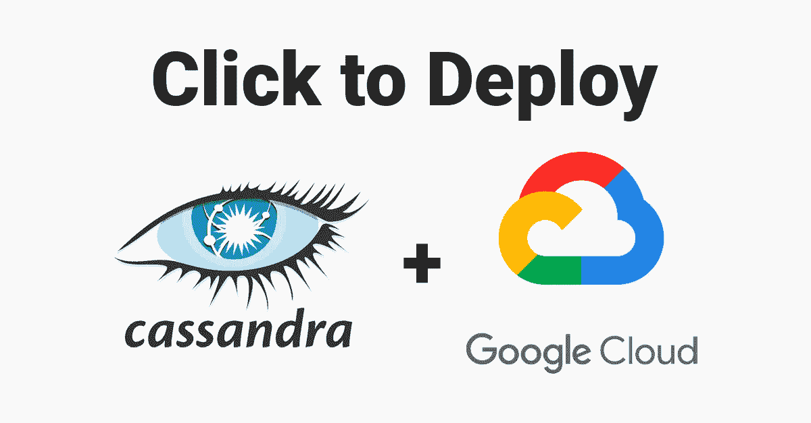

# 如何在 Google 云平台上部署 Cassandra 并通过几下点击进行连接

> 原文：<https://medium.com/google-cloud/how-to-deploy-cassandra-and-connect-on-google-cloud-platform-with-a-few-clicks-11ee3d7001d1?source=collection_archive---------0----------------------->

在过去的一年里，我花了很多时间在谷歌云平台(GCP)上使用 Cloud Bigtable。)最近，我想更好地了解市场上类似的大数据产品，特别是 HBase 和 Cassandra。



我以前从来没有设置过像 Cassandra 这样的东西，被我看过的所有教程视频吓倒了，但事实证明，使用 GCP 的点击部署是一个非常容易管理的任务。

# 部署

在启用了计费的 GCP 项目上，你可以导航到[云市场](https://console.cloud.google.com/marketplace)并搜索“Cassandra”


出现了几个选项，但我选择了运行在谷歌计算引擎上的 [Cassandra(谷歌点击部署)](https://console.cloud.google.com/marketplace/details/click-to-deploy-images/cassandra?filter=solution-type:vm&q=cassandra&id=25ca0967-cd8e-419e-b554-fe32e87f04be)版本。


单击“在计算引擎上启动”,您将看到一个部署配置表单。如果您更熟悉 Cassandra，您可以保留所有默认设置或修改它们。我唯一改变的是启用 Stackdriver 日志记录和监控，以防我在调试时需要它们。一旦您对配置满意，提交表单来部署您的 Cassandra 集群！

# 连接

几分钟后，您的群集将部署完毕，您可以连接了。


成功部署 Cassandra 集群

单击右侧窗格中的 SSH 按钮，打开一个将连接到您的集群的 shell。在 shell 中，您可以通过键入`cqlsh`来访问 Cassandra 命令行客户端。您可以创建一个键空间、表，添加一些数据，并通过 shell 对其进行查询。我关注了这个 [Hello World](https://vocon-it.com/2016/12/08/cassandra-hello-world-example/#Step_5_CreateKeyspace) ，发现它非常有用。


我还想用一个[客户端驱动程序](https://cassandra.apache.org/doc/latest/getting_started/drivers.html)连接到我的 Cassandra 集群，看看如何在实际应用程序中使用它。您需要创建一个新的防火墙规则，允许 TCP 通过端口 9042 访问，这样客户端就可以与集群对话。您可以使用以下 gcloud 命令:

```
gcloud compute firewall-rules create cassandra-client --allow tcp:9042
```

或者在 GCP 控制台的 [VPC 网络](https://console.cloud.google.com/networking/networks/list)下创建防火墙。


VPC 网络下的防火墙规则列表

添加一个针对网络中所有实例的防火墙规则，过滤 0.0.0.0/0 作为 IP 地址范围，并允许 TCP:9042。*如果您将此用于生产目的，您应该指定一个* [*更可控的防火墙规则*](https://cloud.google.com/vpc/docs/firewalls) *。*


现在您的防火墙已经设置好了，您可以连接您选择的[客户端](https://cassandra.apache.org/doc/latest/getting_started/drivers.html)。我决定使用 [Datastax Java 驱动程序](https://github.com/datastax/java-driver)，并执行一个快速查询来查看我的连接是否成功。我使用第一个虚拟机的外部 IP(可以在[虚拟机实例](https://console.cloud.google.com/compute/instances)中的计算引擎下找到)和区域(没有字母后缀的区域)作为本地数据中心的名称。


[阅读卡珊德拉版本](https://github.com/datastax/java-driver/blob/4.x/examples/src/main/java/com/datastax/oss/driver/examples/basic/ReadCassandraVersion.java)

我很高兴看到我的查询成功了！

有关更多信息，请查阅 [Apache 文档](https://cassandra.apache.org/doc/latest/getting_started/index.html)或 [Datastax 文档](https://docs.datastax.com/en/archived/cassandra/3.0/)。

*感谢* [*丹尼尔·伯格奎斯特*](/@bexie)*(*[*@贝谢*](https://twitter.com/bexie)*)*[*克里斯汀·奥利里*](/@kristeno) *，以及* [*罗伯特·库比斯*](/@hostirosti)*(*[*@ hostirosti*](https://twitter.com/hostirosti)