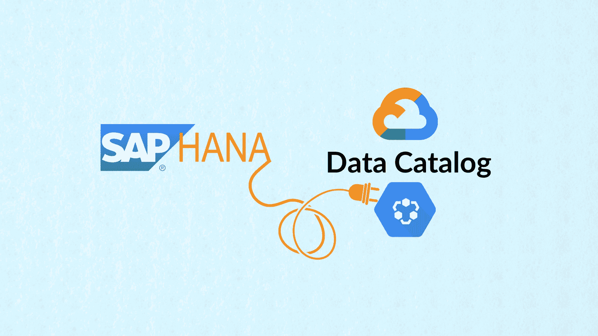
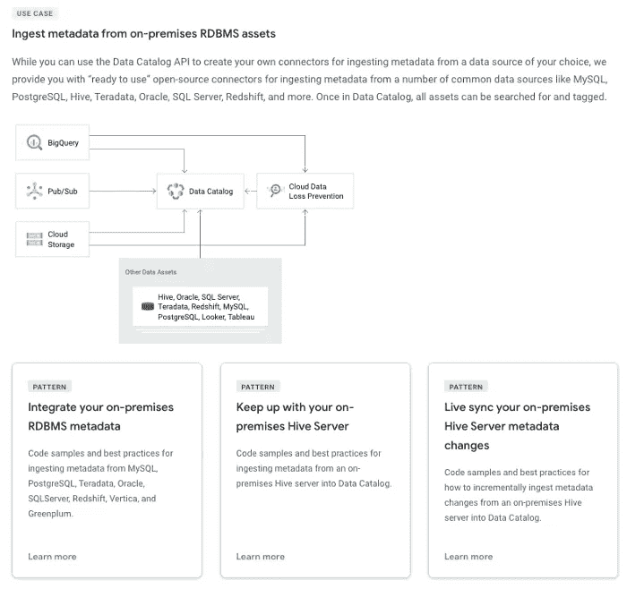
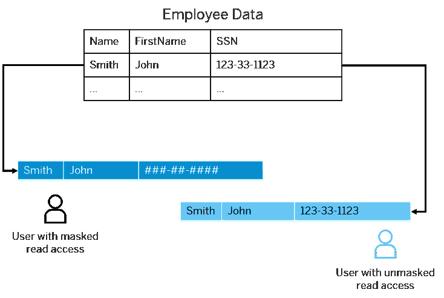
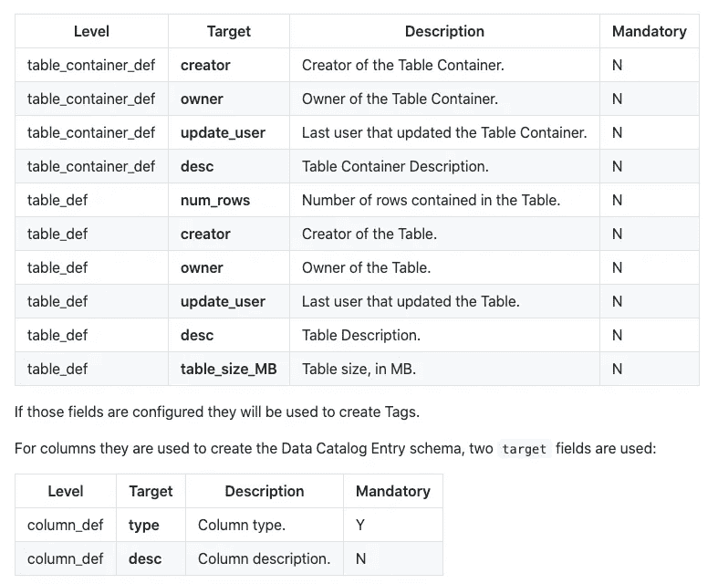
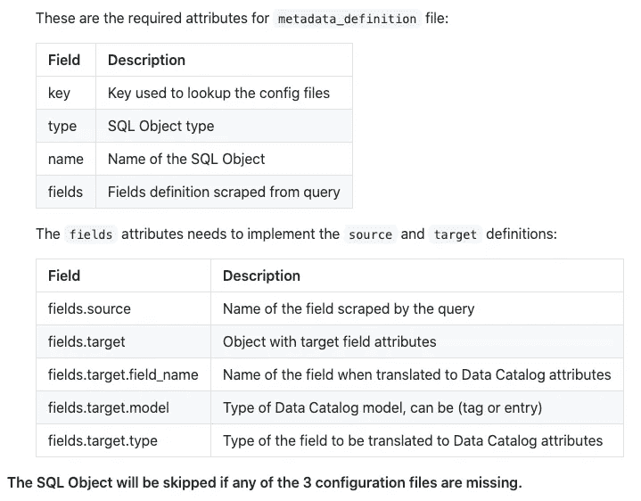
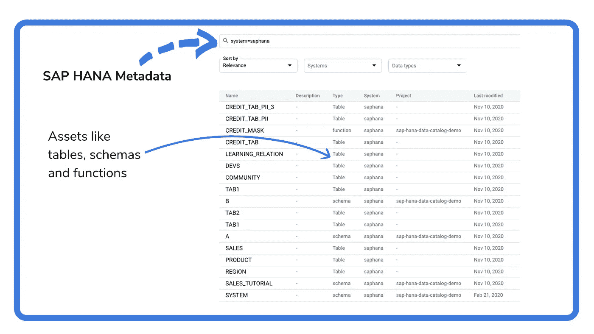
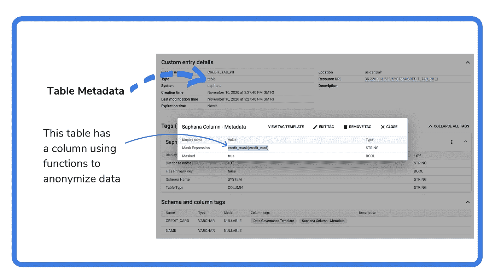
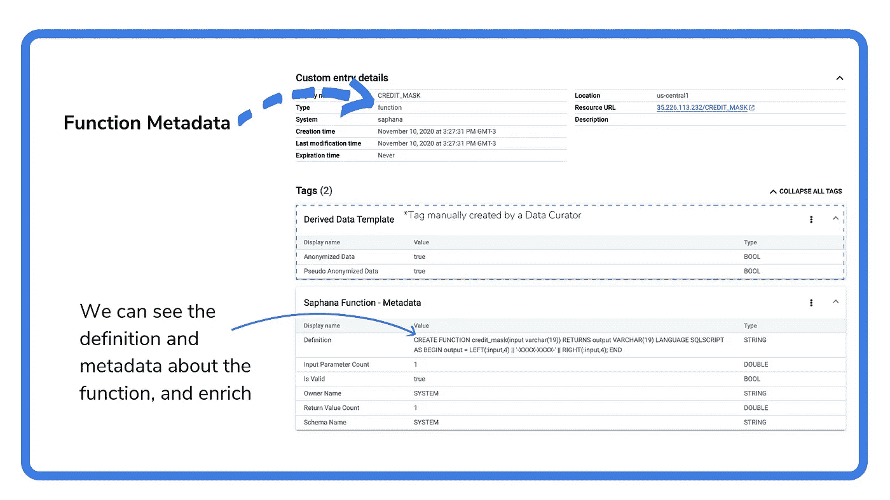
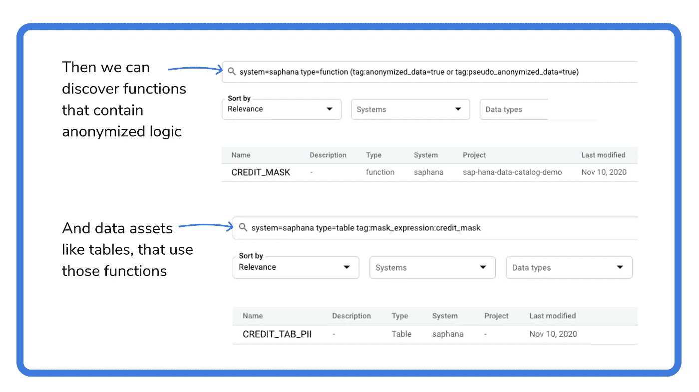

# 如何在 Google 数据目录中发现您的 Sap HANA 资产

> 原文：<https://medium.com/google-cloud/how-to-discover-your-sap-hana-assets-in-google-data-catalog-be13807f91eb?source=collection_archive---------2----------------------->

## 了解如何将 SAP HANA 元数据纳入 Google 数据目录，并根据您的用户需求进行扩展

Google Data Catalog 拥有开源连接器等社区维护的工具，可以从不同的数据源获取元数据:

数据目录连接器用例，来自[官方文档](https://cloud.google.com/data-catalog)。

本文的目标读者应该对数据目录特性和可用的连接器有基本的了解。本文重点介绍 SAP HANA 连接器和一个新特性，该特性使现有的 RDBMS 连接器能够将任何 SQL 语句接收到数据目录中。

关于现有连接器的更多内容，请查看之前关于 [RDBMS 连接器](/google-cloud/google-cloud-data-catalog-integrate-your-on-prem-rdbms-metadata-468e0d8220fb)的帖子。

> **声明:所有观点仅代表我个人，不代表除我之外的任何人……**。**它们来自参与开发完全可操作的示例连接器的经验，可在:**[**GitHub**](https://github.com/GoogleCloudPlatform/datacatalog-connectors)**上获得。**

# 什么是 SAP HANA？

*SAP HANA 是一款高性能内存数据库，可加速数据驱动的实时决策和行动。作为 SAP 业务技术平台的数据基础，它提供对多模型数据、内部数据和云中数据的高级分析。*来自 [SAP 官方文件](https://www.sap.com/products/hana.html?btp=d004204f-b35a-4dcd-a37a-0aa7eae2652e)。

## SAP HANA 数据屏蔽

它的一个有趣的特性是使用**数据屏蔽**和**模糊处理**在像社会安全号码数据这样的列上:

来自 [SAP HANA 文档](https://help.sap.com/viewer/b3ee5778bc2e4a089d3299b82ec762a7/2.0.04/en-US/aaa8d28740ea4cfd907d5a70017b1633.html)

在 SAP HANA 中，当您创建表格时，您可以指定所使用的数据掩码的类型— [内联或使用函数](https://help.sap.com/viewer/b3ee5778bc2e4a089d3299b82ec762a7/2.0.04/en-US/8c7968b893104ac6838a06855d607a6b.html)。

因此，没有适当访问权限的用户(如上图所示)将无法查看敏感数据。

它是如何工作的示例，首先创建函数:

然后我们可以使用我们在表中创建的函数:

这里的主要思想是，除了吸收基本的元数据，如模式、表和列。

我们可以接收关于这些函数的元数据，并发现依赖于它的所有表，这些表可能包含敏感数据。

**告诉我更多…**

# 该连接器

在 GitHub 中有:**[**Google-data catalog-saphana-connector**](https://github.com/GoogleCloudPlatform/datacatalog-connectors-rdbms/tree/master/google-datacatalog-saphana-connector)。RDBMS 连接器的通常结构从源 SQL 数据库中获取基本元数据:**

****

**来自[谷歌-数据目录-关系数据库管理系统-连接器](https://github.com/GoogleCloudPlatform/datacatalog-connectors-rdbms/tree/master/google-datacatalog-rdbms-connector)**

**现在有了 SQL Objects 组件，它还支持将任何 SQL 语句接收到数据目录中:**

****

**来自[谷歌-数据目录-关系数据库管理系统-连接器](https://github.com/GoogleCloudPlatform/datacatalog-connectors-rdbms/tree/master/google-datacatalog-rdbms-connector)**

**我们将使用它从 SAP HANA 获取函数类型，并查看每个所需的文件以支持其使用。**

## **SQL 对象组件**

**该组件通过创建 3 个文件来设置:**

*   **元数据定义**

**省略了一些字段以提高可读性**

**元数据定义文件包含 SQL 查询与要摄取的数据目录条目和标记类型之间的映射。**

*   **SQL 查询**

**省略了一些字段以提高可读性**

**SQL 查询文件包含带有从源数据库查询的字段的 SQL 语句。**

*   **特征标志**

**省略了一些字段以提高可读性**

**最后，特性标志使用户能够根据需要激活/禁用 SQL 对象类型。**

**当 RDBMS 连接器实现这些文件时，连接器将接收该 SQL 对象类型。在撰写本文时，我们有两个使用该组件的 RDBMS 连接器:**

*   **[SAP HANA](https://github.com/GoogleCloudPlatform/datacatalog-connectors-rdbms/tree/master/google-datacatalog-saphana-connector/src/google/datacatalog_connectors/saphana/config) 设置功能。**
*   **[带有函数、触发器和存储过程的 SQL Server](https://github.com/GoogleCloudPlatform/datacatalog-connectors-rdbms/tree/master/google-datacatalog-sqlserver-connector/src/google/datacatalog_connectors/sqlserver/config) 。**

**但是只要提供演示的配置文件，它就可以扩展到所有其他 RDBMS 连接器。**

## **分 4 步执行**

**最后，让我们通过 SQL Object config 函数接收 SAP HANA 元数据，遵循 4 个步骤:**

1.  **安装连接器**

**2.设置服务帐户**

> **如果您在 GCP 环境中运行连接器，如计算引擎虚拟机、云功能、云运行、应用引擎…您不需要下载服务帐户文件。**

**3.设置环境变量**

**4.运行连接器**

**如果你想快速浏览一下，我制作了一个演示视频来展示执行过程:**

## **结果**

**运行连接器后，我们能够从 SAP HANA 数据库中发现主要资产，如表、模式和函数。**

**1搜索结果**

****

****1。SAP HANA 搜索结果****

**数据目录对表和列元数据进行索引，我们可以访问屏蔽每列数据的函数，并且可以处理敏感数据:**

**2摄入表**

****

**2. **SAP HANA 摄取表****

**我们甚至可以查看函数元数据，并利用数据管理器用附加标签来丰富它，比如函数是否负责匿名数据。**

**3摄取功能**

****

**SAP HANA 摄取功能**

**最后，我们可以发现处理匿名数据的函数和使用这些函数的表:**

**4查找依赖表**

****

**SAP HANA 查找依赖表**

**让元数据可被发现可以在很多方面帮助我们，比如当我们想到[数据谱系](https://en.wikipedia.org/wiki/Data_lineage)时。如果我们需要更改那个`credit_mask`函数，我们如何知道哪些数据资产会受到影响？**

**一个好的开始是让它容易被发现:)。**

# **样本连接器**

**本文中讨论的所有主题都包含在一个示例连接器中，可以在 GitHub 上找到:**[**Google-data catalog-saphana-connector**](https://github.com/GoogleCloudPlatform/datacatalog-connectors-rdbms/tree/master/google-datacatalog-saphana-connector)。****

****在 PyPI，[**Google-data catalog-saphana-connector**](https://pypi.org/project/google-datacatalog-saphana-connector/)上也有，如果你不想费事克隆 GitHub repo 的话。****

****请随意获取并根据说明运行它。顺便说一下，欢迎投稿！****

> *****它是在 Apache 许可证版本 2.0 下许可的，以“原样”为基础发布，没有任何种类的担保或条件，无论是明示的还是暗示的。*****

# ****结束语****

****在本文中，我们介绍了如何将 SAP HANA 中的元数据导入 Google Data Catalog。我们还学习了 SQL Objects 组件，该组件可帮助我们将用户定义的函数纳入数据目录，这样我们就可以改进决策，了解哪些数据资产依赖于它们，哪些数据资产可能包含敏感数据。就这样，干杯！****

# ****参考****

*   ******数据目录连接器 Github Repo** : [数据目录连接器](https://github.com/GoogleCloudPlatform/datacatalog-connectors)****
*   ******SQL 对象文档** : [sql-objects-docs](https://github.com/GoogleCloudPlatform/datacatalog-connectors-rdbms/tree/master/google-datacatalog-rdbms-connector#42-add-support-for-sql-objects)****
*   ******SAP HANA 连接器 Github Repo:**[Google-data catalog-SAP HANA-connector](https://github.com/GoogleCloudPlatform/datacatalog-connectors-rdbms/tree/master/google-datacatalog-saphana-connector)****
*   ******数据目录公文** : [数据目录](https://cloud.google.com/data-catalog/)****
*   ******SAP HANA 官方文档** : [hana](https://www.sap.com/products/hana.html?btp=d004204f-b35a-4dcd-a37a-0aa7eae2652e)****