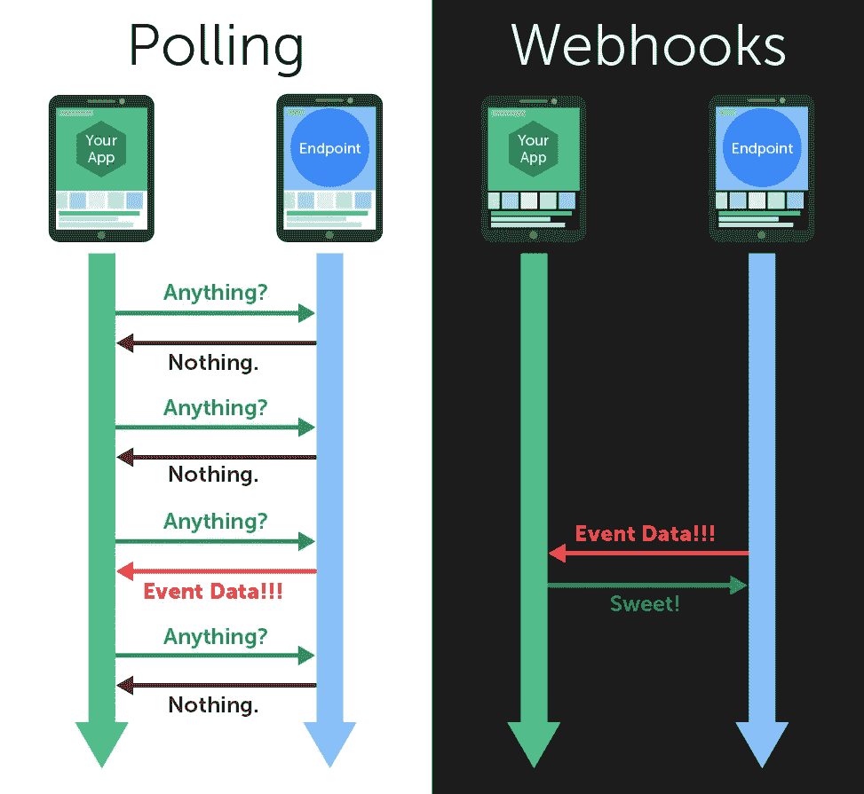

# 使用应用程序引擎上的任务队列进行轮询

> 原文：<https://medium.com/google-cloud/how-to-do-polling-using-google-task-queues-7fe44421fd3a?source=collection_archive---------1----------------------->

通过 [Webhooks vs 轮询](https://blog.cloud-elements.com/webhooks-vs-polling-youre-better-than-this)

轮询是从产生一系列事件和更新的数据源获取数据的最传统的方式。我不是一个大粉丝，它有许多缺点——我宁愿通过 webhooks 推送数据——但有时这是不可避免的，也是唯一可用的选择。

这是一篇简短的文章，展示了在 App Engine 上运行的应用程序上使用任务队列实现轮询的一种方法。

这个想法非常简单:任务链。下面的例子使用 Python 运行时的[延迟库](https://cloud.google.com/appengine/articles/deferred)来实现它:

代码片段非常简单，我会尽量详细解释。一切从**start _ polling**(1–3)开始。它基本上获取当前状态(被监视的资源/实体)并使用 **deferred.defer** 函数将新任务排队。该函数将创建一个新任务，该任务将由 **poll_for_changes** 根据单独的请求进行处理。状态对象将被序列化，它必须是可选择的。

“轮询循环”在**poll _ for _ changes**(5–12)函数中实现。它获取新状态(再次使用 **get_state** )，将其与给定状态进行比较，验证其是否发生变化。如果是肯定的，它通知相关方。然后，在检查它是否应该继续轮询之后，它将一个新任务排入队列。秘密在于 **_countdown** 参数，该参数以秒为单位指定任务运行的时间。在本例中，我们每 15 秒检查一次状态变化，直到 **should_keep_polling** 返回 true。

就是这样！希望这个例子对其他人有用。

**重要提示:**请注意，长时间的轮询会显著增加您的实例时间，从而增加您的成本。明智地使用它。