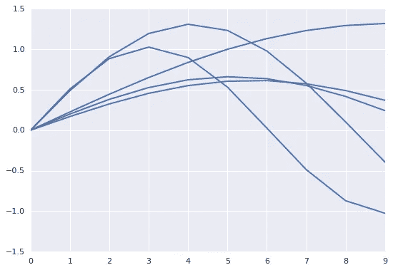

# 如何用 RNNs，TensorFlow，Cloud ML 引擎做时间序列预测

> 原文：<https://medium.com/google-cloud/how-to-do-time-series-prediction-using-rnns-and-tensorflow-and-cloud-ml-engine-2ad2eeb189e8?source=collection_archive---------0----------------------->

tf.contrib.learn 中的 Estimators API 是开始使用 TensorFlow 的一种非常方便的方式。从我的角度来看，估算器 API 真正酷的地方在于，使用它是创建**分布式**张量流模型的一种非常简单的方式。您在互联网上看到的许多 TensorFlow 示例都不是分布式的，它们假设您将在一台机器上运行代码。人们从这样的代码开始，然后发现低级的 TensorFlow 代码实际上并不能在他们的完整数据集上工作，这让他们感到非常难过。然后，他们必须做大量的工作，在原始样本周围添加分布式训练代码，谁想编辑别人的代码呢？

> N 注:评估者现在已经进入核心张量流。[使用 tf.estimator 而非 tf.contrib.learn.estimator 的更新代码现已在 GitHub](https://github.com/GoogleCloudPlatform/training-data-analyst/tree/master/courses/machine_learning/deepdive/09_sequence/sinemodel) 上发布——使用更新后的代码作为起点。

所以，请，请，请，如果你看到一个 TensorFlow 样本，不使用估计 API，忽略它。要让它在您的生产(大型)数据集上工作，需要做大量的工作——将会有监视器、协调器、参数服务器和各种您不想深入其中的系统编程狂热。从估计器 API 开始，使用实验类。(免责声明:我的观点，不是我雇主的观点)。

# 时间序列预测需要一个定制的估计器

估计器 API 带有深度神经网络分类器和回归器。如果你有典型的结构化数据，遵循上面链接的教程或参加谷歌云的这个[培训课程](https://cloud.google.com/training/courses/data-engineering)(很快将在 Coursera 上提供)，你将开始创建机器学习模型，这些模型在你的关系数据仓库中的真实世界、大型数据集上工作。但是如果没有典型的结构化数据问题呢？在这种情况下，您通常需要创建一个定制的评估器。在这篇博文中，我将向你展示如何做到这一点。

您想要对其进行机器学习的一种常见数据类型是时序数据。本质上，您的输入是一组数字，您希望预测该序列中的下一个数字。在本文中，我将把它变得更一般一些，并假设您想要预测序列的最后两个*数字。正如计算机科学谚语所说，如果你能做两件事，你就能做 n 件事。*

用于序列间预测的传统神经网络结构被称为递归神经网络(RNN)。参见这篇[文章](http://colah.github.io/posts/2015-08-Understanding-LSTMs/)和[这篇](http://karpathy.github.io/2015/05/21/rnn-effectiveness/)文章，了解 RNNs 的简单介绍。但是你不需要知道如何实现一个 RNN 来使用它，所以一旦那些文章比你想要的更深入，退出。

为了跟踪这篇文章，让[在另一个浏览器窗口中打开我的 Jupyter 笔记本](https://github.com/GoogleCloudPlatform/training-data-analyst/blob/master/blogs/timeseries/rnn_cloudmle.ipynb)。我在这里只展示了关键的代码片段。笔记本(和 [GitHub 文件夹](https://github.com/GoogleCloudPlatform/training-data-analyst/tree/master/courses/machine_learning/deepdive/09_sequence/))包含了所有的代码。

# 模拟一些时间序列数据

用一个小的玩具数据集来学习通常更容易，你可以想生成多少就生成多少。真实的数据会有自己的怪癖！所以，让我们生成一组时间序列数据。每个序列将由 10 个数字组成。我们将使用前八个作为输入，后两个作为*标签*(即要预测的内容):



使用 numpy (np)生成这些时序序列的代码:

```
SEQ_LEN = 10
def create_time_series():
  freq = (np.random.random()*0.5) + 0.1  # 0.1 to 0.6
  ampl = np.random.random() + 0.5  # 0.5 to 1.5
  x = np.sin(np.arange(0,SEQ_LEN) * freq) * ampl
  return x
```

把一堆这样的时序序列写成 CSV 文件(train.csv 和 valid.csv)我们就入行了。我们有数据。

# 输入函数

TensorFlow 中估算器 API 的工作方式是，您需要提供一个 input_fn 来读取您的数据。你没有提供 x 和 y 值。相反，您提供了一个返回输入和标签的函数。输入是所有输入的字典(张量的输入名),标签是张量。

在我们的例子中，我们的 CSV 文件只包含 10 个浮点数。默认值用于指定张量的数据类型。我们希望一次读取 20 行数据；这就是 BATCH_SIZE。批次是执行梯度下降的样本数。你需要试验这个数字——如果太大，你的训练会很慢，如果太小，你的训练会反弹，不会收敛。因为我们只有输入，所以您给输入起的名字并不重要。我们称之为原始数据。

```
DEFAULTS = [[0.0] for x in xrange(0, SEQ_LEN)]
BATCH_SIZE = 20
TIMESERIES_COL = 'rawdata'
N_OUTPUTS = 2  # in each sequence, 1-8 are features, and 9-10 is label
N_INPUTS = SEQ_LEN - N_OUTPUTS
```

估计器 API 想要的 input_fn 应该不带参数。然而，我们确实希望能够提供在命令行上读取的文件名。所以，让我们写一个 read_dataset()函数，返回一个 input_fn。

```
# read data and convert to needed format
def read_dataset(filename, mode=tf.contrib.learn.ModeKeys.TRAIN):
  def _input_fn():
    num_epochs = 100 if mode == tf.contrib.learn.ModeKeys.TRAIN else 1
```

我们要做的第一件事是决定历元的数量。这是我们需要浏览数据集的次数。如果我们是在训练，我们会浏览数据集 100 次，但是如果我们是在评估，我们只会浏览一次。

接下来，我们将进行通配符扩展。很多时候，大数据程序会生成分片文件，如 train.csv-0001-of-0036，因此，我们希望只提供 train.csv*作为输入。我们使用它来填充文件名队列，然后使用 TextLineReader 来读取数据:

```
# could be a path to one file or a file pattern.
input_file_names = tf.train.match_filenames_once(filename)
filename_queue = tf.train.string_input_producer(
        input_file_names, num_epochs=num_epochs, shuffle=True)reader = tf.TextLineReader()
    _, value = reader.read_up_to(filename_queue, num_records=BATCH_SIZE)value_column = tf.expand_dims(value, -1)
```

之后，我们对数据进行解码，将前 8 个数字作为输入，后两个数字作为标签。当我们读取它时，输入是一个 8 个张量的列表，每个张量的大小为 1。使用 tf.concat 使其成为单个 8xbatchsize 张量。这很重要，因为估算者 API 想要张量而不是列表。

```
# all_data is a list of tensors
all_data = tf.decode_csv(value_column, record_defaults=DEFAULTS)
inputs = all_data[:len(all_data)-N_OUTPUTS]  # first few values
label = all_data[len(all_data)-N_OUTPUTS : ] # last few values

# from list of tensors to tensor with one more dimension
inputs = tf.concat(inputs, axis=1)
label = tf.concat(label, axis=1)
print 'inputs={}'.format(inputs)

return {TIMESERIES_COL: inputs}, label   # dict of features, label
```

# 定义 RNN

如果我们使用线性回归器、dnn 回归器、DNNLinearCombinedRegressor 等。，我们可以简单地使用现有的类。但是因为我们做的是序列到序列的预测，所以我们必须自己写模型函数。至少现在，估算器 API 还没有现成的 RNNRegressor。因此，让我们使用低级张量流函数推出我们自己的 RNN 模型。

```
LSTM_SIZE = 3  *# number of hidden layers in each of the LSTM cells*

*# create the inference model*
**def** simple_rnn(features, targets, mode):
  *# 0\. Reformat input shape to become a sequence*
  x = tf.split(features[TIMESERIES_COL], N_INPUTS, 1)
  *#print 'x={}'.format(x)*

  *# 1\. configure the RNN*
  lstm_cell = rnn.BasicLSTMCell(LSTM_SIZE, forget_bias=1.0)
  outputs, _ = rnn.static_rnn(lstm_cell, x, dtype=tf.float32)

  *# slice to keep only the last cell of the RNN*
  outputs = outputs[-1]
  *#print 'last outputs={}'.format(outputs)*

  *# output is result of linear activation of last layer of RNN*
  weight = tf.Variable(tf.random_normal([LSTM_SIZE, N_OUTPUTS]))
  bias = tf.Variable(tf.random_normal([N_OUTPUTS]))
  predictions = tf.matmul(outputs, weight) + bias

  *# 2\. Define the loss function for training/evaluation*
  *#print 'targets={}'.format(targets)*
  *#print 'preds={}'.format(predictions)*
  loss = tf.losses.mean_squared_error(targets, predictions)
  eval_metric_ops = {
      "rmse": tf.metrics.root_mean_squared_error(targets, predictions)
  }

  *# 3\. Define the training operation/optimizer*
  train_op = tf.contrib.layers.optimize_loss(
      loss=loss,
      global_step=tf.contrib.framework.get_global_step(),
      learning_rate=0.01,
      optimizer="SGD")

  *# 4\. Create predictions*
  predictions_dict = {"predicted": predictions}

  *# 5\. return ModelFnOps*
  **return** tflearn.ModelFnOps(
      mode=mode,
      predictions=predictions_dict,
      loss=loss,
      train_op=train_op,
      eval_metric_ops=eval_metric_ops)
```

回想一下，我们必须将输入打包成单个张量，然后将它作为特征从 input_fn 传递出去。步骤 0 简单地颠倒了这个过程，并得到张量的列表。

递归神经网络由一个 BasicLSTMLCell 组成，您可以将输入传递给它。您会得到输出和状态。对其进行切片，仅保留 RNN 的最后一个像元—我们不使用任何先前的状态。其他架构也是可能的。例如，我可以训练网络总是只有一个输出，并使用滚动窗口。在本文的最后，我将讨论如何修改我的示例来做到这一点。

关于其他步骤，上面代码中的注释是不言自明的。我们在那里没有做任何令人惊讶的事情。这是一个回归问题，所以我用 RMSE。

# 创造一个实验

实验类是估计器 API 中的智能类。它知道如何采用模型函数、用于训练和验证的输入函数，并做关于分配、提前停止等合理的事情。所以，让我们把我们的作品交给它:

```
**def** get_train():
  **return** read_dataset('train.csv', mode=tf.contrib.learn.ModeKeys.TRAIN)

**def** get_valid():
  **return** read_dataset('valid.csv', mode=tf.contrib.learn.ModeKeys.EVAL)

**def** experiment_fn(output_dir):
    *# run experiment*
    **return** tflearn.Experiment(
        tflearn.Estimator(model_fn=simple_rnn, model_dir=output_dir),
        train_input_fn=get_train(),
        eval_input_fn=get_valid(),
        eval_metrics={
            'rmse': tflearn.MetricSpec(
                metric_fn=metrics.streaming_root_mean_squared_error
            )
        }
    )

shutil.rmtree('outputdir', ignore_errors=True) *# start fresh each time*
learn_runner.run(experiment_fn, 'outputdir')
```

# 云上培训

上面的代码在单台机器上工作，如果您将其打包到 Python 模块中，您还可以将其提交到 Cloud ML Engine，以无服务器的方式对其进行训练:

```
OUTDIR=gs://${BUCKET}/simplernn/model_trained
JOBNAME=simplernn_$(date -u +%y%m%d_%H%M%S)
REGION=us-central1
gsutil -m rm -rf $OUTDIR
gcloud ml-engine jobs submit training $JOBNAME \
   --region=$REGION \
   --module-name=trainer.task \
   --package-path=${REPO}/simplernn/trainer \
   --job-dir=$OUTDIR \
   --staging-bucket=gs://$BUCKET \
   --scale-tier=BASIC \
   --runtime-version=1.0 \
   -- \
   --train_data_paths="gs://${BUCKET}/train.csv*" \
   --eval_data_paths="gs://${BUCKET}/valid.csv*"  \
   --output_dir=$OUTDIR \
   --num_epochs=100
```

# 一个常见的变体:非常长的时间序列

在本文中，我假设您有数千个短(10 个元素)序列。如果你有一个很长的序列呢？例如，您可能有股票的价格或来自传感器的温度读数。在这种情况下，你能做的就是把你的长序列分解成固定长度的滚动序列。这个长度显然是任意的，但是可以把它想象成 RNN 的“回望”间隔。下面是 TensorFlow 代码，它将一个长序列分解成更小的固定长度的重叠序列:

```
import tensorflow as tf
import numpy as npdef breakup(sess, x, lookback_len):
  N = sess.run(tf.size(x))
  windows = [tf.slice(x, [b], [lookback_len]) for b in xrange(0, N-lookback_len)]
  windows = tf.stack(windows)
  return windows
```

例如:

```
x = tf.constant(np.arange(1,11, dtype=np.float32))
with tf.Session() as sess:
    print 'input=', x.eval()
    seqx = breakup(sess, x, 5)
    print 'output=', seqx.eval()
```

将导致:

```
input= [  1\.   2\.   3\.   4\.   5\.   6\.   7\.   8\.   9\.  10.]
output= [[ 1\.  2\.  3\.  4\.  5.]
 [ 2\.  3\.  4\.  5\.  6.]
 [ 3\.  4\.  5\.  6\.  7.]
 [ 4\.  5\.  6\.  7\.  8.]
 [ 5\.  6\.  7\.  8\.  9.]]
```

一旦你有了这些固定长度的序列，一切都和以前一样了。

编码快乐！