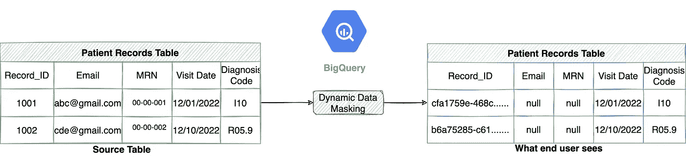
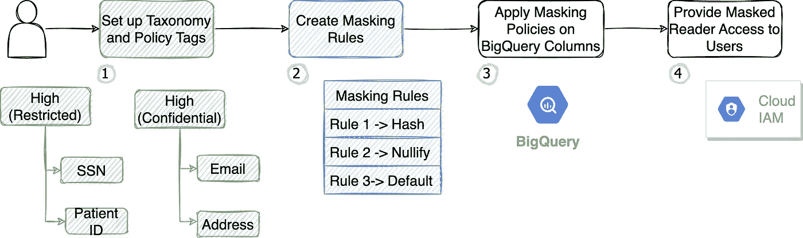
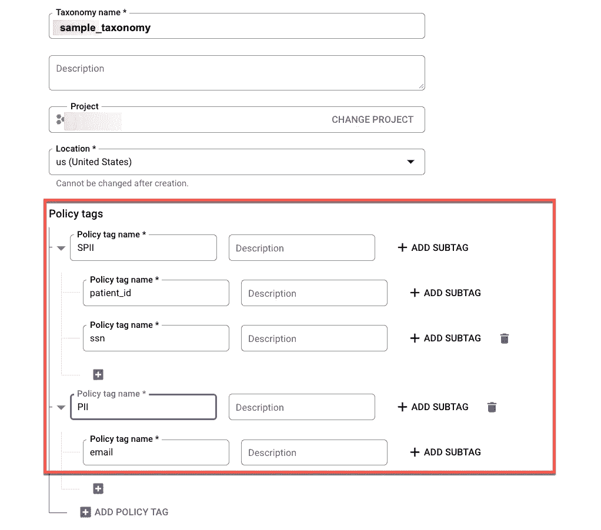
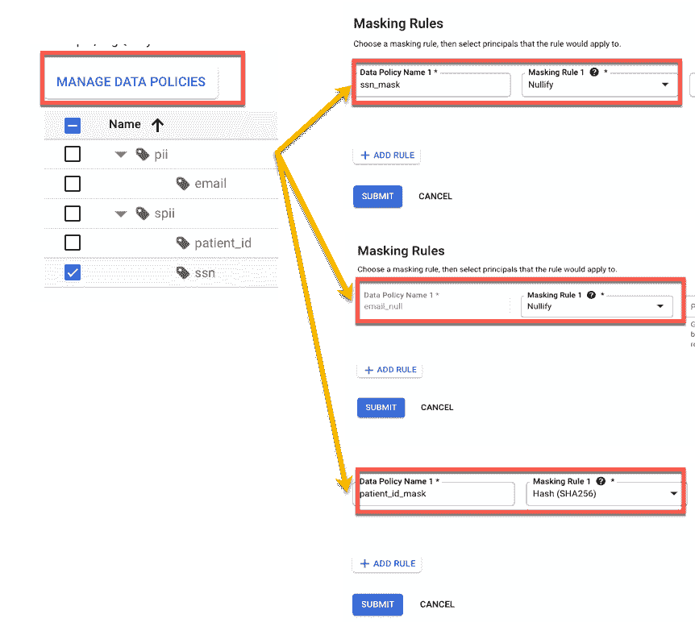
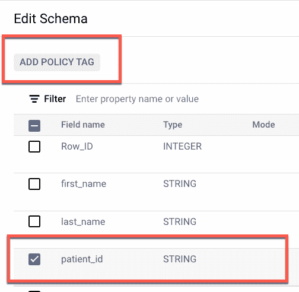
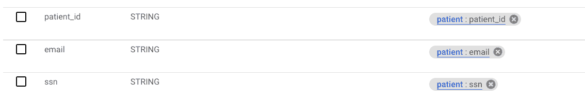
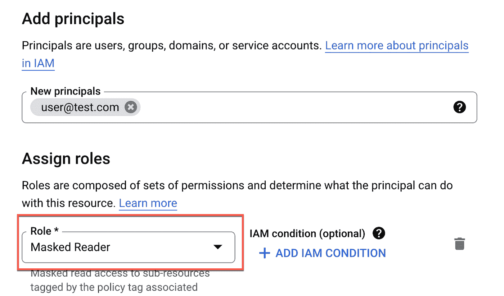
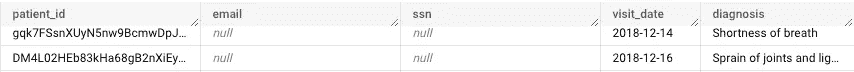

# 如何在 BigQuery 中动态屏蔽列数据？

> 原文：<https://medium.com/google-cloud/how-to-dynamically-mask-column-data-in-bigquery-15d1d24b3572?source=collection_archive---------2----------------------->

需要数据共享来疏通分析用例并推动创新。但是，在组织内部或外部与第三方共享数据之前，通过屏蔽任何敏感信息来安全地做到这一点非常重要。本指南展示了如何利用 BigQuery 中的[动态数据屏蔽](https://cloud.google.com/bigquery/docs/column-data-masking-intro)功能向用户隐藏列数据，同时仍然允许对列的访问。

配置数据屏蔽的工作流

**步骤 1:设置分类和策略标记:**第一步是创建策略标记的分类，以便能够根据敏感级别更好地分离数据，并控制谁可以查看敏感列。在下面的屏幕截图中，您将看到一个简单的分类，由两个高度受限的策略标记(patient_id 和 ssn 列)和一个正在创建的机密标记(email 列)组成。您需要根据您的数据保护和机密性要求来设置它。[这里的](https://cloud.google.com/bigquery/docs/best-practices-policy-tags#build_a_hierarchy_of_data_classes)是为你的组织建立分类结构的最佳实践指南。

**步骤 2:应用屏蔽规则**下一步是为上一步创建的每个策略标记定义屏蔽规则。您可以应用诸如无效、SHA256 散列值或默认屏蔽(字符串将被替换为“”、0 整数等规则。) .在下面的示例中，您将看到 ssn/email 列应用了“无效”规则，以防止最终用户看到它。您可能需要一个去标识版本的 patient_id 列来连接多个数据集，因此我为该列设置了一个“哈希”规则。有关屏蔽规则的更多信息，请参考本[指南](https://cloud.google.com/bigquery/docs/column-data-masking-intro#masking_options)。

**步骤 3:将策略标记应用于 BigQuery 列:**一旦创建了策略标记和数据策略，现在就可以将它们分配给相关的 BigQuery 列了。您可以在 GCP 控制台中通过导航到 BigQuery 表并单击 edit schema 来实现这一点。选择您要添加的列，然后单击“add policy tag ”(添加策略标记),使用您在上一步中创建的相关策略标记来附加列。

应用标记后，schema 部分将显示应用于每一列的标记。

显示列和应用的策略标记的 BigQuery 模式

**步骤 4:授予屏蔽读者访问权:**最后，您需要将屏蔽读者访问权授予需要访问屏蔽数据的用户。为此，您可以转到 IAM 页面，添加用户/组并提供一个“屏蔽读者”角色。如果没有屏蔽的 reader 角色，用户在尝试查询列时将会看到一条错误消息。

**结果**:下图显示了 BigQuery 中一个带有屏蔽数据的表的选择查询的输出。您将看到 patient_id 和 email/ssn 列的散列值根据上面定义的屏蔽规则被取消。

具有掩码列的表的查询结果