# 如何为 GCP 终止用户 OAuth

> 原文：<https://medium.com/google-cloud/how-to-end-user-oauth-for-gcp-1dce8e8ef1a2?source=collection_archive---------0----------------------->

让我们谈谈最终用户认证。我一直在深入研究身份认证领域，并分享了一些心得。

当您访问 GCP 服务时，会有身份验证来确定您是谁，授权来确定您能做什么，以及审计来记录您做了什么。在 IAM 中，您可以设置角色，以便根据您在项目中的权限进行授权。

在 GCP，有几种主要方式使用凭证来访问/登录/认证平台上的不同服务。

*   [终端用户 Auth | OAuth 客户端 ID](https://cloud.google.com/docs/authentication/end-user) :代表终端用户(包括您)使用 [OAuth 2.0](https://developers.google.com/identity/protocols/oauth2/) 访问服务/Google API/私有数据的凭证。通常它会打开一个浏览器窗口进行身份验证。
*   [服务帐户](https://cloud.google.com/iam/docs/service-accounts):使用 JSON 文件的凭证，该文件具有代表计算机/虚拟机访问服务的私钥。基本上。它代表需要访问的非人类用户。没有密码，不能使用浏览器或 cookies 登录。如果服务器不在 GCP，就在服务器上下载 JSON 文件，并将其传递给云客户端库，以便在运行时生成凭证。
*   [API 密匙](https://cloud.google.com/docs/authentication/api-keys):使用 API 密匙匿名访问公共数据的凭证它不需要用户认证，这与公共数据访问一起工作。

查看[认证概述](https://cloud.google.com/docs/authentication)了解关于这些不同方法的更多信息。

这篇博客主要关注如何使用最终用户凭证设置身份验证，并提供了一个如何在 Python 中使用这些凭证的示例。

最终用户身份验证的一个常见用例是为您构建的 web 或移动应用程序设置对数据的访问，如 Google 日历数据。我从从我的笔记本电脑访问云服务(如 Cloud Functions 或 BigQuery)而不使用服务帐户的用例中探索了这一点。在这种类型的用例中，服务帐户是一个更实际的途径，但这并不总是一个选项。

我假设你已经设置了一个谷歌云项目，并知道如何访问控制台。

# 设置 OAuth 同意屏幕

设置凭证时，从 Google Cloud 控制台上的*API&服务*部分开始。在设置凭据之前，如果您还没有设置 OAuth 凭据同意，则必须设置 OAuth 凭据同意。您在这里设置的是您的用户将在浏览器重定向中看到的同意屏幕。

因此，首先进入 *OAuth 同意屏幕*。

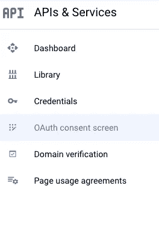

如果您从*凭证*页面开始，将会看到一个配置同意屏幕，指示您需要首先进行身份验证，该链接还会将您带到 *OAuth 同意屏幕*。

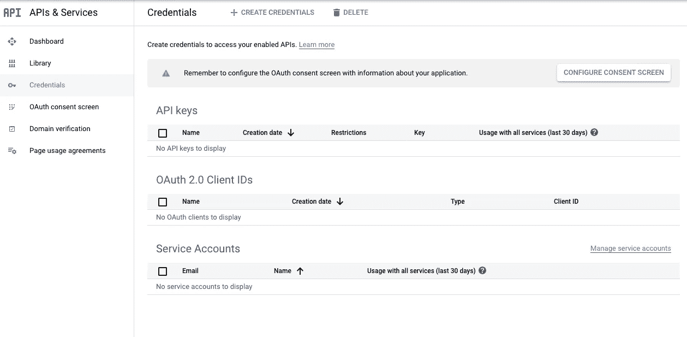

如果仅在您的组织中需要访问权限，请选择*内部*，如果外部最终用户将使用您的产品或服务，请使用*外部*。对于我的用例来说， *Internal* 是我所需要的，这使它更简单。

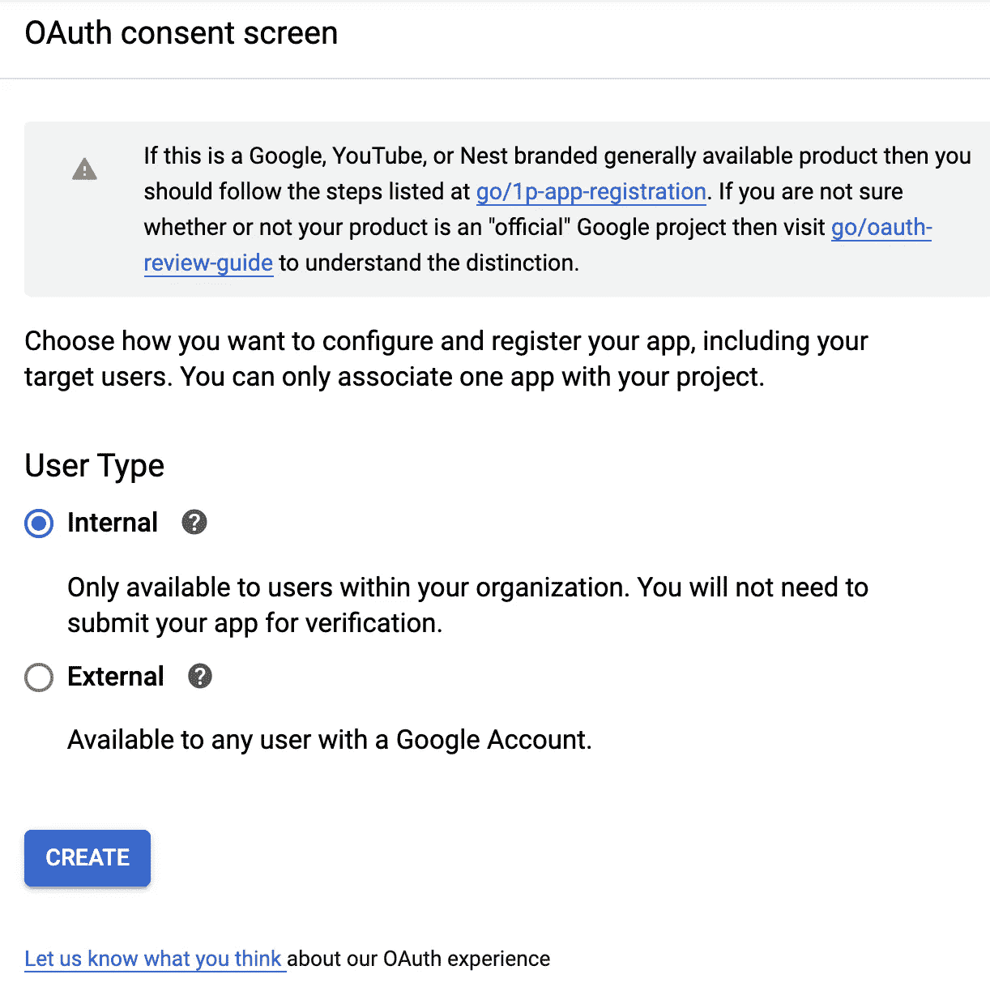

包括一个将请求同意的*应用名称*和*支持电子邮件*。

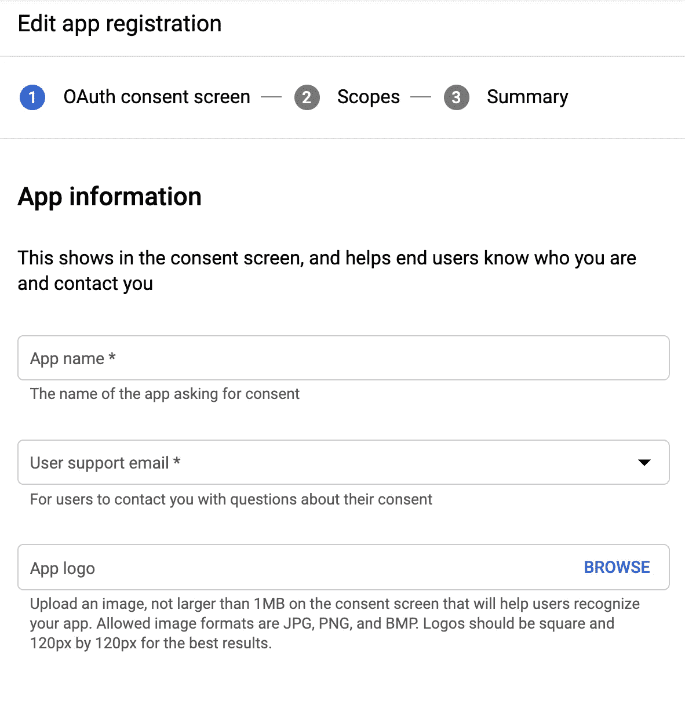

另外，添加*开发人员联系信息*，如果需要，可以与支持电子邮件相同*保存并继续*。

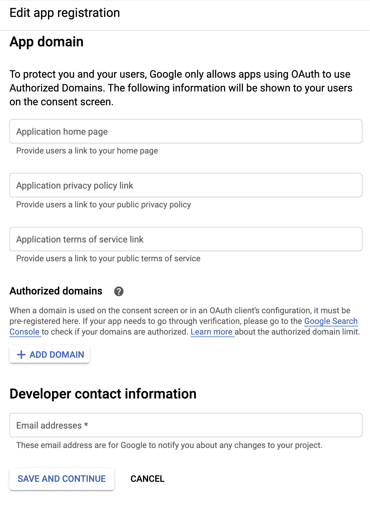

在设置初始凭证同意时，您可以设置*范围*。范围指定您希望潜在访问的有关最终用户的数据类型，以及您需要该最终用户帐户的多少访问权限。这进入了访问的授权区域，并且限制了应用程序可以代表最终用户执行的操作。选择项目需要访问的范围，并认真考虑您真正需要多少最终用户数据。

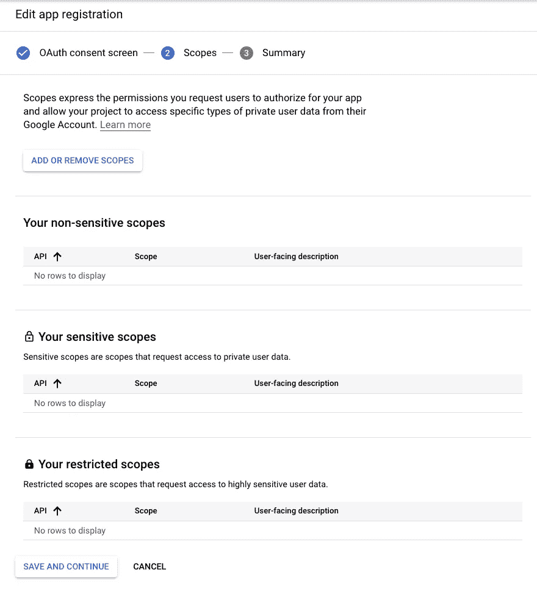

当您选择*添加或删除范围*时，您可以选择在下面的示例中包含哪些范围。

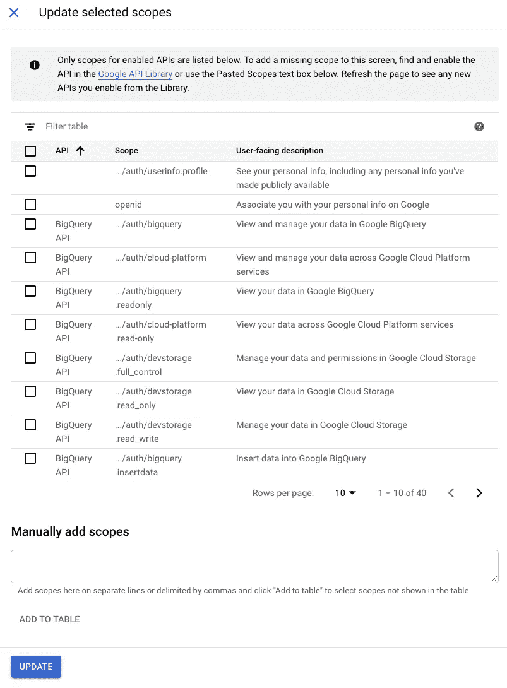

您可以查找范围并手动添加它们，而不是在列表中搜索。查看 [Google Scopes 文档](https://developers.google.com/identity/protocols/googlescopes)获得更多选项。

在这一部分之后，选择*保存并继续*，您将看到 OAuth 同意书的摘要，然后您将提交该摘要进行验证。

如果它是外部的，并且请求敏感范围(如日历、YouTube 数据)或受限范围(如 Gmail、驱动器)，则可能需要审查以进行验证。请点击此处了解更多关于 OAuth API 验证常见问题解答的信息。

# 创建凭据

一旦设置了 OAuth 同意，您将可以选择使用下面截图顶部*凭证*下的链接*+创建凭证*。


这些是您可以创建的凭据类型，正如上面所解释的那样。为了处理最终用户认证，我使用了 *OAuth 客户端 ID* 。

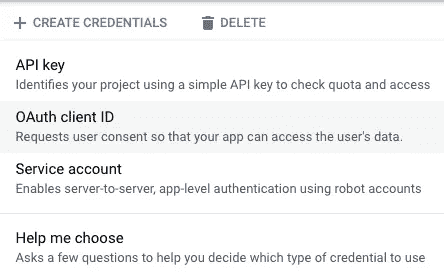

*帮我选择*在你导航这个不确定的时候很好用。

同样对于这个例子，我使用了*应用程序类型* *Web 应用程序*。

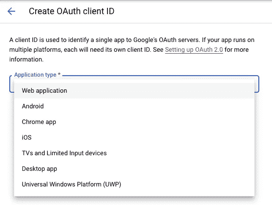

中途使用 Oauth 2.0 访问 Google API 文档提供了一个很好的应用程序选项的运行，以帮助您进行选择。

您可以为应用程序指定一个名称，以便在它要求身份验证时帮助在控制台中识别客户端。

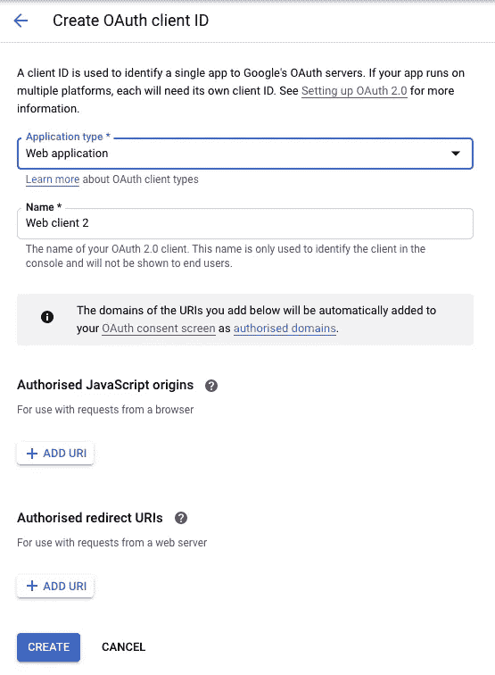

对于我想要使用的，我将本地主机 URI 放在*授权重定向 URIs* 中。

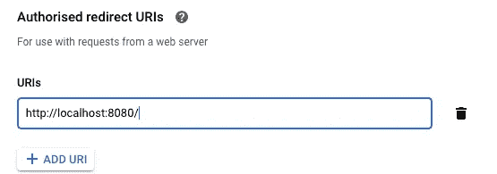

如果您计划在本地测试一些东西，请确保准确地包含上面的[http://localhost:8080/](http://localhost:8080/)；否则，它会给你一个 400 错误，说明重定向没有被授权。

在您*创建*凭证之后，它将显示您所创建内容的摘要。您可以返回到*凭证*仪表板，查看在 *OAuth 2.0 客户端 id*部分*下列出的新凭证。*在凭证名称的右边有一个向下的箭头，您可以在这里下载生成访问令牌所需的 JSON 文件。


记录文件名和路径。

# 获取和使用凭证的示例代码

下面的代码可以帮助测试您的新凭证。这段代码加载凭证，再往下是示例代码，说明如何使用凭证来获取对 BigQuery 等服务的访问令牌。

```
from google_auth_oauthlib import flowlaunch_browser = True # when using locally and False when remoteappflow = flow.InstalledAppFlow.from_client_secrets_file(
    'CLIENT_SECRETS.json',
    scopes=['https://www.googleapis.com/auth/bigquery'])

if launch_browser:
    appflow.run_local_server()
else:
    appflow.run_console()

credentials = appflow.credentials
```

CLIENT_SECRETS 是在创建 OAuth 2.0 凭证后下载的 JSON 文件。用该文件的路径替换它，或者通过环境变量传递它。

下面是对上面代码的更详细的分解，查看 [google_auth_oauthlib 文档](https://google-auth-oauthlib.readthedocs.io/en/latest/_modules/google_auth_oauthlib/interactive.html)以获得关于这个库的更多信息。

定义您希望应用程序访问的范围。同样，你可以从[谷歌范围文档](https://developers.google.com/identity/protocols/googlescopes)中获得更多的范围选项。

```
scopes=['[https://www.googleapis.com/auth/bigquery'](https://www.googleapis.com/auth/bigquery')])
```

打开浏览器窗口，自动(运行本地服务器)或手动(运行控制台)授权。

```
if launch_browser:
    appflow.run_local_server()
else:
    appflow.run_console()
```

请注意，您希望在浏览器中打开身份验证，您登录的**电子邮件帐户在该凭证和这些范围**下获得授权；否则，您会收到一条未经授权的消息。

如果 OAuth 是内部的，那么该帐户必须来自您的组织，并且它需要能够授予对您所请求的范围的访问权限。通常这可能是一个人的日历或 Gmail。对于这个例子，我确保 BigQuery 范围被附加到 OAuth 同意，并且我设置了一个授予我的帐户访问权限的 [IAM 角色](https://cloud.google.com/iam/docs/quickstart)。

获取访问令牌。

```
credentials = appflow.credentials
```

向 API 发送访问令牌以获得对服务的访问。在本例中，我将它发送给了 BigQuery API。

```
from google.cloud import bigquery

client = bigquery.Client(project=PROJECTID, credentials=credentials)
```

将*项目 ID* 替换为 GCP 项目 ID。

测试访问是否有效。以下是可用于测试 BigQuery 数据集的示例代码。

```
query_string = """SELECT name, SUM(number) as total
FROM `bigquery-public-data.usa_names.usa_1910_current`
WHERE name = 'William'
GROUP BY name;
"""
query_job = client.query(query_string)

# Print the results.
for row in query_job.result():  # Wait for the job to complete.
    print("{}: {}".format(row['name'], row['total']))
```

注意，BigQuery 数据集是公共的，但我的项目不是。因此，我可以用这些凭证从我的笔记本电脑上发出请求，在我的私人项目中运行 BigQuery 上的查询。

# 包裹

这篇文章概述了终端用户的 GCP 认证访问。它一步一步地设置 OAuth 同意屏幕、设置凭证，并提供了用于测试的示例代码。

在我的私人 GCP 项目中，我尝试用这个方法从我的笔记本电脑发送一个查询，并在 BigQuery 上运行。为什么你会问？…因为这是一个复杂的查询，需要其他代码来创建，并且运行时间超过 15 分钟。否则，我会直接使用 BigQuery 或云函数或云运行，但这些都不是最佳选择。

身份验证可能很棘手，但它是可行的，而且我知道您也知道，这一点非常重要，尤其是从安全的角度来看。花些时间尝试熟悉它，因为一旦你掌握了它，这是一个你在应用程序工作时可以避免的兔子洞。