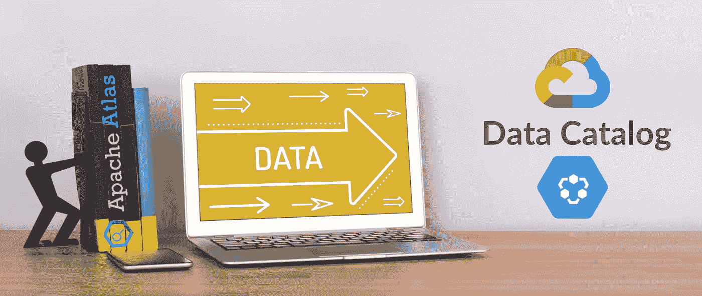
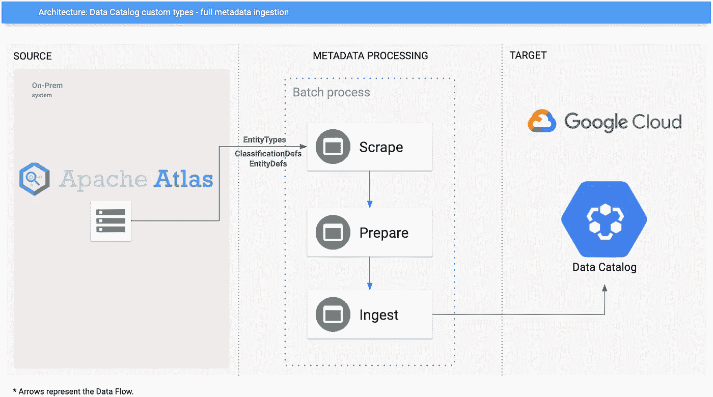
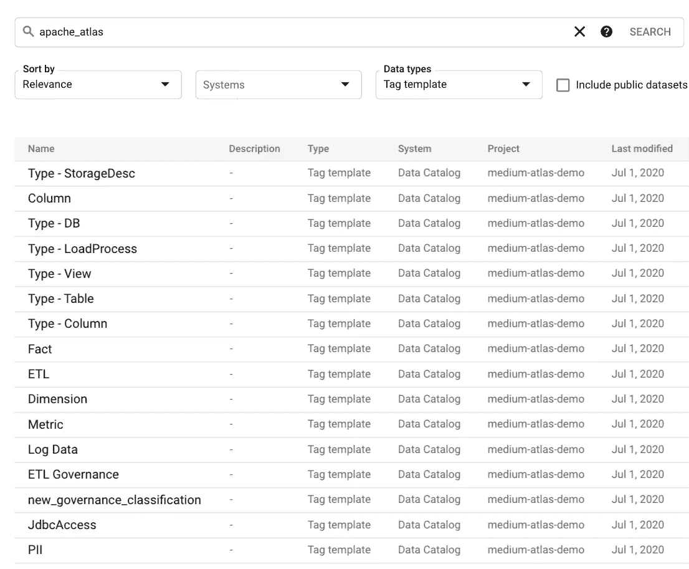
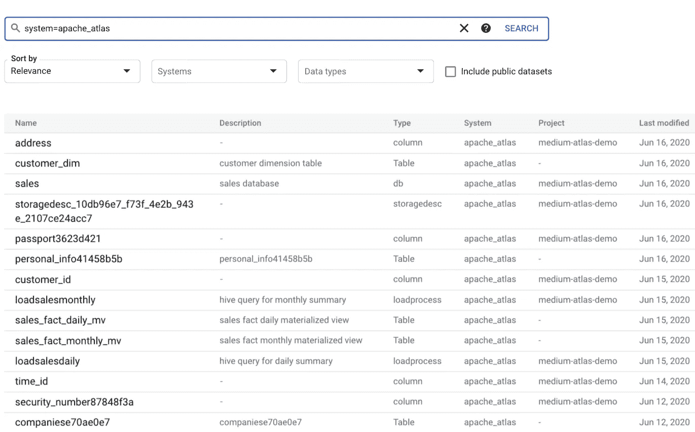
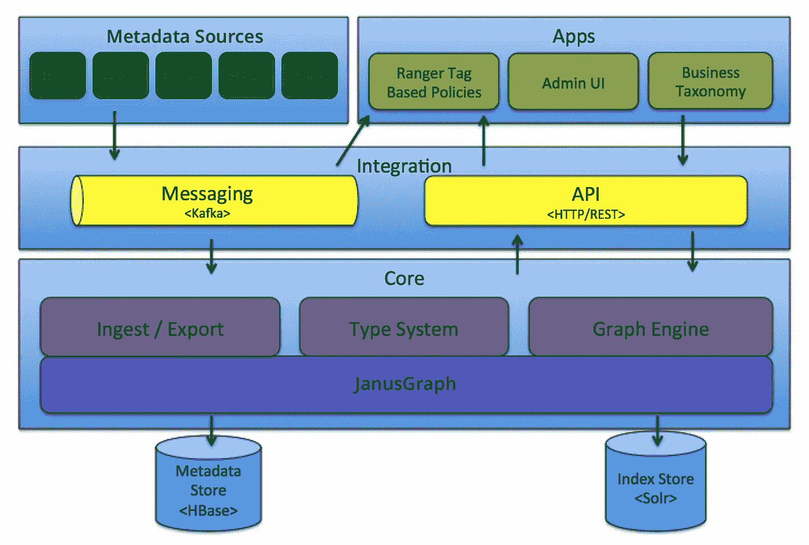
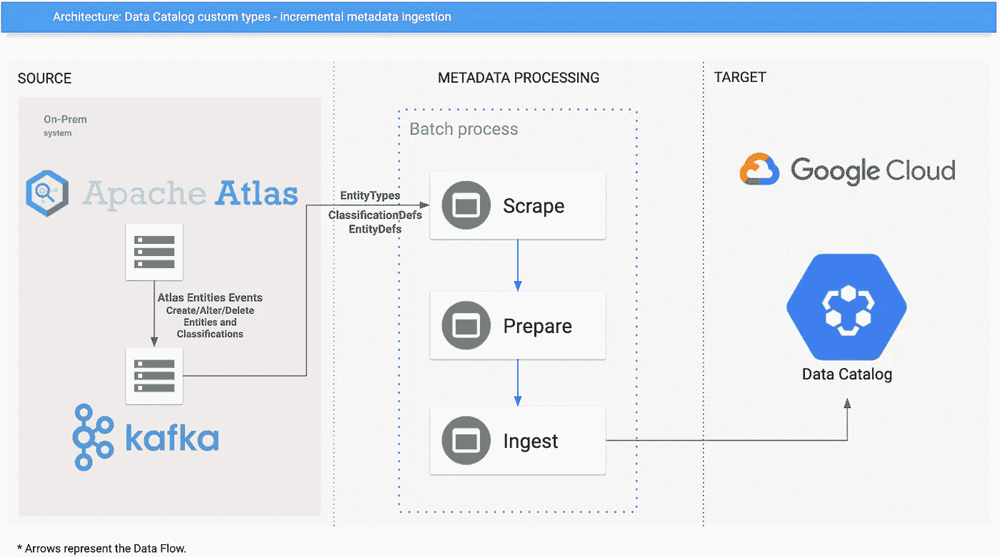
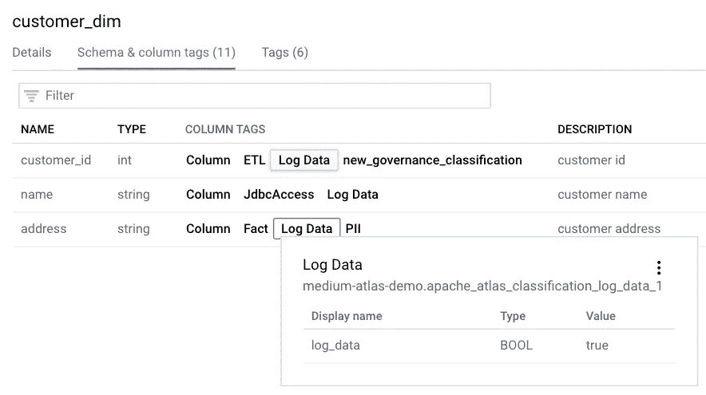
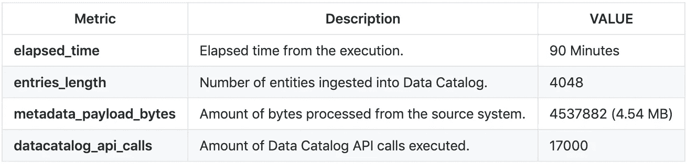

# 如何将 Apache Atlas 元数据扩展到 Google 数据目录

> 原文：<https://medium.com/google-cloud/how-to-extend-your-apache-atlas-metadata-to-google-data-catalog-e84b8ddc8f59?source=collection_archive---------1----------------------->

## 从设计决策到逐步执行，了解如何在 Google Data Catalog 中摄取 Apache Atlas 元数据，进行完整和增量运行。



在 [Canva](https://www.canva.com/) 上创建的图像。

> ***免责声明:所有观点均为本人观点，仅代表本人……****。* ***它们来自参与开发完全可操作的示例连接器的经验，可用在:***[***github***](https://github.com/GoogleCloudPlatform/datacatalog-connectors)***上。***

如果你错过了关于 Apache Atlas 和 Data Catalog 如何构建元数据的最新帖子，请查看[a-metadata-comparison-between-Apache-Atlas-and-Google-Data-Catalog](/@mesmacosta/a-metadata-comparison-between-apache-atlas-and-google-data-catalog-7e1ad391b4c2)。

# 服装胜利公司

在本文中，我们将首先创建一个虚构的场景，其中我们有 Dress4Victory 公司。他们帮助用户在购买服装时获得最优惠的价格，多年来，他们已经从几台服务器发展到几百台服务器。


服装 4 胜利公司标志

该公司有许多分析工作负载要处理和支持他们的用户数据，他们的技术堆栈主要由 Hadoop 组件组成。

总的来说，他们的元数据管理一团糟。因此，去年他们的首席技术官将 Apache Atlas 添加到他们的技术堆栈中，以更好地组织他们的元数据，并可视化他们企业的数据结构。

通过改进他们的元数据管理，它帮助他们解决了许多问题，例如:

*   分析师花很长时间寻找有意义的数据。
*   客户数据无处不在。
*   对其数据的访问控制问题。
*   合规要求被忽略。

现在，他们正在将一些工作负载迁移到 Google 云平台，他担心，自从 Apache Atlas 开始为他们工作以来，管理他们的元数据将变得更加困难。

他发现了 Google Data Catalog，他很想使用它，因为它得到了全面的管理，并将降低他的运营成本，但目前他们不能将所有东西都迁移到 GCP。

幸运的是，他发现有一个用于 apache-atlas 的连接器。他想马上开始试验。

# 完全摄取执行

让我们帮助 Dress4Victory，看看 Apache Atlas `connector`全摄取架构:



完全摄取架构

每次执行时，它都会:

*   **Scrape** :连接 Apache Atlas，检索所有可用的元数据。
*   **准备** : 在数据目录实体中转换，用额外的元数据创建标签。
*   **摄取**:将数据目录实体发送到 Google Cloud 项目。

目前，连接器支持以下 Apache Atlas 资产类型:

*   **实体类型**由于 Google 数据目录有预定义的属性，我们创建了一个额外的模板来丰富 Apache Atlas 元数据。
*   **分类类型**
    每个分类类型都被转换成一个数据目录模板，因此我们能够授权用户创建标签，使用他们在 Apache Atlas 中使用的相同分类。如果有分类附加到实体，连接器也会将它们作为标记进行迁移。
*   **实体**
    每个实体被转换成一个数据目录条目。由于我们在 Google 数据目录中没有类型结构，所有来自相同类型的条目共享相同的模板**、**，因此用户可以用与在 Apache Atlas 中相似的方式进行搜索。

因为偶数列被表示为 Apache Atlas 实体，所以这个连接器允许用户将实体类型列表指定为摄取过程中要考虑的命令。

> 在发布时，数据目录不支持沿袭，因此该连接器不使用 Apache Atlas 中的沿袭信息。如果情况有变，我们可能会考虑更新这个。

# 运行它

在设置连接器环境之后，按照 [Github repo](https://github.com/GoogleCloudPlatform/datacatalog-connectors-hive/tree/master/google-datacatalog-apache-atlas-connector) 中的说明，让我们使用它的命令行参数来执行它:

```
#Environment variables
export GOOGLE_APPLICATION_CREDENTIALS=datacatalog_credentials_file
export DATACATALOG_PROJECT_ID=google_cloud_project_id
export APACHE_ATLAS2DC_HOST=localhost
export APACHE_ATLAS2DC_PORT=21000
export APACHE_ATLAS2DC_USER=my-user
export APACHE_ATLAS2DC_PASS=my-passgoogle-datacatalog-apache-atlas-connector sync \
  --datacatalog-project-id $DATACATALOG_PROJECT_ID \
  --atlas-host $APACHE_ATLAS2DC_HOST \
  --atlas-port $APACHE_ATLAS2DC_PORT \
  --atlas-user $APACHE_ATLAS2DC_USER \
  --atlas-pass $APACHE_ATLAS2DC_PASS
```

## 结果

观看视频时打开字幕进行逐步指导。

全运行 Apache Atlas 演示

现在我们在谷歌数据目录中有了所有的阿帕奇地图集`Classifications`和`Entity Types`作为`Tag Templates`:



Apache Atlas 摄取了分类和实体类型

和实体作为数据目录[自定义条目](https://cloud.google.com/data-catalog/docs/how-to/custom-entries):



Apache Atlas 摄取了实体

还记得 Dress4Victory 里的 Hadoop 组件吗？我们甚至从蜂巢中摄取了一些`loadProcesses`，像`loadsalesdaily`和`loadsalesmonthly`。

Dress4Victory 非常喜欢这一点，但他们得出的结论是，由于他们有 100 台服务器，每隔一段时间进行一次完整的接收对他们来说是不合适的。

> 如果您想知道完全摄取 4048 个 Apache Atlas 条目需要多长时间，请参阅本文末尾的**执行指标**部分。

幸运的是，我们有一个进行增量摄入的选项，接下来我们将看看这个选项是如何工作的。

# 增量摄取执行

如果您不熟悉 Apache Atlas，这张图片显示了它们的架构:



来自[图集文档](https://atlas.apache.org/1.2.0/Architecture.html)的图集架构

因此，我们将在连接器增量运行模式下利用 Kafka 消息传递事件总线:



增量摄取架构

现在我们已经完成了完整的运行，我们可以执行增量摄取。

每次执行时，它都会:

*   **Scrape** :监听 Apache Atlas event bus 上的事件变化，我们看到的是 Kafka，检索给定事件的元数据。由于 Kafka 使用的是一个[拉模型](https://kafka.apache.org/documentation/#design_pull)，连接器通过以预先配置的时间间隔轮询元数据来工作。轮询机制，听[图集 _ 实体](https://atlas.apache.org/1.1.0/Notifications.html)专题。
*   **准备** : 在数据目录实体中转换，用额外的元数据创建标签。
*   **摄取**:将数据目录实体发送到 Google Cloud 项目。

这里的主要区别是，我们的执行速度快得多，我们只需要处理整个元数据的一部分。如果我们有一个高事件吞吐量，我们甚至可以运行连接器的多个实例，为它们分配不同的[分区](https://kafka.apache.org/25/documentation/streams/architecture)。

# 运行它

在设置连接器环境之后，按照 [Github repo](https://github.com/GoogleCloudPlatform/datacatalog-connectors-hive/tree/master/google-datacatalog-apache-atlas-connector) 中的说明，让我们使用它的命令行参数来执行它:

```
#Environment variables
export GOOGLE_APPLICATION_CREDENTIALS=datacatalog_credentials_file
export DATACATALOG_PROJECT_ID=google_cloud_project_id
export APACHE_ATLAS2DC_HOST=localhost
export APACHE_ATLAS2DC_PORT=21000
export APACHE_ATLAS2DC_USER=my-user
export APACHE_ATLAS2DC_PASS=my-pass
export APACHE_ATLAS2DC_EVENT_SERVERS=my-event-server
export APACHE_ATLAS2DC_CONSUMER_GROUP=atlas-event-syncgoogle-datacatalog-apache-atlas-connector sync-event-hook \
  --datacatalog-project-id $APACHE_ATLAS2DC_DATACATALOG_PROJECT_ID \
  --atlas-host $APACHE_ATLAS2DC_HOST \
  --atlas-port $APACHE_ATLAS2DC_PORT \
  --atlas-user $APACHE_ATLAS2DC_USER \
  --atlas-pass $APACHE_ATLAS2DC_PASS \
  --event-servers $APACHE_ATLAS2DC_EVENT_SERVERS \
  --event-consumer-group-id $APACHE_ATLAS2DC_CONSUMER_GROUP
```

## 结果

观看视频时打开字幕进行逐步指导。

增量运行 Apache Atlas 演示

通过增量执行，几分钟后我们就可以看到我们在 Apache Atlas 上添加的列级标记:



地址栏中的日志数据标记

太棒了，现在 Dress4Victory 很开心。最后，让我们来看看一些执行指标。

# 执行指标

最后，让我们看一下完整执行生成的一些指标。通过运行一个 Apache Atlas 1.0.0 实例来收集指标，该实例填充了 1013 个表、1 个 StorageDesc、3026 列、2 个视图、3 个数据库和 3 个 LoadProcesses，产生了 4048 个实体。

> 以下指标并非保证，而是近似值，可能会因环境、网络和执行情况而异。



度量摘要

作为参考，谷歌数据目录提供了一个月免费的`1 million` API 调用层，每个`100,000` API 调用比`1 million` API 调用收费 10 美元。

另外，如果我们看一下执行时间，`90`分钟，该执行消耗了超过`4000`的资产，这不是一个小数目的编目资产。好事情是我们有一个选择，做增量运行之后:)。

> 有关数据目录计费的最新信息，请访问:[数据目录计费文档](https://cloud.google.com/data-catalog/pricing)。

# 样本连接器

本文中讨论的所有主题都包含在一个示例连接器中，可以从 GitHub 上获得:[**Apache-atlas-connector**](https://github.com/GoogleCloudPlatform/datacatalog-connectors-hive/tree/master/google-datacatalog-apache-atlas-connector)。你可以随便拿，按照说明跑。顺便说一下，欢迎投稿！

> *它是在 Apache 许可证版本 2.0 下许可的，以“原样”为基础发布，没有任何种类的担保或条件，无论是明示还是暗示。*

# 结束语

在本文中，我们介绍了如何将 Apache Atlas 中的元数据导入 Google Data Catalog，进行完整和增量运行。我们还拜访了一家虚构的公司，该公司将利用 Google Data Catalog 来扩展其元数据管理，由于这是一个完全托管的无服务器解决方案，它无疑增加了很多价值！干杯！

# 参考

*   **Apache Atlas 架构**:[https://atlas.apache.org/1.2.0/Architecture.html](https://atlas.apache.org/1.2.0/Architecture.html)
*   **数据目录连接器 Github Repo**:[https://Github . com/Google cloud platform/Data Catalog-Connectors](https://github.com/GoogleCloudPlatform/datacatalog-connectors)
*   **Apache Atlas connector Github Repo:**[https://Github . com/Google cloud platform/data catalog-connectors-hive/tree/master/Google-data catalog-Apache-Atlas-connector](https://github.com/GoogleCloudPlatform/datacatalog-connectors-hive/tree/master/google-datacatalog-apache-atlas-connector)
*   数据目录公文:[https://cloud.google.com/data-catalog](https://cloud.google.com/data-catalog/)