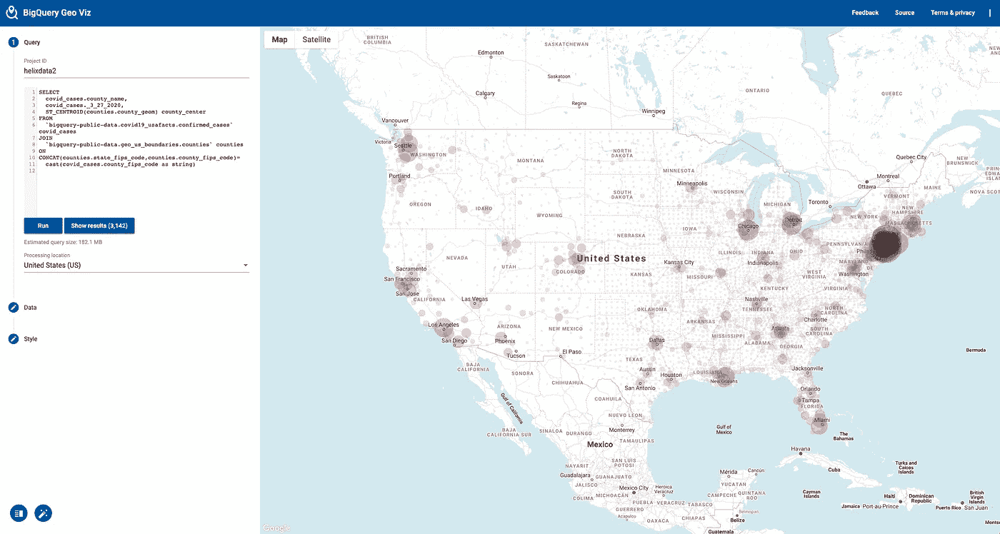
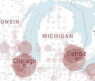
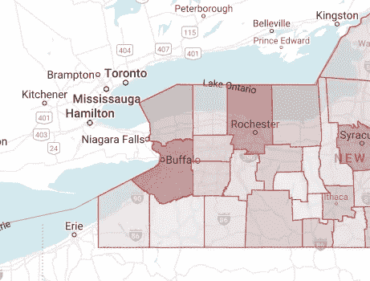
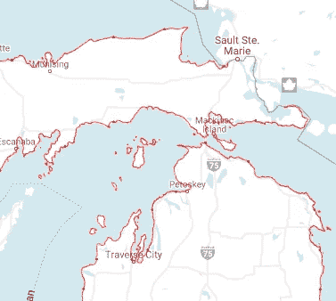
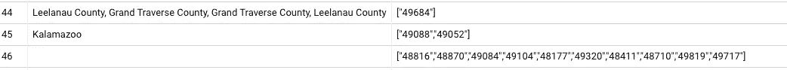

# 如何使用 BigQuery GIS 找到美国各县的内部质心

> 原文：<https://medium.com/google-cloud/how-to-find-the-interior-centroid-of-us-counties-using-bigquery-gis-de396f0fad03?source=collection_archive---------2----------------------->

## 如何处理质心在五大湖区的问题

*同* [同*施密特*同](/@easchmidt)

在尝试使用一个刚刚推出的 BigQuery 数据集来绘制各县的新冠肺炎确诊病例数据时，我们注意到了一个问题。总的来说，地图看起来不错:



## 州与州之间的海上边界带来的问题

不过，就地图而言，细节很重要。这张地图的每个用户都会放大到他们居住的地方。任何住在上密歇根州海岸线的用户都会立即注意到一个问题:



注意他们县的数据在水里！这是为什么呢？

因为美国的县界到了州或国家的边界。通常，这不是问题，但在这里，边界是海上边界，位于五大湖的中途。这是另一个例子，这次是在美加边境:



当你创建像新冠肺炎确诊病例这样的地图时，你希望标记在人们生活的地方，而不是在水里。在本文中，我将向您展示如何创建一个位于该县土地质心的地图标记。

## 想法一:海岸线

第一个想法是对海岸线边界数据集进行空间连接，然后找到县边界和海岸线之间的交叉点(公共区域)。这应该只给我们陆地面积。

BigQuery 拥有美国地理边界的公共数据集，因此我们可以这样做:

```
WITH land_only AS (
 SELECT 
   county_name, 
  ** ST_Intersection**(county_geom, coastline_geom) AS county_geom
 FROM `bigquery-public-data.geo_us_boundaries.counties`, 
      `bigquery-public-data.geo_us_boundaries.coastline`
 WHERE state_fips_code = '26' -- Michigan
       AND ST_Intersects(county_geom, coastline_geom)
)SELECT 
county_name,
ST_Centroid(county_geom) AS map_marker,
county_geom
FROM land_only
```

我们可以使用 BigQuery GeoViz 可视化结果，这告诉我们该方法不起作用:



请注意，这种技术对于岛屿非常有效(因为岛屿是多边形)，但对于其他县则不然，因为一般来说，美国的海岸线是由多条线组成的，而不是多边形。

## 想法二:加入邮政编码

美国邮政编码实际上是一个邮路集合的边界框。由于邮局不会在水中投递邮件，我们可以把邮政编码的边界看作是由人口组成的区域。

让我们看看每个县的邮政编码是什么样的:

```
SELECT
    county,
    TO_JSON_STRING(ARRAY_AGG(zip_code)) AS zip_codes,
  FROM `bigquery-public-data`.geo_us_boundaries.zip_codes
  WHERE state_fips_code = '26' -- Michigan
  GROUP BY county
```

## 3.清理邮政编码数据

我们注意到一些邮政编码(如 49684)覆盖几个国家:



因此，我们需要拆分 county 字段，并将 49864 放入每个县。还有一个问题。在某些情况下，县名会写成 Ostego、Ostego county 或 ostego County。因此，这里有一个函数将进行必要的清理:

```
CREATE OR REPLACE FUNCTION advdata.cleanup_county_name(county_split STRING) AS
(
  TRIM(REPLACE(UPPER(county_split), 'COUNTY', ''))
)
```

创建一个县到邮政编码的表，并对所有的几何图形进行联合:

```
CREATE OR REPLACE TABLE advdata.michigan_zipcodes AS
  SELECT
    advdata.cleanup_county_name(county_split) AS county,
    TO_JSON_STRING(ARRAY_AGG(zip_code)) AS zip_codes,
    **ST_Union**(ARRAY_AGG(zip_code_geom)) AS population_geom
  FROM `bigquery-public-data`.geo_us_boundaries.zip_codes, UNNEST(SPLIT(county, ',')) AS county_split
  WHERE state_fips_code = '26' -- Michigan
  GROUP BY advdata.cleanup_county_name(county_split)
```

## 4.创建标记

现在，我们可以做标记，每个县对应一个标记，方法是根据邮政编码边界进行交叉:

```
CREATE OR REPLACE TABLE advdata.michigan_landareas ASWITH land_only AS (
  SELECT 
    lsad_name, int_point_geom,
    ST_Intersection(county_geom, population_geom) AS county_geom
  FROM `bigquery-public-data.geo_us_boundaries.counties`
  JOIN advdata.michigan_zipcodes
  ON advdata.cleanup_county_name(lsad_name) = county
  WHERE state_fips_code = '26' -- Michigan
)SELECT 
  lsad_name,
  int_point_geom,
  ST_Centroid(county_geom) AS map_marker,
  county_geom
FROM land_only
```

这样做之后，我们现在有了一个表，其中每个县都有一个 map_marker 点。我们可以用它来绘制任何基于点的县级数据。

## 5.扩展到所有状态

到目前为止，这些查询只针对密歇根州，因此我们可以快速地对它们进行测试。现在，不要硬编码 state_fips_code='26 '，让我们对美国所有的州都这样做。我们将结果存储在名为 reference 的数据集中。

县城清理功能:

```
CREATE OR REPLACE FUNCTION reference.cleanup_county_name(county_split STRING) AS
(
  TRIM(REPLACE(UPPER(county_split), 'COUNTY', ''))
)
```

请注意，在 where 子句中，state fips 被添加到组中，而 Michigan 被删除:

```
CREATE OR REPLACE TABLE reference.zipcodes AS
  SELECT
    state_fips_code,
    reference.cleanup_county_name(county_split) AS county,
    TO_JSON_STRING(ARRAY_AGG(zip_code)) AS zip_codes,
    ST_Union(ARRAY_AGG(zip_code_geom)) AS population_geom
  FROM `bigquery-public-data`.geo_us_boundaries.zip_codes, UNNEST(SPLIT(county, ',')) AS county_split
  GROUP BY state_fips_code, reference.cleanup_county_name(county_split)
```

对于 landareas 查询也是如此:

```
CREATE OR REPLACE TABLE reference.landareas AS# join back using state fips and county name
WITH land_only AS (
  SELECT 
    counties.state_fips_code,
    lsad_name, int_point_geom,
    ST_Intersection(county_geom, population_geom) AS county_geom
  FROM `bigquery-public-data.geo_us_boundaries.counties` as counties
  JOIN reference.zipcodes as zips
  ON reference.cleanup_county_name(lsad_name) = county
    AND counties.state_fips_code = zips.state_fips_code
)SELECT 
  state_fips_code,
  lsad_name,
  int_point_geom,
  ST_Centroid(county_geom) AS map_marker,
  county_geom
FROM land_only
```

最后，审计该表:

```
select area.* EXCEPT(county_geom), county.geo_id FROM
`covid19-analytics.reference.landareas` as area
FULL JOIN `bigquery-public-data.geo_us_boundaries.counties` as county
ON area.state_fips_code = county.state_fips_code
    and area.lsad_name = county.lsad_name
```

结果是，由于缺少邮政编码或在 counties 表中缺少信息，有 7 个县没有地理信息。

尽情享受吧！