# 如何启动并运行云身份感知代理

> 原文：<https://medium.com/google-cloud/how-to-get-cloud-identity-aware-proxy-up-and-running-547195f1fce3?source=collection_archive---------0----------------------->

您需要能够感知人员和设备的工具来保护您的应用。你不会在没有检查乘客身份和携带物品的情况下让他们登机，你也应该同样对待你的申请。这种上下文感知的思维方式推动了谷歌对 BeyondCorp 之外的[的采用，并且已经获得了牵引力。](/google-cloud/what-is-beyondcorp-what-is-identity-aware-proxy-de525d9b3f90)

现代应用依赖于大量的系统:web 服务器、微服务和可扩展的无服务器部署。您希望所有的子组件都可以互相访问，并且您的员工也可以访问，但是如果您不小心的话，您可能会将它们向互联网上的所有人开放。没人想这样。

第三集

# 复杂的访问策略

饮食。Run 是一家初创公司，主要面向热衷于跑步的零食爱好者，随着规模的扩大，他们的系统迅速扩展，需要保护他们存储的关于跑步者、慢跑者和力量步行者的大量个人身份信息，包括一段时间内的位置数据和个人联系人列表。他们知道他们必须更加小心哪些员工和承包商可以访问哪些系统，所以他们检查了他们的选择。


天真的解决方案是详尽地列出哪些人或服务可以或不可以访问他们运行的每个服务。可悲的是，这变得非常复杂，非常快，并创造了一个维护噩梦。列举每一个联系所需要的时间和精力会大大减慢他们的速度。

他们的第一种方法，因为他们刚刚起步，根本没有模型:一切都可以与其他一切交谈。这有助于加速增长，但对于安全团队来说，这种态度变得过于宽容。

> 完全开放的访问会导致危害或泄漏

接下来，他们转向了更细粒度的访问模型:EatAnd。运行团队跟踪哪些服务可以与哪些服务对话，因此他们的客户数据库可以与他们的营销管理系统对话，财务运营工具被限制从公司网络外部访问，客户案例管理可以访问注册用户数据库，等等。等等。等等。他们一个接一个地写出防火墙规则来解决这些用例——痛苦但有效。

这也变得不可行，因为政策很快变得错综复杂，甚至对 EatAnd 的任何人来说都难以理解。跑去了解一下。在那个时候，公司里没有人能理解它应该如何工作，或者可能的结果是什么。

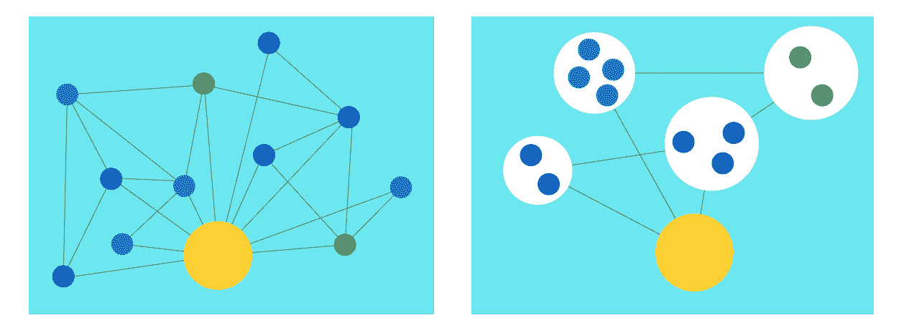

# 是时候简化了

使用[身份感知代理(IAP)](https://cloud.google.com/iap/) 和[身份和访问管理](https://cloud.google.com/iam/)(IAM)eat and。运行 DevSecOps 团队创建了清晰、易读、符合逻辑的策略来控制哪些人可以在何时查看哪些应用程序。他们还更进一步，利用不同类型的条件来定制访问标准。他们发现，随着团队的不断壮大，只需点击几下鼠标，就可以添加新的员工组和新的应用程序，这很容易发展和改变。

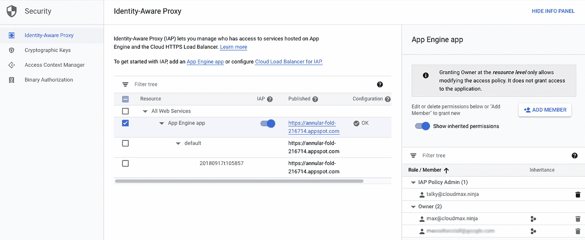

与之形成对比的是:复杂的防火墙策略、VPN 限制和访问控制。一个新的家庭手工业在 90 年代兴起，只是为了帮助简化这些规则，减少复杂性和冗余，因为规则的数量激增到几十万个。

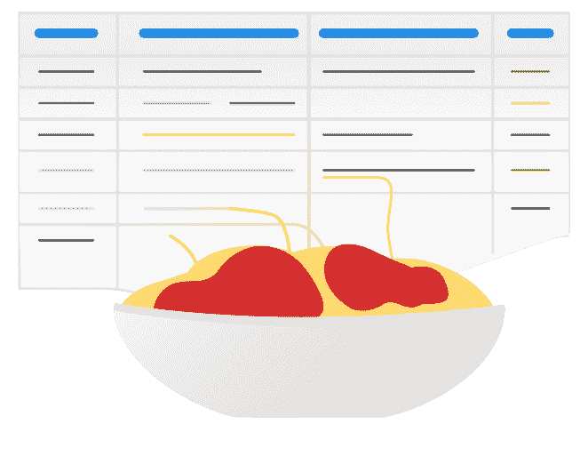

嗯，意大利面

和 IAP 一起吃饭。运行团队可以快速选择哪个应用程序、哪些人以及哪些访问角色。上面你可以看到他们如何设置了两个应用程序所有者，他们可以完全管理 App Engine 应用程序，其中一名员工 Talky McTalkerson 作为 IAP 策略管理员，在我们雇用更多员工时维护策略。

# 更进一步

之前帮助 EatAnd 的[应用引擎](https://cloud.google.com/iap/docs/app-engine-quickstart)和 [GKE 快速入门](https://cloud.google.com/iap/docs/enabling-kubernetes-howto)覆盖了[。运行使 IAP 快速启动并运行；接下来，该团队希望利用云 IAM 条件来扩展他们的模型，并建立更加细致入微的访问策略。一些已经转移到谷歌云的应用程序包含敏感数据，或者他们希望防止潜在泄露的正在进行的工作。](/@max.saltonstall/what-is-beyondcorp-what-is-identity-aware-proxy-de525d9b3f90)

饮食。Run 正准备在他们的应用程序中推出一个新的社交分享组件，但它还不够充实，不足以处理他们的全部用户群。因此，他们在 IAP 后面的 App Engine 上设置了新版本，并且只限于工程团队使用。

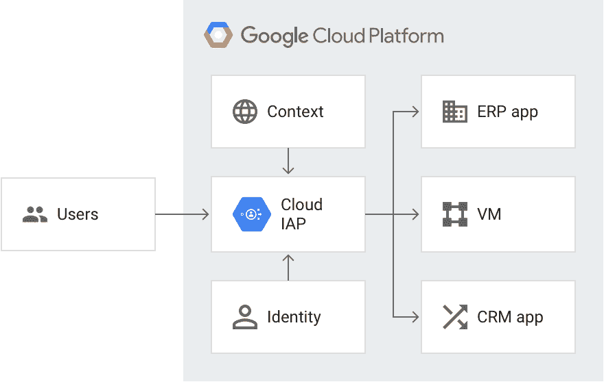

在云控制台中打开 IAP，他们首先从 App Engine 应用程序的 IAP 安全 Web 应用程序用户角色中删除了 *employees* 组，因为他们现在希望为不同版本设置不同的权限。

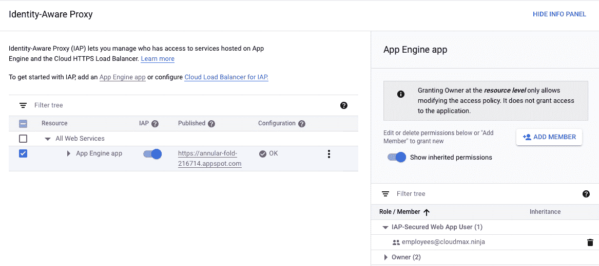

他们认为每个人都可以安全地看到版本 2，但只希望工程人员看到最新、最不稳定的版本 3。

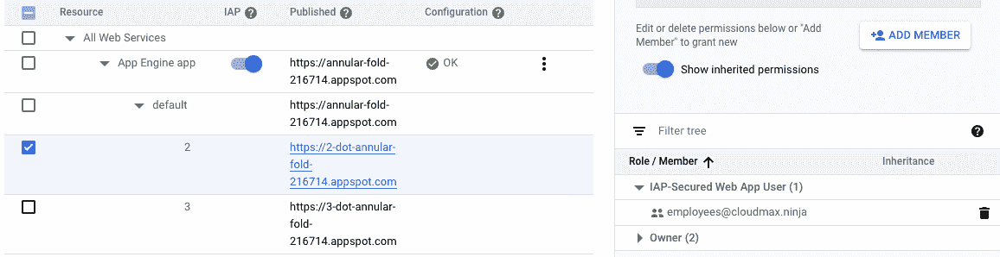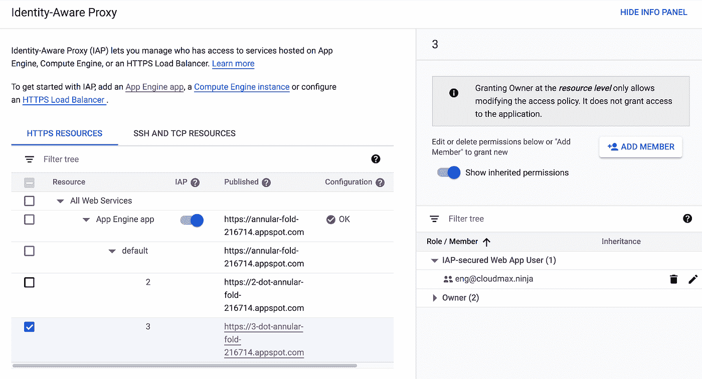

# 用条件增加 IAP

他们已经在 IAP 的基础上开发了一个新版本的应用程序，并且仅限全职员工使用，但现在他们想更进一步。

现在只有工程团队可以使用新版本及其功能，因为他们仍在测试中。好的开始，但是仍然有泄露的危险。为了更进一步，团队使用 Access Context Manager 创建了更多的访问条件，而不仅仅是组成员资格。因为团队已经在他们的设备上设置了[端点验证](/google-cloud/secure-your-devices-and-theirs-byod-and-device-management-27e6360c1e34)，他们正在获取每个人机器状态的清单数据。

为了确保只有安全的设备才能访问这个新版本，他们决定限制对符合其安全策略的设备的访问。他们必须运行最新的 Chrome 操作系统，这样他们才能免受本地或基于浏览器的恶意软件的攻击。他们需要一个屏幕锁，这样当他们走开去喝摩卡咖啡时，一个心不在焉的咖啡店员工就不会泄露秘密。而且它们需要磁盘加密，所以被盗设备不会对本地驱动器询问产生任何秘密。


“不，不是蛮力，你要什么我都告诉你！”

这些限制有助于团队保持其食物发现创新的私密性，并避免偷窥摄像头或恶意软件的危害。他们在 Access Context Manager 控制台中创建了一个新的访问级别来强制实施这种访问，因此只有满足这些条件的设备才被允许访问其应用程序的新版本。

> 现在，应用程序受到个人和设备条件的保护

在云控制台中，他们可以在访问上下文管理器的“安全性”下进行设置。

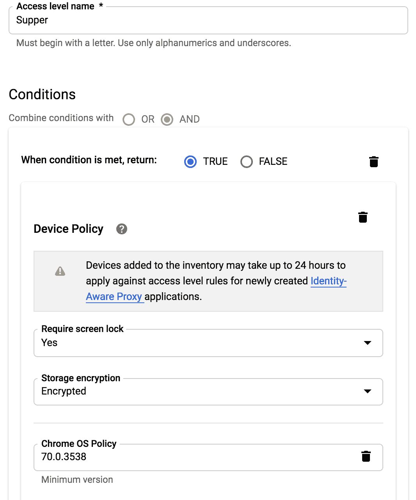

然后它会显示在访问级别列表中，如下所示:

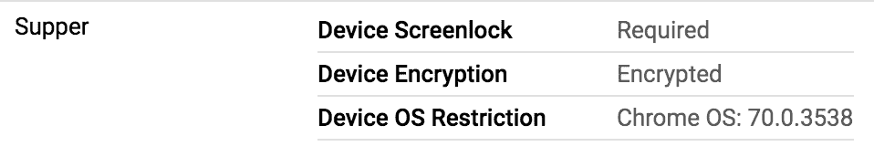

通过 gcloud 实现这一点也很简单，只需创建一个新的 conditions.yaml 文件(可以使用任何您喜欢的名称),其中包含以下约束:

```
- devicePolicy:
     osConstraints:
       - osType: DESKTOP_CHROME_OS
       minimumVersion: 70.0.3538
     requireScreelock: true
     allowedEncryptionStatuses: ENCRYPTED
```

保存后，您可以在命令行上创建新的访问级别:

```
gcloud beta access-context-manager levels create Supper \
   — title SupperGuestsOnly \
   — basic-level-spec conditions.yaml \
   — policy=EatAndRunPolicy
```

# 用 IAP 连接点

一旦团队设置了他们的访问级别，在本例中为低、中、高安全性访问设置了早餐、午餐和晚餐，他们就可以使用 IAP 中的这些级别来限制访问。现在，IAP 正在检查身份和上下文，以决定给定的请求是否可以看到这个 App Engine 应用程序。

访问级别显示在访问上下文管理器中

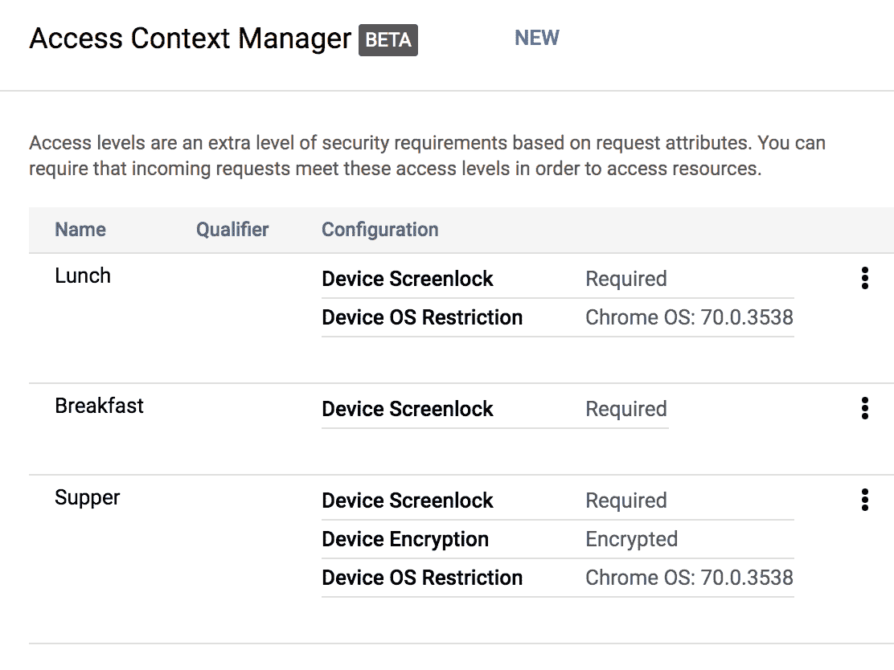

在身份识别代理中，为应用程序激活后，可以选择身份列表和访问上下文。

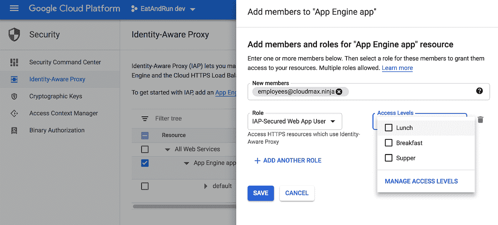

这是一个新承包商在没有设置屏幕锁定的情况下尝试访问应用程序时看到的情况(所以甚至在早餐时也没有)

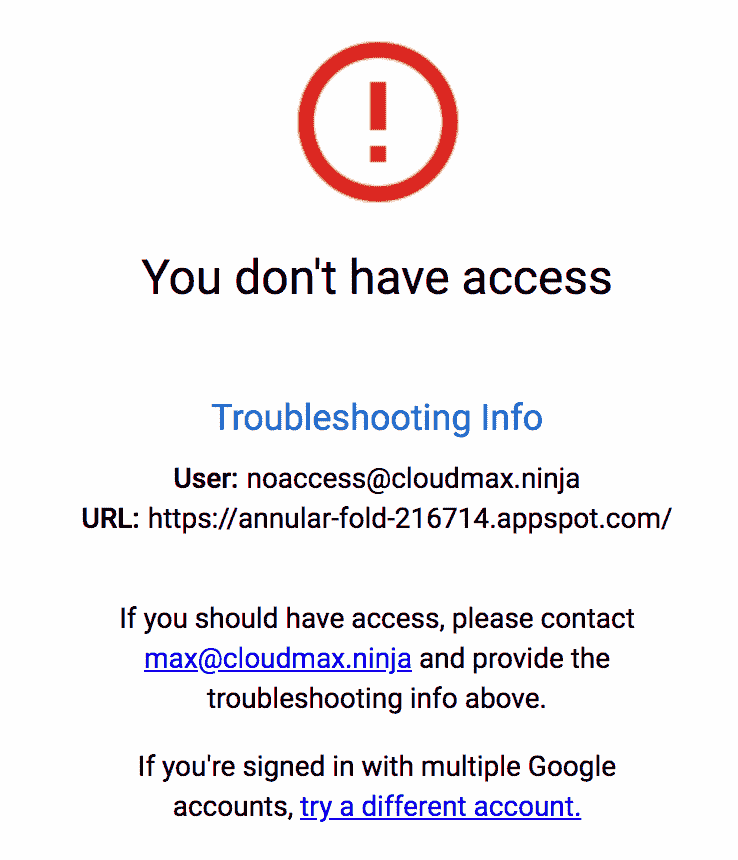

# 更进一步

使用访问策略和[访问上下文管理器](https://console.cloud.google.com/security/access-level?_ga=2.100436183.-814743227.1538505488)可以做更多的事情，尤其是当您插入端点验证数据时。尝试[制定一个新的访问策略](https://cloud.google.com/access-context-manager/docs/create-access-level#device-example)和访问级别，然后让我知道你希望在未来触发的其他条件；随着我们获得反馈，这一功能会不断发展。