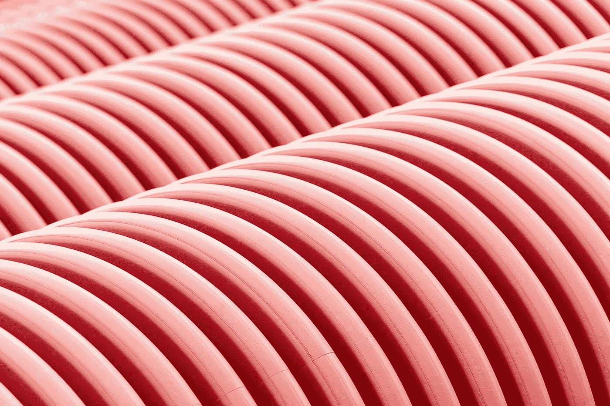

# 如何为你的 Vertex AI 机器学习管道实现 CI/CD

> 原文：<https://medium.com/google-cloud/how-to-implement-ci-cd-for-your-vertex-ai-pipeline-27963bead8bd?source=collection_archive---------0----------------------->

## 自动部署和运行您的机器学习管道。真正的深度潜水，一步一步来。

在本文中，我们将介绍顶点人工智能管道是如何调度的，并对其内部工作方式有一个深入的了解。我们使用这些知识来实现机器学习管道的自动部署。

