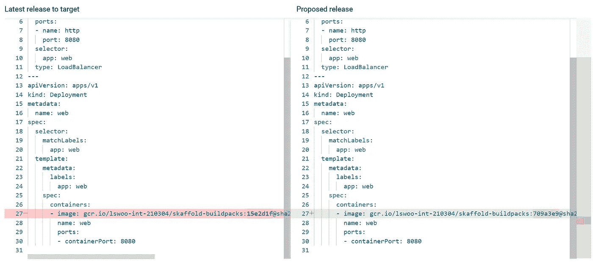

# 如何用 Google Cloud Deploy & Gitlab 实现 CI/CD 管道

> 原文：<https://medium.com/google-cloud/how-to-implement-ci-cd-pipeline-with-google-cloud-deploy-gitlab-2b751f47c946?source=collection_archive---------0----------------------->


# **TL；博士**

Google Cloud Deploy 是 GCP CI/CD 服务的新成员。现在，我们可以只通过谷歌云的服务建立一个可靠而持久的 CI/CD 渠道。让我们来了解一下如何用 Google Cloud Deploy & GitLab 实现 CI/CD 管道！

# Google Cloud Deploy？

Google Cloud Deploy 是 Google Cloud 对 Google Kubernetes 引擎的完全托管 CD 服务。
Cloud Deploy 允许构建可靠、持久的 CI/CD 管道，可以自动化构建、渲染和部署作业。

此外，Cloud Deploy 可以轻松连接到现有的 CI/CD 工具，如 Jenkins、Gitlab CI/CD、Argo CD..很多其他的东西。

本文的目标是了解如何使用带有 GitLab CI/CD 的 Cloud Deploy 实现 CI/CD 管道，git lab CI/CD 是一种流行的 CI/CD 工具，可以帮助用户设计他们的 Devops 架构。

# 首先，制作一些 GKE 环境

运行下面的命令创建 4 个 GKE 环境，我们将在这四个环境中部署我们的清单，用您的项目 ID 值替换 PROJECT_ID。

> gcloud beta container clusters 创建 cluster-dev-zone us-central 1-c-PROJECT = PROJECT _ ID
> g cloud beta container clusters 创建 cluster-QA-zone us-central 1-c-PROJECT = PROJECT _ ID
> g cloud beta container clusters 创建 cluster-stage-zone us-central 1-c-PROJECT = PROJECT _ ID
> g cloud beta container clusters 创建 cluster-prod-zone us-central 1-c-PROJECT = PROJECT _ ID


# 在你的 GitLab 库中放一些源代码


我放了一些 webserver 源代码(main。go，templates)在我的 GitLab 仓库里，带云部署，k8s，。gitlab-ci.yml，skaffold.yaml 文件。您可以将任何可以构建到容器映像的代码放入您的存储库中。

## k8s

web.yaml

```
apiVersion: v1
kind: Service
metadata:
  name: web
spec:
  ports:
  - port: 8080
    name: http
  type: LoadBalancer
  selector:
    app: web
---
apiVersion: apps/v1
kind: Deployment
metadata:
  name: web
spec:
  selector:
    matchLabels:
      app: web
  template:
    metadata:
      labels:
        app: web
    spec:
      containers:
      - name: web
        image: skaffold-buildpacks
        ports:
          - containerPort: 8080
```

我们将用这个清单将一些 Kubernetes 资源部署到我们的 GKE 环境中，这些资源包括一个负载平衡器服务和一个部署。

## 。gitlab-ci.yml

```
stages:          # List of stages for jobs, and their order of execution
  - deploy

deploy-job:      # This job runs in the deploy stage.
  stage: deploy complete successfully.
  script:
    - skaffold config set default-repo gcr.io/PROJECT_ID
    - skaffold build --interactive=false --file-output=artifacts.json 
    - echo "Application successfully built"
    - gcloud beta deploy releases create test-release-rel-$(date +%y%m%d-%s)   --project=PROJECT_ID  --region=us-central1 --delivery-pipeline=cloud-deploy-test --build-artifacts=artifacts.json
    - echo "Application successfully released."
```

我们可以在这个 yaml 清单中使用 GitLab CI/CD 的强大功能。清单由一个“部署”阶段组成，运行一些 skaffold 命令将源代码构建到工件中，并执行“gcloud beta deploy releases create”命令将一个版本注册到 Cloud Deploy。
在使用此清单文件之前，您必须在 GitLab 托管的实例中安装 skaffold、GitLab runner 和 cloud SDK 工具。

## 斯卡福德

```
apiVersion: skaffold/v2beta15
kind: Config
build:
  googleCloudBuild: 
    projectId: PROJECT_ID 
  artifacts: 
  - image: skaffold-buildpacks 
    buildpacks: 
      builder: "gcr.io/buildpacks/builder:v1" 
```

我们使用带有“googleCloudBuild”和“Google Cloud buildpack”技术的远程构建将源代码构建到工件中。使用 buildpack，您可以构建容器映像，而无需繁琐的 Dockerfile 脚本。

## 云部署

clouddeploy.yaml

```
apiVersion: deploy.cloud.google.com/v1beta1
kind: DeliveryPipeline
metadata:
  name: cloud-deploy-test
description: cloud deploy delivery pipeline
serialPipeline:
 stages:
 - targetId: dev
 - targetId: qa
 - targetId: stage
 - targetId: prod

---

apiVersion: deploy.cloud.google.com/v1beta1
kind: Target
metadata:
  name: dev
description: dev cluster
requireApproval: true
gke:
  cluster: projects/PROJECT_ID/locations/us-central1-c/clusters/cluster-dev

---

apiVersion: deploy.cloud.google.com/v1beta1
kind: Target
metadata:
  name: prod
description: prod cluster
requireApproval: true
gke:
  cluster: projects/PROJECT_ID/locations/us-central1-c/clusters/cluster-prod

---

apiVersion: deploy.cloud.google.com/v1beta1
kind: Target
metadata:
  name: qa
description: qa cluster
requireApproval: true
gke:
  cluster: projects/PROJECT_ID/locations/us-central1-c/clusters/cluster-qa

---

apiVersion: deploy.cloud.google.com/v1beta1
kind: Target
metadata:
  name: stage
description: stage cluster
requireApproval: true
gke:
  cluster: projects/PROJECT_ID/locations/us-central1-c/clusters/cluster-stage
```

Cloud Deploy 需要一个包含两种资源的清单文件，即 DeliveryPipeline 和 Target。
“目标”资源是将 GKE 集群环境映射到阶段名称所必需的。
“delivery pipeline”资源使用目标的阶段名来组成订单中的整个串行管道。
您必须在启动 CI/CD 管道流程之前运行以下命令，才能将此清单应用到您的云部署。

```
gcloud beta deploy apply --file=clouddeploy.yaml \
                         --region=us-central1
                         --project=PROJECT_ID
```

# 让我们开始运作吧


在管道运行之前，我的 web 应用程序应该打印一个简单的短语，带有红色的“Hello world！”词。我用绿色的“Hello world！”更改了新的 web 应用程序源代码 word 并把它们推送到我的 GitLab 库。


当我将新代码推送到我的 repo 中时，GitLab CI/CD 就开始运行我的第一个序列化管道阶段，它运行“skaffold build”和“gcloud beta deploy releases create”命令。


在 Cloud deploy 的管道可视化页面中，您可以在 GUI 界面中看到序列化的流程，每个流程代表您的管道阶段。


您可以单击“APPROVE”按钮，批准将这个新版本部署到您的第一个 GKE 环境阶段，即“dev”集群。



在 review 页面上，您还可以将 Kubernetes 清单的当前版本与建议的版本进行比较。


批准后，您可以在开发 GKE 集群中看到 web 应用程序页面的更改版本。
渲染、构建、拉取、部署等所有工作..都是全自动的。开发人员刚刚发布了新版本的代码，运营部门刚刚批准了新版本。这就是我们这条管道所需要的。
剩下的三个阶段(qa、stage、prod)也可以用上面同样的方式进行。

# 结论


该图包含了上述所有 CI/CD 管道阶段。

如果你想在你的云部署中增加一些高级功能，你可以集成其他的 Google 云服务，比如 Pub/sub 用于提醒你的邮件或短信，Operations suite 用于日志、监控和审计。


Cloud Deploy 只是一个“*托管的 Skaffold 服务*，基于 OSS，所以你也可以自己集成各种 CI/CD 工具以及 GitLab CI/CD。

因此，我们有了一个完整的 CI/CD 管道，可以自动化我们所有的持续集成和部署工作！

# 要了解更多信息，

谷歌云平台云部署官方文档:[https://cloud.google.com/deploy/docs/](https://cloud.google.com/deploy/docs/)

# 参考

[](https://cloud.google.com/deploy/docs/deploying-application) [## 部署您的应用|谷歌云部署

### 预览此产品包含在 Google Cloud 服务条款的正式发布前产品条款中。正式上市前的产品…

cloud.google.com](https://cloud.google.com/deploy/docs/deploying-application) [](https://cloud.google.com/deploy/docs/architecture) [## 谷歌云部署服务架构

### 预览此产品包含在 Google Cloud 服务条款的正式发布前产品条款中。正式上市前的产品…

cloud.google.com](https://cloud.google.com/deploy/docs/architecture) [](https://docs.gitlab.com/ee/ci/) [## GitLab CI/CD | GitLab

### GitLab CI/CD 是一个使用连续方法进行软件开发的工具:使用 GitLab CI/CD 来捕获 bug 和…

docs.gitlab.com](https://docs.gitlab.com/ee/ci/)