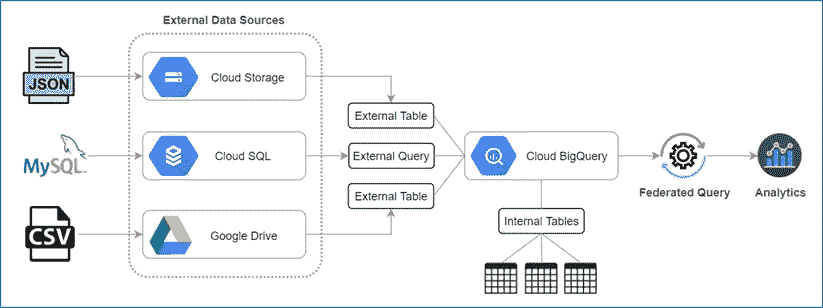

# 如何用 BigQuery 集成外部数据源

> 原文：<https://medium.com/google-cloud/how-to-integrate-external-data-sources-with-bigquery-9e126d5751ea?source=collection_archive---------0----------------------->

## 连接联邦数据源的指导性方法

数据联合是组织采用的一种整体方法，通过从不同的数据源收集信息来托管统一的数据控制点，从而获得有意义的见解。这使组织能够实施集中式存储库来支持分析。

联邦数据源，也称为外部数据源，是一个数据基础，可以用来直接从异构数据位置进行查询，即使数据没有存储在 BigQuery 中。使用这种方法，可以从多个源中以所需的数据格式提取结构化数据，从而避免从源系统复制或传输数据。这篇博客解释了从多个来源查询数据的方法，例如**云存储**、**云 SQL** 和 **Google Drive** 。

## 数据联合架构

数据处理流水线

## 步骤 1:将云存储与 BigQuery 集成

1.  登录谷歌云平台控制台，打开云存储浏览器。
2.  浏览包含源数据的文件的位置。BigQuery 需要新的行分隔的 JSON 文件，每行都用大括号“ **{}** ”和键/值对包围。
3.  使用外部表定义文件创建外部表。在下面的示例中，使用“ **autodetect** ”标志创建表定义文件，以允许 BigQuery 自动识别模式。

## 步骤 2:将云 SQL 与 BigQuery 集成

1.  登录谷歌云平台控制台，打开云 SQL
2.  单击实例 ID 以打开概述页面。
3.  复制“连接名称”-[项目名称]:[区域]:[实例 ID]。
4.  使用“ **bq mk** ”命令在云 SQL 和 BigQuery 之间创建一个外部连接。虽然可以使用云控制台连接到云 SQL，但在下面的示例中，说明了命令行选项。

## 第三步:将 Google Drive 与 BigQuery 集成

1.  登录 Google Drive
2.  浏览要用作外部数据源的逗号分隔值(CSV)文件的位置。
3.  右键单击 CSV 文件，然后单击“获取可共享链接”图标。
4.  复制驱动器 https://drive.google.com/file/d/[格式:**【文件 id】**/查看？usp =分享】。
5.  制定驱动为[https://drive.google.com/open?id=**【文件编号**](https://drive.google.com/open?id=[file-id) 】。
6.  使用外部表定义文件(schema.json)创建外部表。BigQuery " **mk** "命令使用模式定义文件读取表定义，并创建一个指向 Google Drive 的外部表。

## 步骤 4:用于分析的联合查询:

联邦查询提供了一种统一的方法，即使底层数据源是异构的，也可以用一个查询从多个不连续的数据源中检索数据。单个查询通过访问联邦数据源来显示组合数据结构的视图。