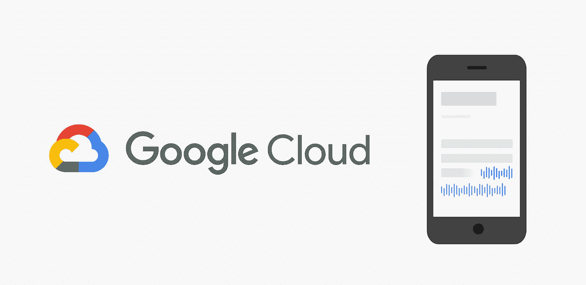
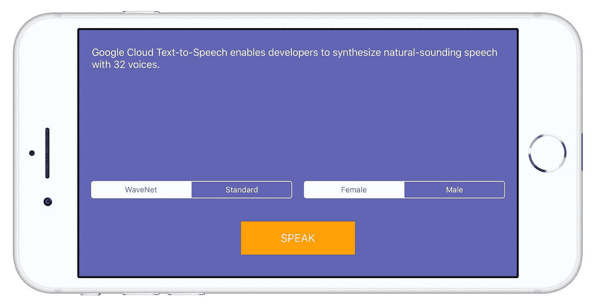

# 如何将谷歌云文本到语音转换 API 集成到你的 iOS 应用中

> 原文：<https://medium.com/google-cloud/how-to-integrate-google-cloud-text-to-speech-api-into-your-ios-app-140ab7be42ae?source=collection_archive---------0----------------------->



谷歌云最近推出了一个新的文本到语音转换 API，拥有 30 多种语音，有多种语言和变体。可用的 WaveNet 语音产生极其自然和流畅的声音，但即使是“基本”的替代声音也令人惊讶地好。你可以在这里阅读全部内容，甚至可以尝试一下。

## 为什么要使用谷歌的云文本到语音转换服务？

如果你正在读这篇文章，你可能已经知道答案了。原因是**超强的音质！**

苹果的 SDK 从 iOS 7 开始就已经提供了文本到语音的功能，而且它非常容易使用，只有 4 行代码。

但相比之下，苹果的音质非常糟糕，**它没有使用 Siri 的声音**，它使用其他机器人发出的声音。即使是用户必须首先下载的“增强”语音，以今天的标准来看，听起来仍然相当糟糕。

# 在进入代码之前

与任何 Google Cloud API 一样，该 API 必须在 Google Cloud 控制台中的项目上启用，并且所有 API 调用都将与该项目相关联。要在 Google Cloud 控制台中设置一个项目，您可以遵循这里描述的所有步骤，除了这个演示应用程序需要 API 密钥而不是服务帐户密钥。

**总结步骤:** 1。在[云控制台](https://console.cloud.google.com/)中创建一个项目(或使用已有的项目)。
2。确保为您的项目启用了[计费](https://console.cloud.google.com/billing?project=_)。
3。启用[文本到语音转换 API](https://console.cloud.google.com/flows/enableapi?apiid=texttospeech.googleapis.com) 。
4。创建一个 [API 密钥](https://console.cloud.google.com/apis/credentials?project=_)。

# 现在到了有趣的部分…代码🙌

我们将创建一个简单的演示应用程序与基本的输入控制。
我们的 app 会有:
1。文本视图—输入我们要转换为音频的文本。
2。分段控制—在不同的声部选项之间切换。
3。语音按钮—启动语音服务。

从[这里](https://drive.google.com/uc?export=download&id=1fl9o5Nafk8-6n1PIsg9pvvWin-v6f1xQ)下载启动项目，解压并打开项目。运行之后，您应该会看到类似这样的内容:



现在让我们将`SpeechService`类添加到我们的项目中。这个类包含了与 Google Cloud 文本到语音转换 API 进行通信所需的所有内容。这个文件中的每一个重要部分都有解释其用途的注释，请务必通读一遍。

在继续之前，确保用在上面的 API 启用步骤中创建的实际 API 密钥替换`<YOUR_API_KEY>`。

您与`SpeechService`类交互的方式非常简单:

```
SpeechService.shared.speak(text: “My text”) {
   // Finished speaking
}
```

现在，最后，让我们在“Speak”按钮按下动作上使用`SpeechService`类。为此，我们需要如下更新`didPressSpeakButton`函数:

现在，运行应用程序并按下“说话”。它开始说话了吗？耶！！！我们刚刚将文本视图文本转换成音频并播放。

那么，下一步是什么？正如你可能注意到的，我们的用户界面有其他我们没有应用的选项。为了能够在不同的声音类别和性别之间切换，并在说话时禁用“说话”按钮，我们需要再次更新`didPressSpeakButton`功能:

最后一次运行应用程序。尝试不同的声音选项(类别和性别)。成功了吗？不错！！！现在你有了自己的个人 [J.A.R.V.I.S.](https://en.wikipedia.org/wiki/Edwin_Jarvis) ！…嗯，也许还没有。

完整的项目可在[这里](https://github.com/acotilla91/Google-TTS-Demo)获得。

# 结论

Google Cloud 文本到语音转换 API 非常易于使用和集成，并且它的音频效果令人印象深刻。但是很明显，所有那些好看的功能都不是免费的，你可以在这里查看定价细节[，我认为是合理的。如果音频质量不是你的应用程序的优先考虑事项，肯定要使用苹果内置的`AVSpeechSynthesizer`，超级容易使用和免费的**。**](https://cloud.google.com/text-to-speech/pricing)

## **就这些了，感谢阅读！下次见！**