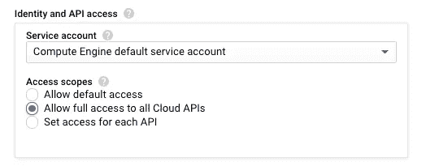
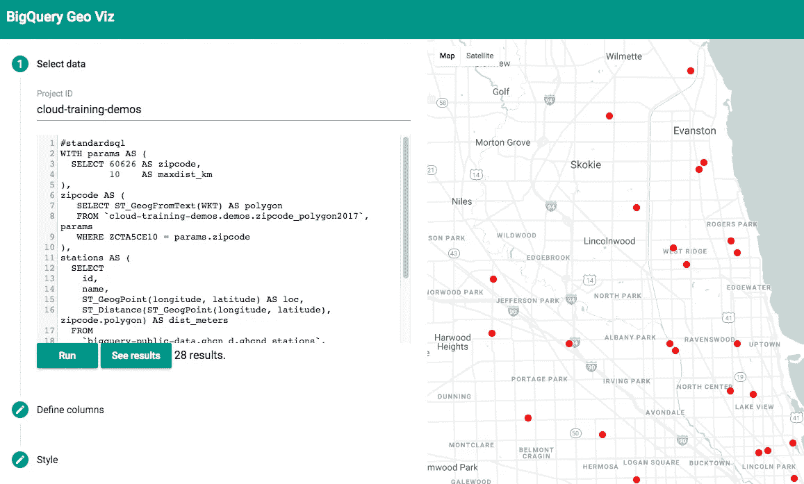
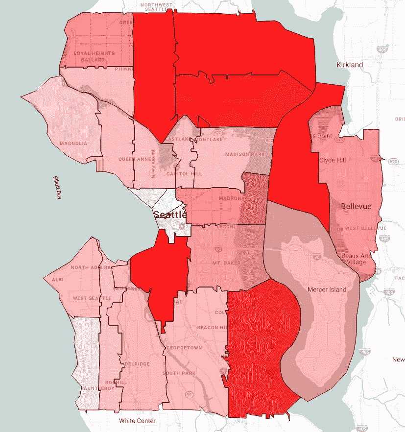

# 如何将 shapefiles 等地理数据加载到 BigQuery 中

> 原文：<https://medium.com/google-cloud/how-to-load-geographic-data-like-zipcode-boundaries-into-bigquery-25e4be4391c8?source=collection_archive---------0----------------------->

既然 BigQuery 支持 GIS 查询，那么让我们看看如何将地理数据加载到 BigQuery 中。我将使用一个上传对应于美国邮政编码的边界多边形的例子。*注意，这只是一个例子 zipcode 多边形在 BigQuery 中已经是一个公共数据集，所以你不用上传数据；你可以简单地使用它。*

每年，人口普查局都会公布他们用于人口普查的[地图边界](https://www.census.gov/geo/maps-data/data/cbf/cbf_zcta.html)。有一个适用于制图的概化集(50 MB)和一个适用于 GIS 分析的详细集(500 MB)。让我们将它们都加载到 BigQuery 中。

什么？为什么邮政编码每年都变？为什么有两个边界文件？嗯……美国的邮政编码实际上不是多边形。相反，它们是邮路的集合，因此边界是可以改变的。此外，因为它们是邮政路线的集合，所以可以绘制无限多的多边形来适应这些邮政路线。

## 1.设置 GCE 虚拟机

启动 Google 计算引擎(GCE)实例。更改虚拟机以访问所有云平台 API:



然后，接受所有缺省值并启动实例。

一旦实例启动，ssh 到 GCE 实例并安装 zip 和 gdal:

```
sudo apt-get install gdal-bin unzip
```

## 2.下载 zip 文件

然后，从人口普查局下载两个文件:

```
curl -O ftp://ftp2.census.gov/geo/tiger/TIGER2017/ZCTA5/tl_2017_us_zcta510.zip
curl -O [http://www2.census.gov/geo/tiger/GENZ2017/shp/cb_2017_us_zcta510_500k.zip](http://www2.census.gov/geo/tiger/GENZ2017/shp/cb_2017_us_zcta510_500k.zip)
```

第一个压缩文件是综合数据(500 MB)，第二个压缩文件是概化多边形数据(50 MB)。

如果第二个 Curl 命令不起作用(http 服务器似乎会周期性地拒绝 http 请求)，您可能需要使用浏览器下载并上传到 VM(可能通过 Google 云存储)。

## 3.展开 zip 文件

```
unzip tl_2017_us_zcta510.zip
unzip [cb_2017_us_zcta510_500k.zip](http://www2.census.gov/geo/tiger/GENZ2017/shp/cb_2017_us_zcta510_500k.zip)
```

## 4.转换为 GeoJSON

这些数据以 shapefiles 的形式发布，这是一种用于 GIS 软件的[“基本上”开放的](https://en.wikipedia.org/wiki/Shapefile)数据格式。BigQuery 理解 GeoJSON，一个开放的标准。所以，我们需要把人口普查局提供的形状文件转换成 GeoJSON。这就是我让您安装 gdal 的原因——它附带了一个名为 ogr2ogr 的有用工具:

```
ogr2ogr -f csv -dialect sqlite -sql "select AsGeoJSON(geometry) AS geom, * from cb_2017_us_zcta510_500k" zipcode_polygon2017.csv cb_2017_us_zcta510_500k.shpogr2ogr -f csv -dialect sqlite -sql "select AsGeoJSON(geometry) AS geom, * from tl_2017_us_zcta510" zipcode_polygon_detailed2017.csv tl_2017_us_zcta510.shp
```

上面的命令将 shapefiles 转换为 CSV 文件中 GeoJSON 编码的地理位置。

**注意**:这篇博文的早期版本推荐创建知名文本(WKT)，但是现在 BigQuery 支持 GeoJSON，最好使用 GeoJSON。原因与如何处理平面几何图形的技术细节有关。

## 5.将 CSV 文件上传到 GCS

因为 CSV 文件相当大，所以多线程上传 Google 云存储并从那里加载到 BigQuery 会更快/更安全:

```
gsutil -m cp *.csv gs://BUCKET/
```

## 6.将数据加载到 BigQuery

在 BigQuery 中创建数据集:

```
bq mk demos
```

使用 bq-load 将数据加载到 BigQuery 中，要求 BigQuery 从 CSV 文件中自动检测模式:

```
bq load --autodetect --replace demos.zipcode_polygon2017 gs://BUCKET/zipcode_polygon2017.csvbq load --autodetect --replace demos.zipcode_polygon_detailed2017 gs://BUCKET/zipcode_polygon_detailed2017.csv
```

## 7.向表格中添加信息

去控制台添加一些关于列的信息是一个好主意。关键因素包括:

```
geom: Polygon geometry of the zipcode
ZCTA: Zipcode tabulation areas (5-digit zipcode)
GEOID: See https://www.census.gov/geo/reference/geoidentifiers.html
ALAND: Land/Water area in square meters
```

## 8.尝试查询

您可以使用 ST_GeogFromGeoJson 将 Json 列解析为多边形，然后对其应用 ST_Distance 和 ST_DWithin 等方法。这是一个查找特定邮政编码 10 公里范围内的气象站的查询:

```
#standardsql
WITH params AS (
  SELECT 60626 AS zipcode,
         10    AS maxdist_km
),zipcode AS (
   **SELECT ST_GeogFromGeoJson(geom) AS polygon** 
   FROM demos.zipcode_polygon2017, params 
   WHERE ZCTA5CE10 = params.zipcode
),stations AS (
  SELECT
    id,
    name,
    ST_GeogPoint(longitude, latitude) AS loc,
    ST_Distance(ST_GeogPoint(longitude, latitude), zipcode.polygon) AS dist_meters
  FROM
    `bigquery-public-data.ghcn_d.ghcnd_stations`,
    params,
    zipcode
  WHERE ST_DWithin(ST_GeogPoint(longitude, latitude), zipcode.polygon, params.maxdist_km*1000)
)SELECT * from stations
ORDER BY dist_meters ASC
LIMIT 100
```

## 9.将 GeoJSON 字符串转换为地理类型

与将面存储为字符串并每次都执行 ST_GeogFromGeoJson 不同，首先将数据存储为地理类型会更有效。我们可以使用 SQL 来做到这一点:

```
CREATE OR REPLACE TABLE demos.us_zipcodes ASSELECT * EXCEPT(geom), **ST_GeogFromGeoJson(geom) AS polygon**
FROM demos.zipcode_polygon2017
```

上面的查询现在变成了:

```
#standardsql
WITH params AS (
  SELECT 60626 AS zipcode,
         10    AS maxdist_km
),zipcode AS (
   **SELECT polygon** 
   FROM **demos.us_zipcodes**, params 
   WHERE ZCTA5CE10 = params.zipcode
),stations AS (
  SELECT
    id,
    name,
    ST_GeogPoint(longitude, latitude) AS loc,
    ST_Distance(ST_GeogPoint(longitude, latitude), zipcode.polygon) AS dist_meters
  FROM
    `bigquery-public-data.ghcn_d.ghcnd_stations`,
    params,
    zipcode
  WHERE ST_DWithin(ST_GeogPoint(longitude, latitude), zipcode.polygon, params.maxdist_km*1000)
)SELECT * from stations
ORDER BY dist_meters ASC
LIMIT 100
```

当我这样做时，这个查询在 6.3 秒内完成(相比之下，在查询本身中执行 ST_GeogFromGeoJson 的查询需要 16.8 秒)。这是近 3 倍的加速！

## 10.可视化地理数据

您可以使用 BigQuery Geo Viz 可视化上述数据。只需运行上面的查询，选择“loc”作为几何列，并根据需要指定基于其他列的样式。这是一个看起来像什么的例子:



芝加哥邮政编码 10 公里范围内的气象站

## 10.使用邮政编码的公共数据集

可视化工具相当酷。这是另一个视觉效果，这次用邮政编码边界加入了公共人口普查数据。该查询是:

```
#standardsql
with zipcodes as (
SELECT
  zip_census.zipcode as zipcode,
  population,
  zcta_geom as geometry
FROM
  `bigquery-public-data.census_bureau_usa.population_by_zip_2010` AS zip_census
  join `bigquery-public-data.geo_us_boundaries.us_zip_codes` as zip_geom
  on zip_census.zipcode = zip_geom.zip_code
WHERE
   gender IS NULL and
   minimum_age is NULL and
   maximum_age is NULL
)
SELECT
  zipcodes.*,
  state_code,
  city,
  county
FROM
  `bigquery-public-data.utility_us.zipcode_area` as zip_area
  join zipcodes on zip_area.zipcode = zipcodes.zipcode
where 
  ST_DWITHIN(geometry, ST_GeogPoint(-122.3321,47.6062), 10000)
```

这是一个图像:



如果您仔细查看表名，您会注意到该表实际上是一个公共数据集，而不是我们刚刚上传的那个。此外，公共数据集将面存储为地理类型，以提供 3 倍的加速。是的，邮政编码多边形信息已经是一个 BigQuery 公共数据集(但本文解释了如何将自己的地理数据上传到 BigQuery)。

尽情享受吧！