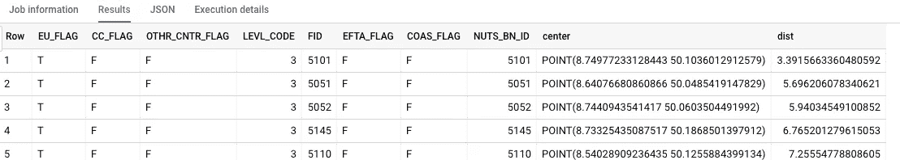

# 如何将 GeoJSON 文件加载到 BigQuery GIS 中

> 原文：<https://medium.com/google-cloud/how-to-load-geojson-files-into-bigquery-gis-9dc009802fb4?source=collection_archive---------0----------------------->

## GeoJSON 到 BigQuery 的 ETL 管道

虽然本教程专门针对欧洲行政区域的 GeoJSON 文件，但我希望您能够将其用作其他数据源的指南。在 [CloudShell](https://console.cloud.google.com/cloudshell) 或任何安装了 Google Cloud SDK 和 Python3 的机器上做这件事。


要查询多边形边界，请将欧洲行政区域的 GeoJSON 加载到 BigQuery 中

首先从[欧盟统计局网站](https://ec.europa.eu/eurostat/web/gisco/geodata/reference-data/administrative-units-statistical-units/nuts#nuts16)下载你感兴趣的文件:

```
wget https://ec.europa.eu/eurostat/cache/GISCO/distribution/v2/nuts/download/ref-nuts-2016-01m.geojson.zip
```

然后，将其解压缩以获得感兴趣的 GeoJSON 文件。

```
mkdir tmp
cd tmp
unzip ../ref-nuts-2016-01m.geojson.zip
```

GeoJSON 文件包含一个几何要素列表和每个几何的一些属性。BigQuery 需要换行符分隔的 JSON 文件，其中几何列是单个字符串。

下面是一个将进行必要转换的 Python 程序(注意，文件名对应于 EPSG::4326 版本—这些是用经度/纬度坐标表示的版本):

下面是 JSON 文件中的一行代码:

```
{"geometry": "{\"type\": \"LineString\", \"coordinates\": [[25.4907, 35.29833], [25.49187, 35.28897], [25.50206, 35.28633], [25.50528, 35.273], [25.49648, 35.2621], [25.49437, 35.24823], [25.49879, 35.24146], [25.51013, 35.23245], [25.51199, 35.22759], [25.49429, 35.22849], [25.47941, 35.22515], [25.47122, 35.21485], [25.46806, 35.21088], [25.4512, 35.20152], [25.43949, 35.20199], [25.42395, 35.21019], [25.41463, 35.20585], [25.41267, 35.20494], [25.41331, 35.19424], [25.41463, 35.19189], [25.41792, 35.18603], [25.41463, 35.18273], [25.39944, 35.16751], [25.40761, 35.15651], [25.41199, 35.15531], [25.40992, 35.13521], [25.41463, 35.13308], [25.42063, 35.13035], [25.42306, 35.12754], [25.42105, 35.11549], [25.4345, 35.11028], [25.44723, 35.11027], [25.46348, 35.09302], [25.47211, 35.08832], [25.50064, 35.08005], [25.5182, 35.0656], [25.50834, 35.05567], [25.49872, 35.05048], [25.49786, 35.0427], [25.50702, 35.03823], [25.52577, 35.03663], [25.52902, 35.02909], [25.53016, 35.02644], [25.54641, 35.01885], [25.54925, 35.00995], [25.54713, 34.99973], [25.55057, 34.99076]]}", "EU_FLAG": "T", "CC_FLAG": "F", "OTHR_CNTR_FLAG": "F", "LEVL_CODE": 3, "FID": 102, "EFTA_FLAG": "F", "COAS_FLAG": "F", "NUTS_BN_ID": 102}
```

程序打印的结果模式是:

```
geometry:GEOGRAPHY,EU_FLAG,CC_FLAG,OTHR_CNTR_FLAG,LEVL_CODE:int64,FID:int64,EFTA_FLAG,COAS_FLAG,NUTS_BN_ID:int64
```

现在，将新行分隔的 JSON 加载到 BigQuery 中(适当地更改数据集和表名):

```
bq load --source_format NEWLINE_DELIMITED_JSON advdata.eurostat to_load.json geometry:GEOGRAPHY,EU_FLAG,CC_FLAG,OTHR_CNTR_FLAG,LEVL_CODE:int64,FID:int64,EFTA_FLAG,COAS_FLAG,NUTS_BN_ID:int64
```

就是这样！尝试一个查询，根据多边形与德国法兰克福的距离对其进行排序:

```
SELECT 
  * EXCEPT(geometry)
  , ST_Centroid(geometry) AS center
  , ST_Distance(geometry, ST_GeogPoint(8.68, 50.11))/1000 AS dist
FROM advdata.eurostat
ORDER by dist ASC
LIMIT 5
```

这将返回:



尽情享受吧！