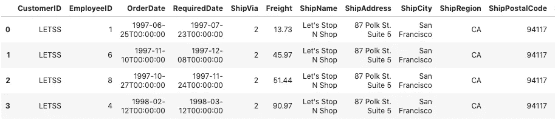

# 如何使用 Python 数据流将 XML 数据加载到 BigQuery 中

> 原文：<https://medium.com/google-cloud/how-to-load-xml-data-into-bigquery-using-python-dataflow-fd1580e4af48?source=collection_archive---------1----------------------->

## 将 XML 解析成 Python 字典，并使用 Apache Beam 的 BigQueryIO

如果你的数据在 Avro，JSON，Parquet 等。将其加载到 BigQuery 中就像运行联邦查询或使用 bq load 一样简单。但是如果您的数据是 XML 格式的呢？


本文的代码在 GitHub 上的《BigQuery:权威指南》一书中。

## 输入 XML 文档

假设数据存在于一个名为 orders.xml 的文件中，该文件包含一个订单示例文档(该示例摘自[微软的 XSD 文档](https://docs.microsoft.com/en-us/dotnet/csharp/programming-guide/concepts/linq/sample-xsd-file-customers-and-orders1)):

```
<Root>
<Orders>  
    <Order>  
      <CustomerID>GREAL</CustomerID>  
      <EmployeeID>6</EmployeeID>  
      <OrderDate>1997-05-06T00:00:00</OrderDate>  
      <RequiredDate>1997-05-20T00:00:00</RequiredDate>  
      <ShipInfo ShippedDate="1997-05-09T00:00:00">  
        <ShipVia>2</ShipVia>  
        <Freight>3.35</Freight>  
        <ShipName>Great Lakes Food Market</ShipName>  
        <ShipAddress>2732 Baker Blvd.</ShipAddress>  
        <ShipCity>Eugene</ShipCity>  
        <ShipRegion>OR</ShipRegion>  
        <ShipPostalCode>97403</ShipPostalCode>  
        <ShipCountry>USA</ShipCountry>  
      </ShipInfo>  
    </Order>
    <Order>
    ...
</Orders>
</Root>
```

## 解析成 Python 字典

为了将它解析到 Python 字典中，我们将使用一个名为 xmltodict 的 Python 包:

```
def parse_into_dict(xmlfile):
    import xmltodict
    with open(xmlfile) as ifp:
        doc = xmltodict.parse(ifp.read())
        return doc
```

考虑到这一点，我们可以简单地遵从项目来获取值。例如，要获得第一个订单，我们需要:

```
doc = parse_into_dict('orders.xml')
doc['Root']['Orders']['Order'][0] # first order
```

## 指定架构

在 BigQuery 中指定输出表的模式。该表将包含订单信息，因此我们只需表示订单的结构。因为 xmltodict 创建 OrderedDict，所以保持元素在订单的 XML 表示中出现的准确顺序非常重要:

```
table_schema = {
    'fields': [
        {'name' : **'CustomerID'**, 'type': 'STRING', 'mode': 'NULLABLE'},
        {'name' : **'EmployeeID'**, 'type': 'STRING', 'mode': 'NULLABLE'},
        {'name' : 'OrderDate', 'type': 'STRING', 'mode': 'NULLABLE'},
        {'name' : 'RequiredDate', 'type': 'STRING', 'mode': 'NULLABLE'},
        **{'name' : 'ShipInfo', 'type': 'RECORD',** 'mode': 'NULLABLE', 'fields': [
            {'name' : 'ShipVia', 'type': 'STRING', 'mode': 'NULLABLE'},
            {'name' : 'Freight', 'type': 'STRING', 'mode': 'NULLABLE'},
            {'name' : 'ShipName', 'type': 'STRING', 'mode': 'NULLABLE'},
            {'name' : 'ShipAddress', 'type': 'STRING', 'mode': 'NULLABLE'},
            {'name' : 'ShipCity', 'type': 'STRING', 'mode': 'NULLABLE'},
            {'name' : 'ShipRegion', 'type': 'STRING', 'mode': 'NULLABLE'},
            {'name' : 'ShipPostalCode', 'type': 'STRING', 'mode': 'NULLABLE'},
            {'name' : 'ShipCountry', 'type': 'STRING', 'mode': 'NULLABLE'},
            {'name' : '**ShippedDate**', 'type': 'STRING', 'mode': 'NULLABLE'},
        ]},
    ]
}
```

需要注意一些事情:

*   像 CustomerID、EmployeeID 等字段。被定义为基本字段。
*   示例文档将 EmployeeID 存储为 <employeeid>3</employeeid> ，因此，xmltodict 将其视为文本字段。因此，我们必须将其定义为字符串。
*   ShipInfo 有子元素，所以我们在 BigQuery 中让它成为一个记录(struct)
*   属性 ShippedDate 位于所有子元素的最后。xmltodict 实际上将这些存储为\@ShippedDate，但是@符号不是合法的 BigQuery 列名，因此我们必须对其进行清理以删除该符号:

```
def cleanup(x):
    import copy
    y = copy.deepcopy(x)
    if '[@ShippedDate](http://twitter.com/ShippedDate)' in x['ShipInfo']: # optional attribute
        y['ShipInfo']['ShippedDate'] = x['ShipInfo']['[@ShippedDate](http://twitter.com/ShippedDate)']
        del y['ShipInfo']['[@ShippedDate](http://twitter.com/ShippedDate)']
    return y
```

给定 XML 文档，我们可以使用以下方法逐个获取订单:

```
def get_orders(doc):
    for order in doc['Root']['Orders']['Order']:
        yield cleanup(order)
```

## 波束管道

将所有这些放在一起，获取 XML 文件并使用它来填充 BigQuery 表的 Beam 管道是:

```
with beam.Pipeline(argv=pipeline_args) as p:
        orders = (p 
             | 'files' >> beam.Create(['orders.xml'])
             | 'parse' >> beam.Map(lambda filename: **parse_into_dict**(filename))
             | 'orders' >> beam.FlatMap(lambda doc: **get_orders**(doc)))
             | 'tobq' >> beam.io.**WriteToBigQuery**(known_args.output,
    **schema=table_schema**,                  
    write_disposition=beam.io.BigQueryDisposition.WRITE_APPEND, 
    create_disposition=beam.io.BigQueryDisposition.CREATE_IF_NEEDED)
```

## 输出 BigQuery 表

当 Beam 作业运行时(无论是在本地还是在数据流中)，表被填充，您可以查询它。例如:

```
SELECT * EXCEPT(ShipInfo), ShipInfo.* 
FROM advdata.fromxml 
WHERE CustomerID = 'LETSS'
```

给了我们:



## 后续步骤

1.  在 AI 平台笔记本中尝试[完整代码(可在 GitHub](https://github.com/GoogleCloudPlatform/bigquery-oreilly-book/blob/master/blogs/xmlload/xmlload.ipynb) 中获得)。
2.  将 *- runner DataflowRunner* 添加到代码中，以在数据流中运行它
3.  要了解更多关于将数据加载到 BigQuery 的信息，请阅读《BigQuery:权威指南》的第 4 章。这本书会定期更新这些博客文章，以保持权威性。

尽情享受吧！