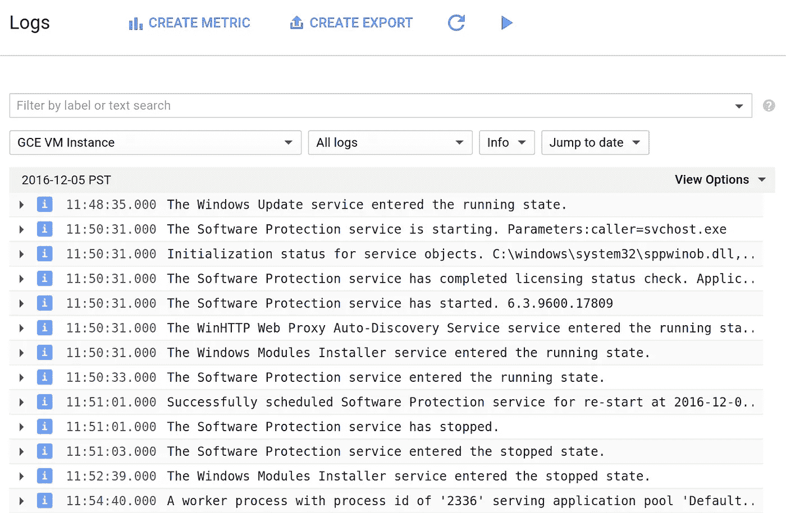
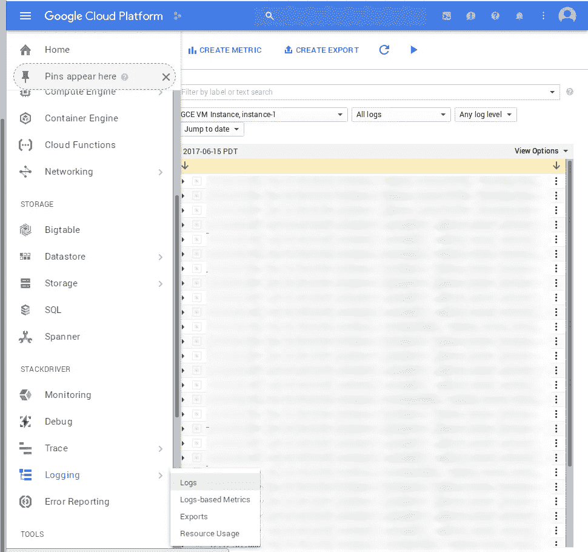

# 如何在 Google 计算引擎上登录您的应用程序

> 原文：<https://medium.com/google-cloud/how-to-log-your-application-on-google-compute-engine-6600d81e70e3?source=collection_archive---------0----------------------->

我有一个运行在 Google 计算引擎实例上的自定义守护进程，我想以某种方式让它的日志进入一个更好的界面。某种方法来记录日志，而不必一直 ssh 到实例中。

我花了一点时间搜索和拼凑，才弄明白如何做到这一点，所以我想我应该分享一下所涉及的内容。

第一部分是 Stackdriver 日志。这是作为谷歌云平台的一部分提供的服务:



堆叠驱动测井

它为您记录的事件提供了一个相当好的界面。您可以从 Google Cloud 控制台进入日志->日志:



很好，那么我们如何将应用程序的日志放入这里呢？首先，您需要在计算引擎实例上安装日志代理。这超级简单，只要按照这里的安装说明:[https://cloud.google.com/logging/docs/agent/installation](https://cloud.google.com/logging/docs/agent/installation)

仅供参考:fluentd 在我的实例上使用了大约 300MB 的内存。

安装完成后，我们需要添加一个定制的 fluentd 配置。有了这个配置，fluentd 将查看我们的日志文件，并为我们将事件馈送到 Stackdriver 日志中。以下是我最终使用的配置之一:

```
<source>
 type tail
 format none
 path /home/bitcoin/data/debug.log
 pos_file /var/lib/google-fluentd/pos/bitcoind.pos
 read_from_head true
 tag bitcoind
</source>
```

此配置捕获 bitcoind 的日志。它告诉 fluentd 像读`tail -f` 一样读`/home/bitcoin/data/debug.log`。它应该跟踪它停止的地方，所以重新启动后，它会继续正常运行。行`read_from_head true`告诉 fluentd，当第一次读取文件时，从头开始。如果您的日志中已经有内容，并且希望 fluentd“跟上”,这将非常有用。由于位置跟踪，这应该只在 fluentd 第一次读取文件时有关系。fluentd 以 root 身份运行，所以我不需要对`debug.log`上的权限做任何特殊的事情。

将该配置文件写入`/etc/google-fluentd/config.d/bitcoind.conf`，或者随意命名。然后调用`sudo service google-fluentd reload`。应该就是这样！fluentd 将查看日志并将条目转储到 Stackdriver 中。

如果您返回到 Stackdriver 日志记录，您应该能够调出您的实例的日志，并看到您的应用程序的所有日志。不错！

请注意，默认情况下，fluentd 似乎会在安装后自动捕获您的系统日志。因此，如果您已经设置了您的应用程序来记录 syslog，您就不需要做上面的任何配置。在我的例子中，我使用 systemd 设置了另一个守护进程，所以我只在它的`.service`文件中设置了`StandardOutput=journal`，它将其 stdout 通过管道传输到 syslog。`systemd`在日志条目前添加服务名，这样很容易在 Stackdriver 中过滤。

伐木快乐！