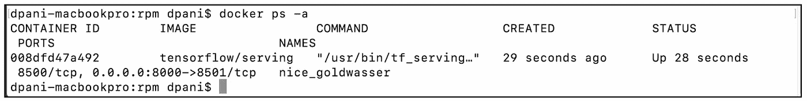
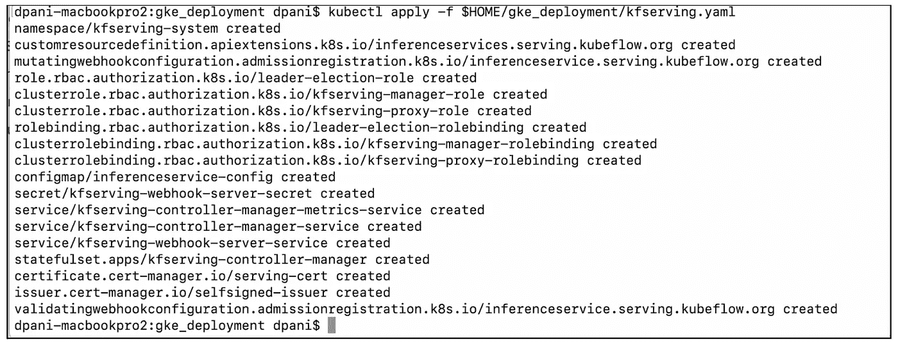

# 如何从 Google Cloud Kubernetes 引擎上运行的容器 app(web，Spark)在 KFServing 上做出 ML 模型推断？

> 原文：<https://medium.com/google-cloud/how-to-make-an-ml-model-inference-on-kfserving-from-container-apps-web-spark-running-on-google-c50ca849c9f0?source=collection_archive---------0----------------------->

比方说，您有一个运行在 [Kubernetes](https://kubernetes.io/) 平台上的电子商务应用程序和/或大数据应用程序(如 Apache Spark )(一个用于自动化部署、扩展和管理容器化应用程序的开源容器编排系统)。现在，您需要在现有的 Kubernetes 基础架构中使用您已建立的 DevOps 实践来服务预训练的机器学习模型。本解决方案指南探索了一种自以为是的方法，使用您已建立的 DevOps 实践在这个 Kubernetes 基础架构上服务于机器学习(ML)模型。该指南涵盖以下主题:

*   开发一个 web 应用程序和一个 [Apache Spark](https://spark.apache.org/) 应用程序，并在本地开发环境中测试它们。
*   提供一个 GKE 环境来部署和测试执行 ML 模型推理的应用程序。
*   在[Google Kubernetes Engine](https://cloud.google.com/kubernetes-engine)(GKE)上托管的 [KFServing](https://github.com/kubeflow/kfserving) (无服务器模型推理平台)上部署一个预先训练好的 [TensorFlow](https://www.tensorflow.org/) (一个端到端 ML 框架)模型——这是一个在 Google Cloud 上完全托管的 Kubernetes 容器编排服务。

为什么[谷歌 Kubernetes 引擎](https://cloud.google.com/kubernetes-engine) (GKE)？

GKE 是一个全面管理的 Kubernetes 即服务，它提供集群自动扩展、自动修复、工作负载和网络安全、集成日志记录和监控、内置仪表板、GPU 和 TPU 支持、通过 [GKE 沙箱](https://cloud.google.com/kubernetes-engine/docs/concepts/sandbox-pods)的容器隔离等等。。请查看[文档](https://cloud.google.com/kubernetes-engine#all-features)以获取最新功能的详细列表。

为什么 [KFServing](https://github.com/kubeflow/kfserving) ？

KFServing 使用[容器](https://www.docker.com/resources/what-container)作为底层基础设施，支持 Kubernetes 上的无服务器推理。它抽象了不同的 ML 框架，如 TensorFlow、PyTorch 和 XGBoost。它支持自动缩放、缩放到零、金丝雀展开、GPU 等等。

# 开发和部署解决方案的逐步方法

您可以继续使用现有的 CI/CD 基础架构和 DevOps 实践来构建解决方案。您的 Web 应用程序和 Spark 作业可以在同一个 Kubernetes 集群中对 ML 模型推理应用程序(运行在 KFServing 中)进行低延迟调用。)您可以根据自己的性能需求，为 web 应用程序、spark 应用程序和 ML 模型推理应用程序的底层 kubernetes 节点选择不同的机器类型。例如，您可以为 ML 模型推理应用程序使用 CPU 优化或内存优化的机器类型，为 web 应用程序使用 [E 机器类型](https://cloud.google.com/compute/docs/machine-types#e2_machine_types)，为 Spark 应用程序使用 [N2 机器类型](https://cloud.google.com/compute/docs/machine-types#n2_machine_types)。

下面的部署架构是该解决方案的可视化表示:


下面的序列图显示了 web 应用程序和 ml 模型推理端点之间的交互:


下面的序列图显示了 Spark 应用程序和 ml 模型推理端点之间的交互:


该解决方案使用以下环境:

1.  开发环境—Mac(您将使用的命令已经在 Mac 上测试过。)你可以使用[谷歌计算引擎](https://cloud.google.com/compute)(高性能虚拟机)或[谷歌数据处理器](https://cloud.google.com/dataproc)(一个托管的 Hadoop 和 Spark 集群)
2.  在本地开发和单元测试所有的容器化应用程序。在 GKE 进行集成测试。
3.  使用 [Google Cloud SDK](https://cloud.google.com/sdk) (gcloud 和 gsutil 命令行工具)与 Google 云服务进行交互。
4.  [谷歌云](https://cloud.google.com/)环境

该解决方案使用谷歌云的以下付费组件:

*   [谷歌云 Kubernetes 引擎](https://cloud.google.com/kubernetes-engine)
*   [谷歌云存储](https://cloud.google.com/storage)
*   谷歌[容器注册表](https://cloud.google.com/container-registry)
*   [谷歌云运行](https://cloud.google.com/run)
*   谷歌[云日志](https://cloud.google.com/logging)

web 应用程序将使用 Java，spark 应用程序将使用 Scala。您将在 [git 存储库](https://github.com/dpanigra/solutions/tree/main/ml_inference)中找到所有代码、构建文件、命令、输入文件、预训练模型、应用程序 war 文件和 spark 应用程序 jar 文件。

该解决方案需要以下步骤:

1.  [确定一个预先训练好的机器学习模型](/@dpani/how-to-make-an-ml-model-inference-on-kfserving-from-container-apps-web-spark-running-on-google-c50ca849c9f0#746b)
2.  [在开发环境中检查模型的签名](/@dpani/how-to-make-an-ml-model-inference-on-kfserving-from-container-apps-web-spark-running-on-google-c50ca849c9f0#d845)
3.  [创建一个输入数据集，用于测试 Spark 应用程序](/@dpani/how-to-make-an-ml-model-inference-on-kfserving-from-container-apps-web-spark-running-on-google-c50ca849c9f0#c2c3)
4.  [在](/@dpani/how-to-make-an-ml-model-inference-on-kfserving-from-container-apps-web-spark-running-on-google-c50ca849c9f0#c9d3) [TensorFlow Serving](https://www.tensorflow.org/tfx/serving/docker) 中部署模型，用于开发环境中的模型推理
5.  [在开发环境中开发和测试 Web 应用](/@dpani/how-to-make-an-ml-model-inference-on-kfserving-from-container-apps-web-spark-running-on-google-c50ca849c9f0#4b05)
6.  [创建 web 应用程序的容器，并在开发环境中进行测试。](/@dpani/how-to-make-an-ml-model-inference-on-kfserving-from-container-apps-web-spark-running-on-google-c50ca849c9f0 #d3ff)推送到 Google [容器注册表](https://cloud.google.com/container-registry)
7.  [在开发环境中开发和测试 Spark 应用](/@dpani/how-to-make-an-ml-model-inference-on-kfserving-from-container-apps-web-spark-running-on-google-c50ca849c9f0#2c93)
8.  [构建 Spark 图像并将](/@dpani/how-to-make-an-ml-model-inference-on-kfserving-from-container-apps-web-spark-running-on-google-c50ca849c9f0#ba5f)图像推送到 Google [容器注册表](https://cloud.google.com/container-registry)
9.  [提供一个谷歌 Kubernetes 引擎(GKE)集群](/@dpani/how-to-make-an-ml-model-inference-on-kfserving-from-container-apps-web-spark-running-on-google-c50ca849c9f0#8ef0)
10.  [在 GKE 部署 Web 应用](/@dpani/how-to-make-an-ml-model-inference-on-kfserving-from-container-apps-web-spark-running-on-google-c50ca849c9f0#c96d)
11.  [在 GKE 部署 KFServing 并测试样本 TensorFlow flowers 模型](/@dpani/how-to-make-an-ml-model-inference-on-kfserving-from-container-apps-web-spark-running-on-google-c50ca849c9f0#f63e)
12.  [在 GKE 部署 rpm 模型并测试模型推断](/@dpani/how-to-make-an-ml-model-inference-on-kfserving-from-container-apps-web-spark-running-on-google-c50ca849c9f0#eb9b)
13.  [测试在 GKE 上运行的 Spark 应用程序和 Web 应用程序](/@dpani/how-to-make-an-ml-model-inference-on-kfserving-from-container-apps-web-spark-running-on-google-c50ca849c9f0#9299)
14.  [在谷歌云日志中监控 GKE 的应用日志](/@dpani/how-to-make-an-ml-model-inference-on-kfserving-from-container-apps-web-spark-running-on-google-c50ca849c9f0#ff6d)
15.  *在开发环境中安装所有必要的软件*

请参考 git repository commands.txt 获取完整的说明，包括构建解决方案时将使用的变量和工作目录。

# 识别预训练的机器学习模型

第一步是从您现有的 ML Ops 渠道中收集一个预先训练好的 ML 模型。你当然可以使用相同的 GKE 基础设施来为你所有的机器学习模型训练、测试和验证提供一个集中的开发和操作平台。ML 和模型训练通常是资源密集型过程，这使得它难以在本地机器上运行。Kubernetes 利用分布式计算来提供所需的额外资源。你可以使用[kube flow](https://www.kubeflow.org/docs/about/kubeflow/)(Kubernetes 的机器学习工具包)或者你可以根据你的需要有选择地只使用管道框架 [Kubeflow Pipelines](https://www.kubeflow.org/docs/pipelines/overview/pipelines-overview/) 。对于当前解决方案，您将使用在“[如何使用 BigQuery ML 和 Kubeflow 管道](/@dpani/how-to-build-an-end-to-end-propensity-to-purchase-solution-using-bigquery-ml-and-kubeflow-pipelines-cd4161f734d9)构建端到端购买倾向解决方案”中创建的预训练模型。

这里简单介绍一下“[如何使用 BigQuery ML 和 Kubeflow Pipelines 构建端到端购买倾向解决方案](/@dpani/how-to-build-an-end-to-end-propensity-to-purchase-solution-using-bigquery-ml-and-kubeflow-pipelines-cd4161f734d9)”解决方案:购买倾向用例广泛适用于零售、金融等多个垂直行业。该解决方案向您展示了如何使用[Google Cloud big query ML](https://cloud.google.com/bigquery-ml/docs)(BQML)[Google Cloud AI Platform Prediction](https://cloud.google.com/ai-platform/prediction/docs)和 [Kubeflow Pipelines](https://www.kubeflow.org/docs/pipelines/overview/pipelines-overview/) (KFP)构建端到端解决方案(固执己见)，使用 [Google Analytics 数据集](https://console.cloud.google.com/marketplace/details/obfuscated-ga360-data/obfuscated-ga360-data?filter=solution-type:dataset)来确定**哪些客户有购买倾向**。固执己见的解决方案在开发管道组件时，特别结合了一些 [SDLC](https://en.wikipedia.org/wiki/Systems_development_life_cycle) 的最佳实践。您可以使用该解决方案通过电子邮件或邮政渠道在离线活动中接触到您的目标客户。当客户在您的网站上浏览您的产品时，您也可以通过当场决策在在线活动中使用它，向客户推荐一些产品或触发个性化电子邮件。

如果您还没有构建模型，那么您现在就可以这样做，或者您可以使用我们在 git 存储库中提供的模型。这是一个张量流模型。BQML 将模型导出到一个 [Google 云存储](https://cloud.google.com/storage)桶中。在本解决方案的剩余部分，您将使用零售倾向模型(rpm)。

# 在开发环境中检查模型的签名

在识别模型之后，您需要理解模型的输入和输出参数。您可以从模型开发人员那里收集信息，也可以自己检查模型。在当前解决方案中，您将执行后者。您将使用参数知识在您的应用程序(web 应用程序和 Spark 应用程序)中使用它们，创建适当的输入数据集，并组成 json 数据有效负载来测试 rpm 模型推断。

在本节中，您需要执行以下操作:

*   安装 saved_model_cli 工具来检查 TensorFlow rpm 模型
*   下载 rpm 工件
*   检查 rpm 保存的模型[签名](https://www.tensorflow.org/tfx/serving/signature_defs)

# 安装工具以检查张量流模型

您可以通过两种方式安装工具 saved_model_cli:安装 tensorflow 包或从源代码构建工具。您将在您的开发环境中执行前者。如果您只想使用该工具而不是 tensorflow 包，您可以在 git repo 中找到使用 blaze 构建的命令。

以下命令将安装 saved_model_cli 工具:

下面是最后一个命令的输出:


以上输出显示您使用的是 saved_model_cli 版本 0.1.0。如果您有不同的版本，应该不会有问题。但是要注意模型导出的结构和格式。

# 从 Google 云存储中下载 rpm 工件

您现在将下载 BQML 导出到[云存储](https://cloud.google.com/storage)的 TensorFlow 模型。您已经在之前的解决方案“[如何使用 BigQuery ML 和 Kubeflow Pipelines](/@dpani/how-to-build-an-end-to-end-propensity-to-purchase-solution-using-bigquery-ml-and-kubeflow-pipelines-cd4161f734d9) 构建端到端购买倾向解决方案”中创建了模型。或者，您可以使用 git 存储库中可用的模型。

下面是上述 gsutil 命令的输出:


强制文件是 saved_model.pb、variables.data-0000-of-00001 和 variable.index。您可以忽略之前为之前的解决方案创建的 eval_details.txt 和 train_detail.txt，以便保留 rpm 模型的不同版本。稍后您将删除它们。

# 检查 rpm 保存的模型签名定义

您将使用 saved_model_cli 工具来理解模型的输入和输出参数(SignatureDef。)

以下命令将打印 rpm 保存模型的签名定义:

```
# prints the inputs and the outputs of the rpm saved model
$PATH_TO_SAVED_MODEL_CLI/saved_model_cli show \
  --dir $HOME/rpm/$RPM_MODEL_VER/ \
  --all
```

下面是上述命令的输出:


rpm 模型期望“反弹”和“现场时间”作为输入。该模型然后返回三个输出参数，即“预测购买返回访问”、“购买返回访问预测”和“购买返回访问预测值”。

# 创建用于测试应用程序的输入数据集

您需要基于 rpm 模型的 SignatureDef 创建一个输入数据集，您将使用它来测试 Spark 应用程序。您将在 git 存储库中找到样本数据集。稍后，当您准备在开发和 GKE 环境中测试 Spark 应用程序时，您将使用该数据集。

您将创建包含以下信息的文件:

*   fullVisitorId

您将忽略 fullVisitorId 列。你可以把它作为一把钥匙，将[购买倾向预测](/@dpani/how-to-build-an-end-to-end-propensity-to-purchase-solution-using-bigquery-ml-and-kubeflow-pipelines-cd4161f734d9)与客户关系管理(CRM)系统数据(如电子邮件地址)整合起来，使客户拓展更加容易。有关此类整合的示例，请参见 [Salesforce 营销云受众整合](https://support.google.com/analytics/answer/9250031?hl=en)。本文介绍了如何将 Google Analytics 360 与 Salesforce 营销云集成，以便您可以在 Salesforce 电子邮件和 SMS 直接营销活动中使用 Analytics 360 受众。

*   *弹跳*

我们的 rpm 模型需要这个作为输入参数。

*   *现场时间*

我们的 rpm 模型需要这个作为输入参数。

*   *威尔 _ 买 _ 上 _ 回 _ 访*

您可以用这个来比较我们的模型推理是如何执行的。您正在使用一个测试数据集，但是在生产中，您不会事先知道这个值，因为 ml 模型将为我们预测这个值。模型性能优化超出了当前解决方案指南的范围。

以下命令将打印样本数据集:

以下命令将打印 rpm 保存模型的签名定义:

```
# Refer to the commands.txt for detailed commands in the “4\. input file to test the Spark application” section
# peek the input csv file
head -n 3 $HOME/sparkjob/rpm-hdfs-input.csv
```

下面是上述命令的输出:


# 在 TensorFlow 中部署模型，用于开发环境中的模型推理

您将在 TensorFlow Serving (TFServing)中部署 rpm 模型以获得一个端点。您将使用端点来检查请求/响应是如何工作的，并在开发环境中对应用程序(web 应用程序和 Spark 应用程序)进行单元测试。

" [TensorFlow Serving](https://www.tensorflow.org/tfx/serving/architecture) 是一个灵活、高性能的机器学习模型服务系统，专为生产环境而设计。TensorFlow 服务可以轻松部署新的算法和实验，同时保持相同的服务器架构和 API。TensorFlow 服务提供了与 TensorFlow 模型的现成集成，但可以轻松扩展以服务于其他类型的模型。”

开始使用 TensorFlow 服务的最简单方法是使用 [Docker](http://www.docker.com/) 。

在本节中，您需要执行以下操作:

*   *安装/验证对接器*
*   *下载 TFServing 容器*
*   *为 rpm 模型运行 TF serving*
*   *测试转速推断终点*

您将需要 Docker 来测试 rpm 模型推断端点和您稍后将要构建的 web 应用程序容器。

以下命令将帮助您验证和/或安装 Docker:

以下是 docker 和 docker-image version 命令的输出:


*下载 TFServing 容器*:

```
# pull the image and ensure that the image is now available for you to use
docker pull tensorflow/serving
docker image ls tensorflow/serving
```

*为 rpm 模型运行 TFServing】*

TFServing 期望保存的模型遵循特定的目录结构语义。您将重新构建您先前下载的 rpm 模型。您还将删除不必要的文件。然后，您将为 rpm 模型运行 TFServer。您的服务器将监听端口 8000。您可以根据您的环境需求公开任何端口。如果您已经决定这样做，请调整命令以指向新端口。

下面是完成我们刚刚描述的任务的命令:

以下是 docker process 命令的输出:



现在，您将编写一个 POST 请求，向模型输入。“反弹”和“现场时间”到服务 rmp 模型的 TFServing 容器:

下面是 POST 请求的输出:


上面的输出显示，客户将在下次访问网站时购买。您将在“will _ buy _ on _ return _ visit _ values”中看到该值。预测基于阈值 0.5。并且概率是 0.775(77.5%)，其在“will_buy_on_return_visit_probs”字段中。

# 在开发环境中开发和测试 Web 应用程序

出于演示目的，您将开发一个 web 应用程序来测试 ml 模型推断端点，该端点已经作为一个容器运行，并且正在侦听端口 8000。关于 web app 与 ML 模型推理端点的交互，请参考 UML 序列图。你将使用 Java 作为后端，HTML/CSS 作为前端。您将把 web 应用程序导出为 ecommerce.war 文件。电子商务应用程序将在/ecommerce/ web 路径上提供。

或者，您可以跳过 web 应用程序的开发，使用 git repo 中提供的 ecommerce.war 文件。

在本节中，您需要执行以下操作:

*   安装、配置和测试 [Apache Tomcat](https://tomcat.apache.org/)
*   开发和测试 web 应用程序
*   导出 war 文件(将其命名为 ecommerce.war)

# 安装、配置和测试 tomcat

如果您没有 Apache Tomcat，请在您的开发机器上安装它。您将在端口 8080 上运行 tomcat。您可以根据需要调整端口。

运行以下命令来安装和测试 tomcat:

下面是上述命令的输出:


# 开发和测试 web 应用程序

现在，您将使用 git repo 中的 HTML 和 Java 文件来开发一个 web 应用程序，使用您最喜欢的 IDE 或开发工具来构建 war 文件(ecommerce.war)。我们不会给出如何使用 IDE/maven 等的说明。要开发和构建磨损文件，这超出了当前解决方案的范围。

您将使用表单的以下字段:

*   ml 推理主机 url:这是 ML 推理主机端点。对于开发环境，它将是 TFServing 端点。
*   调用 ml 推理端点:如果“否”,那么后端 Java 代码跳过 ML 推理调用。这提供了一种故障排除机制
*   反弹(输入特征):这是模型的输入。您之前已经通过检查 SigngureDef 发现了输入参数。
*   现场时间(输入要素):这是模型的输入。您之前已经通过检查 SigngureDef 发现了输入参数。
*   提交按钮:将表单发送到服务器。

下面是 HTML index.html 页面的一个片段:(完整的代码可以在这里[找到](https://github.com/dpanigra/solutions/blob/main/ml_inference/webapp_dir/eclipse_dir/WebContent/index.html)。)

下面是 index.html 页面的输出:


下面是一段 Java 代码:(完整的代码可以在这里[找到](https://github.com/dpanigra/solutions/blob/main/ml_inference/webapp_dir/eclipse_dir/src/com/mycos/mlinference/MLRefernceServlet.java)。)

## 下面是后端 Java 代码的输出:


正如您所看到的，后端 Java 应用程序对 rpm 模型进行了推断，并打印了它的输出。详情请参考顺序图。


出于故障排除的目的，您也可以在 html 表单字段“调用 ml 推理端点”中提供“否”(不带引号)，从而跳过 ml 推理 post 部分。以下是 http 帖子的回复截图:


如你所见，后端 Java 应用跳过了 rpm 模型推理。当您只想测试 Java Servlet 时，这在故障排除时非常方便。

# 导出 war 文件

在您完成应用程序的开发和单元测试之后，导出 war 文件以便我们继续创建应用程序的容器。或者，您可以使用 git 存储库中的 war 文件。

请参考下面的 be 命令和说明:

# 创建 web 应用程序的容器，并在开发环境中测试它。把它推给谷歌[集装箱登记处](https://cloud.google.com/container-registry)

现在您已经有了一个. war 文件，您将创建一个 docker 映像，使用该映像运行一个容器，测试容器中的代码，并将该映像推送到容器注册表中。

使用以下命令创建包含 webapp war 的容器并运行映像:

下面是上述命令的输出:


您可以看到‘catalina . sh’(Tomcat 服务器)正在运行，并且正在监听端口 8080。

现在您已经启动并运行了容器，您将测试应用程序。您可以使用浏览器或 curl 之类的常用工具进行测试。我们说明了两种方式。

使用浏览器测试应用程序:

*   启动浏览器进入网站[http://{ MY _ DOCKER _ HOST }:8080/ecommerce/](/google-cloud/{MY_DOCKER_HOST}:8080/ecommerce/)
*   在“调用 ML 推理端点”字段中输入“是”。
*   用 ml 推理端点填充“ML 推理主机 url:”字段。

您将在“开发和测试 web 应用程序”一节中找到 web 应用程序的屏幕截图。

要使用 curl 测试应用程序，请使用以下命令:

以下是 curl 命令的输出:


上面的输出显示 Java Servlet 调用了 rpm 模型推理。


上面的输出显示 Java Servlet 跳过了 rpm 模型推断。

现在，您将把图像推送到 Google [容器注册表](https://cloud.google.com/container-registry)。

运行以下命令将 webapp 映像推送到容器注册表。

下面是标签和推送命令的输出:


如果是第一次执行该命令，docker push 的输出会有所不同。

# 在开发环境中开发和测试 Spark 应用程序

出于演示目的，您将开发一个 spark 应用程序来测试 rpm 模型推断点，该推断点已经作为一个容器运行，并且正在侦听端口 8000。请参考 UML 序列图，了解 scala 应用程序与 ML 推理端点的交互。您将在应用程序中使用 Scala。您将把应用程序导出为一个 jar 文件。您将要使用的工具将把这个 jar 文件命名为 ml inference _ 2.12–1.0 . jar。

您可以跳过 scala 应用程序的开发，使用 git repo 中提供的 jar 文件。

在本节中，您需要执行以下操作:

*   安装并检查 Scala 的完整性
*   安装和健康检查 [sbt](https://www.scala-sbt.org/)
*   安装和健全检查火花
*   开发和测试 Spark 应用程序

下面的命令安装并检查 Scala 安装的完整性:

下面是 Scala 编译和运行命令的输出:


以下命令安装并检查 sbt 安装的完整性:

下面是 sbt 编译和运行命令的输出:


现在，您将准备一个 spark 工作目录，下载额外的 jar，创建一个适当的配置文件，复制 Google Cloud service account json 文件并测试 spark-shell。您将让 Spark 使用 Google 云存储，而不是本地 HDFS 来存储应用程序 jar 文件和输入文件，即您之前创建的 csv 文件。

运行以下命令，为后续步骤准备 Spark:

运行以下命令启动 spark-shell，快速检查 spark 安装:

下面是对 Spark 安装进行快速健全检查的命令及其输出的屏幕截图:


运行以下命令启动 spark-shell 来测试 spark 安装的 REPL Scala 程序:

下面是 Spark 安装的 REPL Scala 程序的命令及其输出的屏幕截图:


使用以下命令将 HelloWorld 程序打包到一个 jar 文件中:

```
# package the code to a jar and spark-submit to the local master
cd $HOME/sbttest_sanity
sbt package
```

运行以下命令，通过 spark-submit 运行 Hello World 程序:

```
cd $HOME/Downloads/spark_dir/spark-3.0.1-bin-hadoop2.7/bin
./spark-submit \
  --class com.mycos.test.HelloWorld \
  --master local[1] \
$HOME/sbttest_sanity/target/scala-2.12/sbttest_sanity_2.12-0.1.0-SNAPSHOT.jar
```

下面是 spark-submit 命令的屏幕截图，通过提交 HelloWorld spark 作业来测试 Spark:


现在您将开发一个 scala 程序，它将读取包含您之前创建的样本数据的输入文件，并为每个输入记录调用 ml 推断点。您可以优化程序，在 Spark 中对数据进行分区，并以批处理模式而不是在线模式提交分区后的数据进行预测。然而，这超出了当前解决方案的范围。

scala 程序需要以下参数:

*   ml 推理主机 url:这是 ML 推理主机端点。对于开发环境，它将是 TFServing 端点。
*   调用 ml 推理端点:如果“否”,那么后端 Java 代码跳过 ML 推理调用。这提供了一种故障排除机制
*   输入文件路径:这是 Google 云存储中样本数据的完整路径

除了上述论点之外，星火外壳还期待某些变量。我们稍后将解释它们。

您将执行以下操作:

*   开发、编译和打包 spark 应用程序 jar 文件
*   将 jar 文件上传到 Google 云存储桶
*   将 rpm-hdfs-input.csv 文件上传到存储桶
*   测试 spark-提交正确的参数

您可以跳过开发 jar 文件，使用 git repo 中可用的文件。

按照下面的说明开发、编译和打包 scala 应用程序:

下面是 Scala 程序的一个片段:(完整的代码可以在[这里](https://github.com/dpanigra/solutions/blob/main/ml_inference/sparkapp_dir/src/main/scala/RPMMLInference.scala)找到。)

下面是 sbt 文件的一个片段:(完整的代码可以在这里[找到](https://github.com/dpanigra/solutions/blob/main/ml_inference/sparkapp_dir/read_rpm.sbt)。)

按照下面的说明将带有样本数据的输入文件和 jar 文件上传到 Google 云存储:

按照下面的说明在开发环境中测试 spark-job:

scala 作业从 Google 云存储中读取输入 csv，遍历每一行，打印它，并(可选地，取决于“是”或“否”参数)调用 ml 模型推理端点。

下面是 spark-submit 作业的输出:


以上输出显示了以下输入 rpm 数据:

*   rpm-hdfs-input.csv 中的整个数据集
*   上述数据集中的每一行
*   “跳过 ML 推理调用”消息(因为您在参数中传递了“否”)


以上输出显示了以下输入 rpm 数据:

*   rpm-hdfs-input.csv 中的整个数据集
*   上述数据集中的每一行
*   来自 rpm 模型推理的预测(因为您在参数中传递了“是”)

# 构建 Spark 图像并将它们推送到谷歌[容器注册处](https://cloud.google.com/container-registry)

在本节中，您将创建两个 spark 图像。您将创建一个 Spark 基本映像和一个 Spark 映像，它扩展了基本映像，使用 Google Cloud Storage Connector 和附加的 jar 文件。您可以用额外的 jar 创建单个映像，但这可能会给故障排除带来挑战。因此，为了更好地进行单元测试，您将保留两幅图像。

以下命令将创建两个图像，并将它们推送到 Google 容器注册表:

# 提供 Google Kubernetes 引擎(GKE)集群

您已经开发并测试了 web 应用程序和 spark 应用程序。现在您将在 GKE 部署它来执行集成测试。

您将执行以下操作:

*   调配 GKE 集群和特定于工作负载的节点池
*   授予适当的权限
*   部署 web 应用程序
*   使用注册表中的 Spark 映像部署和测试 Spark 作业
*   部署 KFServing 并测试样本 TensorFlow flowers 模型
*   部署 rpm 模型

# 调配 GKE 集群和节点池

现在，您将为不同的 Kubernetes 工作负载类型创建一个 GKE 集群和多个节点池。您可以在命令中更改每个节点池的机器类型，以满足您的需要。您将在“webapp-pool”节点池中部署 web 应用程序，并在“kfserving-pool”节点池中部署 rpm 模型。spark 作业被部署到默认节点池。

请在 git 存储库中找到完整的命令。对于 KFServing，您需要 [Knative](https://knative.dev/) (基于 Kubernetes 的平台，用于部署和管理现代无服务器工作负载)。由于[云运行](https://cloud.google.com/run)是由谷歌提供的开箱即用的完全管理的无服务器平台，你将使用它作为 Knative 组件..为了测试部署到 KFServing 的测试模型的准备情况，您需要一个外部端点，即作为云运行安装的一部分提供给您的 istio-ingress。

下面是执行此操作的命令:

# 授予适当的许可

您将配置[工作负载标识](https://cloud.google.com/kubernetes-engine/docs/how-to/workload-identity)。这是从在 GKE 运行的应用程序访问 Google 云服务的推荐方式，因为它提高了安全性和可管理性。Spark 作业需要访问存放输入文件和应用程序 jar 文件的 Google 存储帐户。

运行以下命令来设置工作负荷标识:

# 固定和污染节点

现在，您将固定并污染 webapp 和 kfserving 节点，以便应用程序使用您之前在配置 GKE 时已经创建的所需机器类型。

在继续下一步之前，您将创建一个名称空间并授予适当的权限。

您将运行下面的命令来固定和污染节点:

# 创建一个名称空间并测试 Spark 图像

在继续下一步之前，您将创建一个名称空间并授予适当的权限。您还将设置工作负荷标识。

下面是执行此操作的命令:

对于我们的开发目的，您已经使用了“集群管理员”角色，但是对于生产，我们建议您遵循最低权限的[原则。](https://en.wikipedia.org/wiki/Principle_of_least_privilege)

既然您已经创建了名称空间，授予了适当的访问权限，并将 Spark 图像推送到 Google 容器寄存器，那么您将使用现成的“Pi”示例对它们进行单元测试。

以下命令测试两个图像，但不包括“Pi”示例:

以下是 spark image create 命令的输出:


下面是容器日志的输出:


上面的输出显示“Pi 大约是 3.139155695778479。”对于 spark-submit，您将得到类似的输出，一个带有“spark:v3.0.1 ”,另一个带有“spark_gcs:v3.0.1”图像。

# 在 GKE 部署 web 应用程序

您将创建一个名称空间，在集群中部署 web 应用程序，并公开端口 8080。您将使用端口 8080 从开发环境中的 web 浏览器访问 web 应用程序。

您将在 git 存储库中找到 webapp.yaml 文件。您将需要它来部署它。

以下是您将用于部署 web 应用程序的命令:

# 在 GKE 部署 KFServing 并测试样本 TensorFlow flowers 模型

现在您将部署 cert manager，这是 KFServing [git 资源库中解释的先决条件。](https://github.com/kubeflow/kfserving)

以下命令部署证书管理器:

```
cp $GIT_CLONE_HOME_DIR/gke_deploy_dir/cert-manager.yaml .
# deploy cert-manager
kubectl apply --validate=false -f $HOME/gke_deployment/cert-manager.yaml
```

下面是上述命令的输出:


您将部署 v1beta1 版本的 KFServing。您将使用 kfserving.yaml 文件的修改版本，可以在集群的 git repo 中获得。请参考 yaml 文件，了解在 repo 中对该文件所做的精确更改。您将为 KFServing 部署创建一个名称空间，然后部署 yaml 文件。您将配置工作负载标识。您还将部署 KFServing git 存储库中可用的 [TensorFlow flowers](https://github.com/kubeflow/kfserving/tree/master/docs/samples/tensorflow) 示例。在此部署之后，您将能够对部署进行健全性检查。

运行以下命令来部署示例:

下面的命令和指令就是这样做的:

下面是 kubectl apply 命令的输出:



在 GKE 集群中部署 KFServing 后，您可以通过运行以下命令对部署进行完整性检查，从 KFServing [git 存储库](https://github.com/kubeflow/kfserving)中可用的 [TensorFlow flowers](https://github.com/kubeflow/kfserving/tree/master/docs/samples/tensorflow) 示例进行推断:

下面是两个 curl 命令及其输出的屏幕截图:


第一个 curl 的输出将“state”显示为“AVAILABLE ”,这意味着模型已经准备好为请求提供服务。第二个命令的输出显示了 KFServing 返回的“预测”。

# 在 GKE 部署 rpm 模型并测试模型推理

您将把之前下载的 rpm 模型部署到集群中。您将使用。git 存储库中可用的 yaml 文件。您还将测试 rpm 模型是否准备好接受流量。下面的命令可以做到这一点:

下面是上面 curl 命令的输出:


# 在 GKE 测试 Spark 应用程序和 Web 应用程序

您将测试 web 应用程序，并向 GKE 提交一个 spark 作业。您将测试 web 应用程序和 Spark 应用程序的端到端集成。它包括从两个应用程序调用 ML 模型推理。

您将从测试 Scala 应用程序开始，将它提交给 GKE 的 Spark。要进行测试，您需要执行以下操作:

*   准备一个包含 Spark 二进制文件的目录，包括 spark-submit
*   设置证书、令牌和密码以连接到 GKE 群集
*   最后，spark-提交 Spark 作业

以下命令执行上述任务:

您可以在“开发和测试 Spark 应用程序”一节中找到 Spark 应用程序的输出截图。

使用浏览器测试 web 应用程序:

*   启动浏览器进入网站 http:// <external_ip>:8080/ecommerce/</external_ip>
*   在“调用 ML 推理端点”字段中输入“是”。
*   用 ml 推理端点填充“ML 推理主机 url:”字段。您已经在以下变量$MLINFER_ENDPOINT_INTERNAL 中收集了本地 docker 主机。

下面是为您提供外部 ip 的命令:

```
# gather the external ip
export EXTERNAL_IP=`kubectl get svc -n $WEBAPP_NAMESPACE -o jsonpath='{.items[0].status.loadBalancer.ingress[0].ip}'`
echo $EXTERNAL_IP
```

您将在“开发和测试 web 应用程序”一节中找到 web 应用程序的屏幕截图。

# 在谷歌云日志中监控 GKE 的应用日志

您将在 Google Cloud Logging 中监控您的所有应用程序日志。您需要找到执行您的作业的容器。

通过发出以下命令，您将找到上次运行的容器:

```
kubectl logs -f `kubectl get pods -n $SPARK_NAMESPACE \
  --sort-by=.metadata.creationTimestamp | grep driver \
  | tail -1 | awk -F ' ' '{print $1}'` -n $SPARK_NAMESPACE
```

进入谷歌云控制台→ Kubernetes 引擎→工作负载→ <spot the="" container="" that="" ran="" job="">→日志→容器日志</spot>


# 后续步骤

*   注意安全:

*—您已经将 HTTP endpoint 用于 web 应用程序和 spark 应用程序。设置和使用 SSL。*

*—勾选“* [*加固您集群的安全*](https://cloud.google.com/kubernetes-engine/docs/how-to/hardening-your-cluster) *”。*

*—查看* [*安全概述*](https://cloud.google.com/kubernetes-engine/docs/concepts/security-overview) *。*

*   在 Web 客户端调用 ML 推理端点:

使用公共入口 ip 在您的 DNS 中注册 knative 提供的服务的主机 url。主机值在变量 MLINFER_ENDPOINT_EXTERNAL 中。公共 IP 在变量 INGRESS_HOST 中。

*   使用数据分区和批量预测:

您已经遍历了输入数据，并且为每个输入数据行调用了 ml 推断端点。您已经使用在线预测进行最大似然推断。您可以为 Spark 作业划分数据。然后，您可以进行批量预测以获得更好的性能。

*   将预测结果写入永久存储器:

您已经在 spark 应用程序的控制台上打印了预测结果。你可以把结果写入永久存储器。

*   部署不同版本的模型并进行 A/B 测试，以了解新模型的功效:

您只部署了 rpm 模型的一个版本。您可以部署 rpm 模型的多个版本。您可以通过进行 A/B 测试来在实际生产中测试它们，以找出哪个模型版本工作得更好。

*   使用火花算子:

出于演示目的，您已经使用了 Spark 的缩小版本。你可能已经在为一个完整的 Spark 集群运行 [Spark operator](https://github.com/GoogleCloudPlatform/spark-on-k8s-operator) 。如果没有，那么您可以考虑 Spark 操作符

*   使用 [skaffold](https://skaffold.dev/) :

您已经在本地环境中使用 docker 测试了 web 应用程序、spark 应用程序和 rpm 模型服务。您可以在 GKE 直接使用 Skaffold 测试您的应用程序。“Skaffold 处理构建、推动和部署应用程序的工作流程，让您专注于最重要的事情:编写代码。”

*   将文章的资源调配和 ci/cd 部分合并到您现有的 DevOps 基础架构中。使用声明性 YAML，而不是命令性的 kubectl 命令

您已经执行了 shell 和 gcloud 命令来配置 GKE 基础设施和构建 Docker 映像。您已经使用 kubectl 操作来修改集群，例如“kubectl expose deployment”。您可以创建部署和服务 YAML，然后使用 [kustomize](https://github.com/kubernetes-sigs/kustomize/) 通过一个命令非常容易地部署它。我们建议您将这些步骤自动化，并将 Infra 编写为代码，并将它们合并到您现有的管道基础设施中。

*   使用 gRPC 代替 HTTP 端点:

您已经在解决方案中使用了 HTTP，但是为了获得更好的性能，我们建议您使用 gRPC。请查看 [KFServing 路线图](https://github.com/kubeflow/kfserving/blob/master/ROADMAP.md)了解对该功能的支持。

# 摘要

恭喜你！！！您已经到达了解决方案的末尾。您已经学习了如何通过 web 应用程序和 spark 应用程序在 KFServing 中运行 ML 模型推理，其中应用程序和 KFServing 都运行 GKE 环境。我们希望您喜欢这个全面的解决方案，并希望您可以在您的项目中使用这些知识和代码片段。

# 想要更多吗？

请给我留下您的意见和任何建议或更正。

关于我:我在谷歌云工作。我帮助我们的客户在谷歌云上构建解决方案。[这里的](https://www.linkedin.com/in/damodarp/)是我的 linkedin 个人资料。

# 感激

特别感谢 [Praveen Rajagopalan](https://www.linkedin.com/in/praveen-rajagopalan/) 共同编写了解决方案的 GKE 和 KFServing 部分以及各自的部署和测试命令。感谢我的同事[Rajesh thal am](https://www.linkedin.com/in/rajeshthallam)和 [Ameer Abbas](https://www.linkedin.com/in/ameer00/) 审阅了解决方案。