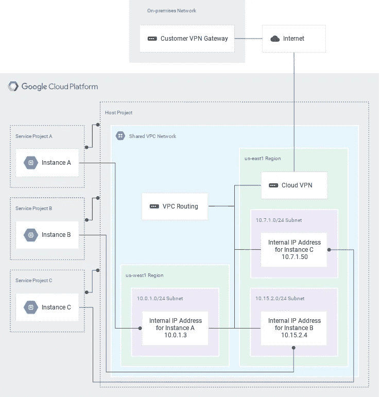

# 管理 VPC 网络？没问题！确保您的团队在共享 VPC 架构中使用正确的子网

> 原文：<https://medium.com/google-cloud/how-to-make-sure-your-teams-always-use-the-right-subnetwork-in-a-shared-vpc-architecture-eef3dc581a04?source=collection_archive---------1----------------------->

在 GCP，在一个组织中使用一个或几个共享的 VPC 网络来简化项目/团队和内部的交流是一个最佳实践。

关于共享 VPC 如何工作的一个有趣的事实是，你给*特定用户(或组)*在 VPC 内的哪些*子网*上的权限，他们可以使用这些权限来创建他们的资源(例如计算引擎虚拟机实例)

共享 VPC 网络，主机和服务项目连接到内部

想象一个场景，一个组织在一个共享的 VPC 中指定*一个项目和一个子网，供组织中的每个团队使用。我们还假设一个用户是多个团队的一部分，因此能够登录到多个项目中。给定共享 VPC 子网共享的工作方式，该用户将能够在已经与她/他共享的任何子网中部署工作负载；而不管她/他登录的具体项目。因此，当在一个项目中创建资源时，用户可能会意外地使用不正确的子网:这可能会导致混乱，并可能由于防火墙规则的不匹配部署而导致连接问题。*

虽然存在其他方法来应对这种情况，但 GCP 客户现在可以利用一种新的完全基于平台的解决方案，该解决方案基于新的[组织策略约束](https://cloud.google.com/resource-manager/docs/organization-policy/understanding-constraints)，称为**限制共享 VPC 子网**(有关其他您可能不知道的好处，请参见[可用约束列表](https://cloud.google.com/resource-manager/docs/organization-policy/org-policy-constraints))。尽管名称如此，许多约束可以应用于组织级别，也可以应用于特定的[文件夹](https://cloud.google.com/resource-manager/docs/cloud-platform-resource-hierarchy#folders)或项目级别。这是一件大事，因为它符合 IAM 层次结构的整体性，并且策略可以被继承。

典型的组织资源层级

现在，在实践中如何应用这个约束，并在上述情况下提供帮助呢？

假设名为 **"Team Orange"** 的数据库管理团队被分配了一个名为(惊喜！)橙色，而名为**“蓝色团队”**的活动目录管理团队被分配了一个名为(另一个惊喜！)蓝色。用于这些项目的文件夹结构很简单，此处显示供参考。

使用的组织资源层次结构

一个名为**橙**的用户是一个超级英雄，他不仅是自己*原生*团队(橙队)的一部分，而且*也是另一个* *团队*(蓝队)的一部分。

最后*用户 orange* 已经获得了主机项目 VPC 的两个子网络的用户权限:

*   **子 192–168–2–48-m28-eu w3**
*   **子 192–168–2–0-m28-euw 4**

当不应用组织策略约束“**限制共享 VPC 子网**”时，用户 orange 可以登录两个项目中的任何一个，并查看与他/她共享的子网:例如，这是登录 Orange 项目时的视图(蓝色项目的视图将是相同的)

事实上，这些子网可以有更好的名字

然而，如果将适当的策略约束应用于 Orange 项目，该用户将只能使用两个子网中的**一个**来部署资源，如计算实例:在本例中，他/她只能使用**子 192–168–2–0-m28-euw4**

你没有用对！

让我们来看看所使用的组织策略约束:正如您所看到的，该策略通过继承被强制到项目“Orange ”(它被应用于文件夹 Orange-SP 级别),并且只允许两个子网络中的一个。

这不是您以前使用的子网！

为了完成设置，对称策略约束被应用到 Blue-SP 文件夹，并通过继承应用到 Blue 项目:这次只允许子网**子 192–168–2–48-m28-eu w3**

有道理，对吧？

那么当用户 orange 登录 project Blue 并尝试在之前部署失败的子网中进行部署时会发生什么呢？

总之，在共享 VPC 设置中，新的组织策略约束“**限制共享 VPC 子网**”允许指定从主机项目共享的哪些子网可以在每个服务项目中使用。如前面的示例所示，它可以用来避免用户错误地将计算实例部署在错误的子网或错误的项目中，这取决于您如何看待它。

如果您通过团队、应用程序或工作负载指定特定的项目和子网，那么现在为正确的子网激活每个项目或文件夹的约束无疑是最佳实践的一部分。

感谢[伊曼纽](https://profile.emazza.net)为本帖贡献图片和用户故事。