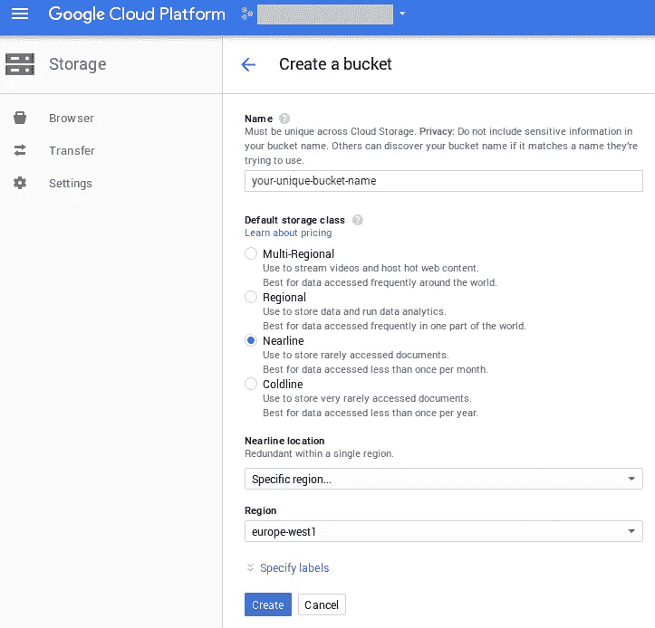
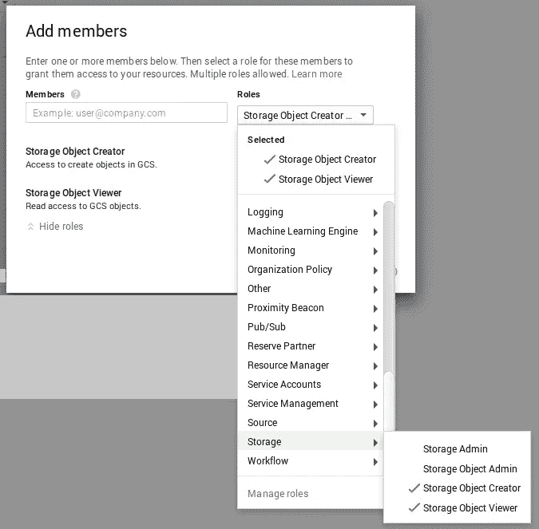
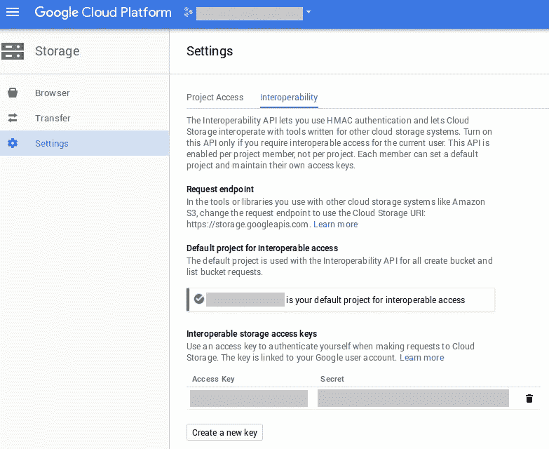
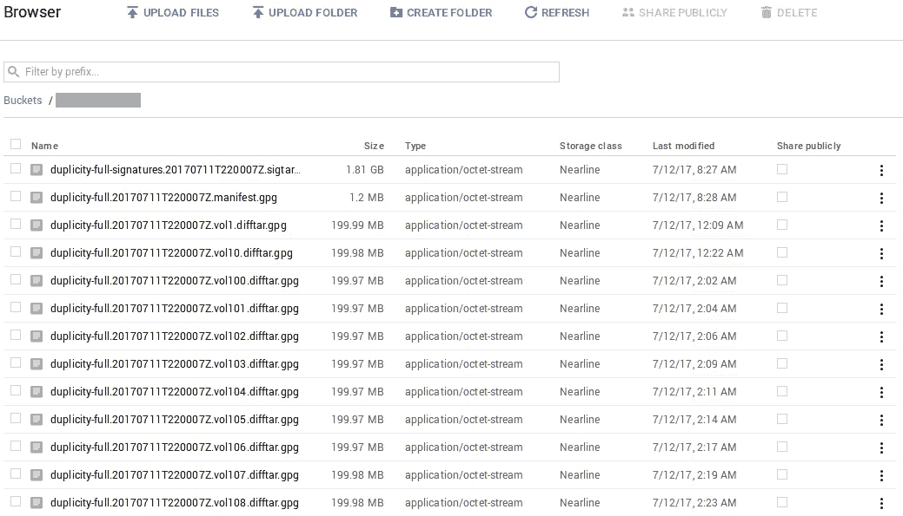

# 如何使用 Duplicity 和谷歌云存储进行 Ubuntu 备份

> 原文：<https://medium.com/google-cloud/how-to-make-ubuntu-backups-using-duplicity-and-google-cloud-storage-849edcc4196e?source=collection_archive---------0----------------------->

这是我的第一篇媒体文章。我将主要写我在 [Open State Foundation](https://openstate.eu/) 做开发者期间遇到的技术问题。

我们最近不得不改变我们的备份策略。我们曾经使用 [BackupPC](http://backuppc.sourceforge.net/) 将我们的服务器备份到我们办公室的一台服务器上。当我们的房东换了一家新的 ISP，大幅提高了带宽和 colo 价格时，这就变得太贵了。因此，我们不得不将备份存储在异地。我们考虑过使用专用服务器，但是考虑到我们想要备份的数据量(2tb ), Google 云存储更便宜。这主要是由于谷歌通过其[近线存储](https://cloud.google.com/storage/archival/)专门为备份/存档目的提供的价格(每月每 GB 0.01 美元)，尽管亚马逊也提供类似的服务，名为 [Glacier](https://aws.amazon.com/glacier/) 。我们也可以选择 Coldline，但这要求您在删除之前将数据存储至少 90 天，而 Nearline 只需要 30 天，这对于我们的备份来说足够了。

我们希望在将数据备份到谷歌的服务器之前对其进行加密，并选择了 [Duplicity](http://duplicity.nongnu.org/) ，因为它是开源的，节省空间，自(2002 年，实际上是自 2007 年)以来一直在不断发展[并支持谷歌云存储。](http://duplicity.nongnu.org/CHANGELOG)

## 创建备份

首先，创建一个谷歌云平台(GCP)账户，启用谷歌云存储(GCS)并创建一个新项目。然后[创建一个 bucket](https://console.cloud.google.com/storage/create-bucket) 并使用一个惟一的、不敏感的名称，因为您使用 GCS 与其他人共享这个名称空间！我们选择近线作为“默认存储类别”。不过在选择地点时要小心！[有些地方比其他地方](https://cloud.google.com/storage/pricing#storage-pricing)更贵，例如*欧洲-西方-2* 每月每 GB 0.16 美元，而*欧洲-西方-1* 每月每 GB 0.01 美元。因此，确定你想在哪个洲存储你的数据，如果确切的位置不重要，选择最便宜的位置。



为了让 Duplicity 访问 GCS，我们将向该项目添加一个新成员(这必须是一个现有的谷歌帐户)。在 IAM & Admin 页面上执行此操作。我们只给这个新成员两个限制性的[角色](https://cloud.google.com/iam/docs/understanding-roles?hl=en_US#predefined_roles)(即权限)*存储对象创建者*和*存储对象查看者。*这确保了文件/备份只能从服务器创建，而不能被覆盖或删除(例如，被获得服务器访问权限的黑客)。



现在，以新创建成员的身份登录，转到“存储”>“设置”，然后选择“互操作性”选项卡。单击“启用互操作性访问”并创建新密钥。



现在 SSH 进入你的服务器，安装 Duplicity 和 [boto](https://github.com/boto/boto) :

```
sudo add-apt-repository ppa:duplicity-team/ppa
sudo apt-get update
sudo apt-get install -y duplicity
sudo pip install boto
```

使用您刚刚创建的互操作性访问密钥添加环境变量，并提供一个安全的密码短语(用于加密/解密您的备份)。[确保](https://askubuntu.com/questions/935103/etc-environment-changes-reload-immediatly-in-ubuntu-16-04-but-not-in-14-04)虽然下面一行以`session`开始，而不是`/etc/pam.d/sudo`中的`auth`。打开`/etc/environment`并添加以下几行:

```
GS_ACCESS_KEY_ID="**<your_access_key>**"
GS_SECRET_ACCESS_KEY="**<your_secret>**"
PASSPHRASE="**<your_passphrase>**"
```

添加以下每日 cronjob，它将对`/home`进行完整备份(如果不存在)，执行每日增量备份，并在上次完整备份一个月后进行另一次完整备份。运行`sudo crontab -e`并添加以下行:

```
0 0 * * * sudo sh -c ‘duplicity --archive-dir /root/.cache/duplicity/ --full-if-older-than 1M /home gs://**<bucket_name>** >> /var/log/duplicity.log’
```

在你口是心非的命令中总是使用`--archive-dir /root/.cache/duplicity/`。这确保了即使另一个用户运行 duplicaty 命令，duplicaty 也使用相同的本地缓存。如果您不这样做，Duplicity 将通过从云存储下载文件来重建本地缓存，这是您希望避免的，因为从 GCS 近线下载会产生成本。此外，您可以通过添加`--exclude`选项来排除目录。最后，指定一个错误的 bucket 名称会导致创建一个新的 bucket **(!)**将对其应用操作！因此，请始终检查您是否指定了正确的存储桶名称！

## 删除旧备份

GCS Nearline 要求您将数据存储至少 30 天(如果您提前删除，则仍需支付 30 天的费用)。因为我们每个月都会创建一个新的完整备份，所以我们将为超过 40 天的文件添加删除策略。这给了我们至少 10 天的时间来注意我们需要访问备份的情况。我们可以使用欺骗来删除旧的备份，但我们不希望服务器能够这样做，因为黑客可能会滥用这一点来扰乱我们的备份。

相反，我们使用 GCS 提供的[生命周期管理](https://cloud.google.com/storage/docs/managing-lifecycles#configexamples)。以下步骤需要在您自己的台式机/笔记本电脑上执行，您需要在那里安装 [gsutil](https://cloud.google.com/storage/docs/gsutil_install#sdk-install) (我建议遵循“将 gsutil 安装为 Google Cloud SDK 的一部分”一节)。用以下内容创建一个名为`gcs-lifecycle-management.json`的文件:

```
{
  "lifecycle": {
    "rule": [
      {
        "action": {"type": "Delete"},
        "condition": {
          "age": 40
        }
      }
    ]
  }
}
```

使用此命令设置生命周期策略:
`gsutil lifecycle set gcs-lifecycle-management.json gs://**<bucket_name>**`

您可能希望设置[日志](https://cloud.google.com/storage/docs/access-logs#delivery)和[计费](https://support.google.com/cloud/answer/7233314?hl=en&ref_topic=7106112) [导出](https://support.google.com/cloud/answer/6293835?hl=en&ref_topic=7106112)，以便更深入地了解您的备份流程和成本。关于账单导出到 BigQuery，看看这个[整洁的可重用仪表板](/google-cloud/visualize-gcp-billing-using-bigquery-and-data-studio-d3e695f90c08)。

## 还原备份

以下命令将向您展示如何恢复单个文件或整个备份。如果您在服务器上执行这些操作，请跳过这一部分，继续下面的重复命令。如果您想在另一台机器上执行它们(例如，因为服务器受到威胁，您需要恢复到不同的位置)，那么首先执行这些步骤。首先安装口是心非和 boto。然后创建一个文件，姑且称之为`env.txt`，在其中添加以下几行:

```
export GS_ACCESS_KEY_ID=**"<your_access_key>**"
export GS_SECRET_ACCESS_KEY="**<your_secret>**"
export PASSPHRASE="**<your_passphrase>**"
```

然后运行`source env.txt`，并在下面的恢复命令中的`sudo`后添加`-E`。一旦使用`shred -uz env.txt`完成恢复，您可能想要粉碎`env.txt`文件。

**显示收集状态** 使用以下命令显示收集状态(例如，有多少个完整备份和增量备份，以及它们是何时制作的):

```
sudo duplicity collection-status --archive-dir /root/.cache/duplicity/ gs://**<bucket_name>**
```

**如何恢复单个文件** 首先列出所有文件来检索你想要恢复的文件的路径(当然除非你知道路径):

```
sudo duplicity list-current-files --archive-dir /root/.cache/duplicity/ gs://**<bucket_name>**
```

然后在以下命令中使用要恢复的文件的路径:

```
sudo duplicity restore --archive-dir /root/.cache/duplicity/ --file-to-restore **<path>** gs://**<bucket_name>** **<filename_to_restore_to>**
```

**如何恢复所有文件** 恢复所有文件就是这么简单:

```
sudo duplicity restore --archive-dir /root/.cache/duplicity/ gs://**<bucket_name>** **<dir_to_restore_to>**
```

上面的还原命令允许您从最新的备份中还原。如果您想使用使用`collection-status`命令列出的旧备份，则添加`--time`选项来指定该备份。关于如何格式化时间字符串，参见`man duplicity`中的**时间格式**部分。

在极其紧急的情况下，删除 40 天后删除文件的生命周期管理策略[可能会很有用。简单地使用如上所示的相同的`gsutil lifecycle set gcs-lifecycle-management.json gs://**<bucket_name>**`命令，但是这次在`gcs-lifecycle-management.json`中输入一个空的 JSON 对象`{}`。](https://cloud.google.com/storage/docs/managing-lifecycles#disable)

## 障碍和烦恼

GCS 工作得很好，但仍需要一些润色。琐碎的任务不能通过他们的网站直接执行。例如，您不能对下图中看到的任何列进行排序，您不能一次下载多个文件，并且没有*全选*按钮。为了得到我想要的行为，找出正确的角色来选择和组合并不是一件小事。文档很好，但在有更多示例/不同用例的地方可以更详细。此外，有用的功能仍在测试中，例如*自定义角色*，所以我希望事情会有所改善！



这样做备份对我们来说很顺利。有一件事仍然让我迷惑不解，那就是 GCP 的账单部分没有反映我们的使用成本，因为它仍然是 0.00 美元。我已经和谷歌的支持部门联系了一个星期，这是一次令人不满意的经历。虽然他们超级友好，但他们似乎缺乏有效处理这一问题的技能。他们反复询问相同的信息，在我最终升级到技术团队后，他们也开始建议无知的解决方案(“如果你在过去两天上传了数据，成本可能还没有反映出来”，…我已经与你联系了一周了！).

我在谷歌对一些非付费消费者服务的支持上有过糟糕的经历，但作为付费企业客户，我期望得到更好的支持。如果谷歌将其每年获得的数十亿利润中的一部分用于改善对他们的支持，那就太好了。

**更新:**1.5 周后，谷歌支持得出结论，GCS 近线的使用费用不应更新。这很奇怪，因为有几种方法可以查看您的当前成本，但我找不到任何声明近线成本不应显示的免责声明。还是那句话，如果谷歌加了这个功能就好了:)。

**更新 2:** 三个多星期后，账单问题终于解决了！我必须说，谷歌的支持团队坚持解决这个问题，每隔几天就向我更新进展。谢谢！最后，我不得不启用谷歌云存储 API，加上他们方面的一些变化，我现在终于看到了我为:D 付出的代价！有趣的是，直到这次修复，费用才被记录下来，所以我得到了 3-4 周的免费存储 XD。我很高兴我现在可以看到我的使用和相关费用的明细了！