# 如何在 Google 云平台上的项目间移动虚拟机实例

> 原文：<https://medium.com/google-cloud/how-to-move-a-vm-instance-between-projects-on-google-cloud-platform-39d1690c73a?source=collection_archive---------1----------------------->

目前还没有一个命令行命令可以在 Google 云平台项目之间移动 Linux VM 实例，但是我已经创建了一个易于遵循的分步指南，您可以使用。(注意:本指南不包括 Windows。)

## 所需步骤的快速总结

*   通过取消选择“删除实例时删除引导磁盘”并终止虚拟机，将引导磁盘与要移动的虚拟机分离
*   从分离的引导磁盘创建映像
*   将图像上传到 Google 云存储，并与新项目共享
*   基于您上传到 Google 云存储的图像，在新项目下创建一个自定义图像
*   基于自定义映像在新项目下创建一个新的虚拟机实例

## 在项目间移动虚拟机的详细步骤

**取消选择启动盘删除(重要！)**并终止您想要移动的虚拟机(我建议在终止前正常关闭)

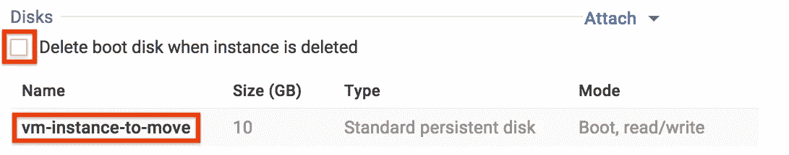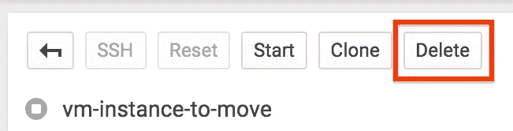

在与终止的虚拟机中的磁盘相同的区域中创建一个临时磁盘。使其足够大，以适合您的虚拟机映像(使用至少两倍于您的虚拟机的永久磁盘大小——越大意味着越快)

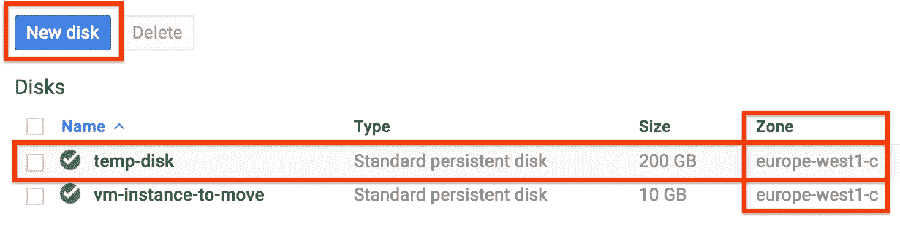

在旧项目下创建一个对 Google 云存储具有完全访问权限的 VM 实例。使用临时和终止的虚拟机磁盘所在的同一区域。暂时不要连接临时和终止的虚拟机磁盘。

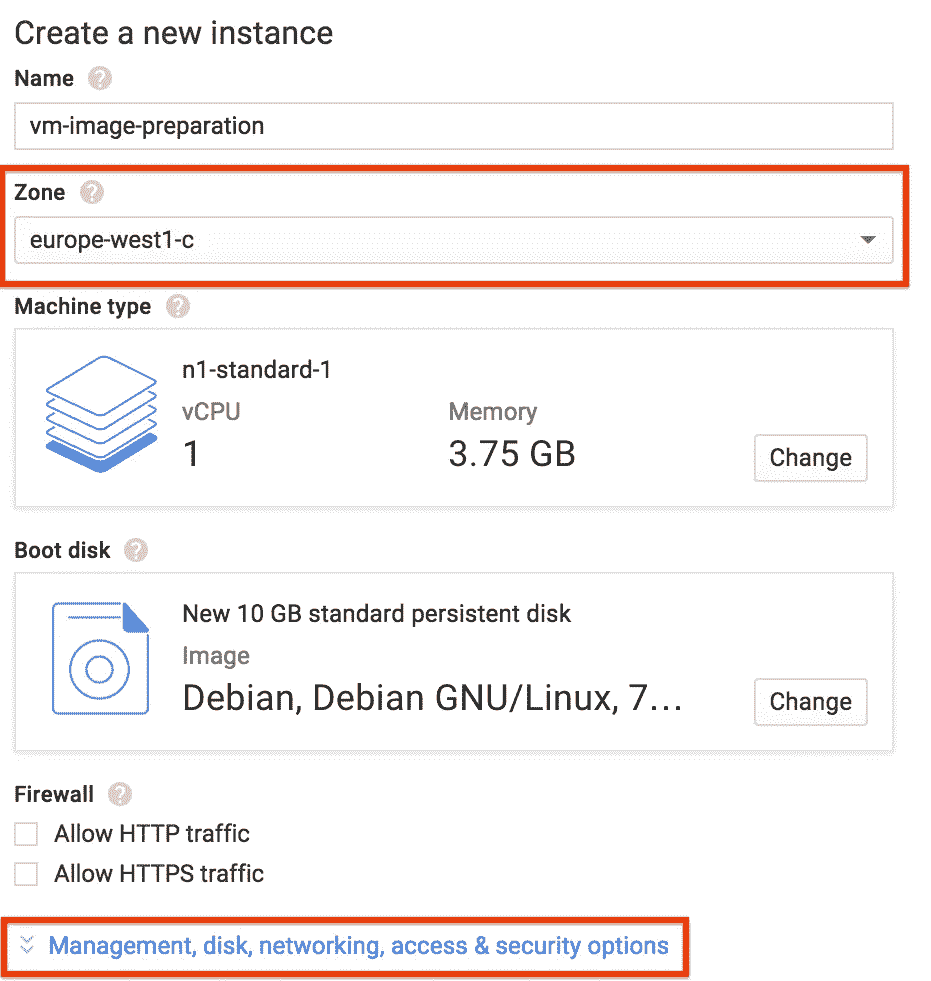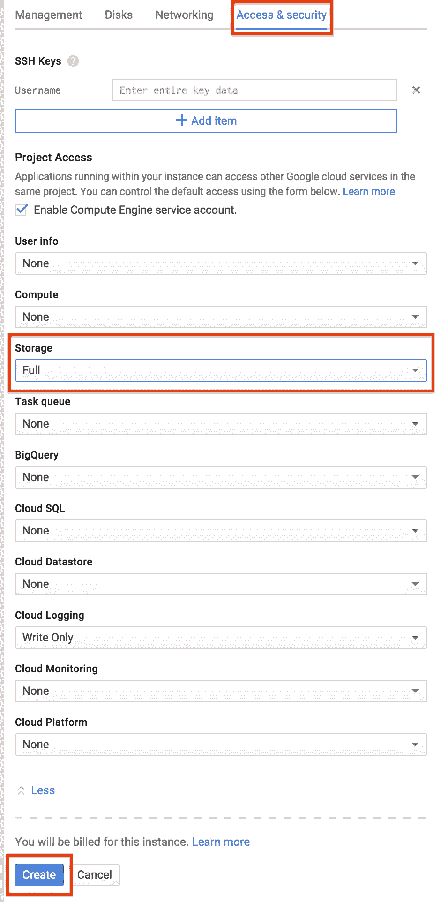

选择对存储的完全访问权限

将临时磁盘和磁盘从终止的虚拟机连接到我们刚刚为映像准备创建的正在运行的虚拟机。这将在引导后连接磁盘，并避免引导复杂化。

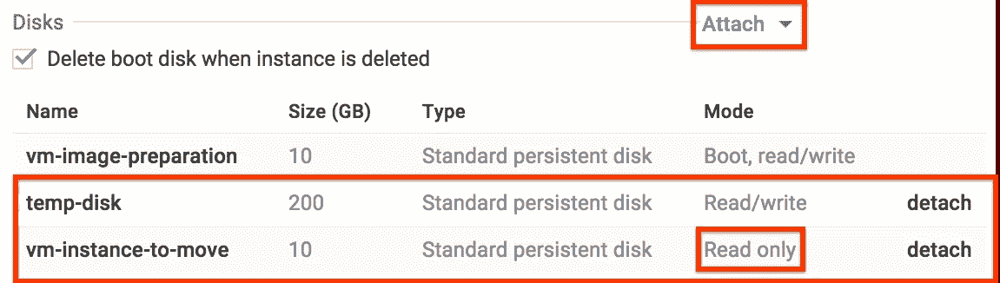

SSH 进入准备虚拟机，格式化并装载临时磁盘

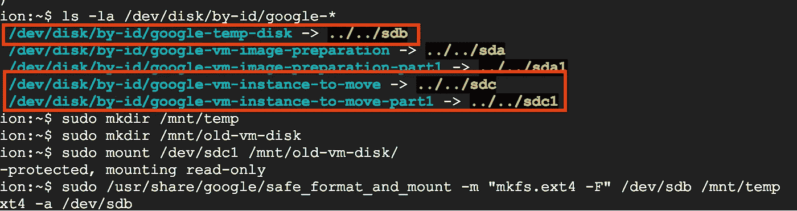

```
$ /usr/share/google/safe_format_and_mount -m "mkfs.ext4 -F" /dev/sdb /mnt/temp
$ cd /mnt/temp
```

使用 [*gcimagebundle*](https://github.com/GoogleCloudPlatform/compute-image-packages) 从您终止的虚拟机创建引导磁盘的压缩映像。一旦完成，就用 *gsutil 将它上传到 Google 云存储的一个桶中。*跳到下一步，了解如何在 Google 云存储中为上传创建存储桶。

```
$ cd /mnt/temp
$ sudo gcimagebundle -d /dev/sdc -r /mnt/old-vm-disk -o /mnt/temp/ --log_file=/mnt/temp/image-create.log
> Created tar.gz file at /mnt/temp/62a70588477be42caf45c5c5c58a7e59a8aa410e.image.tar.gz
$ gsutil cp 62a70588477be42caf45c5c5c58a7e59a8aa410e.image.tar.gz gs://vm-transfer
> Uploading   ...588477be42caf45c5c5c58a7e59a8aa410e.image.tar.gz: 235.73 MiB/235.73 MiB
```

当 *gcimagebundle* 运行时，在运行预备虚拟机的旧项目中创建一个 Google 云存储桶

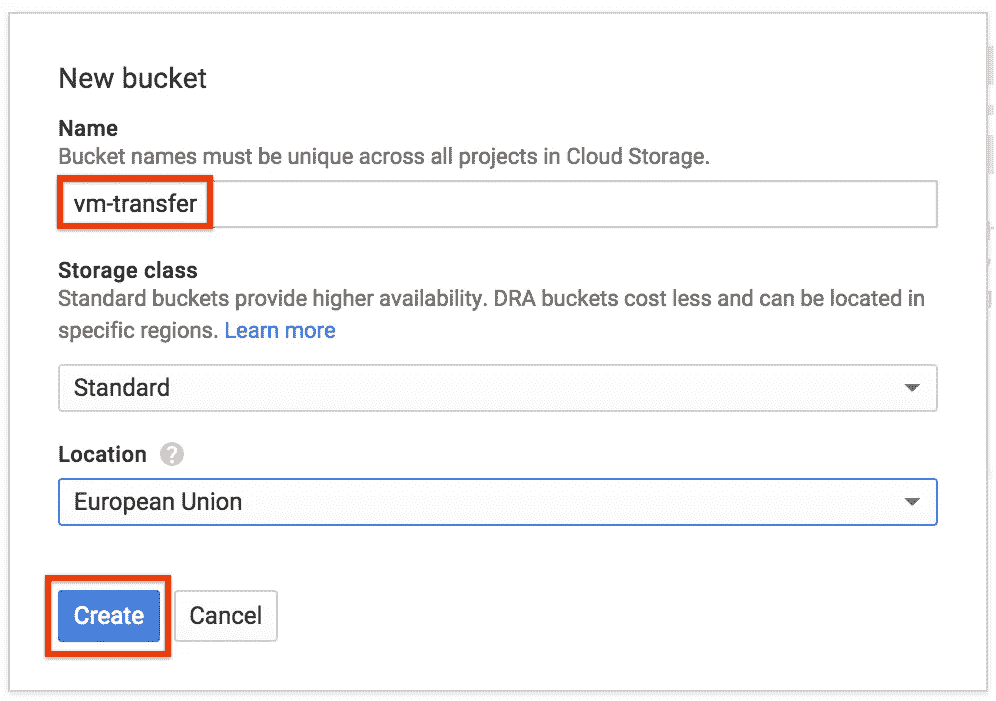

通过将您的电子邮件添加到对象权限，使您可以在新项目中访问 Google 云存储对象

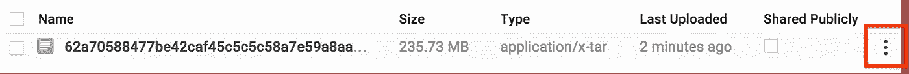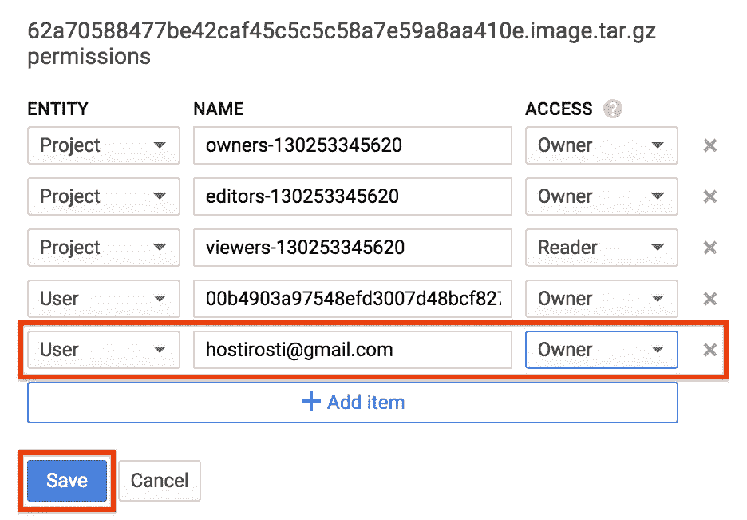

在您的新项目中从 Google 云存储对象创建一个自定义图像

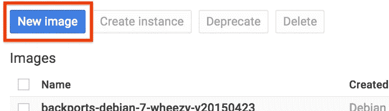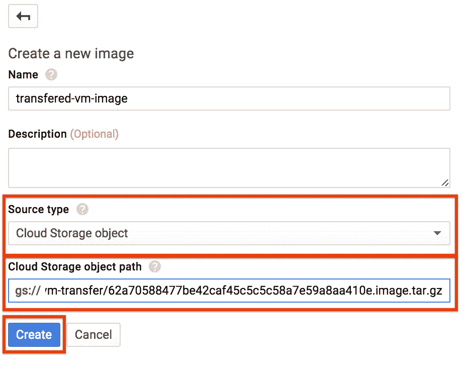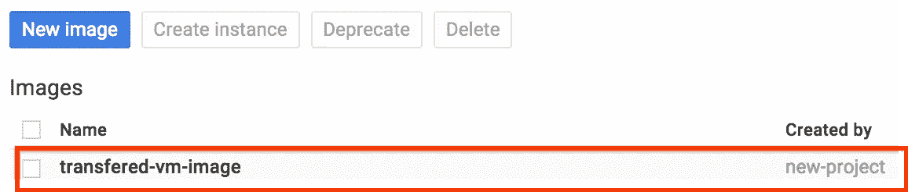

从您的自定义映像创建一个虚拟机实例，瞧！☺

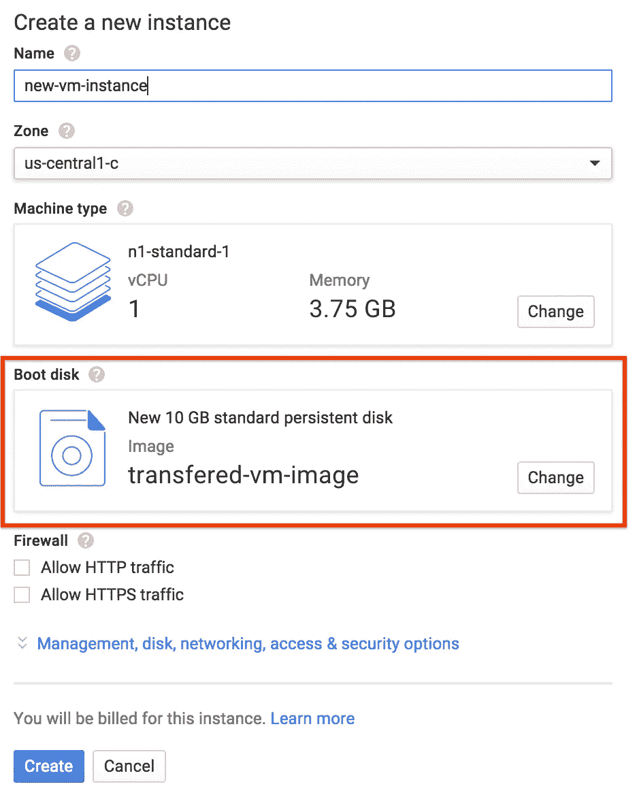

最后但同样重要的是，清理所有你不再需要的资源。一旦您确认您的虚拟机迁移成功，您就可以删除临时磁盘、已终止虚拟机中的磁盘、准备虚拟机以及旧项目中 Google 云存储中的存储桶。

这篇博文使用了来自[https://cloud . Google . com/compute/docs/images # export _ an _ image _ to _ Google _ cloud _ storage](https://cloud.google.com/compute/docs/images#export_an_image_to_google_cloud_storage)的信息