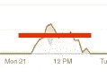

# 如何在 BigQuery 中调整您的固定费率和弹性时段预留

> 原文：<https://medium.com/google-cloud/how-to-move-from-on-demand-pricing-to-reservations-in-bigquery-65552cbebd45?source=collection_archive---------0----------------------->

## 将插槽使用图转化为工作负载管理

我正在与一个非营利组织合作，该组织使用 BigQuery 进行数据分析。他们使用按需定价，但达到了统一费率定价开始有意义的程度(通常每月 1 万美元，尽管如果您的使用更具可重复性，每月可以低至 2 万美元)。他们应该如何着手改变呢？有什么好的策略可以遵循？

所有这些信息都在 BigQuery 文档中，但是在几个不同的地方。所以，我在这里巩固它，并链接到其他一些关于这个主题的好文章。

## 什么时候有意义？

通过按需定价，每个项目可获得 2000 个名额。因此，只有在以下任何一种情况下，您才应该考虑从按需定价转向统一定价:

*   您的统一价格预订将超过 2000 个位置，因此不会有任何减速。
*   您并不担心查询速度变慢，可能是因为这些是报告工作负载。
*   您可以添加灵活插槽。例如，如果您的大型查询是在高峰时使用 5000 个时段的每日报告，那么您可以保留 500 个时段，并购买 4500 个灵活时段，每天一小时。您将在这一小时内运行这些大型的每日报告查询。

## 推荐策略

使用[计费仪表板](https://cloud.google.com/billing/docs/how-to/visualize-data)或[云监控](https://cloud.google.com/bigquery/docs/reservations-monitoring)获得计费账户中**所有**项目的时段使用图表。

假设您的平均每小时插槽使用率如下所示:

每小时时段使用量。尽管本例只显示了一个项目，但是您应该使用一个图表来汇总账单账户中的所有项目。

1.  找到基线。在这里(见下面周四的图表)，我们白天似乎需要 500 个插槽，晚上则减少到零。我们可以购买 16 小时的零固定费率和 500 个灵活时段。或者，我们可以购买 500 个统一费率的老虎机。做数学，我们会更好地与 500 个插槽的统一费率预订。

周四白天的基线是 500 个左右。

2.在你做出购买 500 个插槽一年或更长时间的长期承诺之前，试着每月做 500 个灵活插槽。这样，如果发现统一费率模式对你的任何项目都不起作用，你也不会损失太多。

3.找到导致峰值的查询。假设你发现它用了 3000 个槽(见周二的峰值，如下)。购买 2500 个 flex 插槽，运行这个昂贵的查询，然后释放插槽。您还可以计划购买弹性插槽。

4.有零星的高峰(每天的颠簸，见下文)。找出它们的原因。假设这些查询是由数据科学家交互式地探索数据而创建的。我们想让这些数据科学家快速访问。500 个插槽的限制会惹恼他们。因此，创建一个按需项目，并为其分配数据科学家。但是[在那个项目中加入成本控制](https://cloud.google.com/bigquery/docs/custom-quotas)，以避免数据科学家错误地运行 1 PB 的查询。

5.事实证明，某些天增加的基线(例如，周一的基线，见下文，超过 500)是由面向公众的仪表板驱动的。有 1000 个查询，但是我们不太关心查询性能——如果这些查询需要 3 秒而不是 1 秒来执行，这不是问题。将仪表板使用情况放入原来的 500 个统一费率的预留位置中。将预留增加到 800 个插槽，并将这 300 个插槽的优先级赋予仪表板。当仪表板不使用这 300 个插槽时，它们将有助于加速其他一切。

## 推荐阅读

以下是关于各种活动部分(定价、预订、工作负载管理、插槽使用监控)的重要背景资料，为上述策略提供了信息:

*   [云监控中的监控 BigQuery 预约](https://cloud.google.com/bigquery/docs/reservations-monitoring)
*   [big query 中的工作量管理](https://cloud.google.com/bigquery/docs/reservations-workload-management)
*   BigQuery 中的成本优化
*   [哪种定价模式适合您](https://cloud.google.com/blog/products/data-analytics/choosing-bigquery-pricing)；BigQuery 中的[定价](https://cloud.google.com/bigquery/pricing#overview)是如何工作的
*   [big query 中的预订](https://cloud.google.com/blog/products/data-analytics/effectively-using-bigquery-reservations)