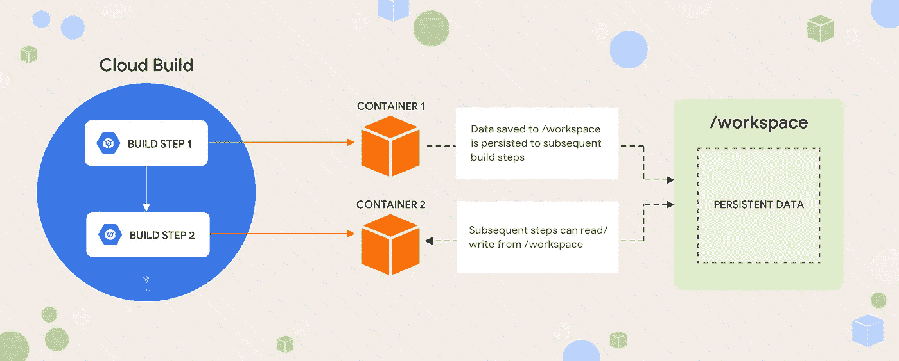

# 如何在云构建步骤之间传递数据

> 原文：<https://medium.com/google-cloud/how-to-pass-data-between-cloud-build-steps-de5c9ebc4cdd?source=collection_archive---------0----------------------->

***TL；DR*** *将内存中的数据保存到* `*/workspace*` *卷挂载，它将可用于所有后续的构建步骤。*

阿利亚·巴普蒂斯塔[www.aliyabaptista.com](http://www.aliyabaptista.com/)可视化

[Google Cloud Build](https://cloud.google.com/cloud-build/) 将您的构建作为一系列**步骤**来运行，这些步骤在隔离的容器化环境中执行。在每一步之后，容器被丢弃。*噗！这让你每一步都有完全不同的工具和环境，并且一步中产生的任何碎屑都不会污染下一步。*

但有时，cruft 实际上是重要的数据…您可能需要保存构建中某个步骤的状态，以便在后续步骤中使用。一种常见的模式是将它存储在一个环境变量中，但这在这里是行不通的，因为每一步都在一个单独的环境中运行(因此有单独的环境变量)。

# 这样不行。不要这样做。

*(参见* [*掌握云构建语法*](/@davidstanke/mastering-google-cloud-build-config-syntax-8c3024607daf) *)详细了解这里使用的“突围语法”。)*

# 改为这样做！

虽然每个步骤的容器中的所有东西都被丢弃了，但是有一样东西仍然存在:**卷挂载**。这些读写路径可以附加到任何构建步骤，并且它们将在整个构建过程中保留其内容。您可以[定义自己的卷](https://cloud.google.com/cloud-build/docs/build-config#volumes)，但是出于这个目的，使用 Cloud Build 自动为您提供的卷`**/workspace**`是最简单的。任何步骤写入该路径的任何内容都可以用于后面的步骤。

提示:你可以在没有任何其他来源的情况下尝试这些片段；将内容保存到文件中，然后运行 `*gcloud builds submit --config=<filename> --no-source*`

# 但是如果我有很多值要传递呢？那会变得非常乏味。

是的，当然可以。这里有一个简化的方法:用一个公共前缀来命名你想要持久化的任何变量。然后，您可以在一行脚本中编写它们，然后在一行中读取它们:

在其他情况下，您可能会发现使用结构化数据格式更有效:假设您从一个返回 JSON 的 API 中读取数据。将输出作为文件写入`/workspace`，然后在后续步骤中，您可以从该文件中读取项目。(`[jq](https://stedolan.github.io/jq/)`在这里很可能派上用场！)

对于如何充分利用云构建，您还有其他很酷的技巧吗？在评论中分享吧！

*感谢 Edrienne 和 Guillermina 启发了这项技术*