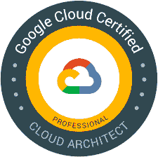

# GCP 零经验如何通过专业云架构师(PCA)考试

> 原文：<https://medium.com/google-cloud/how-to-pass-professional-cloud-architect-pca-exam-with-zero-experience-in-gcp-cd267600fcc4?source=collection_archive---------1----------------------->

我们每个人都有使用不同云平台的经验，现在随着谷歌云开始快速发展，在规定时间内学习和通过 PCA 认证变得很有挑战性。

谷歌 PCA 考试内容有点深，涵盖了谷歌云提供的广泛服务。在这个博客中，我想建议必修课和练习实验室，以清除第一次尝试的 PCA

# 考试

PCA 由 50 个选择题组成，涵盖了广泛的谷歌云平台服务，并应用正确的 GCP 技术来解决各种业务需求。考试持续 2 小时，主要侧重于

1.  案例研究(20%)
2.  GCP 概念题(80%)

谷歌一般不会公布官方的成绩单，它只是告诉我们是否通过了考试。可接受的通过率为 80%，这意味着 40/50 的问题需要正确回答。

# 要走的路

1.  **Coursera**——[谷歌云基础:核心基础设施](https://in.coursera.org/learn/gcp-fundamentals)——这有助于获得关于 GCP 产品的基本知识，以及从 GCP 开始的针对初学者的最佳课程
2.  **Udemy** — [GCP 专业云架构师:谷歌云认证](https://www.udemy.com/course/google-cloud-professional-cloud-architect-certification/) —这是清晰理解 PCA 考试内容的最佳课程，作者涵盖了清晰 PCA 的重要内容
3.  [**牛逼的 GCP**](https://www.youtube.com/AwesomeGCP) —这将帮助你理解从问题本身获得线索的策略，同时也分析选项排除策略
4.  [**流程图**](https://grumpygrace.dev/posts/gcp-flowcharts/) — GCP 流程图
5.  接下来的**案例分析**将出现在考试中，仔细阅读每一个案例分析，并参考一些样题

> a. [EHR 医疗保健](https://services.google.com/fh/files/blogs/master_case_study_ehr_healthcare.pdf)
> 
> b.[直升机竞赛联盟](https://services.google.com/fh/files/blogs/master_case_study_helicopter_racing_league.pdf)
> 
> c.[芒特柯克游戏](https://services.google.com/fh/files/blogs/master_case_study_mountkirk_games.pdf)
> 
> d. [TerramEarth](https://services.google.com/fh/files/blogs/master_case_study_terramearth.pdf)

# 提示和技巧

1.  作为一个初学者，从谷歌云产品 上的 [**1 分钟 YouTube 视频开始，这将为 GCP 提供一些背景**](https://www.youtube.com/playlist?list=PLIivdWyY5sqIQ4_5PwyyXZVdsXr3wYhip)
2.  **whiz labs**—[PCA 练习实验室](https://www.whizlabs.com/google-cloud-certified-professional-cloud-architect/) —了解考试模式的练习实验室
3.  [**qwikilabs**](https://www.qwiklabs.com/)为考试提供了一个环境和实验练习，虽然这些实验中的问题不会直接出现在考试中，但动手练习有助于消除选项

# Tada！您将成功完成 PCA

这涵盖了你通过考试所需的所有资源。考完试后，你可以从谷歌商店买到一些很酷的东西。您可以选择优惠券，并订购一件带有专业云架构师徽章的夹克。

感谢阅读，祝你的 PCA 一切顺利！