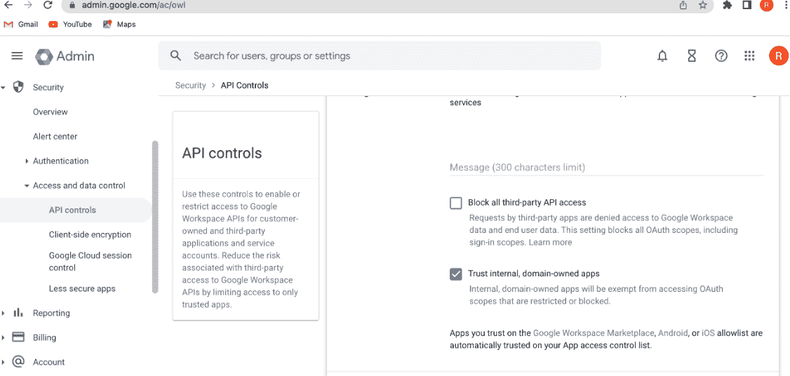

# 如何为 Google Workspace 规划域迁移而不影响 Google Cloud 中的工作负载

> 原文：<https://medium.com/google-cloud/how-to-plan-domain-migration-for-google-workspace-without-affecting-workloads-in-google-cloud-5f9203d0f617?source=collection_archive---------0----------------------->

每当两个或更多被收购的公司合并时，都需要大量的规划来绘制路线图，以同步组织之间的领域、平台和实践。

如果这两家公司已经在使用谷歌工作空间和谷歌云平台，那么域名迁移可能会变得容易。这篇文章强调了一些关于预期问题及其解决方案的要点。

随着业务快速增长，收购如今变得非常普遍。

将被收购的实体与其自己的规则/流程和平台同步往往是母实体最乏味和最伤脑筋的活动。

对于任何收购者来说，蛋糕上的樱桃将是意识到 Aquiree 已经使用了类似的平台(谷歌工作空间，谷歌云等。)和工具。

虽然这对双方来说都很容易进行数字合并，但仍有一些小问题可以看到。

在这篇文章中，我想概述一些要点，这些要点可以加快 Google Workspace 域迁移之旅，同时对 Google Cloud 上托管的应用程序和基础架构产生最小的影响。

> **客户计划进行域名迁移的几个原因:**

1.  客户收购了一家新公司，希望更高效地合作
2.  客户希望用新的名称或实体重塑自己的品牌
3.  客户希望将其一个部门拆分成一个具有新域名的独立实体

在本帖中，我们将介绍最常见的场景(第 1 点)以及如何高效地完成域名迁移，同时将业务中断降至最低。

> **收购方和被收购方同时利用 Google Workspace 和 Google Cloud 时的域名转让类型:**

1.  ***完成域名转移* -**

这里，子实体的 Google Workspace 和 Google Cloud 项目被完全合并到父实体中。

*-工作区用户/谷歌云项目/内部应用等。所有这些都在同一个屋檐下/组织下。*

****缺点***——虽然 Google Workspace 域迁移在这两种场景中都很常见，但是将 Google Cloud 项目从一个实体迁移到另一个实体需要付出巨大的努力，这种情况下需要很多检查点和配置更新。此外，与此类用例所涉及的工作和成本相比，将 Google Cloud 项目从一个领域迁移到另一个领域的附加值非常有限。*

***②*。部分域名转移* -***

*这里只有子实体的 Google Workspace 被合并到父实体的 Google Workspace 中。Google Cloud 组织/项目不会从子项目迁移到父项目。*

****好处***——Google PSO 为客户提供无缝的 Google Workspace 域名迁移服务。客户可以与新收购的实体在所有 Google Workspace 产品、应用程序和服务上无缝协作，而不必迁移/中断他们的 Google 云。谷歌云方面的工作很少，也没有额外的成本。*

***).***

> ***如何在不将 Google Cloud 项目迁移到新域名的情况下成功完成域名迁移？***

*在任何域转移场景中，所有内部用户都被转移到新域。想想看，当你的谷歌云项目托管你的内部应用程序留在旧域，但用户已经转移到另一个域，会发生什么？*

*是的，你猜对了，这些用户将成为旧域的外部用户。这将基本上阻止他们访问他们自己的内部应用程序，除非有某种解决方案。《出埃及记》设置为内部的内部应用程序 OAuth 同意屏幕将认为试图进行身份验证的用户是外部用户，并将拒绝他们的访问。*

*想象一下，如果您大量使用 OAuth 同意屏幕，以前您将它用作内部屏幕，现在您可能会考虑将同意屏幕更改为外部屏幕，作为允许您的用户从新域访问它的唯一可行的解决方案。这种解决方案打开了一个安全漏洞，任何拥有有效 gmail 帐户的人都可以通过互联网访问您的应用程序，即使您说有 VPN 作为第二层防御，但这仍然不能证明损害第一层安全是合理的。*

*为了解决这个问题，有一个解决方案，但还没有正式发布。在本解决方案中，需要完成以下活动:*

1.  *客户应该从“应用程序安全团队”的 bug 门户网站为 Google 创建一个内部票证，并提及其新旧域名的 Google Workspace 客户 ID 的详细信息以及新旧域名的详细信息。*

*前母公司 Google Workspace 客户 ID—254 XXX*

*子 Google Workspace 客户 ID — 261XXXX*

*父域名-xyzcompany.com*

*子域—123company.com*

*在这张票中，他们应该要求谷歌将子域列入父域的白名单。*

*2.一旦谷歌确认他们已经完成了白名单。程序，然后转到父域的 Google Workspace 管理控制台，具有管理员/所有者权限->访问和数据控制-> API 控制->检查标记“信任内部，域拥有的应用程序”*

**

*完成后，父域将开始将所有其子域的应用程序视为自己的应用程序，并且父域中的所有用户将能够像以前一样(在域转移之前)访问内部应用程序。*

> ***好处:***

1.  *随着客户不断收购新公司，他们可以通过一劳永逸的方法无缝地进行域名迁移。他们可以要求白名单尽可能多的子域，因为他们希望在未来。*
2.  *OAuth 同意屏幕前端没有打开安全漏洞，因为在这个用例中屏幕保持原样(内部)。*
3.  *这种设置很简单，并且可以预先提供(白名单可以在 D 日之前预先完成)。*
4.  *当谈到互操作性和协作时，客户可以看到最好的谷歌产品和服务。*