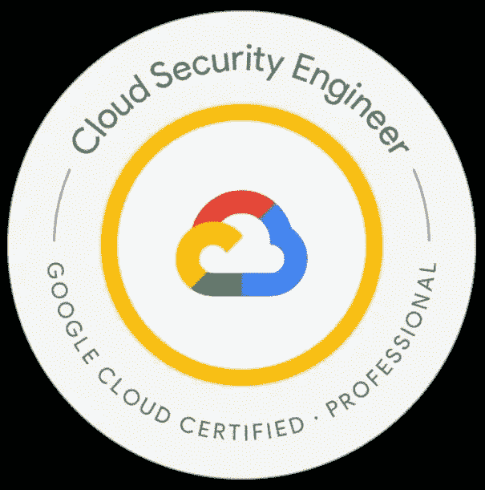

# 如何准备专业云安全工程师认证

> 原文：<https://medium.com/google-cloud/how-to-prepare-for-professional-cloud-security-engineer-certification-f86861e3ae96?source=collection_archive---------2----------------------->

# **简介**

大家好，我很高兴地分享我最近在 2022 年 12 月通过了云安全工程师认证。根据我的考试经验以及工作经验，我将分享一些云安全工程师考试的备考笔记。

# **考试详情**

时长:2 小时
报名费:200 美元(含税)，印度(含税 120 美元)~141 美元
语言:英语、日语
考试形式:50-60 道选择题

# **什么考试都是关于**

专业云安全工程师考试主要关注以下五个主要领域。

在云解决方案环境中配置访问
管理云解决方案环境中的运营
配置网络安全
确保合规性
确保数据保护

如果您已经通过了**网络工程师**、**云架构师、**甚至**助理工程师**，这将是本次考试的额外好处，因为 IAM 和网络的大部分基础知识都包含在上述考试中，并被视为 GCP 的核心。

1.  **在云解决方案环境中配置访问权限**

以下是本节涵盖的主要主题。

a)访问层级
b)云身份
**c)身份感知代理(IAP)(对 GCP 安全服务非常重要 7-8 个关于 IAP、IAP 角色等的问题)**
d)服务帐户管理
e) GCDS，SSO
f)在云身份管理中使用现有 LDAP 或 AD 用户

**组织政策和约束(对考试非常重要)** 下面 5 条是最常见的组织政策，最常被问到的问题都是基于这些政策。
禁用默认网络创建
禁用计算虚拟机的外部 IP
禁用对存储桶的公共访问
禁用服务帐户密钥创建
禁用主机项目删除

**最佳实践** [https://cloud . Google . com/blog/products/identity-security/iam-Best-practice-guides-available-now](https://cloud.google.com/blog/products/identity-security/iam-best-practice-guides-available-now)

# **2。在云解决方案环境中管理运营**

本节主要涵盖以下相关问题

收集和分析谷歌云日志
**日志汇(组织级、文件夹级、项目级)** VPC 流量日志
**数据包镜像** 审计日志
安全指挥中心
网络安全扫描器

# **3。配置网络安全**

你至少应该知道下面所有服务的功能，并且有良好的动手能力对这次考试是有益的。下面用黑色突出显示的部分包含了该部分的大部分问题。

VPC、子网、防火墙
VPC 对等
混合连接
VPC 服务控制
共享 VPC
负载均衡器
DNSSEC
云 NAT
云装甲

# **4。确保数据保护**

数据保护包含考试中的大部分问题，主要涉及 DLP API 和加密技术(CSEK 和 CMEK)。理解以下服务是通过考试以及更好地理解 google 云安全的必要条件。

**DLP API 使用案例
DLP API 检查、去识别和重新识别** DLP API 中使用的不同去识别技术
可逆和不可逆 DLP API 去识别技术
静态、传输中和使用中的加密
客户提供的加密密钥
客户管理的加密密钥
外部密钥管理器
HSM

# **我的考试经历和准备**

对我来说，70%的问题简单明了，更确切地说，我会说是来自不同网站的已知问题示例问题(考试主题/whizlabs 等)，30 %的问题迫使我主要对 DLP API 重新识别技术、CSEK、HSM 进行深入思考，但当我在大多数服务上工作时，能够找出逻辑答案。Tims 不是本次考试的关注点，您将能够在给定时间内甚至更早轻松完成考试。

为了准备这次考试，我查阅了所有上述服务的 google 文档，并实施了最佳实践中提到的安全解决方案。最后，一轮通过互联网和不同网站的样本问题，以确保避免因理论知识缺失而出现小错误。

考试详细复习备考指南

也请找到我下面的谷歌云 youtube 播放列表，免费学习 GCP。