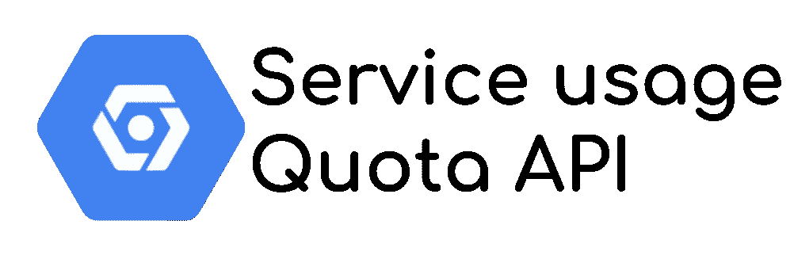

# 如何通过配额 API 保持您的创新速度和预算

> 原文：<https://medium.com/google-cloud/how-to-preserve-your-innovation-speed-and-your-budget-with-quotas-apis-d20557d191ab?source=collection_archive---------0----------------------->



云有**许多好处，其中之一是创新速度**，座右铭是“失败得快，迭代得更快”。事实上，云提供商提议**大量的服务来轻松测试和实验**，而在本地环境中测试和实验同样会**昂贵或者不可能。**

*   使用 Hadoop 或 Kubernetes 创建集群
*   使用图形加速器进行人工智能训练
*   部署全球应用程序，…

云平台是很棒的沙箱，你可以花几个小时去试验和尝试。然而，**资源并不是免费的**！

> 在专业网站上有周期性的坏消息，关于导致巨额账单的不良使用(或误用)。

即使谷歌云**上的免费层级很慷慨**，一些情况也会**导致昂贵的账单**。这种情况让公司和高层管理人员感到害怕，对他们来说，最简单的解决方案是限制用户授权只使用平台的一个子集。
**不好的一面是，你限制了你的团队的自由和创新能力****。**

> **如何在控制预算和避免滥用的同时继续测试、试验和创新？**

**这个问题在你提供给你的用户和/或 R&D 团队的沙盒/测试项目中尤其重要。**

# **谷歌云配额 API**

**另一个**解决方案是限制每个服务的开销**，而不是**用角色和权限来限制可用服务的集合**。配额 API 的目的是**为每个服务上的可用资源**设置一个上限。**

**我想重点介绍两个使用案例:**

*   **BigQuery**
*   **计算引擎**

## **配额自动化**

**要在您的项目上自动实施配额定义，尤其是沙盒项目，您需要在创建或更新项目时自动设置配额。**

**你可以选择**通过 API 调用或者 terraform** 来实现。我将介绍这两者，以帮助选择最适合您的用例以及现有项目创建/更新过程的方法。**

# **API 测试和安全问题**

**在深入之前，你会看到**我使用了** `**gcurl**` **命令**，它是`curl`的别名，带有自动填充的安全头(为了方便使用)。你可以在配额 API 文档中找到如何创建它。**

****然而，我不喜欢那个解决方案**，因为它要求我们创建一个服务帐户密钥文件；它暗示了所有可能的安全问题**。尽管我向谷歌云团队提出了请求，但危险的文档仍然存在。****

****所以我建议**像这样使用你的用户账号***(你需要事先用* `*gcloud auth init*` *或* `*gcloud auth login*` *)进行认证*****

```
**alias gcurl='curl \
  -H "Authorization: Bearer $(gcloud auth print-access-token)" \
  -H "Content-Type: application/json"'**
```

****或者甚至通过假冒 *来**使用** [**服务帐户(确保您当前已验证的用户有正确的角色来假冒服务帐户)**](https://cloud.google.com/iam/docs/impersonating-service-accounts)*****

```
**alias gcurl='curl \
  -H "Authorization: Bearer $(gcloud auth print-access-token \
  --impersonate-service-account=totoyoyo@gdglyon-cloudrun.iam.gserviceaccount.com)" \
  -H "Content-Type: application/json"'**
```

> ****保护秘密的最好方法，就是不要有秘密！****

****所以，如果可以，**不要使用服务帐户密钥文件** *(其中包含私有 RSA 密钥)*，除非[达到 IAM 服务的极限](/google-cloud/the-2-limits-of-iam-service-on-google-cloud-7db213277d9c)****

# ****BigQuery 的配额****

****BigQuery 是一个很棒的玩具:**你可以在几秒钟内处理数 Pb 的数据**！！数据科学家喜欢它，因为**他们现在可以实现以前在本地环境中**无法实现的查询。****

****这太棒了，因为您**为您在每个查询**中扫描的数据量付费，一天结束时的成本会迅速飙升*(我已经在一个下午看到了 10 万美元以上！).*****

****教育是一条正确的道路，但有时也会出现错误。而且没有犯错的余地，**用什么付什么。这就是为什么配额对于防止这种情况非常重要！******

## ****API 的 BigQuery 配额限制****

****在 BigQuery 上设置配额之前，**知道存在哪些配额很重要**。为此，您可以[列出配额](https://cloud.google.com/service-usage/docs/reference/rest/v1beta1/services.consumerQuotaMetrics.limits.consumerOverrides/list) API 中当前可用的配额。****

****我们将慢慢开始，直到**在 BigQuery 服务**上列出消费者配额。*我不得不承认，这个 API 开始时并不容易理解，因为它是通用的，需要适应所有产品的配额。*****

```
**gcurl https://serviceusage.googleapis.com/v1beta1/projects/<projectId>/services/bigquery.googleapis.com/consumerQuotaMetrics**
```

****您可以看到许多您可以增加或减少的配额。*对于我们的用例，* `*Query usage*` *配额是正确的。*****

```
**{
      "name": "projects/751286965207/services/bigquery.googleapis.com/consumerQuotaMetrics/bigquery.googleapis.com%2Fquota%2Fquery%2Fusage",
      **"displayName": "Query usage",**
      "consumerQuotaLimits": [
        {
          "name": **"projects/751286965207/services/bigquery.googleapis.com/consumerQuotaMetrics/bigquery.googleapis.com%2Fquota%2Fquery%2Fusage/limits/%2Fd%2Fproject"**,
          **"unit": "1/d/{project}"**,
          "metric": "bigquery.googleapis.com/quota/query/usage",
          "quotaBuckets": [
            {
              "effectiveLimit": "9223372036854775807",
              "defaultLimit": "9223372036854775807"
            }
          ],
          "allowsQuotaIncreaseRequest": true
        },
        {
          "name": **"projects/751286965207/services/bigquery.googleapis.com/consumerQuotaMetrics/bigquery.googleapis.com%2Fquota%2Fquery%2Fusage/limits/%2Fd%2Fproject%2Fuser"**,
          **"unit": "1/d/{project}/{user}",**
          "metric": "bigquery.googleapis.com/quota/query/usage",
          "quotaBuckets": [
            {
              "effectiveLimit": "9223372036854775807",
              "defaultLimit": "9223372036854775807"
            }
          ],
          "allowsQuotaIncreaseRequest": true
        }**
```

****这里有几个有趣的部分:****

*   ****将**命名为**，因为我们以后会重用它****
*   ****提供配额用途信息的**单元**。我们这里有 BigQuery 查询使用限制:****

1.  ****每天和每个项目****
2.  ****每天、每个项目和每个用户****

****第二个允许**限制项目**的请求者，而不锁定其他人和整个项目本身。有趣的是，你有一个**共享项目，一些用户**负责他们的支出，而不是其他人！****

*****您还可以查看有效和默认限制，以字节为单位。*****

****我们现在有了配额的全称，使用 [ConsumerQuota API 来创建自定义限额](https://cloud.google.com/service-usage/docs/reference/rest/v1beta1/services.consumerQuotaMetrics.limits.consumerOverrides/create)将会更加容易。****

****为此，您需要**创建该机构来定义新的配额设置******

```
**{
  "overrideValue":10000000000
}**
```

*****将配额设置为每个用户和每个项目每天 10Gb*****

****和到`POST`这个主体到带有**配额名称**的服务使用 API(在前面的部分中选择)。*使用* `*gcurl*` *命令进行*****

```
**gcurl -d <BODY> \ https://serviceusage.googleapis.com/v1beta1/<NAME>/consumerOverrides**
```

****如果您从未在 BigQuery 中为您的项目设置这个配额，**它将不会工作**，因为您更改了超过 10%的配额。你需要**添加一个** `**force**` **布尔值为真**作为你的 URL 的查询参数，就像这样****

```
**gcurl -d <BODY> \ https://serviceusage.googleapis.com/v1beta1/<NAME>/consumerOverrides[**?force=true**](https://URL?force=true)**
```

****一旦查询被接受，就会返回操作的 ID。**像以前一样执行 get 查询，并查看更改。******

```
**"quotaBuckets": [
            {
              "effectiveLimit": "10000000000",
              "defaultLimit": "9223372036854775807",
              "consumerOverride": {
                "name": "projects/751286965207/services/bigquery.googleapis.com/consumerQuotaMetrics/bigquery.googleapis.com%2Fquota%2Fquery%2Fusage/limits/%2Fd%2Fproject%2Fuser/**consumerOverrides/Cg1RdW90YU92ZXJyaWRl**",
                "overrideValue": "10000000000"
              }
            }
          ],**
```

****你现在可以看到有效的限制，以及`consumerOverride`的新名字。你将**需要的这个全名** [**【补丁】**](https://cloud.google.com/service-usage/docs/reference/rest/v1beta1/services.consumerQuotaMetrics.limits.consumerOverrides/patch) **或者** [**删除**](https://cloud.google.com/service-usage/docs/reference/rest/v1beta1/services.consumerQuotaMetrics.limits.consumerOverrides/delete) **这个覆盖。******

## ****Terraform 的 BigQuery 配额限制****

****Terraform 是 DevOps 团队用来自动化项目基础设施的常用工具(IaC: Infra as Code)。你也可以用它**创建项目和配置环境**。****

****这里是之前用[配额 API terraform 模块](https://registry.terraform.io/providers/hashicorp/google/latest/docs/resources/service_usage_consumer_quota_override)进行 POST API 调用的例子****

```
**provider "google" {
  project = "<PROJECT_ID>"
  region = "us-central"
}resource "google_service_usage_consumer_quota_override" "override" {
  provider = google-beta
  project = "<PROJECT_ID>"
  service = "bigquery.googleapis.com"
  metric = "bigquery.googleapis.com%2Fquota%2Fquery%2Fusage"
  limit = "%2Fd%2Fproject%2Fuser"
  override_value = "10000000000"
  force = true
}**
```

*****因为我* ***使用我自己的凭证，我也不需要 terraform 的服务账号密钥文件*** *。在您的工作站上，执行* `*gcloud auth application-default login*` *到* ***在您的运行时上下文*** *中设置您的凭证。*****

****如你所见，你需要知道度量和极限名称。您无法猜测它们，需要使用 GET API 的**发现阶段**来确定配额的完全限定名称。****

# ****计算引擎的配额****

****就成本而言，计算引擎**没有 BigQuery 那么严重。它更具有累进性，成本会随着时间的推移而累积。然而，我已经看到坏演员**创建了几十个大型计算引擎实例来挖掘比特币**。******

******不良演员得到了一个开发项目的服务账号密钥文件*** *，保护得很差，用它创建了实例。* ***这就是为什么*** *，我强烈建议* ***尽可能不要生成这些敏感文件！******

***希望 Google Cloud **有自动监控和警报**，以便在**出现可疑活动**的情况下联系项目所有者。成本影响很低，但情况可能会更糟！***

***如果你仔细看看计算引擎 CPU 默认配额，一个**企业账户在几个地区可以使用多达 2400 个 vcpu**(N1 家族)**！出于测试目的，仅在一个区域使用几个 CPU 就足够了。你可以**设置一个配额来限制那个**。*****

*****同时，该配额将**减少(潜在的)攻击影响、服务误用**，以及因疏忽的用户忘记停止资源而导致的固有**成本…*******

## *****按 API 计算引擎配额限制*****

*****与 BigQuery 一样，要从计算引擎上的配额开始，查看和发现消费者配额的 GET 查询是一个很好的起点。*****

```
***gcurl https://serviceusage.googleapis.com/v1beta1/projects/<projectId>/services/compute.googleapis.com/consumerQuotaMetrics***
```

*****还有**吨配额**，按地区，按 CPU 家族，按网络，按 GPU 家族，……*像这样，你可以比如* ***在测试项目上丢弃使用某些 CPU 家族*** *或者 GPU******

*****我将只关注 N1 的 CPU 限制。你应该能看到这个*****

```
***"name": "projects/751286965207/services/compute.googleapis.com/consumerQuotaMetrics/compute.googleapis.com%2Fcpus",
"displayName": "CPUs",
"consumerQuotaLimits": [
  {
    "name": "projects/553150410541/services/compute.googleapis.com/consumerQuotaMetrics/compute.googleapis.com%2Fcpus/limits/%2Fproject%2Fzone",
    "unit": "1/{project}/{zone}",
    "isPrecise": true,
    "metric": "compute.googleapis.com/cpus",
    "quotaBuckets": [
      {
        "effectiveLimit": "-1",
        "defaultLimit": "-1"
      }
    ]
  },
  {
    "name": "projects/751286965207/services/compute.googleapis.com/consumerQuotaMetrics/compute.googleapis.com%2Fcpus/limits/%2Fproject%2Fregion",
    **"unit": "1/{project}/{region}",**
    "isPrecise": true,
    "metric": "compute.googleapis.com/cpus",
    "quotaBuckets": [
      {
        "effectiveLimit": "24",
        "defaultLimit": "24"
      },
      {
        **"effectiveLimit": "2400",**
        "defaultLimit": "2400",
        "dimensions": {
          "region": "asia-northeast1"
        }
      },
      {
        **"effectiveLimit": "2400",**
        "defaultLimit": "2400",
        "dimensions": {
          "region": "us-east1"
        }
      },
      ......***
```

*****如您所见，没有定义的限制，因此默认限制是按地区强制执行的(查看`unit`字段):在许多地区高达**2400 vcpu N1**！*****

*****让我们减少它！获得一个`name`字段的副本，并定义**这个新的覆盖体**，这次用一个`dimensions`:region。*****

```
***{
  "overrideValue": "5",
  "dimensions": {
    "region": "us-east1"
  }
}***
```

******在美国东部地区将最大 CPU 设置为 5******

*****并将其发布到配额 API。*****

```
***gcurl -d <BODY> \ https://serviceusage.googleapis.com/v1beta1/<NAME>/consumerOverrides***
```

******与 BigQuery 部分的模式相同，只是配额的名称发生了变化。******

*****在成功调用*(不要忘记* `*force*` *query param)* 之后，您可以执行另一个 get 到 API 来检查更新。**只有 us-east1 地区被更改。*******

```
***{
  **"effectiveLimit": "5",**
  "defaultLimit": "2400",
  "consumerOverride": {
    "name": "projects/751286965207/services/compute.googleapis.com/consumerQuotaMetrics/compute.googleapis.com%2Fcpus/limits/%2Fproject%2Fregion/consumerOverrides/Cg1RdW90YU92ZXJyaWRlGhIKBnJlZ2lvbhIIdXMtZWFzdDE=",
    **"overrideValue": "5"**
  },
  "dimensions": {
    "region": "us-east1"
  }
},***
```

*****您还可以**在所有地区实施配额**。为此，删除正文中的`dimensions`,为所有地区设置统一的配额。**如果你想只允许使用一个区域，那就很难了**:*****

1.  *****将所有区域设置为 0*****
2.  *****在特定区域设置不同的配额，以便只允许使用它。*****

## *****使用 Terraform 计算引擎配额限制*****

*****你可以用 terraform 达到同样的效果。
同样，您需要准确地知道您想要覆盖的服务、指标和限制名称。GET API 请求的第一个发现步骤不是可选的！*****

```
***provider "google" {
  project = "<PROJECT_ID>"
  region = "us-central"
}resource "google_service_usage_consumer_quota_override" "override" {
  provider = google-beta
  project = "<PROJECT_ID>"
  service = "compute.googleapis.com"
  metric = "compute.googleapis.com%2Fcpus"
  limit = "%2Fproject%2Fregion"
  override_value = "5"
  dimensions = {
    region = "us-east1"
  }
  force = true
}***
```

# *****不再惧怕创新，拥抱创新！*****

*****有了 Quotas API，您现在可以**限制每个服务和每个项目**的可用资源量，而不会将授权限制在某些服务**上，因为您担心它们可能的成本！
如果你的数据科学家需要 GPU，没问题，但他们只能在一个地区得到几个，而不是每个地区几十个！*******

***您甚至可以**使用 terraform 模块**自动执行这些配额限制，针对每种类型的环境、每个文件夹或任何您想要的内容**。*****

***你**不再有理由害怕来自你团队的创新**，你只需要**鼓励并拥抱它**！***